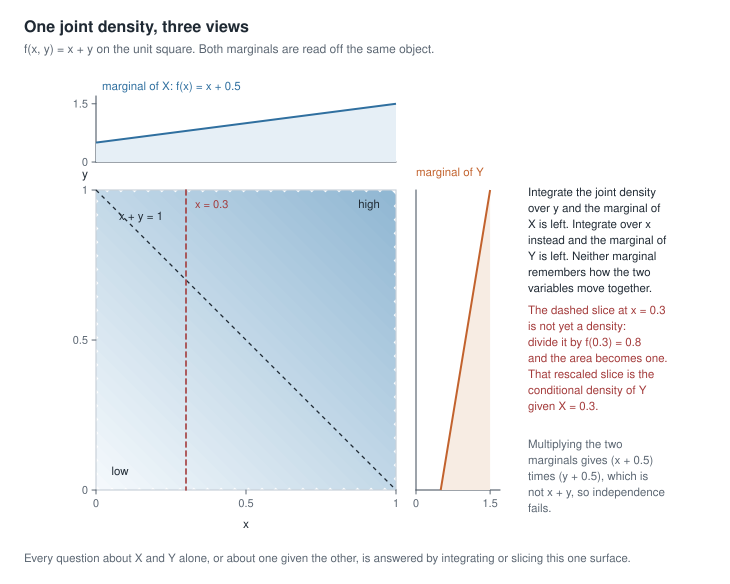
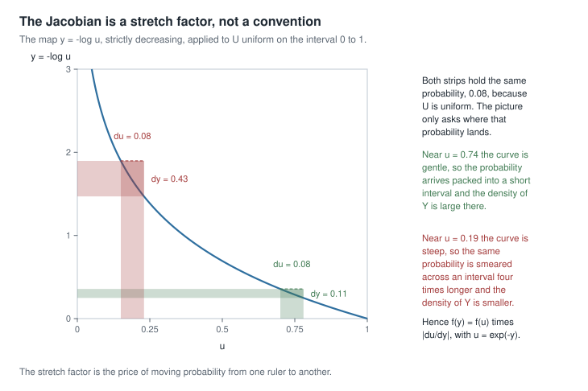
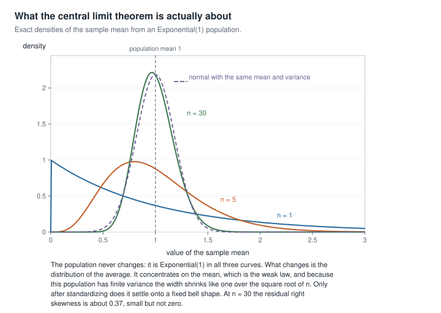
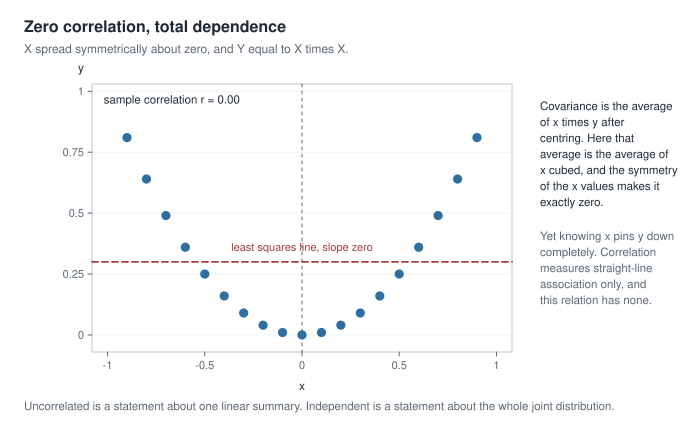

# Week 0 — Readiness and the probability bridge

## Where this week starts

This unit sits before the course proper, and it exists because of one recurring failure. A student
arrives having passed calculus-based probability, meets the score function in Week 7, and finds the
obstacle is not likelihood theory at all: it is that differentiating under an integral sign, or
treating a conditional expectation as a random variable rather than a number, was never quite solid.
The probability then swallows the statistics. So the question for this week is narrow. What
probability do you need in hand before Week 1, and how do you tell whether you have it?

There is no unfinished business behind us; this is the first page. What there is instead is a standing
assumption, made explicit here rather than buried in a prerequisite line. Four things get used
constantly from Week 1 onward: the joint distribution, with marginals and conditionals as readings of
one object rather than three; conditioning as an operation, with the tower property and the variance
decomposition as the identities that make it pay; transformations, since you almost never want the
distribution of the data but of something computed from it; and the two limit theorems, stated
carefully enough to survive cross-examination.

By Thursday you should be able to take an unfamiliar joint density and produce both marginals, either
conditional, a conditional mean, and a verdict on independence, and to push a random variable through
a smooth map and get the stretch factor right. None of this is new the way the rest of the course is
new; all of it is material you will be asked to use at speed, under the course's cycle of Model,
Derive, Compute, Critique, Connect. Reproduce the derivations below with a pencil.

### Why this matters downstream

The dependencies are not decorative. The Rao-Blackwell theorem in Week 11 is the variance
decomposition applied to an estimator and a sufficient statistic, and there is nothing else in its
proof. The information identity in Week 7 is an interchange of differentiation and integration, and
the regularity discussions of Weeks 7 and 12 are about when that interchange is legal. Each looks like
a trick to a reader whose conditional expectation is shaky, and inevitable to a reader whose is not.

The stakes outside the course are just as concrete. An analyst reports that an exposure and an outcome
are uncorrelated and concludes they are unrelated, when the relation is strong and correlation was the
wrong summary. Another applies a normal approximation at thirty observations to a right-skewed cost
distribution and quotes an interval whose real coverage is far under the advertised level.

## What you will be able to do

- Read a joint density and produce both marginals, either conditional, and a conditional mean, naming
  which object is the primitive one.
- Use the tower property and the variance decomposition to get a mean and a variance in two stages,
  then check the totals against a direct calculation.
- Transform a random variable by the distribution-function route and by the change-of-variables route,
  and state the monotonicity condition the second one needs.
- Use a moment generating function to identify the distribution of a sum of independent variables, and
  name a case where none exists.
- State the weak law and the central limit theorem with hypotheses, and separate what each asserts
  from what readers assume it asserts.
- Build a counterexample showing zero correlation without independence, and name the assumption that
  would repair the implication.

## Words worth owning

| Term | What it means in this course |
|------|------------------------------|
| joint density | The one function $f_{X,Y}(x,y)$ answering every probability question about the pair. Marginals and conditionals are read off it, never the reverse. |
| marginal density | What is left after integrating one variable away. It forgets how the two move together. |
| conditional density | The joint density on one slice, rescaled so the slice integrates to one: $f_{Y \mid X}(y \mid x)$. |
| independence | The factorization $f_{X,Y}(x,y) = f_X(x) f_Y(y)$ everywhere, with a product support. Strictly stronger than zero correlation. |
| conditional expectation | $\mathbb{E}[Y \mid X]$, a random variable that is a function of $X$; $\mathbb{E}[Y \mid X = x]$ is one of its values. |
| variance decomposition | Total variance equals average within-group variance plus variance of the group means. Also called the law of total variance. |
| moment generating function | $M_X(t) = \mathbb{E}[e^{tX}]$ where finite near zero; a device for reading moments and identifying sums. |
| convergence in distribution | Convergence of distribution functions at every continuity point of the limit. About a sequence of distributions, not your sample. |

## The joint distribution and the three views of one object

Fix notation now and keep it for fifteen weeks. A sample is $X_1, \dots, X_n$ from a density or mass
function $f(x \mid \theta)$ with $\theta$ in a parameter space $\Theta$. This week $\theta$ stays in
the background, because the topic is the probability that holds for any fixed $\theta$.

A joint density for two continuous variables is a nonnegative $f_{X,Y}$ with total integral one that
assigns probability by integration, $P((X,Y) \in A) = \int_A f_{X,Y}$. That is the entire definition,
and what matters is that there is one object here: the marginal of $X$, the marginal of $Y$, and the
conditional of $Y$ given $X$ are three views of one surface.

### From the joint density to marginals and conditionals

Integrate one variable away and a marginal is left:

$$
f_X(x) = \int_{-\infty}^{\infty} f_{X,Y}(x,y) \, dy, \qquad
f_Y(y) = \int_{-\infty}^{\infty} f_{X,Y}(x,y) \, dx .
$$

Slice instead, and rescale the slice to area one, and a conditional is left:

$$
f_{Y \mid X}(y \mid x) = \frac{f_{X,Y}(x,y)}{f_X(x)}, \qquad \text{where } f_X(x) \gt 0 .
$$

The rescaling is the whole content. A slice at $x$ is a perfectly good shape but does not integrate to
one, so it is not yet a density; dividing by $f_X(x)$, exactly the area of that slice, fixes it. Note
the restriction: in the continuous case $\{X = x\}$ has probability zero, so the conditional density
is a limiting object rather than a ratio of probabilities.

{fig-alt="A unit square shaded so the joint density x plus y grows toward the upper right, with the marginal density of X drawn above it, the marginal of Y at its right, and a dashed vertical slice at x equals 0.3 marking one conditional."}

The figure draws all three views for $f_{X,Y}(x,y) = x + y$ on the unit square, the model the first
worked example takes apart. The shading is the joint density; the curve above the square is the
marginal of $X$, from integrating each vertical column, and the curve to its right is the marginal of
$Y$, from the rows. Notice how little the marginals retain: both are straight lines from $0.5$ to
$1.5$, and their product $(x + 0.5)(y + 0.5)$ is not $x + y$. They cannot rebuild the joint density,
and that gap is the dependence.

Independence says the gap is zero: $f_{X,Y}(x,y) = f_X(x) f_Y(y)$ everywhere. You test it by
factorization — if $f_{X,Y}(x,y) = g(x) h(y)$ with a support that is a rectangle, the variables are
independent and $g, h$ are the marginals up to constants. Both halves matter, and the support half is
the one that gets forgotten. The uniform density on the triangle $\{0 \lt x \lt y \lt 1\}$ has the
constant formula $2$, which factors as $2 \times 1$ if you look only at the formula; but the indicator
that carries the triangle does not factor, and knowing $X = 0.9$ confines $Y$ to $(0.9, 1)$. A support
that is not a product set destroys independence by itself.

A second and quite separate support problem waits in Weeks 3, 7 and 12, and the two are easy to fuse
by mistake. Take $X_1, \dots, X_n$ independent and uniform on $(0,\theta)$. The joint support is the
cube $(0,\theta)^n$, a product set; the density factors exactly; the observations really are
independent. Nothing on this page's test fails. What breaks later is that the support *moves with the
parameter*: the set where the density is positive depends on $\theta$, which is why the family is not
an exponential family, why the likelihood is not differentiable in $\theta$ where it matters, and why
the interchange of differentiation and integration behind the information identity is not licensed.
When the uniform misbehaves in this course, look for a $\theta$-dependent support, not a failure of
independence.

### Conditioning as an operation, and the identities it obeys

Once there is a conditional density there is a conditional mean,
$\mathbb{E}[Y \mid X = x] = \int y \, f_{Y \mid X}(y \mid x) \, dy$. For each fixed $x$ that is a
number, and $x \mapsto \mathbb{E}[Y \mid X = x]$ is an ordinary function; call it $m$. The symbol
$\mathbb{E}[Y \mid X]$ means $m(X)$, a random variable because $X$ is. Confusing the number with the
random variable causes more trouble here than anything else.

The tower property is then one line:

$$
\mathbb{E}\big[\mathbb{E}[Y \mid X]\big]
= \int m(x) f_X(x) \, dx
= \int \left( \int y \, \frac{f_{X,Y}(x,y)}{f_X(x)} \, dy \right) f_X(x) \, dx
= \int \int y \, f_{X,Y}(x,y) \, dy \, dx
= \mathbb{E}[Y] .
$$

The marginal cancels and the double integral collapses to the definition of $\mathbb{E}[Y]$. The only
hypothesis is $\mathbb{E}|Y| \lt \infty$, so the order of integration may be exchanged. In words: to
average $Y$, average within each group, then average the group averages weighted by how often each
group occurs. The variance version needs one more step, and is worth deriving rather than memorizing.
Apply the tower property to $Y^2$ and substitute
$\mathbb{E}[Y^2 \mid X] = \operatorname{Var}(Y \mid X) + (\mathbb{E}[Y \mid X])^2$:

$$
\begin{aligned}
\operatorname{Var}(Y) &= \mathbb{E}[Y^2] - (\mathbb{E}[Y])^2 \\
&= \mathbb{E}\big[\operatorname{Var}(Y \mid X)\big]
 + \mathbb{E}\big[(\mathbb{E}[Y \mid X])^2\big]
 - \big(\mathbb{E}\big[\mathbb{E}[Y \mid X]\big]\big)^2 \\
&= \mathbb{E}\big[\operatorname{Var}(Y \mid X)\big] + \operatorname{Var}\big(\mathbb{E}[Y \mid X]\big) .
\end{aligned}
$$

The last two terms of the middle line are $\mathbb{E}[W^2] - (\mathbb{E}[W])^2$ for
$W = \mathbb{E}[Y \mid X]$, which is why they collapse into a variance. Because both pieces are
nonnegative, each is at most $\operatorname{Var}(Y)$; in particular
$\operatorname{Var}(\mathbb{E}[Y \mid X]) \le \operatorname{Var}(Y)$, so replacing a random quantity by
its conditional mean never increases variance. That inequality, not the identity, is what Week 11
cashes in.

A concrete instance keeps it honest. Let $X$ be a fair coin coded $0$ or $1$, with $Y \mid X = 0$
distributed $N(0,1)$ and $Y \mid X = 1$ distributed $N(4,1)$. Then $\mathbb{E}[Y \mid X]$ takes values
$0$ and $4$ with probability one half each, so it has mean $2$ and variance $4$, while the conditional
variance is $1$ either way, and the decomposition gives $\operatorname{Var}(Y) = 1 + 4 = 5$. Almost
all of the spread of this mixture comes from the separation between centres.

## Transformations, moments, and the two limit theorems

Statistics is rarely about the raw data; it is about $\bar{X}$, or $S^2$, or $X_{(n)}$, or a
likelihood ratio. So the operational question is always the same. Given the distribution of the data,
what is the distribution of the thing I computed? Two of the three standard routes are developed here,
the third appearing below.

### Change of variables and the factor that makes it work

Let $X$ have density $f_X$ and let $Y = g(X)$ with $g$ strictly monotone on the support of $X$ and
continuously differentiable with $g' \ne 0$ there. Then $g$ has a differentiable inverse, and

$$
f_Y(y) = f_X\big(g^{-1}(y)\big) \left| \frac{d}{dy} g^{-1}(y) \right| .
$$

That trailing derivative is the physical content of the formula, not bookkeeping. Probability is an
amount of stuff and a change of variable is a change of ruler: if a short interval of $x$ is stretched
into a long interval of $y$, the same probability is spread thinner and the density must shrink by
exactly the stretch factor. The absolute value is there because a decreasing $g$ reverses orientation
and probability has no sign.

{fig-alt="The decreasing curve y equals minus log u, with a strip of width 0.08 near u equals 0.74 mapping to an interval of length 0.11 and an equally wide strip near u equals 0.19 mapping to an interval of length 0.43."}

The figure argues this without algebra, using the map $y = -\log u$ that the second worked example
needs. Read its direction first: the curve descends, because as $u$ climbs toward one, $-\log u$ falls
to zero, so the strip nearest the right-hand edge lands nearest the origin. That reversal of
orientation is exactly what the absolute value absorbs.
Because $U$ is uniform, every strip of width $0.08$ carries probability $0.08$; follow the
shaded L-shape up to the curve and left to the vertical axis to see where it lands. Near $u = 0.74$
the curve is gentle and the strip arrives as an interval of length about $0.11$, so the density of $Y$
is large there. Near $u = 0.19$ the curve is steep and the same probability is smeared over about
$0.43$, so the density is about four times smaller. The two lengths sit in the ratio of
$|dy/du| = 1/u$ in each strip, roughly $1.35$ against $5.3$.

In two dimensions the stretch factor becomes a determinant. If $(U,V) = T(X,Y)$ is one-to-one with a
continuously differentiable inverse, then

$$
f_{U,V}(u,v) = f_{X,Y}\big(x(u,v), y(u,v)\big) \, \big| J(u,v) \big|,
\qquad
J = \det \begin{pmatrix} \partial x / \partial u & \partial x / \partial v \\
\partial y / \partial u & \partial y / \partial v \end{pmatrix},
$$

the local area-scaling of the inverse map; Week 2 puts it to work on the polar transformation. The
condition to watch is one-to-one behaviour, which guarantees a single inverse. When it fails the
formula is not approximately wrong but missing terms, as the second worked example shows.

### Moment generating functions as a uniqueness device

Define $M_X(t) = \mathbb{E}[e^{tX}]$, and say $X$ has a moment generating function when this is finite
for all $t$ in some interval $(-h, h)$ with $h \gt 0$. Three properties then matter. Derivatives at
the origin recover moments, $M_X^{(k)}(0) = \mathbb{E}[X^k]$. Independence turns sums into products,
since $\mathbb{E}[e^{t(X+Y)}] = \mathbb{E}[e^{tX}] \mathbb{E}[e^{tY}]$. And the function determines
the distribution: agreement on a neighbourhood of zero forces equality. Together they convert a hard
convolution into an easy multiplication — multiply, recognize, and the uniqueness theorem certifies
the recognition.

Work with $K_X(t) = \log M_X(t)$ alongside it, since $K_X'(0) = \mathbb{E}[X]$ and
$K_X''(0) = \operatorname{Var}(X)$ with no subtraction. For the normal,
$M(t) = \exp(\mu t + \sigma^2 t^2/2)$ and $K(t) = \mu t + \sigma^2 t^2 / 2$, returning $\mu$ and
$\sigma^2$ at once, and adding cumulant functions of independent normals adds means and variances term
by term.

Two cautions. Existence is a real condition, and the Cauchy distribution has none on any neighbourhood
of zero. And even when all moments exist they need not determine the distribution, the lognormal being
the standard example. The characteristic function $\mathbb{E}[e^{itX}]$ repairs both problems, which
is why serious limit theory uses it; this course uses moment generating functions anyway, because
every model here has one.

### What the weak law and the central limit theorem actually claim

Let $X_1, \dots, X_n$ be independent and identically distributed with mean $\mu$, and write
$\bar{X}_n = n^{-1} \sum_{i=1}^n X_i$. The weak law says that for every $\epsilon \gt 0$,
$P(|\bar{X}_n - \mu| \ge \epsilon) \to 0$, which is what convergence in probability to $\mu$ means.
With finite variance $\sigma^2$ the proof is two lines: $\operatorname{Var}(\bar{X}_n) = \sigma^2/n$,
so Chebyshev's inequality gives $P(|\bar{X}_n - \mu| \ge \epsilon) \le \sigma^2/(n\epsilon^2)$. Finite
variance is not necessary — a finite mean suffices — but this is the proof to carry.

The central limit theorem puts the variance back and says something sharper. If
$0 \lt \sigma^2 \lt \infty$, then

$$
Z_n = \frac{\sqrt{n} \, (\bar{X}_n - \mu)}{\sigma} \xrightarrow{d} N(0,1),
\qquad \text{that is,} \qquad
P(Z_n \le z) \to \Phi(z) \text{ for every } z .
$$

Every word is load-bearing. What converges is $Z_n$, a standardized and rescaled mean, not the mean
and not the data. The convergence is pointwise convergence of distribution functions, and because
$\Phi$ is continuous it is automatically uniform in $z$ — the technical fact that lets you approximate
probabilities at all.

{fig-alt="Exact densities of the sample mean of n exponential draws at n equals 1, 5 and 30 on one axis; the curves tighten around the mean of 1 and grow more symmetric, and a dashed normal curve nearly covers the n equals 30 curve."}

The figure shows what is and is not converging. The population is Exponential with rate one in all
three curves and never moves. What changes is the distribution of the average, drawn exactly rather
than simulated, since the mean of $n$ independent rate-one exponentials has the Gamma$(n, n)$ density.
At $n = 1$ it is the exponential itself; at $n = 5$ it has an interior mode but is visibly skewed; at
$n = 30$ it is hard to separate by eye from the dashed normal of the same mean and variance. Two
distinct things happen at once: the curves concentrate on the population mean, which is the weak law,
and they grow symmetric, which is the central limit theorem. Standardizing removes the first so you
can see the second.

Keep the rate out of the weak law. That law asserts concentration and nothing more, and it holds on a
finite mean alone. The $n^{-1/2}$ width you can measure off this figure comes from
$\operatorname{Var}(\bar{X}_n) = \sigma^2/n$, so it needs a finite variance — which the exponential
has — and it is the central limit theorem's own scaling, the factor $\sqrt{n}$ that stabilizes $Z_n$.
A finite-mean, infinite-variance population would still close in on $\mu$, only more slowly and at
some other rate.

How close is close? The skewness of $Z_n$ is $\gamma/\sqrt{n}$ for population skewness $\gamma$. The
exponential has $\gamma = 2$, so at $n = 30$ the standardized mean still carries skewness
$2/\sqrt{30} \approx 0.365$ — small, but one-sided tail probabilities feel it. In general the
Berry-Esseen bound says that if $\rho = \mathbb{E}|X - \mu|^3$ is finite then
$\sup_z |P(Z_n \le z) - \Phi(z)| \le C \rho / (\sigma^3 \sqrt{n})$ for a universal constant $C$ below
one half. Read that as what it is, an upper bound. The bound dies at rate $n^{-1/2}$, and for a skewed
population the rate cannot be improved — the exponential above is exactly such a case, its leading
error term being the skewness term. For a symmetric population with a finite third absolute moment
that term is zero, and the true distance is an order of magnitude smaller, typically $O(n^{-1})$. So
$n^{-1/2}$ describes the worst case rather than every case, the constant in front is governed by a
skewness-and-tails quantity, and how large $n$ must be has no answer that does not mention the
population.

## Worked example — a joint density on the unit square

**Setting.** Let $(X,Y)$ have joint density $f_{X,Y}(x,y) = x + y$ on $0 \lt x \lt 1$,
$0 \lt y \lt 1$, and zero elsewhere. This is the density in the first figure, and every quantity below
can be checked by hand.

**Step 1 — confirm it is a density.** Nonnegativity is clear, and for the total mass,

$$
\int_0^1 \int_0^1 (x + y) \, dx \, dy = \int_0^1 \left( \tfrac{1}{2} + y \right) dy
= \tfrac{1}{2} + \tfrac{1}{2} = 1 .
$$

Never skip this on an unfamiliar density; one line catches sign errors, missing constants, and misread
supports.

**Step 2 — the marginals.** Integrating $y$ away gives $f_X(x) = \int_0^1 (x+y) \, dy = x + \tfrac12$
on $(0,1)$, and by symmetry $f_Y(y) = y + \tfrac12$. Each rises from $0.5$ to $1.5$ and integrates to
one, as it must.

**Step 3 — the conditional.** Dividing,
$f_{Y \mid X}(y \mid x) = (x + y)/(x + \tfrac12)$ for $0 \lt y \lt 1$. Check the shape: at $x = 0$ it
is $2y$, tilted hard toward large $y$; at $x = 1$ it is $(1+y)/1.5$, much flatter. That the shape
depends on $x$ at all already says the variables are dependent.

**Step 4 — the conditional mean.**

$$
m(x) = \mathbb{E}[Y \mid X = x] = \frac{1}{x + \tfrac12} \int_0^1 y (x + y) \, dy
= \frac{\tfrac{x}{2} + \tfrac13}{x + \tfrac12} = \frac{3x + 2}{6x + 3} .
$$

Endpoints: $m(0) = 2/3$ and $m(1) = 5/9 \approx 0.556$, so the conditional mean of $Y$ falls as $x$
rises and the dependence is negative. At the slice drawn in the figure,
$m(0.3) = 2.9/4.8 = 29/48 \approx 0.604$.

**Step 5 — check with the tower property.** Averaging $m(X)$ over the marginal of $X$ must return
$\mathbb{E}[Y]$, and the denominators cancel:

$$
\mathbb{E}[m(X)] = \int_0^1 \frac{3x+2}{3(2x+1)} \cdot \frac{2x+1}{2} \, dx
= \int_0^1 \frac{3x+2}{6} \, dx = \frac{1}{6}\left(\frac{3}{2} + 2\right) = \frac{7}{12} .
$$

Directly, $\mathbb{E}[Y] = \int_0^1 y(y + \tfrac12) \, dy = \tfrac13 + \tfrac14 = \tfrac{7}{12}$. The
agreement is a real check; it would have caught a slip in step 4.

**Step 6 — dependence is real, correlation barely notices.** The product of marginals is
$(x + \tfrac12)(y + \tfrac12)$, not $x + y$, so the variables are dependent. Now measure with a
correlation, using $\mathbb{E}[XY] = \int_0^1 \int_0^1 xy(x+y) \, dx \, dy = \tfrac16 + \tfrac16 =
\tfrac13$ and $\mathbb{E}[X^2] = \int_0^1 x^2 (x + \tfrac12) \, dx = \tfrac14 + \tfrac16 =
\tfrac{5}{12}$:

$$
\operatorname{Cov}(X,Y) = \frac13 - \left(\frac{7}{12}\right)^2 = -\frac{1}{144},
\quad
\operatorname{Var}(X) = \frac{5}{12} - \left(\frac{7}{12}\right)^2 = \frac{11}{144},
\quad
\operatorname{Corr}(X,Y) = -\frac{1}{11} \approx -0.091 .
$$

The correlation is the covariance over $\sqrt{\operatorname{Var}(X)\operatorname{Var}(Y)}$, and the
symmetry of the density makes $\operatorname{Var}(Y) = \operatorname{Var}(X) = 11/144$, so the two
variances just cancel the denominator down to $11/144$. A correlation of $-0.09$ would be dismissed as
noise in most reports, yet the dependence is exact.

**Step 7 — the decomposition on real numbers.** Put $W = m(X)$. The substitution $u = 2x+1$ gives
$\mathbb{E}[W^2] = (48 + \log 3)/144$, so

$$
\operatorname{Var}\big(\mathbb{E}[Y \mid X]\big) = \frac{48 + \log 3}{144} - \frac{49}{144}
= \frac{\log 3 - 1}{144} \approx 0.00068 ,
$$

and since $\operatorname{Var}(Y) = 11/144 \approx 0.0764$ by symmetry, the other piece must be
$\mathbb{E}[\operatorname{Var}(Y \mid X)] = (12 - \log 3)/144 \approx 0.0757$. Almost all of the
variance of $Y$ is within-slice; under one per cent comes from slices having different means.

**What this assumed.** Only that the density is as stated and the integrals converge, which they do on
a bounded region with a bounded integrand. Carry away the order of operations: joint, marginal by
integration, conditional by division, conditional mean, then a tower-property check — the cheapest
error detector available.

### The same reasoning, transferred

Run the identical sequence on a bivariate normal. Let $(X,Y)$ be jointly normal with means $\mu_X,
\mu_Y$, standard deviations $\sigma_X, \sigma_Y$ and correlation $\rho$. The marginals are normal, and
the conditional of $Y$ given $X = x$ is normal with

$$
\mathbb{E}[Y \mid X = x] = \mu_Y + \rho \frac{\sigma_Y}{\sigma_X}(x - \mu_X),
\qquad
\operatorname{Var}(Y \mid X = x) = \sigma_Y^2 (1 - \rho^2) .
$$

What stayed the same is the architecture: one joint object, marginals by integration, conditional by
division, conditional mean by integrating against it. What changed is that the conditional mean is now
linear in $x$ and the conditional variance does not depend on $x$ at all. Both are special to the
normal, and they are why linear regression and normal theory fit together so neatly in Week 4.

The decomposition check is immediate. With $\sigma_X = \sigma_Y = 1$, $\mu_X = \mu_Y = 0$ and
$\rho = 0.6$, the conditional mean is $0.6x$ and the conditional variance $1 - 0.36 = 0.64$, while
$\operatorname{Var}(0.6X) = 0.36$; the two sum to $\operatorname{Var}(Y) = 1$. Same identity, a
different model — and here the between-slice share is thirty-six per cent rather than the under one
per cent of the previous example.

## Second worked example — from a uniform draw to a waiting time

**Setting.** Let $U$ be uniform on $(0,1)$ and define $Y = -\log U$. This is not artificial: it is how
simulation software produces exponential waiting times.

**Step 1 — the distribution-function route.** For $y \gt 0$, unwind the definition, remembering that
multiplying an inequality by a negative number flips it:

$$
P(Y \le y) = P(-\log U \le y) = P(\log U \ge -y) = P(U \ge e^{-y}) = 1 - e^{-y} .
$$

The last equality uses the uniform distribution function, and $e^{-y}$ does lie in $(0,1)$ for
$y \gt 0$. Differentiating, $f_Y(y) = e^{-y}$: the standard exponential.

**Step 2 — the change-of-variables route as a check.** Here $g(u) = -\log u$ is strictly decreasing on
$(0,1)$, so the inverse is $u = e^{-y}$ with $|du/dy| = e^{-y}$, and
$f_Y(y) = f_U(e^{-y}) \cdot e^{-y} = e^{-y}$, matching step 1. Two independent routes to one density is
the redundancy Week 8 turns into a discipline.

**Step 3 — introduce a rate.** Set $T = Y/\lambda$ with $\lambda \gt 0$. Then
$P(T \le t) = P(Y \le \lambda t) = 1 - e^{-\lambda t}$, so $T$ is exponential with rate $\lambda$,
mean $1/\lambda$, variance $1/\lambda^2$. Units are a free check: with $\lambda$ in events per hour,
$1/\lambda$ is in hours.

**Step 4 — the moment generating function.** For $t \lt \lambda$,

$$
M_T(t) = \int_0^{\infty} e^{ts} \lambda e^{-\lambda s} \, ds
= \lambda \int_0^{\infty} e^{-(\lambda - t)s} \, ds = \frac{\lambda}{\lambda - t} .
$$

The restriction is where existence lives; the integral diverges otherwise. Since $\lambda \gt 0$ the
function is finite around zero, so the uniqueness theorem applies.

**Step 5 — sum independent waiting times.** With $T_1, \dots, T_n$ independent at rate $\lambda$ and
$S_n = \sum_i T_i$, independence makes the moment generating function of the sum a product of
identical factors, $M_{S_n}(t) = \{\lambda/(\lambda - t)\}^{n}$ for $t \lt \lambda$. That is the
moment generating function of the Gamma distribution with shape $n$ and rate $\lambda$, density
$\lambda^n s^{n-1} e^{-\lambda s}/(n-1)!$ for $s \gt 0$, so by uniqueness $S_n$ has that distribution.
The cumulant function $K(t) = n \log \lambda - n \log(\lambda - t)$ gives $K'(t) = n/(\lambda - t)$
and $K''(t) = n/(\lambda - t)^2$, hence $\mathbb{E}[S_n] = n/\lambda$ and
$\operatorname{Var}(S_n) = n/\lambda^2$.

**Step 6 — numbers.** A reliability laboratory tests components whose lifetimes are exponential with
rate $\lambda = 0.4$ per hour and records the time to the fifth failure. Then $S_5$ is Gamma with
shape $5$ and rate $0.4$, so $\mathbb{E}[S_5] = 12.5$ hours and $\operatorname{Var}(S_5) = 5/0.16 =
31.25$, a standard deviation near $5.59$ hours. The chance the fifth failure arrives within ten hours
follows from the Poisson correspondence — five or more events in ten hours, mean
$\lambda \cdot 10 = 4$:

$$
P(S_5 \le 10) = 1 - \sum_{k=0}^{4} e^{-4} \frac{4^k}{k!} = 1 - 0.6288 = 0.3712 .
$$

### When the map is not monotone

Break the condition on purpose. Let $X \sim N(0,1)$ and $Y = X^2$. Since $g(x) = x^2$ is not
one-to-one on the line, the change-of-variables formula does not apply. A reader who uses it anyway on
the branch $x = \sqrt{y}$, with $|dx/dy| = 1/(2\sqrt{y})$, gets

$$
\tilde{f}(y) = \frac{1}{\sqrt{2\pi}} e^{-y/2} \cdot \frac{1}{2\sqrt{y}}
= \frac{1}{2\sqrt{2\pi y}} e^{-y/2} ,
$$

which integrates to one half. The total-mass check exposes that instantly, which is why you always run
it. The correct route splits the domain, or equivalently uses the distribution function: for
$y \gt 0$,

$$
F_Y(y) = P(-\sqrt{y} \le X \le \sqrt{y}) = 2\Phi(\sqrt{y}) - 1,
\qquad
f_Y(y) = 2 \phi(\sqrt{y}) \cdot \frac{1}{2\sqrt{y}} = \frac{1}{\sqrt{2 \pi y}} e^{-y/2} ,
$$

using the symmetry of the standard normal density $\phi$. This is exactly twice the naive attempt,
because each $y$ has two preimages and both contribute. The result is the chi-square distribution with
one degree of freedom, equivalently Gamma with shape $1/2$ and rate $1/2$; its mean is $1$, its
variance is $\mathbb{E}[X^4] - 1 = 3 - 1 = 2$, and its moment generating function is $(1-2t)^{-1/2}$
for $t \lt 1/2$. Adding independent copies builds the whole chi-square family, the machinery Week 4
needs for $S^2$.

**What these steps assumed.** Strict monotonicity of the map in steps 1 to 3, and existence of the
moment generating function on a neighbourhood of zero in steps 4 and 5, which held because
$\lambda \gt 0$. The habit to transfer is that a transformation problem has two routes, and
disagreement between them means one of them is wrong.

## Checking the claims in R

Do not take the above on trust. The blocks below are shown, not executed; paste them into an
[R](https://www.r-project.org/) session. These pages are built with [Quarto](https://quarto.org/).

```
set.seed(75063)
reps <- 200000

## the conditional mean m(x), by rejection sampling from f(x,y) = x + y
x <- runif(reps); y <- runif(reps)
keep <- runif(reps) * 2 < (x + y)          # accept with probability (x+y)/2
x <- x[keep]; y <- y[keep]
c(EY = mean(y), target = 7/12)             # tower property: both near 0.5833
band <- abs(x - 0.3) < 0.01
c(cond = mean(y[band]), target = 29/48)    # near 0.604
c(corr = cor(x, y), target = -1/11)        # near -0.091
```

Read the rejection step closely: proposing a uniform pair and accepting with probability proportional
to $x + y$ produces draws from the target, using the bound $x + y \lt 2$. The next block checks the
transformation and the limit theorem.

```
## Y = -log(U) is exponential; five of them sum to Gamma(5, 0.4)
u <- runif(reps); yy <- -log(u)
c(mean = mean(yy), var = var(yy))                    # both near 1
s5 <- replicate(50000, sum(rexp(5, rate = 0.4)))
c(mean = mean(s5), sd = sd(s5))                      # near 12.5 and 5.59
mean(s5 <= 10)                                       # near 0.3712

## what the central limit theorem does and does not promise
zs <- replicate(50000, sqrt(30) * (mean(rexp(30, 1)) - 1))
c(mean = mean(zs), sd = sd(zs), third = mean(zs^3))  # near 0, 1, and 0.365
qqnorm(zs); qqline(zs)                               # the upper tail still bends
```

The last three lines are the ones to stare at. The mean and standard deviation land where the theorem
promises, and a careless reader stops there and declares normality. The third moment does not: it sits
near $2/\sqrt{30}$, and the quantile plot bends in the upper tail. Agreement on two summaries is not
agreement on a distribution.

## The misreading to avoid

Two sentences get said out loud every year, and both are wrong in instructive ways.

**"Uncorrelated means independent."** Correlation measures one thing, the strength of the best
straight-line relation; independence is a statement about the whole joint distribution. The gap is
enormous and the counterexample is one line. Let $X$ be uniform on $(-1,1)$ and $Y = X^2$. Then
$\mathbb{E}[X] = 0$ and $\mathbb{E}[XY] = \mathbb{E}[X^3] = 0$ by symmetry, so
$\operatorname{Cov}(X,Y) = 0$ exactly — yet $Y$ is a deterministic function of $X$, which is as far
from independence as one can get. Concretely, $P(Y \lt 0.25) = P(|X| \lt 0.5) = 0.5$ while
$P(Y \lt 0.25 \mid X = 0.9) = 0$.

{fig-alt="Nineteen dots lying exactly on an upward parabola, symmetric about x equals zero, with a flat dashed least squares line at height 0.30 and a note that the sample correlation is 0.00."}

The figure makes this visual with nineteen symmetric values of $x$ and their squares. The sample
correlation is exactly zero and the fitted line exactly flat, because the least squares slope is the
sample covariance over the sample variance of $x$ and the numerator vanishes by symmetry. Any
procedure summarizing this scatter by its correlation reports "no relation" for data lying on a curve
with no scatter at all. The repair is to name the missing assumption: if $(X,Y)$ is *jointly* normal,
zero correlation does give independence, because the bivariate normal density factors exactly when
$\rho = 0$. Joint normality, not marginal normality.

**"The central limit theorem says the data become normal for large $n$."** Nothing about the data
changes as $n$ grows. Each $X_i$ keeps its distribution, and a histogram of the raw sample converges
to the population density, not to a bell curve. What converges is the distribution of $Z_n$, in the
sense of distribution functions. Three consequences follow. The theorem says nothing about any fixed
$n$; accuracy at your $n$ is governed by skewness and tails through Berry-Esseen, and $n = 30$ is a
rule of thumb with no theorem behind it. It is about the centre far more than the tails, so relative
error in a far tail can be huge while the maximum absolute error is small. And it needs finite
variance: for a Cauchy population the sample mean has the same Cauchy distribution as one observation.

A quieter third misreading is worth naming: treating $\mathbb{E}[Y \mid X]$ as a number. It is a
random variable, and every result that conditions on a statistic depends on that. If it were a number,
$\operatorname{Var}(\mathbb{E}[Y \mid X])$ in the decomposition would be zero and the identity would
collapse into nonsense.

## Practice on your own

These are for self-checking before Week 1, not for submission. Pencil first, console second.

1. **A dependent pair with zero covariance.** Let $(X,Y)$ be uniform on the diamond
   $\{|x| + |y| \le 1\}$, whose corners are $(1,0)$, $(0,1)$, $(-1,0)$ and $(0,-1)$. Check first that
   the region has area two, so the density is $1/2$ there. Then show $X$ and $Y$ are uncorrelated,
   find both marginals, and explain geometrically why they cannot be independent. What is the
   conditional range of $Y$ given $X = 0.9$?

2. **A two-stage derivation.** Let $N$ be Poisson with mean $\nu$, and given $N = n$ let $S$ be a sum
   of $n$ independent Bernoulli($p$) variables. Use the tower property and the variance decomposition
   to find $\mathbb{E}[S]$ and $\operatorname{Var}(S)$, then identify the distribution of $S$ outright
   and confirm both moments against it. Say which step used independence.

3. **An audit of a plausible wrong argument.** A colleague writes: "Let $X$ be standard normal and
   $Y = |X|$. Since the absolute value is smooth away from the origin, change of variables gives
   $f_Y(y) = \phi(y)$ for $y \gt 0$." Find the error, produce the correct density, and name the
   one-line check that would have exposed it.

4. **A simulation you specify before running.** How large must $n$ be for the normal approximation to
   the mean to be adequate for a lognormal population with a heavy right tail? Decide in advance what
   you will simulate, which discrepancy you will measure, and what value of it counts as adequate.
   Then run it at $n = 30$, $n = 200$ and $n = 1000$. Writing the criterion first is the habit.

5. **A uniqueness argument, and the closure it needs.** Using moment generating functions, show that
   the sum of independent Poisson variables with means $\nu_1$ and $\nu_2$ is Poisson with mean
   $\nu_1 + \nu_2$. Then run the same move on two independent uniforms on $(0,1)$: the product of the
   two moment generating functions is $\{(e^t - 1)/t\}^2$, and it does identify a distribution — the
   triangular density on $(0,2)$, rising from zero to one and falling back. Confirm that by
   convolution as well, and then say exactly what differs between the two cases. The step of
   multiplying and recognizing never fails; what the Poisson has and the uniform lacks is closure
   under convolution, so the recognition lands you outside the family you started in.

## Where to read more

- [Penn State STAT 414, Introduction to Probability Theory](https://online.stat.psu.edu/stat414/) —
  the closest match to this page. Its lessons on joint and conditional distributions, transformations,
  and moment generating functions cover everything above at a comparable level, with far more routine
  exercises than there is room for here.
- [MIT OpenCourseWare 18.650, Statistics for Applications](https://ocw.mit.edu/courses/18-650-statistics-for-applications-fall-2016/) —
  the applied framing. Its opening lectures treat the law of large numbers and the central limit
  theorem as tools for building estimators, the stance this course takes from Week 1.
- [MIT OpenCourseWare 18.655, Mathematical Statistics](https://ocw.mit.edu/courses/18-655-mathematical-statistics-spring-2016/) —
  more demanding than you need this week, but skim the opening sections so the vocabulary of Week 1 is
  not a surprise.
- [The R Project](https://www.r-project.org/) and [Quarto](https://quarto.org/). Install both before
  Week 1; the code blocks here assume nothing beyond base R.
- Hogg, McKean and Craig's *Introduction to Mathematical Statistics* covers this material in its first
  four chapters if you own a copy — an optional structural reference.
- The [course syllabus](../syllabus.qmd) and the [resources page](../resources/index.qmd).

## Where this goes next

Week 1 changes the question. Everything above holds for a fixed, known distribution; from next week
the distribution is unknown, indexed by a parameter, and the object of study is the family
$\{P_\theta : \theta \in \Theta\}$ rather than any single $P$. The first thing Week 1 does with a joint
density is read it as a likelihood — the same function, viewed as a function of $\theta$ with the data
held fixed — and the first distinction it insists on is between a parameter of the observed-data
distribution and the scientific target you care about. Bring the factorization habit with you:
independence is what turns a joint density into a product, and that product is where likelihood theory
begins.

Read [Week 1 — Statistical experiments, models, parameters, and estimands](week-01.qmd) next. If any
step here felt unfamiliar rather than merely rusty, spend the time now rather than in Week 7. The
[notes index](../index.qmd) lists every unit, and the [schedule](../schedule.qmd) shows which week
reaches which idea.
