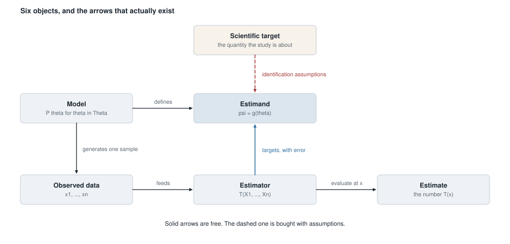
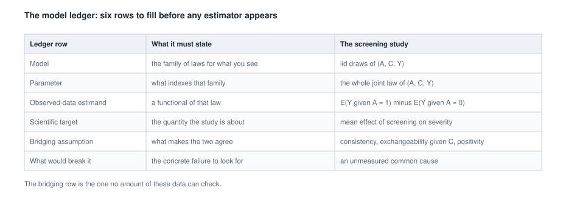
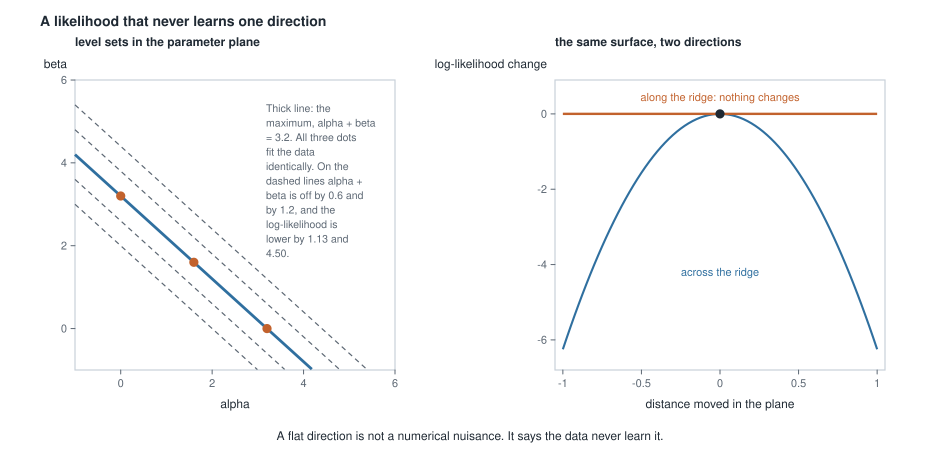
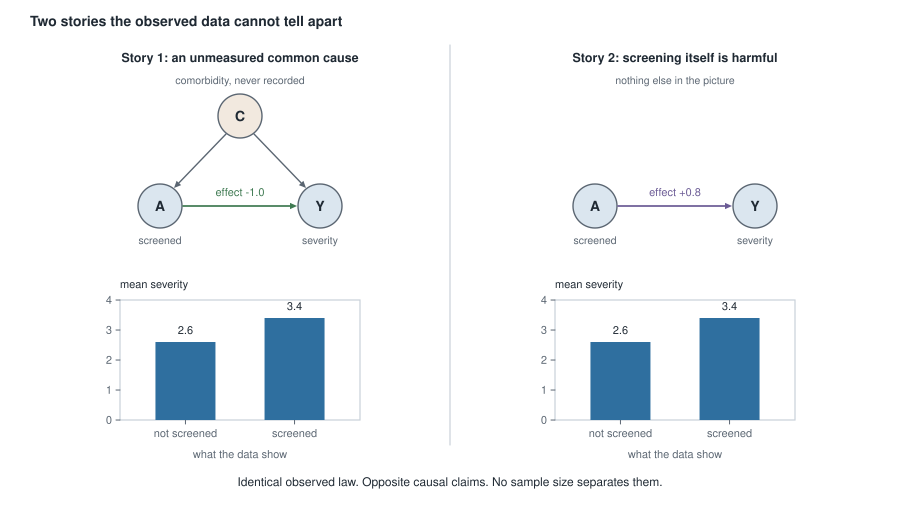

# Week 1 — Statistical experiments, models, parameters, and estimands

## Where this week starts

Week 0 handed you a probability toolkit: joint and conditional densities, the tower property, change
of variables, and the two limit theorems. Every one of those results begins with a distribution already
in hand. Nobody in that story had to decide *which* $f(x \mid \theta)$, or *what number* they were
after, or *whether the data could reveal it*. Those decisions are where statistics starts, and where
this week starts.

The question this week takes up sits before any estimator exists: **what exactly are we trying to
learn, and from what?** "From what" is the statistical experiment — the sample space, the family of
candidate distributions, and the assumptions that turn a wish into a model. "What we are trying to
learn" is the estimand, a specific number fixed before any data arrive. Students arrive fluent in
estimators and vague about estimands, and this course pushes back on that order all term.

By Thursday you should be able to take a described study, write down the experiment
$\mathcal{P} = \{P_\theta : \theta \in \Theta\}$ that formalizes it, decide whether $\theta$ is
identifiable, name a functional of the observed-data distribution that is the thing you want, and say
which further assumption would connect it to the scientific claim someone will make. On Tuesday most of
you can compute a sample mean and call it an estimate of "the effect"; by Thursday you should be
uncomfortable saying "the effect" without saying which one. One habit starts here and never stops: the
**model ledger**, a fixed set of rows — model, parameter, observed-data estimand, scientific target,
bridging assumptions, what would break it — filled in before you compute anything.

### Why this matters downstream

A clinic reports that patients who took an optional screening had *worse* average outcomes than
patients who did not, and a newspaper reports that screening is harmful. Below you will find a fully
specified model in which the observed difference in means is exactly $+0.8$ while screening lowers
severity by exactly $1.0$ for every patient. Nothing is wrong with the arithmetic, the sample size, or
the software. The number computed and the number claimed are different objects, and no amount of data
repairs a mismatch of that kind.

The technical stake is as immediate. Week 7 defines the maximum likelihood estimator as a maximizer of
$\ell(\theta)$; Week 12 asserts that $\sqrt{n}(\hat\theta - \theta)$ is asymptotically normal with
variance $1 / I_1(\theta)$. Both statements silently assume $\theta$ is identifiable, and both fail
without it — but not always in the same way. Always the maximizer is a set rather than a value, so
"the" estimate is not a number. When the observationally equivalent points form a continuum through
$\theta$ — the flat ridge of the second worked example — the information matrix is singular too, and
$1 / I_1(\theta)$ does not exist. When they are isolated instead, as with the label swap in a
two-component mixture, the information stays invertible and the Week 12 formula is well defined; what
fails is that the quantity it is a variance *for* has no single value. Same disease, two symptoms.

## What you will be able to do

- **Write down** a statistical experiment for a described study, naming the sample space, the family,
  the parameter space, and the assumptions that restrict the family.
- **Classify** a model as parametric, nonparametric, or semiparametric, and say what that buys and costs.
- **Prove or disprove** identifiability for a given family, and state what fails when it does not hold.
- **Distinguish** parameter, estimand, estimator, and estimate without conflating a random variable
  with the number it takes.
- **Write** an observed-data estimand as a functional of what you actually see, and the scientific
  target beside it with the assumption that would join them.
- **Fill in** a model ledger and name the concrete failure that would break its bridging assumption.

## Words worth owning

| Term | What it means in this course |
|------|------------------------------|
| Statistical experiment | A sample space $\mathcal{X}$ plus a family $\mathcal{P}$ of distributions on it, one of which is assumed to have generated the data. |
| Model | The family $\mathcal{P}$ as a restriction: everything outside it is excluded by assumption, not by evidence. |
| Parameter | An index $\theta \in \Theta$ naming a member of the family. A label for a distribution. |
| Identifiable | The labelling is one-to-one: $\theta_1 \ne \theta_2$ forces $P_{\theta_1} \ne P_{\theta_2}$. |
| Estimand | The number you want, fixed before data: $\psi = g(\theta)$, or a functional $\psi = \Psi(P)$. |
| Estimator | A random variable $T(X_1, \dots, X_n)$ built from the data alone, with no $\theta$ inside it. |
| Estimate | The realized number $T(x_1, \dots, x_n)$ from the sample you have. |
| Observed-data estimand | A functional of the law of exactly the variables you record: always identified, not always wanted. |
| Scientific target | The quantity the study is about, often a feature of variables you did not record. |

## The statistical experiment as a mathematical object

A **statistical experiment** is a sample space $\mathcal{X}$ together with a family of distributions on
it,

$$\mathcal{P} = \{ P_\theta : \theta \in \Theta \},$$

where $\Theta$ is the parameter space. The data $X$ takes values in $\mathcal{X}$, and the modelling
assumption is that $X \sim P_\theta$ for some unknown $\theta \in \Theta$. Three commitments hide in
that sentence. The first is $\mathcal{X}$: what counts as data. Writing $\mathcal{X} = \mathbb{R}^n$
already decides the study produces $n$ real numbers and nothing else — no covariates, no missingness
indicator, no record of who declined. The second is $\mathcal{P}$: a strict subset of all distributions
on $\mathcal{X}$, so everything outside it has been ruled out by assumption rather than by evidence.
The third is the map $\theta \mapsto P_\theta$, which nothing forces to be injective.

For an independent and identically distributed sample the experiment has extra structure. If
$X_1, \dots, X_n$ are independent draws from a density or mass function $f(x \mid \theta)$, the whole
sample has density

$$f_n(x_1, \dots, x_n \mid \theta) = \prod_{i=1}^{n} f(x_i \mid \theta).$$

Independence says no observation carries information about another beyond what $\theta$ carries.
Identical distribution says one mechanism produced all $n$ records — same clinic, same instrument, same
population, across the whole study. Neither is a property of the data; both are properties of the story
you tell about the data.

### From a sample space to a family of laws

Four families this course reuses, each given by its **one-observation** density or mass function
$f(x \mid \theta)$; the law of the whole sample is the product $f_n$ displayed above, and the two
symbols stay distinct for the rest of the course. **Bernoulli**: $\Theta = [0, 1]$ and
$f(x \mid p) = p^{x}(1-p)^{1-x}$ on $\{0, 1\}$, so $\mathcal{X} = \{0, 1\}^n$ and
$f_n(x_1, \dots, x_n \mid p) = p^{s}(1-p)^{n-s}$ with $s = \sum_i x_i$ — one dimension, and nothing to
argue about except whether the draws really are copies of one another. **Normal with known variance**:
$\Theta = \mathbb{R}$ and $f(x \mid \mu) = (2\pi\sigma_0^2)^{-1/2} \exp\{ -(x - \mu)^2 / (2\sigma_0^2) \}$,
whose product form is
$f_n(x_1, \dots, x_n \mid \mu) = (2\pi\sigma_0^2)^{-n/2} \exp\{ -\sum_i (x_i - \mu)^2 / (2\sigma_0^2) \}$;
fixing $\sigma_0^2$ is a real restriction, since the family is then a curve through the two-parameter
normal family and no member of it is correct if the true variance differs. **Exponential**:
$f(x \mid \lambda) = \lambda e^{-\lambda x}$ for $x > 0$, the well-behaved reference case for Weeks 7
and 12, with a fixed support and everything smooth in $\lambda$.

**Uniform on $(0, \theta)$**: $f(x \mid \theta) = \theta^{-1}\mathbf{1}\{0 < x < \theta\}$, where the
*support* moves with the parameter. Be precise about what goes wrong. The family is perfectly
identifiable: if $\theta_1 < \theta_2$, the interval $(\theta_1, \theta_2)$ has probability $0$ under
$P_{\theta_1}$ and $(\theta_2 - \theta_1)/\theta_2 > 0$ under $P_{\theta_2}$. What the uniform breaks
is *regularity* — differentiating under the integral sign, the score identities, the information bound.
That is a different failure from non-identifiability, and keeping the two apart now will save you real
trouble in Week 12.

All four are **parametric**: $\Theta \subseteq \mathbb{R}^k$ for a fixed finite $k$. A **nonparametric**
model takes $\mathcal{P}$ to be something like all distributions on $\mathbb{R}$ with finite variance,
so the parameter is the distribution itself. A **semiparametric** model splits $\theta = (\beta, \eta)$
with $\beta \in \mathbb{R}^k$ of interest and $\eta$ an infinite-dimensional nuisance; the linear model
$Y = \beta^\top Z + \varepsilon$ with $\mathbb{E}[\varepsilon \mid Z] = 0$ and unspecified error density
is the standard instance. A narrow family gives sharp conclusions when right and confidently wrong ones
when not.

### Identifiability, and the proposition that makes it matter

A model is **identifiable** when the labelling map is injective:

$$\theta_1 \ne \theta_2 \quad \Longrightarrow \quad P_{\theta_1} \ne P_{\theta_2}.$$

This is a property of the model, not of the data, and no sample size bears on it.

**Proposition.** Suppose $\theta_1 \ne \theta_2$ but $P_{\theta_1} = P_{\theta_2}$. Then no sequence of
estimators $\hat\theta_n = T_n(X_1, \dots, X_n)$ is consistent at both $\theta_1$ and $\theta_2$.

*Derivation.* Since $P_{\theta_1} = P_{\theta_2}$, the $n$-fold product measures coincide; call the
common law $Q_n$. Because $T_n$ is a fixed function of the data with no $\theta$ inside it, the
distribution of $\hat\theta_n$ is the law of $T_n$ under $Q_n$ whichever value we call the truth. Put
$\epsilon = \lVert \theta_1 - \theta_2 \rVert / 2$ and let
$A_n = \{ \lVert \hat\theta_n - \theta_1 \rVert \lt \epsilon \}$ and
$B_n = \{ \lVert \hat\theta_n - \theta_2 \rVert \lt \epsilon \}$. The triangle inequality makes them
disjoint, so $Q_n(A_n) + Q_n(B_n) \le 1$ for every $n$. But consistency at $\theta_1$ gives
$Q_n(A_n) \to 1$ and consistency at $\theta_2$ gives $Q_n(B_n) \to 1$, forcing the sum toward $2$.
Contradiction.

That says something stronger than "estimation is hard here". No estimator, however clever and however
large the sample, is consistent for a non-identified parameter across the parameter space. This is not
a variance problem; the missing information is absent at every $n$.

The repair is usually to change the claim. A function $g : \Theta \to \mathbb{R}$ is **identified** when
$P_{\theta_1} = P_{\theta_2}$ implies $g(\theta_1) = g(\theta_2)$: the distribution pins down $g$ even
when it does not pin down $\theta$. In the second worked example below, $\theta = (\alpha, \beta)$ is
not identified but $\alpha + \beta$ is, and everything sensible you can say there is a statement about
$\alpha + \beta$. An estimand is a target you can test for identifiability before committing to
estimate it, which is why this course insists on naming one.

## Parameter, estimand, estimator, estimate

Four words, four different objects, and a semester of confusion if they blur.

{fig-alt="A flow diagram: Model leads right to Estimand and down to Observed data, which feeds the Estimator, evaluated for the Estimate and pointing up at Estimand. A dashed arrow from Scientific target to Estimand reads identification assumptions."}

### Four objects, and the two arrows people get wrong

The **parameter** $\theta$ is an index whose only job is to name a member of $\mathcal{P}$. In a
well-posed problem it is not what you report.

The **estimand** $\psi$ is the number you want, usually $\psi = g(\theta)$ for a known $g$ and often far
lower-dimensional than $\theta$: with $\theta = (\mu, \sigma^2)$ it might be $\mu$, or
$\mathbb{P}_\theta(X > 10) = 1 - \Phi((10 - \mu)/\sigma)$, or $\mu / \sigma$. The more durable form is
a **functional** of the distribution, $\psi = \Psi(P)$ — for the mean, $\Psi(P) = \int x \, dP(x)$,
which makes sense for every $P$ with a finite first moment and needs no parametric family. That form
survives misspecification, which is why Week 14 uses it.

The **estimator** $\hat\psi = T(X_1, \dots, X_n)$ is a random variable: a measurable function of the
data and nothing else. Barring $\theta$ from $T$ is not pedantry — a rule like "use $\bar{X}$ when
$\theta > 0$ and $-\bar{X}$ otherwise" cannot be evaluated. The **estimate** $T(x_1, \dots, x_n)$ is a
number, the thing you type into a report.

Two arrows get misdrawn. Estimator-to-estimand exists: the estimator targets the estimand, always with
error, and bias, variance, mean squared error, consistency and asymptotic normality — Weeks 6, 11 and
12 — all describe that error. Estimate-to-estimand does not exist. A number from one sample has no
distribution, so "the variance of the estimate" is a category error. The estimator has a variance; the
estimate is one draw from it.

### An observed-data estimand is not a scientific target

An **observed-data estimand** is a functional $\Psi(P)$ of the distribution $P$ of exactly the variables
you record. It is always identified, because $P$ is what an infinite sample would reveal, so a
functional of $P$ is pinned down by the sampling process itself. Its limitation is that it need not be
interesting.

A **scientific target** $\psi_{\mathrm{sci}}$ is a feature of a richer structure — potential outcomes
under treatments not given, a true exposure measured with error, a population you did not sample from.
Nothing guarantees that $P$ determines it. The target is **identified** when some functional $\Psi$
satisfies

$$\psi_{\mathrm{sci}} = \Psi(P) \quad \text{for every } P \text{ compatible with the assumptions } \mathcal{A}.$$

Writing down that $\Psi$, and being explicit about $\mathcal{A}$, is the identification step. It is
mathematics, not statistics: no data enter and no estimator is chosen. When $\mathcal{A}$ is too weak,
the values of $\psi_{\mathrm{sci}}$ consistent with $P$ can form an interval rather than a point, and
the honest report is that whole set.

::: {.callout-note}
**Check the special case.** Test every identification claim against the case where it should become
trivial. In the screening study below, if screening were assigned by a coin flip, the crude difference
in means and the standardized contrast would coincide and the bridge would hold by design. If your
assumption set does not simplify in the randomized case, you have written it down wrong.
:::

### The model ledger as a working habit

Six rows, filled in before you compute, each short enough to fit on one line.

{fig-alt="A six-row table with columns for the ledger row, what it must state, and the screening study. Rows are model, parameter, observed-data estimand, scientific target, bridging assumption, and what would break it."}

The sixth row does the work: "what would break it" forces you to name a concrete, imaginable failure —
an unmeasured common cause, an instrument that drifts, a group that declines at a different rate. A
ledger whose last row says "the assumptions might not hold" is not a ledger. One that says "patients
with prior hospitalizations both screen more and worsen more, and we never recorded prior
hospitalizations" is a research plan.

## Worked example — a screening study and the target it does not reach

**Setting.** A clinic records, for each of $n$ adults arriving in one year, a comorbidity indicator
$C \in \{0, 1\}$, a screening indicator $A \in \{0, 1\}$ (screening is optional and patients choose),
and a severity measure $Y$ twelve months later, larger being worse. The data are independent copies of
$(C, A, Y)$. Fix the mechanism completely — and fix it *structurally*, at the level of what each
patient would record under either screening decision, since that is the level a causal claim lives on:

$$\mathbb{P}(C = 1) = 0.5, \qquad \mathbb{P}(A = 1 \mid C = 0) = 0.2, \qquad \mathbb{P}(A = 1 \mid C = 1) = 0.8,$$

$$Y(a) = 2 + 3C - a + \varepsilon \quad \text{for } a \in \{0, 1\}, \qquad Y = Y(A),$$

where $\varepsilon$ is independent of $(A, C)$ with $\mathbb{E}[\varepsilon] = 0$. Read the second line
twice. $Y(a)$ is the severity a given patient would record had the screening decision been $a$ — two
numbers per person, of which the world reveals one — and $Y = Y(A)$ says the severity recorded is the
potential outcome belonging to the decision actually taken. Sicker patients screen far more often,
comorbidity raises severity by three units, and screening lowers it by one unit for everybody.

What the data can display is the observational consequence of that, which follows by substituting
$Y = Y(A)$ and using $\mathbb{E}[\varepsilon \mid A, C] = \mathbb{E}[\varepsilon] = 0$:

$$\mathbb{E}[Y \mid A = a, C = c] = \mathbb{E}[2 + 3C - A + \varepsilon \mid A = a, C = c] = 2 + 3c - a .$$

Every number below can now be checked by hand. Note that the implication runs one way only: conditional
means of $2 + 3c - a$ are equally consistent with a world where screening does nothing and the patients
who choose it differ, within each level of $C$, for reasons nobody recorded.

**Step 1 — the observed-data estimand.** The number a naive report computes is the crude contrast

$$\psi_{\mathrm{crude}} = \mathbb{E}[Y \mid A = 1] - \mathbb{E}[Y \mid A = 0],$$

a functional of the distribution of $(A, Y)$ alone, defined whenever $0 < \mathbb{P}(A = 1) < 1$ and
$\mathbb{E}|Y| < \infty$.

**Step 2 — evaluate it.** The screening rate is $\mathbb{P}(A = 1) = 0.5(0.2) + 0.5(0.8) = 0.5$, so
Bayes' rule gives the comorbidity mix in each arm:

$$\mathbb{P}(C = 1 \mid A = 1) = \frac{0.5(0.8)}{0.5} = 0.8, \qquad \mathbb{P}(C = 1 \mid A = 0) = \frac{0.5(0.2)}{0.5} = 0.2 .$$

Averaging the conditional mean over that mix,

$$\mathbb{E}[Y \mid A = 1] = 2 + 3(0.8) - 1 = 3.4, \qquad \mathbb{E}[Y \mid A = 0] = 2 + 3(0.2) - 0 = 2.6,$$

so $\psi_{\mathrm{crude}} = 3.4 - 2.6 = 0.8$.

**Step 3 — the scientific target.** The target is the average causal effect
$\psi_{\mathrm{sci}} = \mathbb{E}[Y(1) - Y(0)]$, and the structural display hands it over immediately:
$Y(1) - Y(0) = (2 + 3C - 1 + \varepsilon) - (2 + 3C + \varepsilon) = -1$ for every patient, whatever
their comorbidity and whatever their $\varepsilon$, so $\psi_{\mathrm{sci}} = -1$ exactly. Observed
$+0.8$, effect $-1.0$: not merely biased, but the wrong sign. Notice which display did the work — the
mechanism, which no real study hands you. Nothing was read off $\mathbb{E}[Y \mid A = a, C = c]$, and
nothing could have been.

**Step 4 — what would join them.** Consistency: $Y = Y(A)$, the outcome you see is the potential
outcome for the treatment actually taken. Conditional exchangeability: $\{Y(0), Y(1)\}$ independent of
$A$ given $C$. Positivity: $0 < \mathbb{P}(A = 1 \mid C = c) < 1$ for each $c$ that occurs. Under all
three, standardizing over $C$ identifies the target:

$$\psi_{\mathrm{sci}} = \sum_{c} \big\{ \mathbb{E}[Y \mid A = 1, C = c] - \mathbb{E}[Y \mid A = 0, C = c] \big\} \, \mathbb{P}(C = c).$$

Within each stratum the difference is $(2 + 3c - 1) - (2 + 3c) = -1$, so the sum is
$(-1)(0.5) + (-1)(0.5) = -1$. The standardized contrast is a second observed-data functional, and it is
the one that equals the target.

Verify, rather than assume, that all three hold in the construction above. Consistency was imposed
outright by $Y = Y(A)$. Exchangeability holds because $\{Y(0), Y(1)\}$ is a function of
$(C, \varepsilon)$ alone with $\varepsilon$ independent of $(A, C)$. Positivity holds because the
screening probabilities are $0.2$ and $0.8$. That the bridge holds here is the point: a valid bridge
repairs the *estimand*, not the crude contrast, which is still $+0.8$.

**Step 5 — a sample with no noise in it.** Take $n = 400$ with cell counts landing exactly on the
probabilities.

| Comorbidity | Screened | Count | Mean severity |
|-------------|----------|-------|---------------|
| $C = 0$ | no  | 160 | 2.0 |
| $C = 0$ | yes | 40  | 1.0 |
| $C = 1$ | no  | 40  | 5.0 |
| $C = 1$ | yes | 160 | 4.0 |

Then $\bar{y}_1 = \{40(1.0) + 160(4.0)\}/200 = 3.4$ and $\bar{y}_0 = \{160(2.0) + 40(5.0)\}/200 = 2.6$,
so the crude contrast is $0.8$ with no sampling error at all, while stratum by stratum the difference is
$1.0 - 2.0 = -1$ and $4.0 - 5.0 = -1$. The gap is not noise, and no sample size touches it.

```
# one draw from the screening mechanism, then both estimands side by side
set.seed(75063)
n <- 4000
C <- rbinom(n, 1, 0.5)
A <- rbinom(n, 1, ifelse(C == 1, 0.8, 0.2))
Y <- 2 + 3 * C - 1 * A + rnorm(n, 0, 1)     # this line is Y = Y(A), the structural form

crude <- mean(Y[A == 1]) - mean(Y[A == 0])
cell  <- tapply(Y, list(A, C), mean)        # rows A = 0, 1 ; columns C = 0, 1
w     <- prop.table(table(C))
standardized <- sum((cell["1", ] - cell["0", ]) * w)

c(crude = crude, standardized = standardized)
```

The first entry lands near $0.8$ and the second near $-1$. Raise $n$ and both tighten around those
values; neither moves toward the other. That is "consistent for the wrong thing" in a console.

**What this assumed.** That $C$ is the *only* variable pushing both screening and severity. Drop that
and the standardized contrast stops equalling the target while remaining perfectly estimable.
Estimability and relevance are independent properties, and the ledger keeps them in separate rows.

### The same reasoning, transferred

A nutrition study wants the association between habitual daily sodium intake $X$ and blood pressure
$Y$, modelled as $\mathbb{E}[Y \mid X] = \beta_0 + \beta_1 X$. Habitual intake cannot be observed; what
is recorded is a single-day recall $W = X + U$ with $\mathbb{E}[U] = 0$,
$\operatorname{Var}(U) = \sigma_u^2$, and $U$ independent of $X$ and of
$\varepsilon = Y - \mathbb{E}[Y \mid X]$. The data are copies of $(W, Y)$, so the observed-data estimand
is the slope of the regression of $Y$ on $W$:

$$\operatorname{Cov}(Y, W) = \operatorname{Cov}(\beta_0 + \beta_1 X + \varepsilon,\; X + U) = \beta_1 \sigma_x^2, \qquad \operatorname{Var}(W) = \sigma_x^2 + \sigma_u^2,$$

$$\beta_1^{*} = \frac{\operatorname{Cov}(Y, W)}{\operatorname{Var}(W)} = \beta_1 \, \frac{\sigma_x^2}{\sigma_x^2 + \sigma_u^2} .$$

The reliability ratio $\lambda = \sigma_x^2 / (\sigma_x^2 + \sigma_u^2)$ lies strictly between $0$ and
$1$, so the observed slope is pulled toward zero. With $\sigma_x^2 = 900$ and $\sigma_u^2 = 300$ we get
$\lambda = 0.75$, and a true slope of $\beta_1 = 0.020$ appears in the recorded data as
$\beta_1^{*} = 0.015$.

What stayed the same: an identified observed-data functional, a scientific target that is not a
functional of the observed law by itself, and a bridging assumption closing the gap — here, knowledge
of $\lambda$ from a validation substudy with repeated measurements. What changed: attenuation rather
than confounding, and a quantitative bridge rather than a structural one. Correlated measurement error,
where $U$ depends on $X$, breaks this one; an unmeasured common cause broke the other. Same ledger,
different sixth row.

## Second worked example — a normal model with a flat ridge

The first example had an identified model and a target sitting outside it. This one keeps the target
inside the model and breaks identifiability instead.

**Setting.** A device's reading is the sum of a baseline $\alpha$ and an offset $\beta$, observed only
together: $Y_1, \dots, Y_n$ are independent $N(\alpha + \beta, \sigma^2)$ with $\sigma^2$ known, so
$\theta = (\alpha, \beta) \in \mathbb{R}^2$ and

$$\ell(\alpha, \beta) = -\frac{n}{2}\log(2\pi\sigma^2) - \frac{1}{2\sigma^2}\sum_{i=1}^{n} (y_i - \alpha - \beta)^2 .$$

**Step 1 — not identifiable.** If $\alpha + \beta = \alpha' + \beta'$ then $P_{(\alpha, \beta)}$ and
$P_{(\alpha', \beta')}$ are the same distribution: $(0, 3)$, $(3, 0)$ and $(-100, 103)$ all describe
$N(3, \sigma^2)$ data. Every point of $\mathbb{R}^2$ has such a twin, so by the proposition above no
estimator sequence is consistent for $\alpha$ across the parameter space.

**Step 2 — see it in the likelihood.** Using
$\sum_i (y_i - m)^2 = \sum_i (y_i - \bar{y})^2 + n(\bar{y} - m)^2$ with $m = \alpha + \beta$,

$$\ell(\alpha, \beta) = c - \frac{n}{2\sigma^2}\,(\bar{y} - \alpha - \beta)^2, \qquad c = -\frac{n}{2}\log(2\pi\sigma^2) - \frac{1}{2\sigma^2}\sum_{i=1}^{n}(y_i - \bar{y})^2,$$

and $c$ involves neither $\alpha$ nor $\beta$. So $\ell$ depends on the parameter only through
$\alpha + \beta$, and its maximizers form the whole line
$\{(\alpha, \beta) : \alpha + \beta = \bar{y}\}$ — infinitely many, all at the same height.

{fig-alt="Left: parallel straight level lines in the alpha-beta plane, the maximizing line alpha plus beta equals 3.2 drawn thick with three dots on it. Right: a sharp downward parabola across the ridge beside a flat horizontal line along it."}

The left panel takes $n = 25$, $\sigma = 2$ and $\bar{y} = 3.2$. Every level set is a straight line of
slope $-1$; the thick one is the maximum. Shifting to a parameter pair whose sum $\alpha + \beta$
differs from $\bar{y}$ by $d$ costs $n d^2 / (2\sigma^2) = 3.125\, d^2$ in log-likelihood, so the dashed
lines at $d = 0.6$ and $d = 1.2$ sit $1.125$ and $4.5$ below the peak. The right panel slices the same
surface two ways: sharply curved across the ridge, exactly flat along it.

**Step 3 — the information matrix is singular.** Both partial derivatives are the same function,

$$\frac{\partial \ell}{\partial \alpha} = \frac{\partial \ell}{\partial \beta} = \frac{n}{\sigma^2}(\bar{y} - \alpha - \beta),$$

and all three second derivatives equal $-n/\sigma^2$, so

$$I(\alpha, \beta) = -\mathbb{E}\left[\frac{\partial^2 \ell}{\partial \theta \, \partial \theta^\top}\right] = \frac{n}{\sigma^2}\begin{pmatrix} 1 & 1 \\ 1 & 1 \end{pmatrix},$$

whose determinant is zero. There is no $I^{-1}$, so the Week 12 machinery has nothing to say about
$(\hat\alpha, \hat\beta)$. The flat direction in the picture and the zero eigenvalue in the matrix are
one fact seen twice — exactly the cross-check this course wants you to run.

**Step 4 — what is identified.** The function $g(\alpha, \beta) = \alpha + \beta$ is, and
$\hat{g} = \bar{Y} \sim N(\alpha + \beta, \sigma^2/n)$ behaves impeccably; at $n = 25$ and $\sigma = 2$
its standard error is $2/5 = 0.4$. Reparameterizing to $\mu = \alpha + \beta$ gives
$I(\mu) = n/\sigma^2 = 6.25$ and $\operatorname{Var}(\bar{Y}) = \sigma^2/n = 0.16 = 1/6.25$: variance
and reciprocal information agree, as they should here. The estimand you can have is $\mu$; the one you
wanted, $\alpha$, was never on offer.

```
# the ridge, found numerically rather than algebraically
set.seed(75063)
n <- 25; sigma <- 2
y <- rnorm(n, mean = 3.2, sd = sigma)
loglik <- function(a, b) sum(dnorm(y, mean = a + b, sd = sigma, log = TRUE))

g <- expand.grid(alpha = seq(-2, 6, by = 0.05), beta = seq(-2, 6, by = 0.05))
g$ll <- mapply(loglik, g$alpha, g$beta)
top  <- g[g$ll  >  max(g$ll) - 1e-9, ]

nrow(top)                    # many maximizers, not one
mean(y)                      # the sample mean this run produced
range(top$alpha + top$beta)  # one value: the grid line nearest mean(y)
```

The grid search does not fail, crash or warn: it returns a long list of pairs whose log-likelihoods
agree to numerical precision and whose coordinate sums are identical — the grid line closest to
$\bar{y}$. An optimizer would return whichever ridge point its starting value led to, and report
convergence.

**Step 5 — what a prior does, and does not do.** Give $\alpha$ and $\beta$ independent $N(0, \tau^2)$
priors and write $\mu = \alpha + \beta$, $\delta = \alpha - \beta$. A priori these are jointly normal
with $\operatorname{Var}(\mu) = \operatorname{Var}(\delta) = 2\tau^2$ and
$\operatorname{Cov}(\mu, \delta) = \operatorname{Var}(\alpha) - \operatorname{Var}(\beta) = 0$, hence
independent. The likelihood involves $\mu$ only, so the posterior factorizes and the marginal posterior
of $\delta$ is exactly its $N(0, 2\tau^2)$ prior: the data never touch it, at any $n$. With
$v = \sigma^2/n$, bivariate normal conditioning gives

$$\operatorname{Var}(\alpha \mid \bar{y}) = \tau^2 - \frac{(\tau^2)^2}{2\tau^2 + v} = \tau^2 \cdot \frac{\tau^2 + v}{2\tau^2 + v} \; \longrightarrow \; \frac{\tau^2}{2} \quad \text{as } n \to \infty .$$

With $\tau = 10$, $n = 25$ and $\sigma^2 = 4$ we have $v = 0.16$ and
$\operatorname{Var}(\alpha \mid \bar{y}) = 100 (100.16)/(200.16) = 50.04$, against a prior variance of
$100$. The data halve the posterior variance of $\alpha$ and then stop, forever. Such an analysis is
coherent and returns a proper posterior; what it must not do is present the part that is pure prior as
a finding. Week 9 builds the machinery, but the caution belongs here.

Label switching is the same disease in milder form, and comparing the two forms retires a confusion the
opening section warned about. In the mixture $\tfrac{1}{2}N(\mu_1, 1) + \tfrac{1}{2}N(\mu_2, 1)$ the
pairs $(\mu_1, \mu_2)$ and $(\mu_2, \mu_1)$ give identical laws, so the parameter is identified only up
to a swap; imposing $\mu_1 \le \mu_2$ restores identifiability at the cost of changing what the
components mean. But the twin here is *isolated*: one reflected point, not a line of them. The
log-likelihood has two separated peaks of equal height rather than a flat direction, and at every
$\theta$ with $\mu_1 \ne \mu_2$ the information matrix is nonsingular, so $I(\theta)^{-1}$ exists; what
is missing is a unique $\theta$ for it to describe. Non-identifiability alone does not make information
singular. A continuum of equivalent points does, because the log-likelihood is constant along it, so
the score has a direction $v$ with $v^\top \nabla \ell \equiv 0$ and hence
$v^\top I(\theta) v = \mathbb{E}[(v^\top \nabla \ell)^2] = 0$. On this page that is the ridge, and only
the ridge.

## The misreading to avoid

Every year someone says a version of this, and it sounds sophisticated:

> "I do not need to write the estimand down separately. I compute the difference in sample means, it
> converges to something, and *that* is the effect of screening. The estimand is whatever my estimator
> converges to."

The sentence redefines the target as a property of the procedure. Three counterexamples kill it, and
between them they exhibit two distinct ways it breaks. In the first two the limit is perfectly well
defined — a genuine functional of the law of the data collected — and simply is not what anyone wanted;
those two reach that failure by different routes, confounding and selection. In the third there is no
single limit to promote to the status of a target at all.

**A consistent estimator of a number nobody wanted.** In the screening study
$\bar{Y}_1 - \bar{Y}_0 \to 0.8$ almost surely. It is consistent — for $\psi_{\mathrm{crude}} = 0.8$,
while the effect is $-1.0$. Consistency relates an estimator to a *specified* limit and certifies
nothing about whether that limit deserved computing.

**A limit for the wrong population.** Survey households about weekly grocery spending, and write
$S = 1$ for a household that replies. The observed mean converges to $\mathbb{E}[X \mid S = 1]$, not
$\mathbb{E}[X]$. If $\mathbb{E}[X \mid S = 1] = 62$, $\mathbb{E}[X \mid S = 0] = 38$ and
$\mathbb{P}(S = 1) = 0.25$, the population mean is $0.25(62) + 0.75(38) = 44$. Your estimator converges
to $62$; doubling the sample tightens the interval around $62$ and moves it no closer to $44$. Be
careful about what went wrong: the limit is not meaningless. Mean spending among responders is a
legitimate functional of the law of the data you collected, the estimator is consistent for it, and
nothing about $62$ is defective. It is indexed to the wrong population, and the observed law carries no
signal saying so, because the non-responders left no trace in it. Same failure as the previous
counterexample, reached by a different route: there a common cause bent the limit away from the target,
here a selection mechanism did.

**A limit that is not unique.** Return to the flat ridge and try to estimate $\alpha$. Take
$\hat\alpha_n \equiv 17$ with $\hat\beta_n = \bar{Y}_n - 17$: this pair maximizes the likelihood
exactly, for every sample, and $\hat\alpha_n \to 17$. Take $\hat\alpha_n \equiv -4$ with
$\hat\beta_n = \bar{Y}_n + 4$: also a maximizer, converging to $-4$. Both are maximum likelihood
estimators. If the estimand were whatever the estimator converges to, $\alpha$ would be $17$ and $-4$
at once.

{fig-alt="Left: unmeasured comorbidity C causes both screening A and severity Y, with the A to Y effect minus 1.0. Right: A alone causes Y, effect plus 0.8. Both panels show the same observed means, 2.6 unscreened and 3.4 screened."}

The figure makes the deepest version visible. Suppose you record only $(A, Y)$, not $C$. Story one is
the mechanism above: comorbidity drives both screening and severity, and screening helps by one unit.
Story two has no comorbidity in it — screening simply harms, and the conditional law of $Y$ given $A$ is
defined to be exactly the mixture story one induces. By construction the two give the identical
distribution of $(A, Y)$, so every estimator has the same sampling distribution and the same limit under
both. Yet the causal claims are $-1.0$ and $+0.8$. A limit identical in two worlds where the truth
differs cannot define the truth.

The repair is the reversal this week has been building toward. Write the estimand first, as a functional
of something. Check identification. Only then choose an estimator, and ask what it converges to as a
*check* on the choice rather than as a definition of the goal.

## Practice on your own

These are for your own checking, not for handing in.

1. **An identifiability derivation.** Let $X_1, \dots, X_n$ be independent $N(\mu_1 + \mu_2, \sigma^2)$
   with $\theta = (\mu_1, \mu_2, \sigma^2)$ and $\sigma^2 > 0$ unknown. Characterize which functions
   $g(\theta)$ are identified, show that $\sigma^2$ is one and $\mu_1$ is not, then decide about
   $\mu_1 / \mu_2$ and explain the outcome using the level sets in the flat-ridge figure.
2. **A counterexample hunt.** Find a family other than the two on this page that is not identifiable and
   exhibit two parameter values with the same law. Then find a restriction of $\Theta$ that restores
   identifiability, and say in one sentence what it costs scientifically. Worth trying: a product of two
   probabilities, or a two-stage mechanism where only the total time is recorded.
3. **A simulation to describe.** Describe in words and about eight lines of R a study that draws samples
   of size $n = 200$ from the screening mechanism, computes both contrasts in each replication, and plots
   the two sampling distributions on one axis. Predict where each centres and how wide it is before you
   run anything, then say what changes at $n = 2000$.
4. **An audit.** A colleague writes: "$\bar{Y}_1 - \bar{Y}_0$ is unbiased for $\psi_{\mathrm{crude}}$,
   and $\psi_{\mathrm{crude}}$ estimates the effect of screening, so $\bar{Y}_1 - \bar{Y}_0$ is unbiased
   for the effect of screening." Locate the step that is not a mathematical statement, and rewrite the
   argument as a correct conditional claim with its hypothesis made explicit.
5. **A ledger of your own.** Take a study from your own field and fill in all six rows. If you cannot
   name a concrete failure that would break the bridging assumption, that is itself the finding.

## Where to read more

- [MIT OpenCourseWare 18.655, Mathematical Statistics](https://ocw.mit.edu/courses/18-655-mathematical-statistics-spring-2016/)
  develops the statistical experiment and the decision-theoretic framing underneath it; its early
  lecture notes are the closest match to this page.
- [MIT OpenCourseWare 18.650, Statistics for Applications](https://ocw.mit.edu/courses/18-650-statistics-for-applications-fall-2016/)
  gives the same ideas with more applied framing and more worked models.
- [Penn State STAT 414](https://online.stat.psu.edu/stat414/) is where to shore up conditional
  probability if Step 2 above felt effortful.
- [The R Project](https://www.r-project.org/) hosts the language of the two code blocks above.
- Hogg, McKean and Craig's *Introduction to Mathematical Statistics* treats this material in its opening
  chapters, and is optional throughout the course.
- Course pages: [the syllabus](../syllabus.qmd), [the schedule](../schedule.qmd), and
  [the resources page](../resources/index.qmd).

## Where this goes next

Week 2 turns to machinery: given the distribution of the data, how do you get the distribution of the
thing you compute from it? The cumulative distribution function method, the Jacobian, the moment
generating function, and conditioning used as a modelling device — the first place Bayesian structure
appears in this course without being named. Read it as the technical service this week's questions
demand: once you have an estimand and an estimator, you need the law of that estimator. Hold onto
identification, though, because everything in Week 2 is a statement about a $P$ you have already agreed
exists, and none of it rescues a target that $P$ does not determine.

The flat ridge itself returns twice: in Week 7 as one way the score equation fails to locate a maximum,
and in Week 12 as the singular information matrix that voids the Cramér-Rao bound. To review the
probability this week leaned on, go back to [Week 0](week-00.qmd); the next unit is
[Week 2](week-02.qmd), and every unit is listed on [the notes index](../index.qmd).
