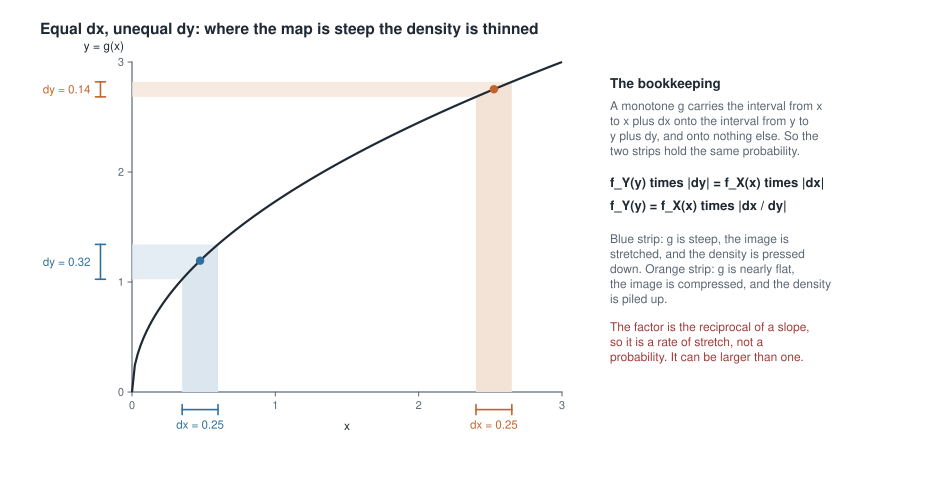
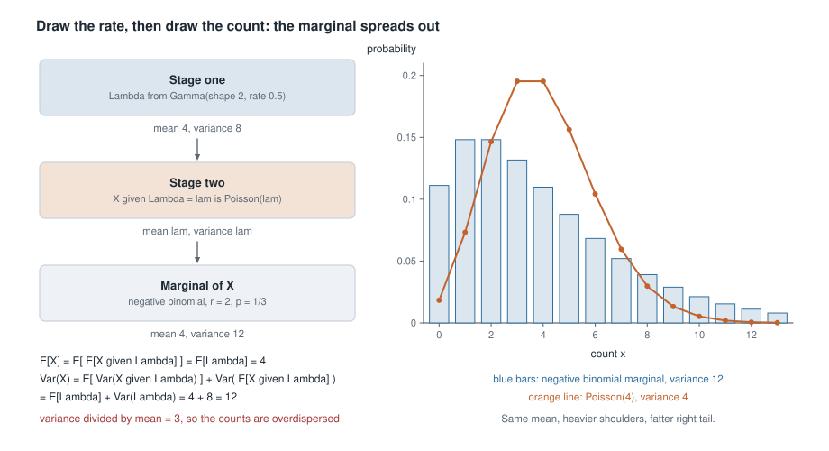
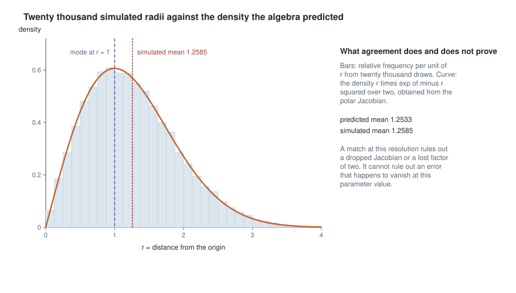
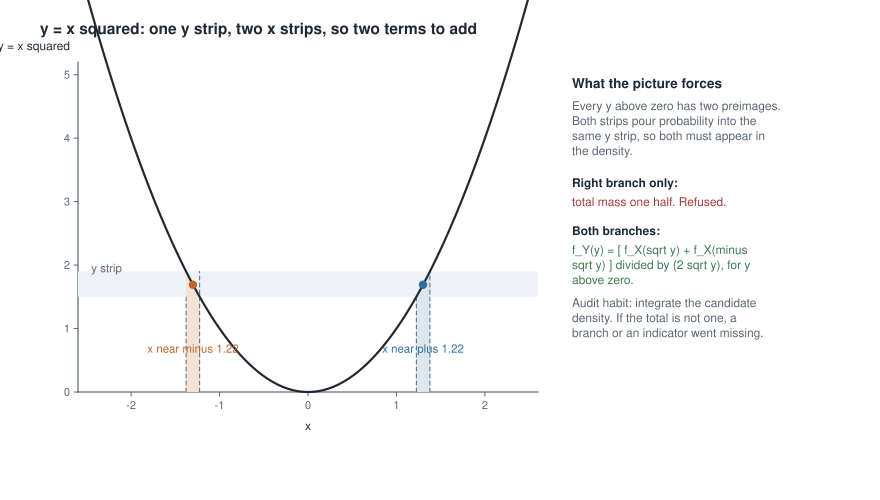

# Week 2 — Joint, conditional, and transformed distributions

## Where this week starts

Week 1 taught you to keep four objects apart — model, parameter, estimand, estimator — and left one
debt unpaid. An estimator is a function of the data, $T = t(X_1, \dots, X_n)$, and every claim you
make about it is a claim about the distribution of *that number*, not of one observation. Week 1
handed you $f(x \mid \theta)$ and nothing about the law of $\bar{X}$, of $S^2$, of the sample
maximum, or of $\log \bar{X}$.

This week pays the debt. Given the distribution of the data, how do you get the distribution of the
thing you compute from it? Three general routes exist: take the event apart and differentiate a
distribution function; change variables and pay a Jacobian factor; or move to moment generating
functions and read the result off a family you already know. Knowing which to reach for is most of
the skill.

The second half runs the machinery backwards. Instead of extracting a function from a joint law you
build one in stages: draw a rate, then draw a count given that rate. Conditioning stops being
bookkeeping and becomes a modelling device. It is also the first appearance of the Bayesian
machinery this course promised would run throughout: nobody says "prior" until Week 9, but the
quantity you integrate away in the second worked example is one, and the factorization that removes
it is Bayes' theorem with the labels rubbed off.

By Thursday you should be able to take an unfamiliar function of a sample, choose a route, carry the
derivation through, and check it by a special case, a total-mass audit, and a ten-line simulation.
Most mistakes in this material are invisible on the page and obvious in a histogram.

### Why this matters downstream

Almost everything exact in the rest of this course is a transformation result wearing a hat. Week 4's
normal-theory trio — the law of $\bar{X}$, the chi-square law of $(n-1)S^2/\sigma^2$, and the $t$
density built as a ratio — is three change-of-variables arguments in a row, and a student who cannot
compute a Jacobian cannot follow any of them. Week 9's posterior is a conditional density and its
predictive distribution is the marginal of a two-stage model, computed exactly the way you will
compute a negative binomial below.

The cost of getting it wrong is concrete. Apply the change-of-variables formula to $y = x^2$ for a
standard normal without noticing that the map is two-to-one, and you produce a respectable-looking
density that integrates to one half. Every tail probability computed from it is then off by a factor
of two, so a reported value of $0.03$ is really $0.06$ and the conclusion flips.

Read that scope carefully, because the tidy one half is an accident of symmetry rather than a general
law. What dropping the negative branch actually discards is the mass $P(X < 0)$, so the candidate
integrates to $P(X > 0)$ — one half only when $X$ is symmetric about zero. For $X \sim N(1,1)$ it
integrates to $0.8413$ instead, and the error in a tail probability is a ratio that varies with $y$
rather than a constant. The size of the damage depends on the distribution; the fact of the damage
does not. Nothing in the algebra complains in either case, and only an audit catches it. The last
section of this page works the symmetric case in full and then does the shifted one, which is where
the general statement earns its keep.

## What you will be able to do

- Derive the law of $Y = g(X)$ by the distribution-function route, and explain why it never needs
  $g$ to be one-to-one.
- Apply the one-dimensional change-of-variables formula, state the monotonicity condition it
  requires, and split the domain into branches when that condition fails.
- Compute a $2 \times 2$ Jacobian determinant, transform a joint density with it, and read
  independence off the factorization.
- Use a moment generating function to identify the law of a sum of independent variables, and say
  what the uniqueness theorem does and does not license.
- Build a two-stage hierarchical model, integrate the first stage out, and get the marginal mean and
  variance from the tower property and the variance decomposition.
- Design a simulation that would expose a dropped Jacobian, and state what its agreement with the
  algebra can and cannot establish.

## Words worth owning

| Term | What it means in this course |
|------|------------------------------|
| Joint density | One function $f_{X,Y}(x,y)$ for several variables at once; every marginal and conditional is read off it. |
| Marginal density | What is left after integrating the other variables out — a fact about one coordinate, not a separate assumption. |
| Conditional density | $f_{Y \mid X}(y \mid x) = f_{X,Y}(x,y)/f_X(x)$ where $f_X(x)$ is positive; a density in $y$ for each fixed $x$. |
| Jacobian determinant | Determinant of the partial derivatives of the inverse map; its absolute value is the local stretch factor. |
| Piecewise monotone | One-to-one on each of finitely many pieces of the support but not on the whole. Each piece contributes a term. |
| Moment generating function | $M_X(t) = \mathbb{E}[e^{tX}]$ when finite near zero; identifies a law and turns sums into products. |
| Hierarchical model | A joint law specified in stages: a distribution for a latent quantity, then one for the data given it. |
| Overdispersion | Variance larger than the mean for a count; one signature of a mixed Poisson, among other mechanisms that produce it. |

## Three routes to a transformed distribution

Fix the setting once. Let $X$ have density $f_X$ supported on $\mathcal{X} \subseteq \mathbb{R}$,
let $g$ be a real-valued function on $\mathcal{X}$, and let $Y = g(X)$. You want the law of $Y$: its
distribution function, its density, or enough moments to be useful. The three routes below answer
that request under different conditions and with very different amounts of labour.

### The distribution-function route

This route always works, so it is the one to fall back on whenever you are unsure. Write the event
and translate it:

$$F_Y(y) = P(Y \le y) = P\big(g(X) \le y\big) = P(X \in A_y), \qquad A_y = \{x \in \mathcal{X} : g(x) \le y\}.$$

Compute $P(X \in A_y)$ with whatever you know about $X$, and differentiate at the end if you want a
density. Nothing assumes $g$ is invertible, monotone, or even continuous.

Do it once on a case you can check. Let $U$ be uniform on $(0,1)$ and put $Y = -\log U$. For
$y > 0$,

$$F_Y(y) = P(-\log U \le y) = P(\log U \ge -y) = P\big(U \ge e^{-y}\big) = 1 - e^{-y},$$

the inequality having reversed at the second step because multiplying by $-1$ reverses it. So $Y$ is
exponential with rate one, and $f_Y(y) = e^{-y}$ for $y > 0$. Audit before moving on: $F_Y$ is
increasing, $F_Y(0) = 0$, $F_Y(y) \to 1$, and the support emerged from the argument rather than
being asserted. All four checks are free and all four catch real errors.

The route costs you an event to reason about, so be careful with the direction of an inequality —
the commonest slip here. It buys safety: the argument is valid for any $g$ whatsoever.

### The Jacobian route and the strip it comes from

When $g$ is well behaved you can skip the event. Suppose $g$ is strictly monotone and continuously
differentiable on an open interval containing $\mathcal{X}$, with $g'(x) \ne 0$ there, and let
$h = g^{-1}$. Then for $y$ in the image $g(\mathcal{X})$,

$$f_Y(y) = f_X\big(h(y)\big)\,\big|h'(y)\big|,$$

and $f_Y(y) = 0$ elsewhere. Reproduce the derivation yourself. If $g$ increases, $g(X) \le y$
exactly when $X \le h(y)$, so $F_Y(y) = F_X(h(y))$ and the chain rule gives $f_X(h(y))\,h'(y)$ with
$h' > 0$. If $g$ decreases, $F_Y(y) = 1 - F_X(h(y))$ and differentiating gives $-f_X(h(y))\,h'(y)$
with $h' < 0$. The two cases collapse into one formula precisely because of the absolute value,
which is therefore not a convention but the residue of a case split.

{fig-alt="A monotone increasing curve with two shaded intervals of equal width 0.25 on the horizontal axis; the steep one maps to a y interval of width 0.32 and the flat one to a y interval of width 0.14."}

The two strips in that figure have the same width, $0.25$; because the curve is steep on the left
and nearly flat on the right, their images have widths $0.32$ and $0.14$. Now argue about
probability. A monotone $g$ carries the interval from $x$ to $x + dx$ onto the interval from $y$ to
$y + dy$ and onto nothing else, so the two strips hold the same probability. Writing that as
$f_Y(y)\,|dy| = f_X(x)\,|dx|$ and dividing gives the theorem. Read the factor as a rate of stretch
rather than a probability: where the map spreads a short interval over a long one the density is
pressed down, and where it compresses, the density piles up. A density may exceed one, and $|h'(y)|$
routinely does.

The condition to keep in view is monotonicity, and it is the one this week's misreading violates. If
$g$ is only *piecewise* monotone — one-to-one on each of the disjoint pieces $A_1, \dots, A_k$
partitioning $\mathcal{X}$, with inverses $h_1, \dots, h_k$ — then every piece capable of producing
$y$ contributes and the formula becomes a sum:

$$f_Y(y) = \sum_{j=1}^{k} f_X\big(h_j(y)\big)\,\big|h_j'(y)\big|\,\mathbf{1}\{y \in g(A_j)\},$$

where $\mathbf{1}\{\cdot\}$ is one when its condition holds and zero otherwise, so a branch that
cannot produce $y$ drops out.

For a first use of the monotone version, take $X \sim N(\mu, \sigma^2)$ and $Y = e^{X}$, strictly
increasing, with $h(y) = \log y$ and $h'(y) = 1/y$. For $y > 0$,

$$f_Y(y) = \frac{1}{y \sigma \sqrt{2\pi}} \exp\left\{ -\frac{(\log y - \mu)^2}{2\sigma^2} \right\},$$

the lognormal density. The factor $1/y$ is the stretch factor, and it is what makes the lognormal
right-skewed although the normal it came from is symmetric.

### Two dimensions, and a determinant instead of a derivative

The multivariate statement is the same idea with a determinant doing the work of a derivative. Let
$(X_1, X_2)$ have joint density $f_{X_1,X_2}$ on an open set $\mathcal{S}$, and let $T$ map
$\mathcal{S}$ one-to-one onto an open set $\mathcal{T}$, with inverse $h = (h_1, h_2)$ whose partial
derivatives are continuous and whose Jacobian determinant never vanishes. Then on $\mathcal{T}$,

$$f_{Y_1,Y_2}(y_1, y_2) = f_{X_1,X_2}\big(h_1(y_1,y_2),\, h_2(y_1,y_2)\big)\,\big|\det J\big|,
\qquad
J = \begin{pmatrix} \partial h_1 / \partial y_1 & \partial h_1 / \partial y_2 \\
\partial h_2 / \partial y_1 & \partial h_2 / \partial y_2 \end{pmatrix}.$$

The absolute determinant is the local area-stretch factor, exactly as $|h'|$ was the local
length-stretch factor. Three practical notes. Differentiate the *inverse* map, the one giving the old
variables in terms of the new; the other Jacobian inverts the factor. Be as careful with the image
set $\mathcal{T}$ as with the algebra, since a transformed density stated without its support is not
yet a density. And when you want only one function $Y_1 = g_1(X_1, X_2)$, invent a convenient second
coordinate, transform the pair, then integrate the scaffold variable out.

### The generating-function route

The third route replaces the distribution by a transform. Define
$M_X(t) = \mathbb{E}\left[e^{tX}\right]$ whenever that expectation is finite for all $t$ in some
interval $(-t_0, t_0)$ with $t_0 > 0$. Three properties make it useful: two distributions whose
generating functions are finite and agree on a common interval around zero are the same
distribution; $M_{X+Y}(t) = M_X(t)M_Y(t)$ for independent $X$ and $Y$; and
$M_{aX+b}(t) = e^{bt}M_X(at)$.

Sums are where it earns its keep, since the density of a sum is a convolution and the transform
turns that integral into a product. Let $X_1, \dots, X_n$ be independent exponentials with rate
$\lambda$; for $t < \lambda$,

$$M_{X_1}(t) = \int_0^{\infty} e^{tx} \lambda e^{-\lambda x}\,dx
= \lambda \int_0^{\infty} e^{-(\lambda - t)x}\,dx = \frac{\lambda}{\lambda - t},$$

the integral converging only because $\lambda - t > 0$, which is why the interval matters.
Independence then gives

$$M_{S_n}(t) = \left(\frac{\lambda}{\lambda - t}\right)^{n}, \qquad S_n = \sum_{i=1}^{n} X_i,$$

which is the generating function of a gamma with shape $n$ and rate $\lambda$; by uniqueness that is
what $S_n$ is. Two honest limitations. The transform identifies the law only if you *recognize* the
function you land on. And some distributions, the Cauchy and the lognormal among them, have no
generating function finite near zero; for those the characteristic function $\mathbb{E}[e^{itX}]$,
which always exists, is the right object.

| If you want | Reach for | Because |
|---|---|---|
| the law of any $g(X)$, monotone or not | the distribution-function route | the event $\{g(X) \le y\}$ needs no inverse |
| a density, and $g$ is strictly monotone | the change-of-variables formula | the derivative of the inverse does the bookkeeping |
| a joint density under a one-to-one map of a pair | the Jacobian determinant | it is the local area-stretch factor |
| the law of a sum of independent variables | the generating-function route | it turns a convolution into a product |
| only the mean and the variance | the tower property and the variance decomposition | neither needs an inverse or a transformed integral |

## Conditioning as a modelling device

Every joint density factors, in two ways, and the factorization is the whole of this section:

$$f_{X,Y}(x, y) = f_X(x)\, f_{Y \mid X}(y \mid x) = f_Y(y)\, f_{X \mid Y}(x \mid y).$$

Reading a factorization left to right is analysis: the joint law exists and you are pulling a
conditional out of it. Reading it right to left is modelling: you are building a joint law one stage
at a time. Statisticians spend most of their lives doing the second thing, and it is the same
equation.

### Building a model in two stages

Choose a distribution for a latent quantity, say a density $f_\Lambda$ for a rate $\Lambda$, then a
distribution for the observable given it, $f_{X \mid \Lambda}(x \mid \lambda)$. Their product is a
legitimate joint law, and the marginal of the observable comes from integrating the latent stage
away:

$$f_X(x) = \int f_{X \mid \Lambda}(x \mid \lambda)\, f_{\Lambda}(\lambda)\, d\lambda.$$

That integral is a *mixture*: an average of second-stage distributions weighted by how likely each
first-stage value was. The result usually lies outside the second-stage family and is almost always
more dispersed, for a reason the variance decomposition makes exact below.

{fig-alt="Three stacked boxes: a gamma stage with mean 4 and variance 8, a Poisson stage given that rate, and a negative binomial marginal with mean 4 and variance 12, beside a bar chart of that marginal against a Poisson of mean 4."}

The figure shows the case the second worked example computes in full. Its bar chart is the whole
point of the construction: the two distributions drawn there have the same mean, $4$, and completely
different spread. Mixing a Poisson over a random rate gives something no longer Poisson and no
longer possessed of variance equal to its mean.

Say plainly what has happened. Call the first stage a prior and the second a likelihood; the joint
density is unchanged, the marginal $f_X$ is what Week 9 calls the prior predictive, and the other
factorization rearranged,

$$f_{\Lambda \mid X}(\lambda \mid x) = \frac{f_{X \mid \Lambda}(x \mid \lambda)\, f_\Lambda(\lambda)}{f_X(x)},$$

is Bayes' theorem for a parameter. There is no new mathematics in Week 9 — a new interpretation of
the first stage, and consequences worth arguing about, but this identity is the machinery.

### What the tower property and the variance decomposition give you

Often you need two numbers rather than a density, and two identities deliver them with no
integration over the transformed variable at all:

$$\mathbb{E}[Y] = \mathbb{E}\big[\mathbb{E}[Y \mid X]\big], \qquad
\operatorname{Var}(Y) = \mathbb{E}\big[\operatorname{Var}(Y \mid X)\big] + \operatorname{Var}\big(\mathbb{E}[Y \mid X]\big).$$

The second follows from the first in three lines. Start from
$\operatorname{Var}(Y) = \mathbb{E}[Y^2] - (\mathbb{E}[Y])^2$, apply the tower property to the first
term, and substitute
$\mathbb{E}[Y^2 \mid X] = \operatorname{Var}(Y \mid X) + (\mathbb{E}[Y \mid X])^2$ inside it:

$$\mathbb{E}[Y^2] = \mathbb{E}\big[\operatorname{Var}(Y \mid X)\big] + \mathbb{E}\big[(\mathbb{E}[Y \mid X])^2\big].$$

Apply the tower property to the second term too, so
$(\mathbb{E}[Y])^2 = \big(\mathbb{E}[\mathbb{E}[Y \mid X]]\big)^2$. Subtracting, the two terms in
$\mathbb{E}[Y \mid X]$ assemble into the variance of that random variable.

Both terms on the right are non-negative, which is the structural content: the variance of $Y$
splits into average within-group variability plus variability of the group means. It follows that
$\operatorname{Var}(\mathbb{E}[Y \mid X]) \le \operatorname{Var}(Y)$ — averaging never increases
variance. Hold onto that inequality: it is the engine of Rao-Blackwell improvement in Week 11, where
$X$ becomes a sufficient statistic and $Y$ a crude estimator.

::: {.callout-note}
## Two special cases to check the identity against

If $Y = c(X)$ is a deterministic function of $X$, then $\operatorname{Var}(Y \mid X) = 0$ and the
identity reduces to $\operatorname{Var}(Y) = \operatorname{Var}(\mathbb{E}[Y \mid X])$, true because
$\mathbb{E}[Y \mid X] = Y$. If $X$ and $Y$ are independent, $\mathbb{E}[Y \mid X] = \mathbb{E}[Y]$
is constant, the second term vanishes, and the first reduces to $\operatorname{Var}(Y)$. Any
candidate identity failing one of these takes a minute to refute.
:::

## Worked example — the polar transformation behind Box-Muller

**Setting.** Let $Z_1$ and $Z_2$ be independent standard normals, so their joint density is the
product

$$f_{Z_1,Z_2}(z_1, z_2) = \frac{1}{2\pi} \exp\left\{-\frac{z_1^2 + z_2^2}{2}\right\}.$$

Change to polar coordinates, identify the laws of the radius and the angle, then run the argument
backwards to get a recipe turning two uniforms into two independent normals.

**Step one, name the map.** Take $R > 0$ and $\Theta \in (0, 2\pi)$ with $Z_1 = R\cos\Theta$ and
$Z_2 = R\sin\Theta$, one-to-one from $(0,\infty) \times (0, 2\pi)$ onto the plane with the
non-negative horizontal axis removed, a set whose complement has probability zero. What is written
here is the *inverse* map, old coordinates in terms of new — the direction the Jacobian wants.

**Step two, the determinant.**

$$J = \begin{pmatrix} \partial z_1 / \partial r & \partial z_1 / \partial \theta \\
\partial z_2 / \partial r & \partial z_2 / \partial \theta \end{pmatrix}
= \begin{pmatrix} \cos\theta & -r\sin\theta \\ \sin\theta & r\cos\theta \end{pmatrix},
\qquad \det J = r\cos^2\theta + r\sin^2\theta = r.$$

Since $r > 0$, $|\det J| = r$: the area element $r\,dr\,d\theta$ from multivariable calculus, a
confirmation rather than a novelty.

**Step three, substitute.** Because $z_1^2 + z_2^2 = r^2$,

$$f_{R,\Theta}(r, \theta) = \frac{1}{2\pi} e^{-r^2/2} \cdot r = \left(r e^{-r^2/2}\right)\left(\frac{1}{2\pi}\right),
\qquad r > 0,\ 0 < \theta < 2\pi.$$

**Step four, read the factorization.** The density is a function of $r$ times a function of $\theta$
over a rectangular region, so $R$ and $\Theta$ are independent, $\Theta$ uniform on $(0, 2\pi)$ and
$R$ carrying $f_R(r) = re^{-r^2/2}$. Each factor integrates to one:
$\int_0^{2\pi} (2\pi)^{-1} d\theta = 1$ and
$\int_0^{\infty} r e^{-r^2/2}\,dr = \left[-e^{-r^2/2}\right]_0^{\infty} = 1$. The rectangular
support matters as much as the algebraic factoring; over a triangular region the same product form
would not give independence.

**Step five, transform again.** Let $S = R^2$. On $r > 0$ the map is strictly increasing, so the
one-dimensional formula applies with $r = \sqrt{s}$ and $dr/ds = 1/(2\sqrt{s})$:

$$f_S(s) = \sqrt{s}\, e^{-s/2} \cdot \frac{1}{2\sqrt{s}} = \frac{1}{2} e^{-s/2}, \qquad s > 0.$$

So $Z_1^2 + Z_2^2$ is exponential with rate $1/2$, which is chi-square on two degrees of freedom.
Week 4 uses that hard.

**Step six, invert the recipe.** If $U_1$ is uniform on $(0,1)$ then $-2\log U_1$ is exponential
with rate $1/2$, by the distribution-function argument done earlier:
$P(-2\log U_1 \le s) = P(U_1 \ge e^{-s/2}) = 1 - e^{-s/2}$. And $2\pi U_2$ is uniform on
$(0,2\pi)$. So for independent uniforms,

$$Z_1 = \sqrt{-2\log U_1}\,\cos(2\pi U_2), \qquad Z_2 = \sqrt{-2\log U_1}\,\sin(2\pi U_2)$$

are independent standard normals. Run one instance by hand. With $u_1 = 0.40$ and $u_2 = 0.70$,
$-2\log(0.40) = 1.8326$, so $r = 1.3537$, and $\theta = 2\pi(0.70) = 4.3982$ radians, where
$\cos\theta = -0.3090$ and $\sin\theta = -0.9511$. That gives $z_1 = -0.4183$ and $z_2 = -1.2875$.
Audit: $z_1^2 + z_2^2 = 0.1750 + 1.6576 = 1.8326$, which is $-2\log(0.40)$ again, as it must be.

**What it means and what it assumed.** The standard bivariate normal is rotationally symmetric and
its squared radius is exponential — a structural fact, not an artifact of coordinates. Two
assumptions did the work: independence of $Z_1$ and $Z_2$, which made the joint density a product,
and equal variances, which made $z_1^2 + z_2^2$ appear as one quantity. Give the normals different
variances and the exponent becomes an ellipse, the angle stops being uniform, and independence of
radius and angle fails.

### The same reasoning, transferred

The structure of that argument — map a pair one-to-one, invert, take the determinant, ask whether
the result factors — transfers to a model with nothing normal in it. Let $X$ and $Y$ be independent
with $X \sim \text{Gamma}(\alpha, 1)$ and $Y \sim \text{Gamma}(\beta, 1)$, so

$$f_{X,Y}(x,y) = \frac{1}{\Gamma(\alpha)\Gamma(\beta)} x^{\alpha-1} y^{\beta-1} e^{-(x+y)},
\qquad x > 0,\ y > 0.$$

Take $U = X + Y$, the total, and $V = X/(X+Y)$, the share contributed by $X$. The inverse map is
$x = uv$ and $y = u(1-v)$ on $u > 0$, $0 < v < 1$, so

$$J = \begin{pmatrix} v & u \\ 1 - v & -u \end{pmatrix}, \qquad
\det J = -uv - u(1-v) = -u, \qquad |\det J| = u.$$

Substituting, and using $x + y = u$,

$$f_{U,V}(u,v) = \frac{(uv)^{\alpha-1}\big(u(1-v)\big)^{\beta-1} e^{-u}}{\Gamma(\alpha)\Gamma(\beta)} \cdot u
= \left[\frac{u^{\alpha+\beta-1} e^{-u}}{\Gamma(\alpha+\beta)}\right]
\left[\frac{\Gamma(\alpha+\beta)}{\Gamma(\alpha)\Gamma(\beta)} v^{\alpha-1}(1-v)^{\beta-1}\right],$$

where $\Gamma(\alpha+\beta)$ was multiplied and divided in so each bracket is a density in its own
variable. The support is again a rectangle, so total and share are independent:
$U \sim \text{Gamma}(\alpha+\beta, 1)$ and $V \sim \text{Beta}(\alpha, \beta)$.

What stayed the same: a one-to-one map of a pair, an inverse differentiated into a determinant, and
independence recognized from a product over a rectangle. What changed: the model, the map, and the
payoff. Box-Muller was a device for simulation; this one explains why a beta law is natural for a
proportion built out of positive components, which is why a beta waits as a prior on a probability
in Week 9.

## Second worked example — a gamma-Poisson hierarchy and its negative binomial marginal

**Setting.** A reliability group logs unscheduled maintenance calls per machine per month. A Poisson
model with one common rate fits badly: the observed variance is several times the observed mean.
That is not a reason to abandon the Poisson but a reason to notice that machines differ. Give each
machine its own rate $\Lambda$, drawn from a gamma with shape $\alpha = 2$ and rate $\beta = 0.5$,
and let its count be Poisson given that rate.

$$\Lambda \sim \text{Gamma}(\alpha, \beta), \qquad X \mid \Lambda = \lambda \sim \text{Poisson}(\lambda).$$

**Step one, write the marginal as an integral.**

$$P(X = x) = \int_0^{\infty} \frac{e^{-\lambda}\lambda^{x}}{x!} \cdot
\frac{\beta^{\alpha}}{\Gamma(\alpha)} \lambda^{\alpha-1} e^{-\beta\lambda}\, d\lambda
= \frac{\beta^{\alpha}}{x!\,\Gamma(\alpha)} \int_0^{\infty} \lambda^{x+\alpha-1} e^{-(1+\beta)\lambda}\, d\lambda.$$

**Step two, recognize the integrand.** It is an unnormalized gamma density with shape $x + \alpha$
and rate $1 + \beta$, so the integral equals $\Gamma(x+\alpha)/(1+\beta)^{x+\alpha}$. Name the
habit: never integrate these by parts, match the integrand to a known kernel and take its
normalizing constant.

**Step three, tidy.**

$$P(X = x) = \frac{\Gamma(x + \alpha)}{x!\, \Gamma(\alpha)}
\left(\frac{\beta}{1+\beta}\right)^{\alpha} \left(\frac{1}{1+\beta}\right)^{x}, \qquad x = 0, 1, 2, \dots$$

For integer $\alpha$, $\Gamma(x+\alpha)/(x!\,\Gamma(\alpha))$ is the binomial coefficient
$\binom{x+\alpha-1}{x}$, so this is a negative binomial with $r = \alpha$ and success probability
$p = \beta/(1+\beta)$. Mixing a Poisson rate over a gamma gives a negative binomial, exactly.

**Step four, get the moments without touching that formula.** For a Poisson,
$\mathbb{E}[X \mid \Lambda] = \Lambda$ and $\operatorname{Var}(X \mid \Lambda) = \Lambda$, so the
two identities give

$$\mathbb{E}[X] = \mathbb{E}[\Lambda] = \frac{\alpha}{\beta}, \qquad
\operatorname{Var}(X) = \mathbb{E}[\Lambda] + \operatorname{Var}(\Lambda)
= \frac{\alpha}{\beta} + \frac{\alpha}{\beta^{2}} = \frac{\alpha(1+\beta)}{\beta^{2}}.$$

**Step five, put the numbers in.** With $\alpha = 2$ and $\beta = 0.5$ the gamma stage has mean
$\alpha/\beta = 4$ and variance $\alpha/\beta^2 = 8$, so the marginal has mean $4$ and variance
$4 + 8 = 12$, with $p = 0.5/1.5 = 1/3$ and $P(X = x) = (x+1)(1/3)^2(2/3)^x$. The first few values
are $1/9 \approx 0.111$, $4/27 \approx 0.148$, $4/27 \approx 0.148$ and $32/243 \approx 0.132$,
against $0.018$, $0.073$, $0.147$ and $0.195$ for a Poisson of mean $4$. Cross-check against the
standard negative binomial moments: $r(1-p)/p = 2(2/3)/(1/3) = 4$ and
$r(1-p)/p^{2} = 2(2/3)/(1/9) = 12$. Two independent routes, one pair of numbers.

**What it means and what it assumed.** The variance-to-mean ratio is $12/4 = 3$, and the
decomposition says where the excess came from: four units of variance are the Poisson noise a single
machine would show at a known rate, and eight are the spread of rates across machines.

Now read that sentence twice, because it is easy to hear as more than it says. *Within this model*,
the excess is attributed to heterogeneity of rates, and the decomposition tells you how much. The
marginal counts alone cannot establish that the attribution is right. A compound Poisson in which
faults arrive in clusters — one root cause producing three call-outs — delivers the same
overdispersion with no heterogeneity at all, and so does serial dependence within a machine, and so
does a mechanism that inflates the count at zero. All of these are observationally equivalent in a
single cross-section of counts: they generate negative-binomial-looking marginals, and the marginal
is all you have. Overdispersion is therefore *consistent with* heterogeneity, not evidence for it
over a non-Poisson within-machine mechanism. Separating them takes repeated observations on the same
machine, where heterogeneity shows up as a machine effect persisting across months and clustering
shows up as bursts within one, and no amount of care with the algebra substitutes for that design.

Three assumptions carried the derivation: a gamma first stage, which bought the closed form and
nothing else; conditionally Poisson counts, the substantive claim and the one just discussed; and
machines exchangeable under one rate distribution, which a real study would have to defend. Replace
the first stage by a beta on $(0,1)$ and the second by a binomial and every step runs identically,
delivering the beta-binomial — the same conditioning argument in a bounded model.

## Checking a transformation by simulation

Derivations in this material fail silently. A dropped Jacobian, a lost factor of two, a missing
indicator: none produces an error message, and all produce something that looks like a density. Build
the check in as a reflex — simulate from the model, compute the transformed quantity, and lay the
histogram against the density you derived.

```r
set.seed(20260215)
n  <- 20000
u1 <- runif(n)
u2 <- runif(n)
r  <- sqrt(-2 * log(u1))
z1 <- r * cos(2 * pi * u2)
z2 <- r * sin(2 * pi * u2)

c(mean(z1), var(z1), cor(z1, z2))   # near 0, near 1, near 0
c(mean(r), sqrt(pi / 2))            # the radius mean against its predicted value
c(mean(r^2), 2)                     # the squared radius against its predicted mean

hist(r, breaks = 60, freq = FALSE, main = "", xlab = "r")
curve(x * exp(-x^2 / 2), from = 0, to = 4, add = TRUE, lwd = 2)
```

{fig-alt="A histogram of twenty thousand simulated radii with the curve r times exp of minus r squared over two drawn on top; the curve follows the bars closely and the simulated mean is marked at 1.2585."}

The figure shows what that block produces. The predicted mean of the radius is
$\int_0^\infty r^2 e^{-r^2/2}\,dr = \sqrt{\pi/2} \approx 1.2533$ and the simulated mean is
$1.2585$; the predicted mean of $R^2$ is $2$, matching $\mathbb{E}[Z_1^2] + \mathbb{E}[Z_2^2]$, and
the simulated value is $2.0181$. Those are the numbers, not numbers of that general size: run the
block above and your console prints them too, because the seed fixes the stream. Reproduce them
before you trust anything else on this page, and if your console disagrees, find out why before you
read on — a check you cannot reproduce is not a check.

Two habits are buried in that. Fix the seed, always, so a disagreement between two runs means a
disagreement between two pieces of reasoning rather than between two draws. And size the discrepancy
against its own noise instead of eyeballing it. The radius has standard deviation
$\sqrt{2 - \pi/2} \approx 0.6551$, so at twenty thousand draws the standard error of the simulated
mean is about $0.0046$; the gap of $0.0052$ between $1.2585$ and $1.2533$ is a little over one standard
error, which is exactly what a correct derivation looks like. A gap of ten standard errors is an
algebra error, and the only way to tell the two apart is to compute the standard error.

Be careful what the agreement licenses. It rules out a dropped Jacobian, which would have moved the
curve off the bars, and a lost factor of two, which would have put the curve at half the height of
the histogram. It does not rule out an error that happens to vanish at this parameter value, and it
never establishes an identity. Derive, compute, critique: three forms of evidence, none sufficient
alone.

## The misreading to avoid

Here is the sentence students actually produce. "To get the density of $Y = X^2$ for
$X \sim N(0,1)$, substitute $x = \sqrt{y}$ into the change-of-variables formula and take
$f_Y(y) = f_X(\sqrt{y})/(2\sqrt{y})$." Written out, the claim is

$$f_Y(y) = \frac{1}{\sqrt{2\pi}} e^{-y/2} \cdot \frac{1}{2\sqrt{y}}
= \frac{1}{2\sqrt{2\pi y}}\, e^{-y/2}, \qquad y > 0,$$

which is positive, integrable, correctly supported, and wrong. It integrates to one half.

The monotonicity condition was never checked. The map $x \mapsto x^2$ decreases on the negatives and
increases on the positives, so $y$ has two preimages, $+\sqrt{y}$ and $-\sqrt{y}$, and both send
probability into the same small interval around $y$.

{fig-alt="A parabola with a horizontal band on the vertical axis whose preimage is two separate shaded intervals on the horizontal axis, one near x equals minus 1.22 and one near plus 1.22, both feeding the same y band."}

The figure makes the failure geometric: the horizontal band is one strip of $y$ values, and the two
shaded strips of $x$ values, near $-1.22$ and $+1.22$, both map into it. Keeping the right-hand
branch alone counts one strip, so exactly half the probability is discarded.

Use the piecewise formula and both branches appear:

$$f_Y(y) = f_X(\sqrt{y})\cdot\frac{1}{2\sqrt{y}} + f_X(-\sqrt{y})\cdot\frac{1}{2\sqrt{y}}
= \frac{1}{\sqrt{2\pi y}}\, e^{-y/2}, \qquad y > 0,$$

using the symmetry $f_X(-u) = f_X(u)$ at the last step. That is the chi-square density on one degree
of freedom, which is what $Z^2$ must have, and it integrates to one. The distribution-function route
would have avoided the trap with no special care: writing $\Phi$ and $\phi$ for the standard normal
distribution function and density, $F_Y(y) = P(-\sqrt{y} \le X \le \sqrt{y}) = 2\Phi(\sqrt{y}) - 1$,
and differentiating gives $2\phi(\sqrt{y})/(2\sqrt{y})$, the same thing.

One refinement, because the tidy factor of two is itself a trap. If $X \sim N(\mu, 1)$ with
$\mu \ne 0$ the branches are no longer equally weighted, and

$$f_Y(y) = \frac{1}{2\sqrt{y}}\Big[\phi(\sqrt{y} - \mu) + \phi(-\sqrt{y} - \mu)\Big], \qquad y > 0,$$

the noncentral chi-square density on one degree of freedom, and the case that arises when you study
the power of a test. Before writing $|h'(y)|$, say out loud how many roots $g(x) = y$ has; if the
count is not one, sum.

## Practice on your own

These are for your own checking. Work them with a pencil first and only then reach for R.

1. Let $X$ be uniform on $(0, \theta)$ and $Y = X/\theta$. Derive the density of $Y$, confirm that
   it does not involve $\theta$, and say in one sentence what property of the family that expresses.
   Repeat for $W = \theta - X$ and note which route was less error-prone.
2. Let $Y = |X|$. Write the piecewise formula for $f_Y$ with both branches, specialize to
   $X \sim N(0,1)$, and identify the half-normal density. Verify by integration that your expression
   has total mass one, and state what one branch would have cost you.
3. A counterexample hunt. Find a strictly increasing but non-differentiable $g$ for which the
   Jacobian formula cannot be applied as stated, and show the distribution-function route still
   delivers the distribution function of $Y = g(X)$. A piecewise-linear map with a kink suffices.
4. Audit this argument. "Let $X_1$ and $X_2$ be independent standard normals. Then $U = X_1 + X_2$
   and $V = X_1 - X_2$ have joint density $f_{X_1,X_2}(u,v)$ with no extra factor, because linear
   maps do not distort area." Locate the false step, compute the correct Jacobian determinant, give
   the joint density of $(U,V)$, and state the two variances and the correlation.
5. A simulation to describe in words before code, checking the negative binomial marginal above. Say
   what you would draw at each stage, how many draws, which two summaries you would compare against
   $4$ and $12$, and what discrepancy would send you back to the algebra rather than to sampling
   noise.

## Where to read more

- [Penn State STAT 414](https://online.stat.psu.edu/stat414/) has the most patient treatment of the
  transformation technique, with the distribution-function route and the bivariate change of
  variables worked in small steps. Use it if Jacobians are new.
- [MIT OpenCourseWare 18.655, Mathematical Statistics](https://ocw.mit.edu/courses/18-655-mathematical-statistics-spring-2016/)
  supplies the general machinery in this course's register, and sets up the conditioning arguments
  needed again in Weeks 9 and 11.
- [MIT OpenCourseWare 18.650, Statistics for Applications](https://ocw.mit.edu/courses/18-650-statistics-for-applications-fall-2016/)
  is the lighter of the two, and a good place to see these transformations used rather than proved.
- [The R Project](https://www.r-project.org/) for the simulation checks; everything here runs in base
  R with no packages.
- Hogg, McKean and Craig's *Introduction to Mathematical Statistics* covers this week in its chapters
  on distributions of functions of random variables. It is optional.
- Course pages: the [notes index](../index.qmd), the [schedule](../schedule.qmd), and the
  [resources page](../resources/index.qmd).

## Where this goes next

Next week turns this machinery on the sample as a whole. Sorting $X_1, \dots, X_n$ into order
statistics is a transformation of the joint density, and the density of the maximum falls out of the
distribution-function route in two lines — the same two lines you practised here. Exponential
families arrive in the same week, and their defining structure is a factorization of the density, so
the habit of reading independence off a factorization, built in the polar example and the gamma-beta
transfer, is the habit that gets rewarded. Both threads return in Week 4, where the chi-square, $t$
and $F$ distributions are assembled from these same operations.

Keep two things in working memory. First the branch count: before writing $|h'(y)|$, ask how many
preimages $y$ has. Second the two-stage picture, because when it returns in Week 9 with the word
"prior" attached you will already have done the integral. Back to [Week 1](week-01.qmd) for the
estimand vocabulary this page assumed, and on to [Week 3](week-03.qmd) next.
