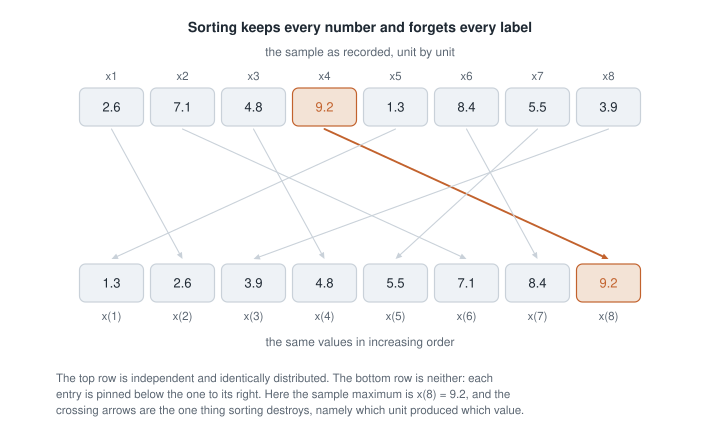
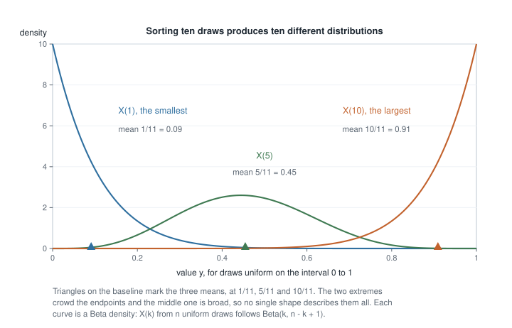
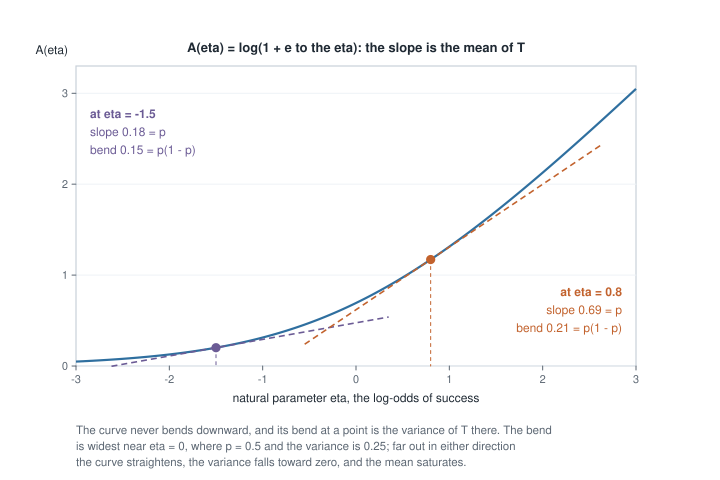
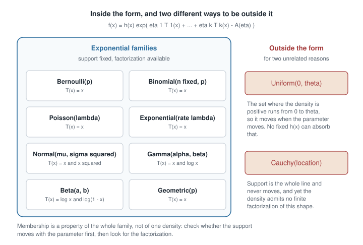

# Week 3 — Random samples, order statistics, and exponential-family structure

## Where this week starts

Week 2 gave you three routes to the distribution of something computed from a random variable: the
distribution-function route, the change-of-variables route with its Jacobian, and the
moment-generating-function route. Each acted on one variable at a time. This week the object being
transformed is the whole sample. You have $n$ independent draws $X_1, \dots, X_n$ from one density
$f(x \mid \theta)$ — a random sample — and the question is what that collection knows that no single
draw does.

Two answers pull in opposite directions. Sorting is itself a transformation of the whole sample, and
the sorted values, the order statistics, have a joint distribution you can write down exactly. The
smallest and largest observation have different distributions, and they report on edges of the
population the sample mean throws away. The second answer runs the other
way: for a large and familiar class of models the joint density of all $n$ observations depends on
the parameter only through a handful of sums, and that handful does not grow with $n$. Those are the
exponential families.

The hinge is what Week 2 left unfinished: change of variables required a one-to-one map, and sorting
is not one-to-one, since all $n!$ orderings of the same numbers give the same sorted vector.

By Thursday you should be able to write the joint density of the order statistics, derive the
marginal density of the $k$-th smallest two independent ways, carry the uniform case through, and
read moments off a cumulant function. Three things are deferred: what "all the information about
$\theta$" means is Week 10, the limit on any estimator is Week 12, and mean squared error is Week 6.

### Why this matters downstream

Picture a reliability group estimating the ceiling of a timing mechanism: the wait before a device
reports is modelled as uniform on $(0, \theta)$. Someone takes the largest observed wait, quotes a
standard error, and reports a symmetric interval around it. Every part of that is wrong in a way this
week makes visible. The maximum is below $\theta$ with probability one, so it is biased downward by a
fixed fraction rather than by luck, and its sampling distribution, rescaled correctly, converges to a
one-sided exponential law. The symmetric interval puts roughly half its mass on values the data have
already excluded.

The exponential-family half carries a different stake, and it is worth separating two things that get
bundled together under the word "regularity". One is structural. For a full-rank exponential family
the natural statistic $\sum_i T(X_i)$ is automatically minimal sufficient and complete, so the
reduction theorems of Weeks 10 and 11 arrive free the moment you recognise the form. That is a
sufficient condition and not a necessary one: Uniform$(0, \theta)$ sits outside the class and still
has a complete sufficient statistic, namely $X_{(n)}$, which is exactly what will certify the
bias-corrected maximum as the best unbiased estimator of $\theta$. The other thing is analytic —
differentiating under the integral sign, which the score identity of Week 7 and the information bound
of Week 12 both rest on, and which the uniform genuinely breaks because its region of integration
moves with $\theta$. Confusing the two costs you either a theorem you were entitled to use or a bound
you were never entitled to quote.

## What you will be able to do

- Write the joint density of the order statistics of a continuous sample, and say where $n!$ comes
  from.
- Derive the marginal density of $X_{(k)}$ by counting, then check it against the
  distribution-function route at $k = 1$ and $k = n$.
- Compute the exact distribution, mean, and variance of a uniform sample's largest observation, and
  state the size and sign of its bias.
- Recognise a $k$-parameter exponential family, exhibit $h$, $T$, $\eta$ and $A$, and describe the
  natural parameter space.
- Differentiate a cumulant function for the mean and covariance of the natural statistic, verifying
  each against a moment you know.
- Explain why Uniform$(0, \theta)$ is outside the class, name a later theorem that therefore does not
  apply to it, and name one that still does.

## Words worth owning

| Term | What it means in this course |
|------|------------------------------|
| Random sample | $X_1, \dots, X_n$ independent, each with density $f(x \mid \theta)$. |
| Order statistics | The same values sorted upward, $X_{(1)} \le \cdots \le X_{(n)}$. |
| Sample extremes | The minimum and maximum, governed by the tails of $F$, not its centre. |
| Support | Where the density is strictly positive. Whether it moves with $\theta$ is this week's decisive question. |
| Exponential family | A family factoring as $h(x)$ times an exponential linear in $\theta$-free statistics, on a support fixed in $\theta$. |
| Natural parameter | The coefficient $\eta_j$ multiplying $T_j(x)$, taken as the parameter itself. Also called canonical. |
| Cumulant function | The normalising term $A(\eta)$. Its first derivative is a mean, its second a variance. |
| Natural statistic | The vector $T(x)$ in the exponent; for a sample, $\sum_i T(x_i)$, whose dimension does not grow with $n$. |

## What sorting does to a random sample

Throughout, $X_1, \dots, X_n$ are independent with distribution function $F$ and continuous density
$f$. Continuity buys one convenience: ties have probability zero, so the sorted values are strictly
increasing almost surely. Everything below needs care for discrete data.

### From the sample to its sorted values

Sorting sends the observations to the sorted vector, $X_{(1)}$ smallest through $X_{(n)}$ largest.
The picture shows one sample of eight going through it.

{fig-alt="Eight labelled observations in a top row joined by crossing arrows to the same eight numbers in increasing order below; the largest value, 9.2, is highlighted as it moves to the final position."}

Two features do the work. No number is created or destroyed, so the sorted vector determines the
multiset exactly. But the arrows are lost: nothing afterwards records that $9.2$ came from the fourth
run. That is the course's first data reduction, and it rests on an assumption — if the observations
really are i.i.d. the labels carried nothing about $\theta$, and if the fourth run followed a
recalibration, sorting destroyed the evidence.

For the joint density, split $\mathbb{R}^n$ into the $n!$ open regions on which the coordinates are
in a fixed strict order. On each, sorting is a permutation of coordinates: one-to-one, with Jacobian
determinant of absolute value one. Week 2's formula applies region by region, each contributing the
same product of densities, so

$$f_{X_{(1)}, \dots, X_{(n)}}(y_1, \dots, y_n) = n! \prod_{i=1}^{n} f(y_i), \qquad y_1 \lt y_2 \lt \cdots \lt y_n,$$

and zero elsewhere. Audit it: by symmetry among the orderings, the region $\{y_1 \lt \cdots \lt y_n\}$
carries probability $1/n!$ under the original product density, so the factor $n!$ restores total mass
one. Notice what the support says, too. This density lives on that ordered region rather than on a
product of intervals, and a density supported on a non-product set cannot describe independent
coordinates. The order statistics are dependent by construction.

### The marginal law of one order statistic

The fastest correct route to a single $X_{(k)}$ is counting. For $X_{(k)}$ to fall in $[y, y + dy)$,
exactly one observation lands there, exactly $k - 1$ fall below, and $n - k$ fall above. The number
of ways to assign labelled observations to those roles is $n!/\{(k-1)!\,1!\,(n-k)!\}$, and each
assignment has probability $F(y)^{k-1} f(y)\,dy\,\{1 - F(y)\}^{n-k}$, so

$$f_{(k)}(y) = \frac{n!}{(k-1)!\,(n-k)!}\, F(y)^{k-1} \{1 - F(y)\}^{n-k} f(y).$$

The second route never mentions infinitesimals. The event $\{X_{(k)} \le y\}$ says at least $k$ of
the observations are at most $y$, and that count is Binomial$(n, F(y))$, so

$$F_{(k)}(y) = \sum_{j=k}^{n} \binom{n}{j} F(y)^{j} \{1 - F(y)\}^{n-j}.$$

Differentiating in $y$ makes almost every term cancel against its neighbour, and what survives is the
density above. Two independent derivations agreeing is the corroboration this course asks for: a slip
in one is unlikely to be repeated by the other.

The extremes are worth rebuilding rather than memorising. All observations are at most $y$ exactly
when the largest is, so $F_{(n)}(y) = F(y)^n$; all exceed $y$ exactly when the smallest does, so
$F_{(1)}(y) = 1 - \{1 - F(y)\}^{n}$. Differentiating gives $n F(y)^{n-1} f(y)$ and
$n \{1 - F(y)\}^{n-1} f(y)$, matching the general formula at $k = n$ and $k = 1$.

### The uniform sample, done completely

Take $X_1, \dots, X_n$ uniform on $(0, \theta)$, so $F(y) = y/\theta$ and $f(y) = 1/\theta$ on
$[0, \theta]$. Substituting and cancelling powers of $\theta$,

$$f_{(k)}(y) = \frac{n!}{(k-1)!\,(n-k)!} \cdot \frac{y^{k-1} (\theta - y)^{n-k}}{\theta^{n}}, \qquad 0 \le y \le \theta.$$

With $\theta = 1$ this is the Beta$(k, n-k+1)$ density, so every uniform order statistic is a Beta
variable and the Beta moments apply:

$$\mathbb{E}[X_{(k)}] = \frac{k}{n+1}\,\theta, \qquad \operatorname{Var}(X_{(k)}) = \frac{k\,(n-k+1)}{(n+1)^2 (n+2)}\,\theta^{2}.$$

The mean formula says something concrete: the $n$ order statistics cut the interval into $n+1$ pieces
of equal expected length.

{fig-alt="Three density curves on the unit interval for a sample of ten: the smallest draw piles up against zero, the fifth is a broad hump near 0.45, and the largest piles up against one; triangles mark the three means."}

The figure makes three points formulas tend not to. The curves have different shapes, so the order
statistics are not identically distributed. The extremes are far more concentrated than the middle
one — the variance formula gives $10/(121 \cdot 12) = 0.0069$ for $X_{(10)}$ against
$30/(121 \cdot 12) = 0.0207$ for $X_{(5)}$, a visible factor of three. And the extreme densities are
sharply skewed against a hard wall, which is already why a symmetric error bar around a sample
maximum is the wrong shape.

Dependence can be quantified. For $i \le j$ the covariance of two uniform order statistics on $(0,1)$
is $i(n-j+1)/\{(n+1)^2 (n+2)\}$, strictly positive for every pair. Check the smallest case: with
$n = 2$ the formula gives $1/36$, while directly $\mathbb{E}[X_{(1)} X_{(2)}] = \mathbb{E}[X_1 X_2] = 1/4$, since the product of the sorted values is the product of the original ones, and
$1/4 - (1/3)(2/3) = 1/36$. The sign makes sense: a sample landing high pushes every order statistic
up together.

One guard against over-generalising, stated with the hypothesis that actually makes it true. Central
order statistics do behave conventionally, but the index has to approach its target level fast
enough, and that condition is the part students drop. Let $\xi_p$ be the population quantile, so that
$F(\xi_p) = p$ with $0 \lt p \lt 1$, and suppose $f$ is positive and continuous at $\xi_p$. If the
indices satisfy the rate condition $\sqrt{n}\,(k_n/n - p) \to 0$ — of which $k_n = \lceil np \rceil$
is the ordinary case — then

$$\sqrt{n}\,\big(X_{(k_n)} - \xi_p\big) \xrightarrow{d} N\Big(0, \; \frac{p(1-p)}{f(\xi_p)^{2}}\Big).$$

The weaker requirement $k_n/n \to p$ will not do, and what fails is the centring rather than the
spread. Take $k_n = \lceil np + n^{3/4} \rceil$. Then $k_n/n \to p$, so the weak hypothesis holds,
but $X_{(k_n)}$ concentrates near the quantile at level $k_n/n$, which sits roughly
$n^{-1/4}/f(\xi_p)$ above $\xi_p$; multiplying by $\sqrt{n}$ leaves a centre growing like
$n^{1/4}/f(\xi_p)$, and the sequence converges to nothing at all. The general statement keeps the
variance and tracks the drift: if $\sqrt{n}\,(k_n/n - p) \to c$ for a finite $c$, the limit is
$N\big(c/f(\xi_p),\, p(1-p)/f(\xi_p)^{2}\big)$, and $c = 0$ recovers the clean version above. The
sample median is the case to keep in mind — $k_n = \lceil n/2 \rceil$ and $p = 1/2$ satisfy the rate
condition, and the limiting variance is $1/\{4 f(\xi_{1/2})^{2}\}$: a density that is flat where it
is cut gives an imprecise median, because neighbouring values of the quantile are then nearly as
plausible. Only the extremes, where the count of observations beyond the point of interest stays
bounded instead of growing with $n$, need a theory of their own.

## Exponential families and what they buy you

The second half of the week asks a different question: what shape makes a whole sample easy to
handle at once?

### The k-parameter form, written carefully

A family $\{f(x \mid \theta) : \theta \in \Theta\}$ is a $k$-parameter exponential family when

$$f(x \mid \theta) = h(x) \exp\Big\{ \sum_{j=1}^{k} \eta_j(\theta)\, T_j(x) - A(\theta) \Big\}, \qquad x \in \mathcal{X},$$

where $h \ge 0$ and each $T_j$ depend on the data alone, each $\eta_j$ on the parameter alone, and —
the condition that does the damage later — the set $\mathcal{X}$ where the density is positive is the
same for every $\theta$. The term $A(\theta)$ makes the density integrate to one.

Reparameterise so the coefficients are the parameters. With $\eta = (\eta_1, \dots, \eta_k)$,

$$f(x \mid \eta) = h(x) \exp\{ \eta^{\top} T(x) - A(\eta)\}, \qquad A(\eta) = \log \int_{\mathcal{X}} h(x)\, e^{\eta^{\top} T(x)}\, dx,$$

with a sum replacing the integral in the discrete case. The natural parameter space $\mathcal{H}$ is
the set of $\eta$ making that integral finite; it is convex, which matters because the
differentiation below needs an interior point.

For $n$ independent draws the joint density is a product, and a product of exponentials adds
exponents:

$$f_n(x_1, \dots, x_n \mid \eta) = \Big\{ \prod_{i=1}^{n} h(x_i) \Big\} \exp\Big\{ \sum_{j=1}^{k} \eta_j \sum_{i=1}^{n} T_j(x_i) - n A(\eta) \Big\}.$$

The sample lies in an exponential family of the same order $k$, with natural statistic
$\sum_i T(x_i)$ and cumulant function $nA(\eta)$. The parameter touches the data through $k$ numbers
however large $n$ becomes: a thousand Poisson observations reach the likelihood through their sum and
nothing else. A fixed-dimensional summary of arbitrarily much data is exactly the kind of structure a
sample can have and a single observation cannot exhibit.

### Differentiating the cumulant function

Take $k = 1$. By construction $e^{A(\eta)} = \int h(x)\, e^{\eta T(x)}\, dx$. Differentiate both
sides, moving the derivative inside the integral:

$$A'(\eta)\, e^{A(\eta)} = \int T(x)\, h(x)\, e^{\eta T(x)}\, dx.$$

Divide by $e^{A(\eta)}$ and recognise the density on the right:

$$A'(\eta) = \int T(x)\, h(x)\, e^{\eta T(x) - A(\eta)}\, dx = \mathbb{E}_\eta[T(X)].$$

Differentiate once more. The derivative of $e^{\eta T(x) - A(\eta)}$ in $\eta$ is
$\{T(x) - A'(\eta)\}$ times itself, so

$$A''(\eta) = \int \{T(x) - A'(\eta)\}\, T(x)\, h(x) e^{\eta T(x) - A(\eta)}\, dx = \mathbb{E}_\eta[T^2] - \{\mathbb{E}_\eta[T]\}^2 = \operatorname{Var}_\eta(T(X)).$$

In $k$ dimensions the same computation makes the gradient of $A$ the mean vector of $T$ and the
Hessian its covariance matrix. Since a covariance matrix is positive semidefinite, $A$ is convex.

::: {.callout-note title="Where the interchange is licensed, and where it is not"}
Moving $\partial/\partial\eta$ inside the integral is the step to be suspicious of. It is legal here
because at an interior point of $\mathcal{H}$ the integrand is smooth in $\eta$ and locally dominated
by an integrable function, and — crucially — the region of integration does not move when $\eta$
moves. Week 7's score identity $\mathbb{E}_\theta[\partial \ell / \partial \theta] = 0$, in which
$\ell$ is the log-likelihood, is the same interchange in other clothes, and the uniform breaks it
precisely because its region of integration does move.
:::

It is worth seeing $A' = \mathbb{E}[T]$ rather than only reading it, on the Bernoulli cumulant
function $A(\eta) = \log(1 + e^{\eta})$.

{fig-alt="An increasing, gently curving function of the natural parameter eta, with dashed tangent lines at eta equal to minus 1.5 and eta equal to 0.8; the tangent slopes are labelled 0.18 and 0.69, the matching success probabilities."}

At $\eta = 0.8$ the tangent slope is $e^{0.8}/(1 + e^{0.8}) = 0.690$, the success probability there,
and the curve's bend is $0.690 \times 0.310 = 0.214$, the variance. At $\eta = -1.5$ the slope is
$0.182$ and the bend $0.149$. Two structural facts are visible without algebra: the curve never bends
downward, since a variance is never negative, and far out in either direction it straightens as $p$
saturates.

Say what that straightening means carefully, because the loose version of the sentence is false. The
bend is $A''(\eta) = p(1-p)$, which is the Fisher information about the **natural** parameter $\eta$,
and it does collapse toward zero as $p$ approaches $0$ or $1$: one observation then moves your view
of $\eta$ hardly at all. Notice, though, that there is no edge being approached. Saturation means
$\eta \to -\infty$ or $\eta \to +\infty$, and the natural parameter space here is the whole line, so
"near the boundary of the parameter space" is not even a description of what is happening in the
picture. Information about $p$ runs the other way. A
one-line computation from $\log f(x \mid p) = x \log p + (1-x)\log(1-p)$ gives
$I(p) = 1/\{p(1-p)\}$, which diverges as $p$ saturates, and correspondingly the Cramér-Rao bound
$p(1-p)/n$ for unbiased estimators of $p$ shrinks there rather than growing. Both statements are
correct because information belongs to a model *and a parameterisation together*, the two being tied
by the chain rule $I(p) = I(\eta)\,(d\eta/dp)^{2}$; here $d\eta/dp = 1/\{p(1-p)\}$, and the square of
that factor converts $p(1-p)$ into $1/\{p(1-p)\}$ exactly. So the honest reading of the flattening
curve is that a saturated Bernoulli is uninformative about its log-odds, not that it is uninformative
full stop. Week 12 makes the transformation rule quantitative and shows which questions the bound
answers.

| Family | $h(x)$ | $T(x)$ | $\eta$ | $A(\eta)$ | $A'(\eta)$ | $A''(\eta)$ |
|---|---|---|---|---|---|---|
| Bernoulli$(p)$ | $1$ on $\{0,1\}$ | $x$ | $\log\{p/(1-p)\}$ | $\log(1 + e^{\eta})$ | $p$ | $p(1-p)$ |
| Poisson$(\lambda)$ | $1/x!$ | $x$ | $\log \lambda$ | $e^{\eta}$ | $\lambda$ | $\lambda$ |
| Exponential(rate $\lambda$) | $1$ on $(0, \infty)$ | $x$ | $-\lambda$ | $-\log(-\eta)$ | $1/\lambda$ | $1/\lambda^2$ |

Check at least one row. For the exponential, $A(\eta) = -\log(-\eta)$ gives $A'(\eta) = -1/\eta = 1/\lambda$, the mean, and $A''(\eta) = 1/\eta^2 = 1/\lambda^2$, the variance. The natural parameter is
$-\lambda$, so the natural parameter space is the negative half-line and a sign slip flips both
derivatives.

### Why the uniform sits outside the family

Suppose Uniform$(0, \theta)$ could be written in exponential form. The exponential factor is strictly
positive wherever defined, so for each $\theta$ the set where the density is positive equals the set
where $h$ is positive. The second set does not involve $\theta$; the first is the interval from $0$
to $\theta$, which differs for $\theta = 1$ and $\theta = 2$. Contradiction — and not one a cleverer
parameterisation could dodge, since common support is part of the definition.

{fig-alt="A box holds eight named families including Bernoulli, Poisson and normal; two sit outside it: the uniform on zero to theta, whose support moves with the parameter, and the Cauchy, which admits no such factorization."}

Almost everything familiar is inside, which is why the class feels universal until you meet a member
of the complement, and the two exclusions drawn fail for different reasons. The uniform's support
moves, and the argument above disposes of it without looking at the density. The Cauchy location
family has the whole real line as support for every parameter value, so the support test passes, and
it is still not an exponential family: no finite factorisation of the required shape exists for
$f(x \mid \mu) = 1/[\pi\{1 + (x - \mu)^2\}]$. Test the support first, then hunt for the
factorisation.

The consequences are why the course keeps returning to the uniform. The interchange of derivative and
integral fails, so the score has no reason to have mean zero (Week 7); the information bound of Week
12 has no force, and the maximum beats the rate it would suggest; the likelihood is not
differentiable at its maximum, so the score equation is useless.

Now do not overcorrect, because the list of casualties is shorter than students expect. Everything
lost above is analytic, a consequence of the moving region of integration. The reduction theory
survives intact. The joint density of the sample is $\theta^{-n}$ when $0 \lt x_{(1)}$ and
$x_{(n)} \le \theta$, and zero otherwise, which factors through $x_{(n)}$ alone — an indicator doing
the work an exponent usually does — so Week 10's criterion makes $X_{(n)}$ sufficient, and in fact
minimal sufficient. It is also complete, and the argument is short enough to run here. Suppose
$\mathbb{E}_\theta[g(X_{(n)})] = 0$ for every $\theta \gt 0$. The density of $X_{(n)}$ is
$n t^{n-1}/\theta^{n}$ on $[0, \theta]$, the $k = n$ case of the marginal formula above, so the
assumption says $\int_0^{\theta} g(t)\, t^{n-1}\, dt = 0$ for every $\theta \gt 0$; differentiating
in $\theta$ gives $g(\theta)\,\theta^{n-1} = 0$ for almost every $\theta$, hence $g = 0$ almost
everywhere, which is completeness. Sufficiency plus completeness is
precisely the input Week 11's Lehmann-Scheffé theorem wants, and it will hand back
$\tfrac{n+1}{n}X_{(n)}$ as the unique unbiased estimator of $\theta$ with smallest variance — the
model with no information bound and no usable score nonetheless has a clean optimality result.
Neither sufficiency nor completeness is the private property of exponential families; the smooth
theory built on top of them is.

## Worked example — the largest observation in a uniform sample

**Setting.** A workshop instruments a batch-testing rig that reports after a wait modelled as uniform
on $(0, \theta)$ seconds, where $\theta$ is an unknown polling ceiling. Eight independent runs give
waits of $2.6$, $7.1$, $4.8$, $9.2$, $1.3$, $8.4$, $5.5$ and $3.9$. The estimand is $\theta$, so
$n = 8$ and the observed maximum is $9.2$.

**Step 1 — the distribution function.** The largest observation is at most $t$ exactly when every
observation is, and they are independent, so for $0 \le t \le \theta$,

$$P(X_{(8)} \le t) = \prod_{i=1}^{8} P(X_i \le t) = \left(\frac{t}{\theta}\right)^{8}.$$

**Step 2 — the density.** Differentiating in $t$ gives $f_{(8)}(t) = 8 t^{7}/\theta^{8}$ on
$[0, \theta]$. Cross-check with the general marginal density at $k = n = 8$: the coefficient is
$8!/(7!\,0!) = 8$, $F(t)^{7}$ is $t^7/\theta^7$, $\{1 - F(t)\}^{0}$ is one, and $f(t) = 1/\theta$.
The product is the same.

**Step 3 — the mean, and the bias.**

$$\mathbb{E}[X_{(8)}] = \int_0^{\theta} t \cdot \frac{8 t^{7}}{\theta^{8}}\, dt = \frac{8}{\theta^{8}} \cdot \frac{\theta^{9}}{9} = \frac{8}{9}\,\theta.$$

In general $\mathbb{E}[X_{(n)}] = n\theta/(n+1)$, so the bias is $-\theta/(n+1)$, here $-\theta/9$.
The sign is no accident of the algebra: $X_{(n)} \le \theta$ for every possible sample, so the
estimator cannot average out to $\theta$. Multiplying by $(n+1)/n$ removes the bias exactly, and
$\tfrac{9}{8} \times 9.2 = 10.35$ is the corrected estimate. That corrected estimator is not merely
one unbiased option among many: since $X_{(n)}$ is complete and sufficient here, the Lehmann-Scheffé
argument of Week 11 makes $\tfrac{n+1}{n}X_{(n)}$ the unbiased estimator of $\theta$ with the
smallest variance there is. Whether to insist on being unbiased at all is a different and harder
question, a mean-squared-error one, and that is Week 6's business.

**Step 4 — the variance.** The second moment is

$$\mathbb{E}[X_{(8)}^{2}] = \int_0^{\theta} t^{2} \cdot \frac{8 t^{7}}{\theta^{8}}\, dt = \frac{8}{\theta^{8}} \cdot \frac{\theta^{10}}{10} = \frac{4}{5}\,\theta^{2},$$

so the variance is $\tfrac{4}{5}\theta^2 - \tfrac{64}{81}\theta^2 = \tfrac{8}{810}\theta^2 \approx 0.00988\,\theta^2$ and the standard deviation about $0.0994\,\theta$. The general formula
$n\theta^2/\{(n+2)(n+1)^2\}$ returns $8\theta^2/810$, the same number. If $\theta$ is near ten
seconds, the maximum of eight runs has a standard deviation of about one second, and all of that
spread lies below $\theta$.

**Step 5 — what the numbers say.** With $X_{(8)} = 9.2$ we know with certainty that
$\theta \ge 9.2$, a guarantee no other estimator here supplies, and we know the estimate runs low by
about eleven percent on average. As a calibration,
$P(X_{(8)} \le 0.9\,\theta) = 0.9^{8} = 0.430$: in more than two samples out of five the maximum
lands below ninety percent of the ceiling.

**What this assumed.** Independence, a genuinely uniform wait, and a ceiling that does not drift.
Uniformity does more work than it looks: $(t/\theta)^n$ is a statement about the far right tail of
$F$, which is where a modelling assumption is least constrained by data near the centre. If the true
density thins near $\theta$, every number here changes while the sample mean barely notices.

### The same reasoning, transferred

Let $X_1, \dots, X_n$ be independent Exponential draws with rate $\lambda$, so
$P(X_i \gt t) = e^{-\lambda t}$, and look at the smallest observation. The smallest exceeds $t$
exactly when all of them do, so

$$P(X_{(1)} \gt t) = \prod_{i=1}^{n} P(X_i \gt t) = e^{-n \lambda t},$$

the survival function of an Exponential with rate $n\lambda$. Hence
$\mathbb{E}[X_{(1)}] = 1/(n\lambda)$ and $\operatorname{Var}(X_{(1)}) = 1/(n\lambda)^2$.

The engine stayed the same: an event about one extreme became an event about all $n$ observations at
once, independence turned it into a product of identical factors, and the distribution followed. What
changed is which tail is probed. The uniform maximum left its family and became a Beta variable; the
exponential minimum stays exponential, with the rate multiplied by $n$.

The consequence warns against a lazy generalisation. Since $\mathbb{E}[n X_{(1)}] = 1/\lambda$, the
rescaled minimum is exactly unbiased for the mean. But its variance is
$n^2/(n\lambda)^2 = 1/\lambda^2$ for every $n$: it never shrinks, so the estimator is unbiased and not
consistent. The uniform maximum, by contrast, has standard deviation shrinking like $1/n$, faster
than the usual $1/\sqrt{n}$. Same class of statistic, opposite behaviour: the shape of $F$ near the
boundary decides, not the word "extreme".

## Second worked example — the two-parameter normal in natural form

**Setting.** Let $X_1, \dots, X_n$ be i.i.d. Normal$(\mu, \sigma^2)$, both parameters unknown. This
exercises a different facet of the week: not a sampling distribution, but canonical form and the
moments read off a cumulant function.

**Step 1 — expand the exponent.**

$$-\frac{(x - \mu)^2}{2\sigma^2} = -\frac{x^2}{2\sigma^2} + \frac{\mu x}{\sigma^2} - \frac{\mu^2}{2\sigma^2}.$$

**Step 2 — read off the ingredients.** Absorb $(2\pi)^{-1/2}$ into $h$ and the $\theta$-dependent
leftovers into $A$:

$$f(x \mid \mu, \sigma^2) = \frac{1}{\sqrt{2\pi}} \exp\Big\{ \frac{\mu}{\sigma^2} x - \frac{1}{2\sigma^2} x^{2} - \frac{\mu^2}{2\sigma^2} - \frac{1}{2}\log \sigma^{2} \Big\}.$$

So $h(x) = (2\pi)^{-1/2}$, $T(x) = (x, x^2)$, $\eta_1 = \mu/\sigma^2$, $\eta_2 = -1/(2\sigma^2)$, and
$A = \mu^2/(2\sigma^2) + \tfrac{1}{2}\log\sigma^2$. The support is the whole line for every parameter
value, so the structural condition holds.

**Step 3 — invert to natural coordinates.** From $\eta_2 = -1/(2\sigma^2)$ we get
$\sigma^2 = -1/(2\eta_2)$, forcing $\eta_2 \lt 0$, and then $\mu = \eta_1\sigma^2 = -\eta_1/(2\eta_2)$. So $\mathcal{H} = \mathbb{R} \times (-\infty, 0)$ and

$$A(\eta) = -\frac{\eta_1^{2}}{4 \eta_2} - \frac{1}{2}\log(-2\eta_2).$$

**Step 4 — the gradient gives the means.**

$$\frac{\partial A}{\partial \eta_1} = -\frac{\eta_1}{2\eta_2} = \mu, \qquad \frac{\partial A}{\partial \eta_2} = \frac{\eta_1^{2}}{4\eta_2^{2}} - \frac{1}{2\eta_2} = \mu^{2} + \sigma^{2}.$$

Those are $\mathbb{E}[X]$ and $\mathbb{E}[X^2]$, exactly as the general theorem promised.

**Step 5 — the Hessian gives the covariances.**

$$\frac{\partial^2 A}{\partial \eta_1^{2}} = -\frac{1}{2\eta_2} = \sigma^{2}, \qquad \frac{\partial^2 A}{\partial \eta_1 \partial \eta_2} = \frac{\eta_1}{2\eta_2^{2}} = 2\mu\sigma^{2}, \qquad \frac{\partial^2 A}{\partial \eta_2^{2}} = -\frac{\eta_1^{2}}{2\eta_2^{3}} + \frac{1}{2\eta_2^{2}} = 4\mu^{2}\sigma^{2} + 2\sigma^{4}.$$

Audit all three against moments obtained another way. The first is $\operatorname{Var}(X) = \sigma^2$. For the second, the normal third moment is $\mu^3 + 3\mu\sigma^2$, so
$\operatorname{Cov}(X, X^2) = \mu^3 + 3\mu\sigma^2 - \mu(\mu^2 + \sigma^2) = 2\mu\sigma^2$. For the
third, the fourth moment is $\mu^4 + 6\mu^2\sigma^2 + 3\sigma^4$, and subtracting
$(\mu^2 + \sigma^2)^2$ leaves $4\mu^2\sigma^2 + 2\sigma^4$. All three match.

**Step 6 — put numbers through it.** Fix $\mu = 3$ and $\sigma^2 = 4$, so $\eta_1 = 0.75$ and
$\eta_2 = -0.125$.

| Quantity | From the natural form | Value | From the ordinary form | Value |
|---|---|---|---|---|
| $A$ | $-\eta_1^2/(4\eta_2) - \tfrac12\log(-2\eta_2)$ | $1.818$ | $\mu^2/(2\sigma^2) + \tfrac12\log\sigma^2$ | $1.818$ |
| $\partial A/\partial\eta_1$ | $-\eta_1/(2\eta_2)$ | $3$ | $\mathbb{E}[X] = \mu$ | $3$ |
| $\partial A/\partial\eta_2$ | $\eta_1^2/(4\eta_2^2) - 1/(2\eta_2)$ | $13$ | $\mathbb{E}[X^2] = \mu^2 + \sigma^2$ | $13$ |
| $\partial^2 A/\partial\eta_1^2$ | $-1/(2\eta_2)$ | $4$ | $\operatorname{Var}(X) = \sigma^2$ | $4$ |
| $\partial^2 A/\partial\eta_1\partial\eta_2$ | $\eta_1/(2\eta_2^2)$ | $24$ | $\operatorname{Cov}(X, X^2) = 2\mu\sigma^2$ | $24$ |
| $\partial^2 A/\partial\eta_2^2$ | $-\eta_1^2/(2\eta_2^3) + 1/(2\eta_2^2)$ | $176$ | $\operatorname{Var}(X^2) = 4\mu^2\sigma^2 + 2\sigma^4$ | $176$ |

**Step 7 — go to the sample.** For $n$ observations the natural statistic becomes
$\big(\sum_i X_i, \sum_i X_i^2\big)$ and the cumulant function $nA(\eta)$, so
$\mathbb{E}\big[\sum_i X_i\big] = n\mu$, $\mathbb{E}\big[\sum_i X_i^2\big] = n(\mu^2 + \sigma^2)$,
and the covariance matrix is $n$ times the Hessian above. Week 4 builds the exact distributions of
$\bar{X}$ and $S^2$ from that pair, and Week 10 proves it minimal sufficient.

### Reading the same two derivatives for the Bernoulli

The Bernoulli is the one-parameter rehearsal. Writing $f(x \mid p) = p^{x}(1-p)^{1-x}$ on
$\{0, 1\}$ and taking logs inside an exponential,

$$f(x \mid p) = \exp\Big\{ x \log \frac{p}{1-p} + \log(1-p) \Big\},$$

so $h(x) = 1$ on $\{0,1\}$, $T(x) = x$, the natural parameter is the log-odds
$\eta = \log\{p/(1-p)\}$, and $A = -\log(1-p)$. Inverting, $p = e^{\eta}/(1 + e^{\eta})$, so
$A(\eta) = \log(1 + e^{\eta})$ — the curve in the figure above. One derivative returns $p$ and two
return $p(1-p)$, and for a sample the statistic $\sum_i X_i$ has mean $np$ and variance $np(1-p)$
read straight off $nA'$ and $nA''$.

## A numerical check worth running

Neither result needs simulation to be true, but running one is how you catch a dropped factor. This
block checks the uniform maximum against Steps 3, 4 and 5.

```
set.seed(75063)
theta <- 10; n <- 8; reps <- 50000
mx <- replicate(reps, max(runif(n, 0, theta)))

mean(mx)                  # near 8.889  = n * theta / (n + 1)
sd(mx)                    # near 0.994  = theta * sqrt(n) / ((n + 1) * sqrt(n + 2))
mean((n + 1) / n * mx)    # near 10     = theta, the bias-corrected estimator
mean(mx <= 0.9 * theta)   # near 0.430  = 0.9^8
```

The second differences $A$ rather than differentiating it, so an algebra slip shows up.

```
cumulant <- function(e) log(1 + exp(e))
eta <- 0.8; h <- 1e-4

(cumulant(eta + h) - cumulant(eta - h)) / (2 * h)                    # near 0.6900
(cumulant(eta + h) - 2 * cumulant(eta) + cumulant(eta - h)) / h^2    # near 0.2139

exp(eta) / (1 + exp(eta))                                            # 0.6900
```

A close match at one parameter value with fifty thousand replicates rules out gross algebra errors
and sign flips, which is most of what goes wrong. It is not a proof, though: a wrong derivation can
agree with a simulation by coincidence.

## The misreading to avoid

Here is the sentence as graduate students write it: "the largest observation is the natural estimator
of the upper endpoint, so it should be unbiased for $\theta$, and with a reasonable sample size I can
attach a symmetric two-standard-error interval to it." Each clause is wrong, instructively so.

The estimator is not unbiased and cannot be. Every possible sample satisfies $X_{(n)} \le \theta$, so
the sampling distribution lives below $\theta$ and its mean is strictly below it, short by exactly
$\theta/(n+1)$. That follows from never being able to overshoot; a bigger study does not fix it.

The normal approximation is not merely inaccurate; it is the wrong shape at every $n$. For
$0 \le t \le n$,

$$P\Big( \frac{n(\theta - X_{(n)})}{\theta} \ge t \Big) = P\Big( X_{(n)} \le \theta\big(1 - \tfrac{t}{n}\big)\Big) = \Big(1 - \frac{t}{n}\Big)^{n} \longrightarrow e^{-t}.$$

The correct normalising factor is $n$, not $\sqrt{n}$, and the limit is Exponential with rate one:
one-sided, right-skewed, with no left tail. The exact distribution offers a simple one-sided
interval instead, since $X_{(n)}/\theta$ has distribution function $u^{n}$ on $(0,1)$ and so does not
involve $\theta$. Taking $u = \alpha^{1/n}$ gives
$P\big(\theta \le X_{(n)}\,\alpha^{-1/n}\big) = 1 - \alpha$; for the eight observations above with
$\alpha = 0.05$, the factor is $0.05^{-1/8} = 1.454$ and the interval runs from $9.2$ to $13.38$. It
is asymmetric because the situation is. Week 4 names the object that made this work: a pivot.

Behind the specific error sits a general one: treating the order statistics as though they were
themselves an i.i.d. sample. They are not identically distributed, as the three Beta densities
plotted earlier show, and not independent, as the covariance $i(n-j+1)/\{(n+1)^2(n+2)\}$ shows.
Any argument that quietly adds variances of order statistics, or applies the central limit theorem to
one without asking whether it is central or extreme, is unsound. The earlier qualification stands in
both directions: the median, whose index $\lceil n/2 \rceil$ meets the rate condition, really is
asymptotically normal at rate $\sqrt{n}$, and the failure is specific to extremes and to indices that
drift away from their level too slowly.

A companion misreading sits on the exponential-family side: "the families I know are all exponential
families, so the regularity conditions are safe to assume." Membership can fail with a moving support
or a fixed one, and the check takes a single line.

## Practice on your own

Work these with a pencil first; they are for your own checking.

1. Differentiate $F_{(k)}(y) = \sum_{j=k}^{n} \binom{n}{j} F^{j} (1-F)^{n-j}$ in $y$. Show the terms
   cancel in pairs, that what remains is the marginal density above, and that it collapses correctly
   at $k = 1$ and $k = n$.
2. For a uniform sample on $(0,1)$ with $n = 3$, compute the three variances from the Beta formula,
   add them, and compare with $3\operatorname{Var}(X_1) = 1/4$. Account for the difference using the
   covariance formula, and say why it has the sign it does.
3. A classmate argues: "sorting only relabels, so $\sum_k X_{(k)} = \sum_i X_i$; therefore
   $\operatorname{Var}(X_{(1)}) + \cdots + \operatorname{Var}(X_{(n)})$ equals
   $n \operatorname{Var}(X_1)$." Locate the step that fails and use item 2 to say by how much.
4. Membership hunt, one line of justification each: Uniform$(\theta, \theta + 1)$;
   Normal$(\mu, \mu^{2})$ with $\mu \gt 0$; Binomial$(m, p)$ with $m$ known; Binomial$(m, p)$ with
   both unknown. For any that fail, name the requirement that fails.
5. Describe a simulation, in enough detail for someone else to code, separating the two candidate
   limit laws for the uniform maximum: histogram $n(\theta - X_{(n)})/\theta$ against an Exponential
   density with rate one, then histogram $\sqrt{n}(X_{(n)} - \theta)$ as $n$ grows. Say in advance
   what each picture should show if this unit is right.

## Where to read more

- [MIT OpenCourseWare 18.655, Mathematical Statistics](https://ocw.mit.edu/courses/18-655-mathematical-statistics-spring-2016/) — exponential families in the canonical parameterisation, with the cumulant derivatives as a theorem rather than a trick.
- [Penn State STAT 414, Introduction to Probability Theory](https://online.stat.psu.edu/stat414/) — the gentlest complete treatment of the counting argument.
- [MIT OpenCourseWare 18.650, Statistics for Applications](https://ocw.mit.edu/courses/18-650-statistics-for-applications-fall-2016/) — why this structure matters to a practitioner.
- [The R Project](https://www.r-project.org/) — for running the blocks above and documenting `runif` and `replicate`.
- Hogg, McKean and Craig treat order statistics and exponential families in adjacent chapters. Optional.
- Course pages: the [syllabus](../syllabus.qmd) and the [schedule](../schedule.qmd).

## Where this goes next

Week 4 takes the normal model apart exactly, starting from the pair
$\big(\sum_i X_i, \sum_i X_i^2\big)$ this unit produced: $\bar{X} \sim N(\mu, \sigma^2/n)$, the
scaled sample variance as a chi-square variable, and the independence of the two, which is a
peculiarly normal phenomenon. The order-statistics half gets its sequel in Week 6's mean-squared-error
comparison, Week 7's regularity counterexample, and Week 12's bound that does not apply. Read
[week-04.qmd](week-04.qmd) next; [week-02.qmd](week-02.qmd) set up the change-of-variables argument,
and the [notes index](../index.qmd) lists the sequence.

One forward connection is worth planting now. If the model is an exponential family with natural
parameter $\eta$ and you take a prior $\pi(\eta) \propto \exp\{\eta^{\top}\tau - \nu A(\eta)\}$ for
fixed constants $\tau$ and $\nu$, then multiplying by the likelihood of a sample adds
$\sum_i T(x_i)$ to $\tau$ and $n$ to $\nu$, and the posterior belongs to the same family. Conjugacy is not a coincidence and not a
philosophy; it is this form closing under multiplication. That is the week's Connect step, developed
in Week 9: the structure you learned to spot here is what makes Bayesian updating tractable.
