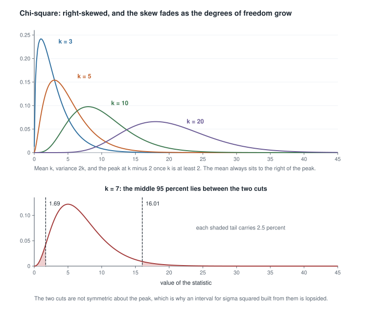
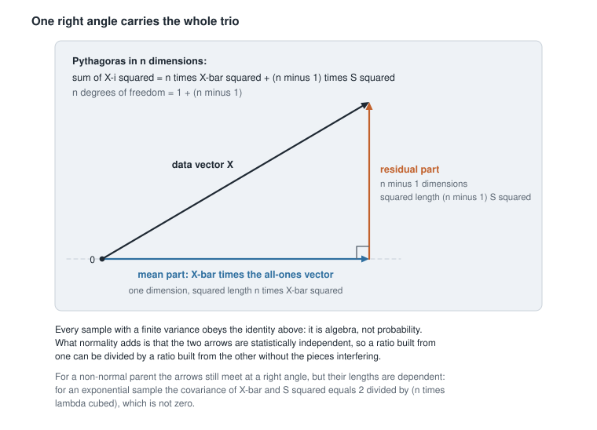
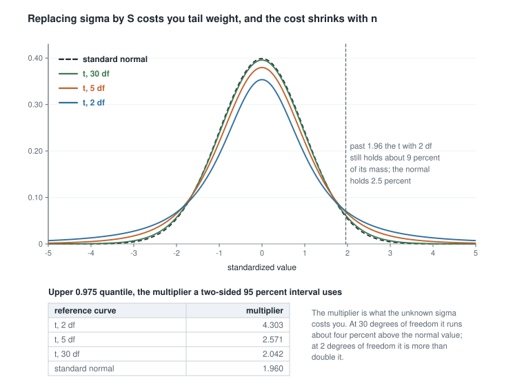
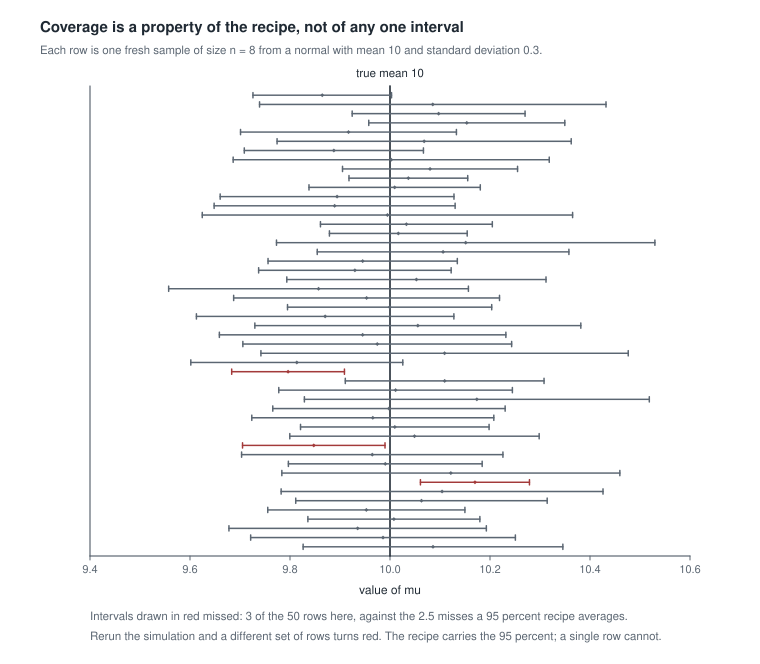

# Week 4 — Exact sampling distributions, pivots, and normal theory

## Where this week starts

Week 3 handed you the structure of an independent and identically distributed sample: the joint
density of the order statistics, the law of an extreme, and the exponential-family form so many
standard models share. What it did not hand you was the distribution of anything you would actually
report. If a colleague hands you eight measurements and asks how far the sample mean is likely to be
off, Week 3 has no sentence for you.

This week supplies that sentence for one model, and supplies it exactly. Take
$X_1, \dots, X_n$ independent from $N(\mu, \sigma^2)$ with both parameters unknown, and write
$\bar{X} = n^{-1}\sum_{i=1}^n X_i$ for the sample mean and
$S^2 = (n-1)^{-1}\sum_{i=1}^n (X_i - \bar{X})^2$ for the sample variance. Under that model the joint
behaviour of $\bar{X}$ and $S^2$ is known in closed form, at every sample size, with no approximation
anywhere. That word *exact* is the point of the week. Next week you begin approximating, because
outside a small circle of models you must, and you should first see what you are giving up.

The second half turns those distributions into inference. To get an interval out of a sampling
distribution you need a **pivotal quantity**: a function of the data *and* the parameter whose
distribution does not depend on the parameter. Once you have one, an interval falls out of set
algebra and the probability attached to it is exact. That construction also houses the most durable
misunderstanding in the course, so we build it carefully and then say what the resulting number does
not claim.

By Thursday you should be able to state the three normal-theory results without hedging, reproduce
the orthogonal-transformation argument behind the hardest of them, recognize a pivot, invert it with
real arithmetic, and tell a colleague who has just said "there is a 95 percent chance the mean is in
here" which object that sentence actually describes.

### Why this matters downstream

Here is the concrete stake. A laboratory reports the mean of five replicate measurements as
$\bar{x}$ plus or minus $1.96 s / \sqrt{5}$, on the reasoning that 1.96 is the familiar 95 percent
multiplier. Because $\sigma$ was estimated rather than known, the correct multiplier from the $t$
distribution with four degrees of freedom is 2.776, so the reported interval covers $\mu$ about 87.8
percent of the time and understates the uncertainty by close to a third. No extra care at the bench
fixes that, because the error sits in the distribution theory. Week 9 will build the posterior object
that *does* license the probability sentence, and Week 13 will lay three kinds of interval side by
side and ask what each one claims.

## What you will be able to do

- State the three normal-theory results precisely, with the conditions each one needs.
- Derive the independence of $\bar{X}$ and $S^2$ from an orthogonal transformation, and identify the
  two places where normality is used.
- Recognize a pivotal quantity, distinguish it from a statistic, and invert one into a confidence set
  whose coverage is exact.
- Compute a $t$ interval for a normal mean and a chi-square interval for a normal variance by hand,
  and read the asymmetry of the second correctly.
- Explain what the 95 percent in a confidence interval attaches to, and name the object for which a
  probability statement about the parameter itself would have been legitimate.
- Describe a simulation that exposes the true coverage of a procedure whose model assumption is
  wrong, and predict the direction of the failure first.

## Words worth owning

| Term | What it means in this course |
|------|------------------------------|
| Sampling distribution | The distribution of a statistic across repeated draws of the whole sample, with the parameter held fixed. |
| Exact distribution | A sampling distribution correct at every sample size, not only in a limit. Everything in this unit is of that kind. |
| Chi-square with $k$ degrees of freedom | The law of a sum of $k$ squared independent standard normal variables. Mean $k$, variance $2k$, right-skewed. |
| $t$ with $k$ degrees of freedom | The law of $Z / \sqrt{V/k}$ for $Z$ standard normal and $V$ chi-square with $k$ degrees of freedom, the two independent. |
| $F$ with $k_1$ and $k_2$ degrees of freedom | The law of a ratio of two independent chi-square variables, each divided by its own degrees of freedom. |
| Degrees of freedom | The dimension of the subspace the residual vector is free to move in once estimation has used up the rest. |
| Pivotal quantity | A function of data and parameter whose distribution is the same for every parameter value. Not a statistic: you cannot compute it. |
| Coverage probability | The probability, before the data are seen, that the random interval a procedure produces contains the fixed true parameter. |

## The normal-theory trio and the geometry behind it

Fix the model for the whole section: $X_1, \dots, X_n$ are independent, each $N(\mu, \sigma^2)$,
with $n \ge 2$ and both $\mu$ and $\sigma^2$ unknown. Three results hold, and they hold together.

### Three statements, and what each one says

The first is the one you already believe. A linear combination of independent normal variables is
normal, with the obvious mean and variance, so

$$\bar{X} \sim N\!\left(\mu, \frac{\sigma^2}{n}\right).$$

Note what is claimed: not that $\bar{X}$ is approximately normal for large $n$ — that is the central
limit theorem, and it belongs to next week — but that it is exactly normal at $n = 2$ and at
$n = 2000$ alike. The normal family is closed under addition, and that closure does all the work.

The second concerns the sample variance. Recall the definition of a chi-square variable: if
$Z_1, \dots, Z_k$ are independent standard normal, then $\sum_{i=1}^k Z_i^2$ has the chi-square
distribution with $k$ degrees of freedom, written $\chi^2_k$. Its mean is $k$ and its variance is
$2k$. The claim is

$$\frac{(n-1)S^2}{\sigma^2} \sim \chi^2_{n-1}.$$

The degrees of freedom are $n - 1$, not $n$, and the missing one was spent estimating $\mu$. A
consequence falls straight out: a $\chi^2_{n-1}$ variable has mean $n-1$, so taking expectations gives
$\mathbb{E}[S^2] = \sigma^2$, which is exactly why the divisor $n-1$ is there. A second, which the
practice section asks you to check, is $\operatorname{Var}(S^2) = 2\sigma^4/(n-1)$.

{fig-alt="Four right-skewed chi-square densities at 3, 5, 10 and 20 degrees of freedom, flattening and shifting right as the degrees grow. Below, the density at 7 degrees of freedom with dashed cuts at 1.69 and 16.01 and shaded tails."}

Every member of the family lives on the positive half-line and is right-skewed, because a sum of
squares cannot go negative but can grow without bound. As $k$ grows the peak moves right, the spread
grows like $\sqrt{2k}$, and the skew fades; the mean sits at $k$ while the mode sits at $k - 2$ once
$k \ge 2$, so the mean is always to the right of the peak. Hold on to that asymmetry — it is why the
variance interval in the second worked example comes out lopsided, and it does not fade at the sample
sizes a laboratory actually collects.

The third result is the one worth the derivation.

$$\bar{X} \quad \text{and} \quad S^2 \quad \text{are independent.}$$

This should look surprising. $S^2$ is built from the same numbers as $\bar{X}$, and is defined by
subtracting $\bar{X}$ from each of them. Under almost any other model the two are dependent. Under
the normal they are not, and that is what lets us divide one by the other in the next subsection and
still know the law of the ratio.

### Why the mean and the variance come apart

Standardize first, so that the parameters disappear. Put $Z_i = (X_i - \mu)/\sigma$, so that
$Z_1, \dots, Z_n$ are independent standard normal, and collect them into a vector $Z$. Choose any
$n \times n$ orthogonal matrix $A$ whose first row is $(1/\sqrt{n}, \dots, 1/\sqrt{n})$. Such a matrix
exists, because the all-ones direction is a unit vector once divided by $\sqrt{n}$ and Gram-Schmidt
extends any unit vector to an orthonormal basis; the classical explicit choice is the Helmert matrix.
Set $Y = AZ$.

Two facts about $Y$ do the work. First, $Y$ is again a vector of independent standard normal
variables: a linear map of a Gaussian vector is Gaussian, and
$\operatorname{Var}(AZ) = A I_n A^{\top} = I_n$. That is the first place normality enters, and it is
essential — for a non-Gaussian $Z$ the coordinates of $Y$ would still be uncorrelated, since the
covariance calculation is unchanged, but uncorrelated is not independent. Second, an orthogonal map
preserves length, so $\sum_{i=1}^n Y_i^2 = \sum_{i=1}^n Z_i^2$.

Read off the pieces. The first coordinate is

$$Y_1 = \frac{1}{\sqrt{n}} \sum_{i=1}^n Z_i = \sqrt{n}\, \bar{Z},$$

and the remaining coordinates absorb everything else:

$$\sum_{i=2}^n Y_i^2 = \sum_{i=1}^n Z_i^2 - Y_1^2 = \sum_{i=1}^n Z_i^2 - n \bar{Z}^2
= \sum_{i=1}^n (Z_i - \bar{Z})^2 = \frac{(n-1)S^2}{\sigma^2}.$$

Confirm the last two equalities with a pencil: expanding $\sum (Z_i - \bar{Z})^2$ gives
$\sum Z_i^2 - 2\bar{Z}\sum Z_i + n\bar{Z}^2 = \sum Z_i^2 - n\bar{Z}^2$, and
$Z_i - \bar{Z} = (X_i - \bar{X})/\sigma$ because the shift by $\mu$ cancels.

Everything now follows. $Y_1$ is standard normal, so $\bar{X} = \mu + \sigma Y_1/\sqrt{n}$ is
$N(\mu, \sigma^2/n)$. The sum $\sum_{i=2}^n Y_i^2$ is a sum of $n-1$ squared independent standard
normal variables, so $(n-1)S^2/\sigma^2$ is $\chi^2_{n-1}$. And $Y_1$ is independent of
$(Y_2, \dots, Y_n)$, so $\bar{X}$ and $S^2$ are independent as functions of separate blocks. That is
the second place normality enters, and it is where a general parent would leave you with
uncorrelated blocks and no independence.

{fig-alt="A right triangle: the data vector runs from the origin, its horizontal leg is the mean part, and its vertical leg is the residual part whose squared length is n minus 1 times the sample variance."}

The picture is worth more than the matrix. Think of the sample as one vector in $n$-dimensional
space. It splits into a piece along the all-ones direction, fixed by $\bar{X}$ alone, and a residual
piece orthogonal to it whose squared length is exactly $(n-1)S^2$. Pythagoras gives
$\sum_i X_i^2 = n\bar{X}^2 + (n-1)S^2$, and the degrees of freedom add the same way,
$n = 1 + (n-1)$. That is algebra, true of any sample. What normality contributes is that the two legs
are independent and not merely orthogonal.

The converse holds too: if the parent has finite, non-zero variance and $\bar{X}$ and $S^2$ are
independent for some $n \ge 2$, the parent must be normal — a characterization due to Geary and
sharpened by Lukacs. Independence here is a defining property, not a convenience. To see how ordinary
dependence is, use $\operatorname{Cov}(\bar{X}, S^2) = \mu_3/n$, where
$\mu_3 = \mathbb{E}[(X - \mu)^3]$ is the third central moment. At $n = 2$ with $\mu = 0$ you can check
it in three lines:
$S^2 = (X_1 - X_2)^2/2$, so $\bar{X}S^2$ expands to
$\frac{1}{4}(X_1^3 + X_2^3 - X_1^2 X_2 - X_1 X_2^2)$, whose expectation is $\mu_3/2$ because each
cross term carries a factor $\mathbb{E}[X_i] = 0$. An exponential parent with rate $\lambda$ has
$\mu_3 = 2/\lambda^3$, so the covariance is $2/(n\lambda^3)$ and never vanishes. Exponential data
break the independence claim and the chi-square claim together.

### Building $t$ and $F$ from the pieces

Now put the trio to work. Define

$$Z = \frac{\bar{X} - \mu}{\sigma/\sqrt{n}}, \qquad V = \frac{(n-1)S^2}{\sigma^2}.$$

By the three results, $Z \sim N(0,1)$, $V \sim \chi^2_{n-1}$, and $Z$ and $V$ are independent. That is
precisely the recipe in the definition of the $t$ distribution, so $Z/\sqrt{V/(n-1)}$ has the $t$
distribution with $n-1$ degrees of freedom. Simplify the left-hand side, using
$V/(n-1) = S^2/\sigma^2$ and $S \ge 0$:

$$\frac{Z}{\sqrt{V/(n-1)}}
= \frac{(\bar{X} - \mu)\sqrt{n}/\sigma}{\sqrt{S^2/\sigma^2}}
= \frac{(\bar{X} - \mu)\sqrt{n}/\sigma}{S/\sigma}
= \frac{\bar{X} - \mu}{S/\sqrt{n}}.$$

Every $\sigma$ has cancelled. The quantity on the right can be computed from the data once you supply
a candidate value of $\mu$, and its distribution, $t_{n-1}$, involves no unknown at all. That is the
engine of the first worked example.

{fig-alt="Four bell curves centred at zero. The t with 2 degrees of freedom is lowest at the centre and heaviest in the tails; the t with 30 degrees of freedom nearly matches the normal. A table lists multipliers 4.303, 2.571, 2.042 and 1.960."}

The figure prices the substitution of $S$ for $\sigma$. Every $t$ density is lower at the centre and
heavier in the tails than the standard normal, because the random denominator sometimes comes out
small and inflates the ratio. Past 1.96 the $t$ with two degrees of freedom still carries about nine
percent of its mass, against the normal's 2.5 percent. The tabulated multipliers say the same thing
in the form you will use: 4.303 at two degrees of freedom, 2.571 at five, 2.042 at thirty, against
1.960 for the normal. By thirty the penalty is about four percent, which is why the normal multiplier
passes unnoticed in large samples and burns people in small ones.

The $F$ distribution comes from the same parts. If $V_1 \sim \chi^2_{k_1}$ and $V_2 \sim \chi^2_{k_2}$
are independent, then $(V_1/k_1)/(V_2/k_2)$ has the $F$ distribution with $k_1$ and $k_2$ degrees of
freedom. For two independent normal samples of sizes $m$ and $n$ the two chi-square variables are the
scaled sample variances, and the ratio

$$\frac{S_1^2/\sigma_1^2}{S_2^2/\sigma_2^2} \sim F_{m-1,\; n-1}$$

is again free of every unknown parameter. Squaring a $t_k$ variable gives an $F_{1, k}$ variable,
which is a good consistency check to run on the two definitions.

## Pivots, inversion, and the meaning of coverage

### What makes a quantity a pivot

A **pivotal quantity** is a function $Q(X, \theta)$ of the data and the parameter whose distribution
under $P_\theta$ is the same for every $\theta \in \Theta$. It is not a statistic: a statistic can be
computed from the data alone but its law generally moves with $\theta$, while a pivot has a fixed law
and cannot be computed, since evaluating it would require knowing $\theta$.

In the normal model, $(\bar{X} - \mu)/(S/\sqrt{n})$ is a pivot, distributed $t_{n-1}$ whatever $\mu$
and $\sigma$ are, and that is the whole content of the previous section; $(n-1)S^2/\sigma^2$ is a
pivot for $\sigma^2$, distributed $\chi^2_{n-1}$. By contrast $\bar{X}$ on its own is a statistic and
not a pivot, because its law shifts with $\mu$ — which is exactly why it estimates $\mu$ and exactly
why it cannot by itself deliver an interval.

### Turning a pivot into an interval

Suppose $Q(X, \theta)$ is a pivot with a known distribution. Pick constants $a$ and $b$ with

$$P_\theta\big(a \le Q(X, \theta) \le b\big) = 1 - \alpha \quad \text{for every } \theta,$$

which is possible precisely because the law of $Q$ does not move with $\theta$. Now define the random
set

$$C(X) = \{\theta \in \Theta : a \le Q(X, \theta) \le b\}.$$

For a fixed $\theta$, the statement $\theta \in C(X)$ and the statement
$a \le Q(X, \theta) \le b$ are the *same event* — the same set of sample outcomes, written twice.
Therefore

$$P_\theta\big(\theta \in C(X)\big) = 1 - \alpha \quad \text{for every } \theta,$$

and $C(X)$ is a confidence set with exact coverage $1 - \alpha$. Notice how little happened: no
approximation, no limit, no new probability, only bookkeeping applied to a distributional fact.
Notice also what the probability is over. The randomness sits in $X$, and $\theta$ is a fixed unknown
constant throughout. That observation is the entire content of the misreading section below.

One caveat. The pair $(a, b)$ is not pinned down by the requirement; any pair with the right
probability inverts to a valid interval, and the equal-tailed choice is a convention rather than a
derivation. For a symmetric pivot such as the $t$ it also happens to be the shortest. For a skewed
pivot such as the chi-square it is not, and you should know you have chosen convenience over
length.

### Pivots that have nothing to do with the normal

The construction is not a normal-theory trick. Let $X_1, \dots, X_n$ be independent
Uniform$(0, \theta)$ draws and let $M = X_{(n)}$ be the sample maximum, whose distribution function
you derived in Week 3: $P_\theta(M \le t) = (t/\theta)^n$ for $0 \le t \le \theta$. Then for
$0 \le u \le 1$,

$$P_\theta\!\left(\frac{M}{\theta} \le u\right) = u^n,$$

free of $\theta$, so $M/\theta$ is a pivot. Inverting with $a = (\alpha/2)^{1/n}$ and
$b = (1 - \alpha/2)^{1/n}$ turns $a \le M/\theta \le b$ into $M/b \le \theta \le M/a$. With $n = 10$,
$\alpha = 0.05$ and an observed maximum of $4.7$, the constants are $a = 0.6915$ and $b = 0.9975$,
and the interval runs from $4.712$ to $6.797$. It lies entirely above the observed maximum, as it
must, since $\theta \ge M$ with probability one, and it is wildly asymmetric, because the pivot is.
None of this required a derivative, a regularity condition, or a limit — a contrast Week 12 turns
into a theorem when the information bound fails to apply to this model at all.

## Worked example — a $t$ interval for a calibration mean

**Setting.** A calibration laboratory weighs the same reference mass eight times on one balance,
recording, in grams,

$$10.2, \quad 9.8, \quad 10.5, \quad 10.1, \quad 9.6, \quad 10.4, \quad 9.9, \quad 10.3.$$

Model the readings as independent $N(\mu, \sigma^2)$ with both parameters unknown. The estimand is
$\mu$, the balance's long-run mean reading for this mass. Take $\alpha = 0.05$.

**Step one, the centre.** The eight values sum to $80.8$, so $\bar{x} = 80.8/8 = 10.1$ grams.

**Step two, the spread.** Work with the deviations, which must sum to zero — a free arithmetic check
you should always run.

| $x_i$ | $x_i - \bar{x}$ | $(x_i - \bar{x})^2$ |
|------:|----------------:|--------------------:|
| 10.2 | $0.1$ | 0.01 |
| 9.8 | $-0.3$ | 0.09 |
| 10.5 | $0.4$ | 0.16 |
| 10.1 | $0.0$ | 0.00 |
| 9.6 | $-0.5$ | 0.25 |
| 10.4 | $0.3$ | 0.09 |
| 9.9 | $-0.2$ | 0.04 |
| 10.3 | $0.2$ | 0.04 |
| sum | $0.0$ | 0.68 |

So $\sum (x_i - \bar{x})^2 = 0.68$, giving $s^2 = 0.68/7 = 0.09714$ and $s = 0.3117$ grams. The
estimated standard error of the mean is $s/\sqrt{8} = 0.3117/2.8284 = 0.11019$ grams.

**Step three, the pivot.** From the previous section,
$T = (\bar{X} - \mu)/(S/\sqrt{n}) \sim t_7$, whatever $\mu$ and $\sigma$ happen to be.

**Step four, the cuts.** The upper $0.975$ quantile of $t_7$ is $2.3646$, and by symmetry
$P(-2.3646 \le T \le 2.3646) = 0.95$.

**Step five, the inversion.** Rearranging $-2.3646 \le (\bar{X}-\mu)/(S/\sqrt{n}) \le 2.3646$ moves
$\mu$ to the middle and gives

$$\bar{X} - 2.3646 \frac{S}{\sqrt{n}} \;\le\; \mu \;\le\; \bar{X} + 2.3646 \frac{S}{\sqrt{n}}.$$

The half-width is $2.3646 \times 0.11019 = 0.2606$ grams, so the realized interval runs from
$10.1 - 0.2606 = 9.839$ to $10.1 + 0.2606 = 10.361$ grams.

**What it means, and what it assumed.** The procedure that produced $(9.839, 10.361)$ captures the
balance's long-run mean reading in 95 percent of repetitions of the whole experiment. It is wider
than $\bar{x} \pm 2 s/\sqrt{n}$ would have been, and the excess is the price of not knowing $\sigma$
at $n = 8$. Three assumptions carried it: independence across the eight weighings, a common variance,
and normality — and independence is the one a laboratory most often breaks, through drift within a
session. Note the estimand, in the Week 1 spirit: this interval is about the balance's mean reading,
not the true mass of the reference. A systematic calibration offset would shift $\mu$ and the
interval together, and no amount of replicate weighing would reveal it.

### The same reasoning, transferred

Now two independent normal samples with a shared variance: $X_1, \dots, X_m$ from
$N(\mu_1, \sigma^2)$ and $W_1, \dots, W_n$ from $N(\mu_2, \sigma^2)$, with sample variances $S_1^2$
and $S_2^2$ and the estimand $\delta = \mu_1 - \mu_2$. Everything structural repeats. The difference
of means is normal, $\bar{X} - \bar{W} \sim N(\delta, \sigma^2(1/m + 1/n))$. The two residual sums of
squares are independent chi-squares, so their sum is $\chi^2_{m+n-2}$, and the pooled estimator
$S_p^2 = \{(m-1)S_1^2 + (n-1)S_2^2\}/(m+n-2)$ satisfies $(m+n-2)S_p^2/\sigma^2 \sim \chi^2_{m+n-2}$.
The numerator is independent of the denominator, within each sample and across them, so

$$\frac{(\bar{X} - \bar{W}) - \delta}{S_p \sqrt{1/m + 1/n}} \sim t_{m+n-2}$$

is a pivot, and inversion proceeds exactly as before. Suppose $m = n = 6$ with
$\bar{x} = 12.4$, $s_1^2 = 0.90$, $\bar{w} = 11.5$ and $s_2^2 = 1.30$. Then
$s_p^2 = (5 \times 0.90 + 5 \times 1.30)/10 = 1.10$, so $s_p = 1.0488$ and the standard error is
$1.0488\sqrt{1/3} = 0.6055$. With $t_{10}$ giving a multiplier of $2.2281$, the half-width is
$1.3492$ and the interval for $\delta$ runs from $-0.449$ to $2.249$.

What stayed the same: a standardized quantity in which the unknown scale cancels, a chi-square
denominator independent of the numerator, and a purely algebraic inversion. What changed: the degrees
of freedom became $m + n - 2$ because two means were estimated, and a new assumption appeared, that
the two populations share $\sigma^2$. The reading changed too. The interval contains zero, so these
data do not separate the two means — a statement about resolution at this sample size, not evidence
that the means are equal.

## Second worked example — a chi-square interval for a normal variance

**Setting.** Keep the eight calibration weighings and change the estimand. A metrologist wants the
balance's repeatability, $\sigma$, reported as a 95 percent interval for $\sigma^2$. The sample gave
$\sum (x_i - \bar{x})^2 = 0.68$ and $s^2 = 0.09714$.

**Step one, the pivot.** From the trio, $V = (n-1)S^2/\sigma^2 \sim \chi^2_7$, with observed numerator
$(n-1)s^2 = 0.68$. This pivot is not symmetric and no standardization makes it so.

**Step two, the cuts.** The equal-tailed choice takes the $0.025$ and $0.975$ quantiles of
$\chi^2_7$, which are $1.6899$ and $16.0128$ — the two cuts drawn in the lower panel of the
chi-square figure above.

**Step three, the inversion.** Start from $1.6899 \le 0.68/\sigma^2 \le 16.0128$. All three quantities
are positive, so taking reciprocals reverses the inequalities and multiplying through by $0.68$ gives

$$\frac{0.68}{16.0128} \;\le\; \sigma^2 \;\le\; \frac{0.68}{1.6899},$$

that is, $0.0425 \le \sigma^2 \le 0.4024$ in grams squared. Taking square roots, which is legitimate
because the map is increasing on the positive half-line, the interval for $\sigma$ itself runs from
$0.206$ to $0.634$ grams.

**Reading the asymmetry.** The estimate $s^2 = 0.0971$ sits far from the middle: the interval extends
$0.0547$ below it and $0.3053$ above it, a factor of about $5.6$. Nothing has gone wrong. The
chi-square pivot is right-skewed, and inverting a skewed pivot through a reciprocal produces a long
upper arm. Substantively, eight weighings pin down a *lower* bound on repeatability reasonably well
and an upper bound hardly at all. Reporting $s^2$ plus or minus something symmetric would have hidden
that.

**Two critiques.** First, the equal-tailed cuts are a convention; other pairs with the same enclosed
probability exist, some giving shorter intervals. Second, and more serious, this interval is far less
robust than the $t$ interval. The $t$ pivot leans on normality mainly through $\bar{X}$, which the
central limit theorem partially rescues; the chi-square pivot leans on fourth-moment behaviour, which
nothing rescues. Applying both recipes to exponential data at $n = 8$ gives roughly 89 percent
coverage for the $t$ interval and under 80 percent for this one — worth remembering every time
someone reports an interval for a variance component.

## A simulation check you can run

Derive, then compute, then critique. The claim "this recipe covers $\mu$ in 95 percent of
repetitions" is directly checkable, and checking it is the fastest way to make coverage stop feeling
abstract. In [R](https://www.r-project.org/), the whole experiment is a few lines.

```
set.seed(20260405)
reps <- 20000; n <- 8; mu <- 10; sigma <- 0.3

correct <- replicate(reps, {
  x    <- rnorm(n, mu, sigma)
  half <- qt(0.975, df = n - 1) * sd(x) / sqrt(n)
  abs(mean(x) - mu) <= half
})
mean(correct)   # close to 0.950

naive <- replicate(reps, {
  x <- rnorm(n, mu, sigma)
  abs(mean(x) - mu) <= 1.96 * sd(x) / sqrt(n)
})
mean(naive)     # close to 0.909
```

The first proportion lands near $0.950$ and the second near $0.909$. The second is not simulation
noise: $P(|T_7| \le 1.96) = 0.9092$ exactly, so the normal multiplier costs four percentage points of
coverage at this sample size. Replace `rnorm(n, mu, sigma)` with `rexp(n, rate = 1)` and compare
against that draw's true mean of 1; the first proportion drops to about $0.894$, which is the
misspecification effect from the previous section rather than an error in the code.

{fig-alt="Fifty horizontal intervals stacked vertically, each from a fresh sample of size eight, crossed by a vertical line at the true mean of 10. Forty-seven intervals cross the line in grey; three that fall entirely to one side are drawn in red."}

The figure draws fifty of those repetitions instead of counting twenty thousand. Each row is a fresh
sample of eight observations and the interval it produced; the vertical line is the true mean, fixed
at 10 and never moving. Three rows missed here, against an average of two and a half. Two things
reward a stare. The widths differ visibly, because each interval uses its own $s$, and the widest are
not the ones that miss; the misses are samples whose $s$ came out small enough to produce a short
interval in the wrong place. Coverage is a property of the column, not of any row.

## The misreading to avoid

Here is the sentence, more or less verbatim, that a graduate student writes every year:

::: {.callout-note}
"We are 95 percent confident that $\mu$ is between 9.839 and 10.361, so there is a 95 percent
probability that the true mean lies in that range."
:::

The first clause is fine: "confident" is a term of art meaning the procedure has 95 percent
coverage. The second clause is a different claim, and in this framework it is not available. The
probability statement $P_\mu(\mu \in C(X)) = 0.95$ is an integral over $X$ with $\mu$ held fixed. Once
the eight weighings are in hand, $C(x)$ is the fixed pair $(9.839, 10.361)$ and $\mu$ is a fixed
unknown constant, so $9.839 \le \mu \le 10.361$ is either true or false with no random element left
to carry a probability. Writing $0.95$ beside it silently changes what kind of object $\mu$ is.

If that feels like pedantry, this example should dislodge it. Let $X_1, X_2$ be independent draws
from Uniform$(\theta - 1/2,\, \theta + 1/2)$ and report $(\min(X_1, X_2),\, \max(X_1, X_2))$. Its
coverage is exactly one half, since $\theta$ lies between the two observations precisely when one
falls below it and the other above, and each falls below with probability one half independently. So
this is a bona fide 50 percent procedure. Now suppose the observations differ by at least $1/2$, say
$x_1 = 0.1$ and $x_2 = 0.7$. Each lies within $1/2$ of $\theta$, so
$\theta \gt x_2 - 1/2 = 0.2 \ge x_1$ and $\theta \lt x_1 + 1/2 = 0.6 \le x_2$: the reported interval
contains $\theta$ with certainty. A gap that wide happens a quarter of the time; on the other three
quarters, where the gap falls below $1/2$, the conditional coverage is only one third. The 50 percent
is an average over two very different situations, and attaching it to the interval in front of you is
the wrong arithmetic.

A quieter misreading is worth naming too: the interval is not a range for the *observations*. It is
an interval for $\mu$ and shrinks like $n^{-1/2}$, whereas a range built to contain a future
measurement does not shrink to a point.

None of this makes the probability sentence wrong in every framework — it makes it wrong *here*. Give
$\mu$ a prior and the posterior is a genuine distribution for $\mu$ given the data, so "the
probability that $\mu$ lies in this interval is 0.95" becomes a legitimate within-model statement
about a credible interval. That object arrives in [Week 9](week-09.qmd), and
[Week 13](week-13.qmd) sets the two side by side on the same data. Until then, keep the two sentences
apart.

## Practice on your own

1. **A density by transformation.** From the $\chi^2_{n-1}$ density, use a change of variables to
   write down the density of $S^2$ for a normal sample. Confirm that $\mathbb{E}[S^2] = \sigma^2$ and
   $\operatorname{Var}(S^2) = 2\sigma^4/(n-1)$, and say why the second shrinks like $1/n$ while the
   first does not shrink at all.

2. **An audit.** A colleague writes: "Since $(n-1)S^2/\sigma^2 \sim \chi^2_{n-1}$ and a chi-square
   with $n-1$ degrees of freedom has variance $2(n-1)$, we get
   $\operatorname{Var}(S^2) = 2\sigma^4/(n-1)$; taking square roots,
   $\operatorname{Var}(S) = \sigma^2\sqrt{2/(n-1)}$." One conclusion is right and one is badly wrong.
   Identify which, explain the step that fails, and describe a simulation that would settle it.

3. **A counterexample hunt.** Find a non-normal parent for which $\bar{X}$ and $S^2$ are uncorrelated
   but not independent. Use $\operatorname{Cov}(\bar{X}, S^2) = \mu_3/n$ to see which parents kill the
   covariance, then take a bounded symmetric parent such as Uniform$(-1, 1)$ and argue dependence
   directly: what does $|\bar{x}|$ close to one force $s^2$ to be?

4. **A simulation to describe.** Predict, before running anything, whether the equal-tailed
   chi-square interval for $\sigma^2$ over-covers or under-covers when the parent has heavier tails
   than the normal, say a $t$ with five degrees of freedom scaled to variance one. Write out the
   simulation, name the quantity you would report, and say what would falsify your prediction.

5. **Another inversion.** Invert the pivot
   $(S_1^2/\sigma_1^2) / (S_2^2/\sigma_2^2) \sim F_{m-1, n-1}$ into a $1 - \alpha$ interval for the
   variance ratio $\sigma_1^2/\sigma_2^2$. State which quantiles you need, and check the interval
   behaves sensibly when the two sample variances happen to be equal.

## Where to read more

- [MIT OpenCourseWare 18.650, Statistics for Applications](https://ocw.mit.edu/courses/18-650-statistics-for-applications-fall-2016/)
  for normal theory, the $t$ multiplier, and intervals treated as a construction rather than a
  formula.
- [MIT OpenCourseWare 18.655, Mathematical Statistics](https://ocw.mit.edu/courses/18-655-mathematical-statistics-spring-2016/)
  for the general pivot idea and the decision-theoretic setting Weeks 9 and 11 will need.
- [Penn State STAT 414](https://online.stat.psu.edu/stat414/) for a slower treatment of the
  chi-square, $t$ and $F$ densities, including the derivations this page quotes without proving.
- [The R Project](https://www.r-project.org/) for `qt`, `qchisq` and `qf`, the source of every
  multiplier above.
- Hogg, McKean and Craig cover the sampling distributions in their third chapter and interval
  estimation in their fourth.
- Course pages: the [syllabus](../syllabus.qmd), the [schedule](../schedule.qmd), and the
  [resources page](../resources/index.qmd).

## Where this goes next

Everything here is exact, and everything here is fragile in the same way: it assumed a normal model.
[Week 5](week-05.qmd) removes that assumption. What comes through is built from convergence in
probability and in distribution, the weak law, the central limit theorem and the delta method, and
its practical shape is that $(\bar{X} - \mu)/(S/\sqrt{n})$ is approximately standard normal for large
$n$ under conditions far weaker than normality. The word *approximately* does real work there, and
Week 5 spends its time on how much. Read this week's exact results as the standard those
approximations are measured against, and [Week 3](week-03.qmd) as the source of the order-statistic
facts behind the uniform pivot.

Two threads run forward. The coverage discussion is a promissory note that
[Week 9](week-09.qmd) redeems with the posterior, the one object for which the forbidden sentence is
true. And the uniform pivot, needing no derivatives and no regularity, is a first hint of
[Week 12](week-12.qmd), where that same model falls outside the Cramer-Rao conditions entirely. The
[notes index](../index.qmd) lists every unit in order.
