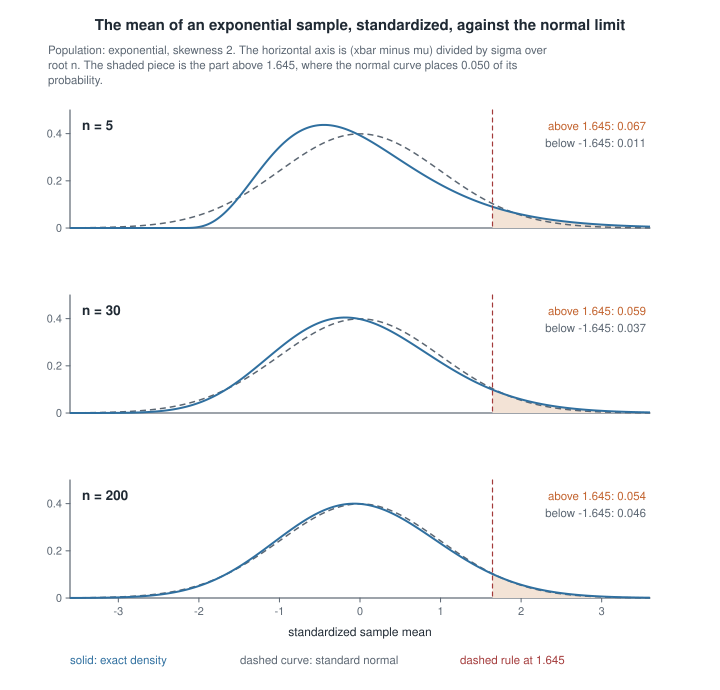
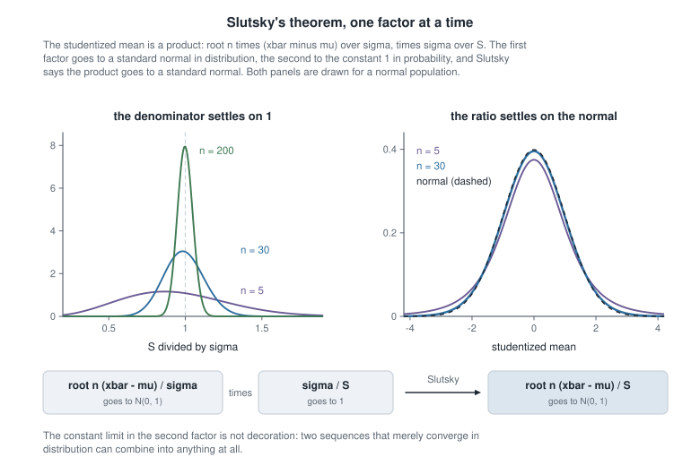
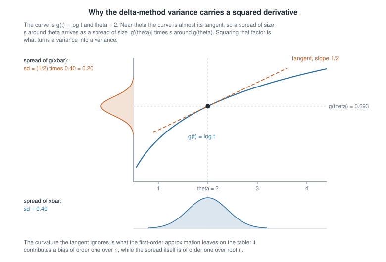
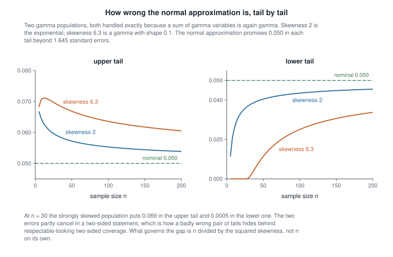

# Week 5 — Convergence, the laws of large numbers, and the delta method

## Where this week starts

Week 4 handed you exact statements: under a normal model the sample mean is exactly normal, the scaled sample variance exactly chi-square, the two exactly independent, and the studentized mean exactly $t_{n-1}$ at every sample size, including $n = 3$. Those are facts about the normal family, not about statistics in general; they came from an orthogonal transformation no other family hands you.

Step one inch outside that family and the exact sampling distribution of even a mild statistic disappears. What is the exact density of $\log \bar{X}_n$ for an exponential sample? Of $\hat{p}(1 - \hat{p})$ for a Bernoulli sample? Of a ratio of two sample means? Occasionally you can grind one out; usually you cannot.

So this week asks: when the exact distribution is out of reach, what survives as $n$ grows, and how wrong is the approximation at the sample size you actually have? The first half needs a vocabulary of limits, together with the two theorems — continuous mapping and Slutsky — that build complicated limits from simple ones. The second half needs the delta method and an honest audit of what it costs at finite $n$.

That second half matters most: "asymptotically normal" describes a limit no data set ever reaches. By Thursday you should be able to state each convergence mode precisely, assemble a limit from parts, run the delta method on a transformation of your choosing, and put a number on the error you accept.

### Why this matters downstream

Here is the stake. A reliability laboratory measures time to failure on a strongly right-skewed population, collects thirty units, and reports a one-sided lower 95 percent bound for the mean from a normal approximation — a guaranteed minimum average life — believing the true mean falls below it five percent of the time. Track which tail that failure lives in: the bound $\bar{X}_n - 1.645\,\sigma/\sqrt{n}$ overshoots the truth exactly when the sample mean runs high, that is when the standardized mean exceeds $1.645$. With skewness near six at $n = 30$ that tail carries about seven percent, so the guarantee fails nearly forty percent more often than advertised, while the matching upper bound fails through the opposite tail and almost never fails at all. A two-sided summary would have concealed both errors.

The machinery also carries the rest of the course. Every standard error you meet from Week 12 onward, and every one printed by a regression routine, is a delta-method calculation on an asymptotic variance; the asymptotic normality of the maximum likelihood estimator is a Taylor expansion of the score finished by Slutsky; the Wald interval of Week 13 is the delta method plus a normal quantile. Leave the vocabulary vague and all of that becomes recipe.

## What you will be able to do

- State convergence in probability and in distribution precisely, and exhibit a sequence that converges in distribution but not in probability.
- Prove the weak law under a finite variance with Chebyshev's inequality, and name the hypothesis that proof uses which the theorem does not need.
- Use continuous mapping and Slutsky to obtain the limiting distribution of a ratio, and explain why Slutsky needs one of its limits to be a constant.
- Derive the first-order delta-method variance for a differentiable $g$, and recognise when $g'(\theta) = 0$ forces a second-order argument with a non-normal limit.
- Build a variance-stabilizing transformation by solving $g'(\theta) \propto 1/\sigma(\theta)$, and carry an interval back to the original scale.
- Quantify how far a normal approximation sits from the exact result at a stated $n$, and name the population feature that governs the gap.

## Words worth owning

| Term | What it means in this course |
|------|------------------------------|
| Convergence in probability | The chance that $X_n$ misses its target by any fixed tolerance goes to zero. About closeness. |
| Convergence in distribution | The distribution functions converge at every continuity point of the limit. About shape only. |
| Weak law of large numbers | For an i.i.d. sample with a finite mean, the sample mean converges in probability to that mean. |
| Central limit theorem | For an i.i.d. sample with finite non-zero variance, the standardized sample mean converges in distribution to a standard normal. |
| Slutsky's theorem | A limit in distribution combines with a limit in probability to a constant — by sum, product or quotient — and the constant comes along. |
| Delta method | A smooth transformation multiplies the asymptotic standard deviation by the absolute derivative, the variance by its square. |
| Asymptotic variance | The variance of the limiting normal law after scaling by $\sqrt{n}$. A property of the limit, not the limit of the variances. |
| Variance-stabilizing transformation | A transformation chosen so the asymptotic variance stops depending on the parameter. |

## Modes of convergence and the tools that move between them

Throughout, $X_1, \dots, X_n$ are independent draws from a common distribution with mean $\mu = \mathbb{E}[X_1]$ and variance $\sigma^2 = \operatorname{Var}(X_1)$, both finite unless a passage says otherwise. Write $\bar{X}_n = n^{-1}\sum_{i=1}^{n} X_i$ and $S_n^2 = (n-1)^{-1}\sum_{i=1}^{n}(X_i - \bar{X}_n)^2$.

A sequence of random variables is not a sequence of numbers, so "converges" needs a definition. Two carry this course.

$$X_n \xrightarrow{p} X \quad \text{means} \quad P\left(|X_n - X| > \varepsilon\right) \to 0 \ \text{ for every fixed } \varepsilon > 0 ,$$

$$X_n \xrightarrow{d} X \quad \text{means} \quad F_n(x) \to F(x) \ \text{ at every } x \text{ where } F \text{ is continuous} ,$$

where $F_n$ and $F$ are the distribution functions of $X_n$ and $X$. The first says the random variables get close to each other; the second says only that the pictures get close, and permits $X_n$ and $X$ to live on different probability spaces. That gap is why two definitions are needed.

Convergence in probability implies convergence in distribution, and the reverse fails. The counterexample is one line: let $X$ be standard normal and set $X_n = -X$ for every $n$. By symmetry $X_n$ has exactly the standard normal law, so $F_n = F$ and $X_n \xrightarrow{d} X$; but $|X_n - X| = 2|X|$ and $P(2|X| > 1)$ is a fixed positive number that never shrinks. The definitions ask different questions.

One partial converse holds and gets used constantly: if $X_n \xrightarrow{d} c$ for a constant $c$, then $X_n \xrightarrow{p} c$, since $P(|X_n - c| > \varepsilon) \le F_n(c - \varepsilon) + \left(1 - F_n(c + \varepsilon)\right) \to 0 + (1-1) = 0$, both $c \pm \varepsilon$ being continuity points of the degenerate limit. With a constant target there is no shape left to match.

### Convergence in probability and the weak law

The weak law of large numbers says that if $X_1, \dots, X_n$ are i.i.d. with $\mathbb{E}|X_1| < \infty$ and mean $\mu$, then $\bar{X}_n \xrightarrow{p} \mu$. Assuming also a finite variance, the proof is one line of Chebyshev's inequality, since $\mathbb{E}[\bar{X}_n] = \mu$ and $\operatorname{Var}(\bar{X}_n) = \sigma^2/n$:

$$P\left(|\bar{X}_n - \mu| \ge \varepsilon\right) \le \frac{\operatorname{Var}(\bar{X}_n)}{\varepsilon^2} = \frac{\sigma^2}{n \varepsilon^2} \xrightarrow[n \to \infty]{} 0 .$$

Notice what happened. The proof used a finite variance; the theorem needs only a finite mean. The conditions of a proof and of a theorem are different lists, and confusing them makes a result look more fragile than it is.

The finite mean, though, is genuinely needed. Let $X_1, \dots, X_n$ be standard Cauchy, density $f(x) = 1/\{\pi(1+x^2)\}$, with no mean at all. Its characteristic function is $e^{-|t|}$, so that of $\bar{X}_n$ is $\left(e^{-|t|/n}\right)^{n} = e^{-|t|}$: the average of $n$ Cauchy observations has exactly the distribution of one, for every $n$. Averaging a thousand buys nothing.

### Convergence in distribution and the central limit theorem

The central limit theorem, in the form used here, says that if $X_1, \dots, X_n$ are i.i.d. with mean $\mu$ and variance $\sigma^2$ satisfying $0 < \sigma^2 < \infty$, then

$$Z_n = \frac{\sqrt{n}\left(\bar{X}_n - \mu\right)}{\sigma} \xrightarrow{d} N(0,1) .$$

Read that carefully, because it is routinely misquoted. The observations do not become normal; their distribution never changes. Nor does the sample mean become normal. The theorem is about $\bar{X}_n$ *after* centring at $\mu$ and inflating by $\sqrt{n}$; without that inflation $\bar{X}_n$ collapses onto $\mu$ and the limit is degenerate. The factor $\sqrt{n}$ holds the spread still while the centre stabilizes, and finding such a rate is a move you will repeat all term.

It is also an $n \to \infty$ statement, silent about any particular $n$. The figure below makes that concrete for an exponential population, where a sum of exponentials is gamma and the exact density of $Z_n$ is available in closed form.

{fig-alt="Three stacked density panels on one standardized axis. At n equals 5 the exact density is clearly right-skewed; by n equals 200 it nearly matches the normal, yet the tail probabilities printed on each panel still differ from 0.050."}

At $n = 5$ the exact density is obviously not normal, and its left tail simply ends, because $\bar{X}_n$ cannot be negative and so $Z_n$ cannot fall below $-\sqrt{n}$. By $n = 30$ the curves are hard to separate by eye in the middle, yet the printed tail probabilities show the approximation still off where it matters: the region above $1.645$, to which the normal gives probability $0.050$, carries $0.059$ at $n = 30$ and still carries $0.054$ at $n = 200$. Agreement in the middle arrives long before agreement in the tails, and inference lives in the tails.

### Continuous mapping and Slutsky as the working tools

Two theorems turn these limits into a calculus. The **continuous mapping theorem** says that if $X_n \xrightarrow{d} X$ and $g$ is continuous on a set carrying all of the probability of $X$, then $g(X_n) \xrightarrow{d} g(X)$; the same holds with $\xrightarrow{p}$ throughout. **Slutsky's theorem** says that if $X_n \xrightarrow{d} X$ and $Y_n \xrightarrow{p} c$ for a *constant* $c$, then

$$X_n + Y_n \xrightarrow{d} X + c, \qquad Y_n X_n \xrightarrow{d} c X, \qquad \frac{X_n}{Y_n} \xrightarrow{d} \frac{X}{c} \ \text{ when } c \ne 0 .$$

The word "constant" is load-bearing and students skip it. Convergence in distribution of two separate sequences tells you nothing about their sum: put $X_n = Z$ and $Y_n = -Z$ for $Z$ standard normal, and both converge to $N(0,1)$ while $X_n + Y_n$ is identically zero. Marginal limits do not determine joint behaviour; Slutsky escapes this because a sequence converging to a constant has no room left to be dependent on anything.

The standard use is the studentized mean:

$$\frac{\sqrt{n}\left(\bar{X}_n - \mu\right)}{S_n} = \underbrace{\frac{\sqrt{n}\left(\bar{X}_n - \mu\right)}{\sigma}}_{\xrightarrow{d} \, N(0,1)} \times \underbrace{\frac{\sigma}{S_n}}_{\xrightarrow{p} \, 1} .$$

For the second factor, the identity $\sum_{i}(X_i - \bar{X}_n)^2 = \sum_i X_i^2 - n \bar{X}_n^2$ gives $S_n^2 = \frac{n}{n-1}\left(\frac{1}{n}\sum_i X_i^2 - \bar{X}_n^2\right)$. The weak law applied to $X_i^2$ gives $\frac{1}{n}\sum_i X_i^2 \xrightarrow{p} \mathbb{E}[X_1^2]$, finite precisely because $\sigma^2$ is; continuous mapping gives $\bar{X}_n^2 \xrightarrow{p} \mu^2$; and $n/(n-1) \to 1$. So $S_n^2 \xrightarrow{p} \sigma^2$, and $u \mapsto \sigma/\sqrt{u}$, continuous at $\sigma^2 > 0$, gives $\sigma/S_n \xrightarrow{p} 1$. Slutsky assembles the pieces, with no normality assumption anywhere.

{fig-alt="Left: densities of S over sigma at n equal to 5, 30 and 200, collapsing onto one. Right: the studentized mean, heavy-tailed at n equals 5 and matching the standard normal at n equals 30. Three boxes below assemble the product."}

The figure separates the factors. On the left the density of $S_n/\sigma$ is broad at $n = 5$ and has collapsed to a spike at $1$ by $n = 200$ — convergence in probability to a constant, drawn. On the right the ratio starts heavy-tailed and is already on the standard normal at $n = 30$. For a normal population that ratio is exactly $t_{n-1}$ at every $n$, which is why the $n = 5$ curve is fat-tailed rather than noisy; the asymptotic argument reaches the same limit while assuming far less.

## The delta method and the price of a smooth transformation

Estimators rarely arrive in the form you want to report: you estimate a mean and want a log, a rate and want a half-life, a proportion and want the odds. The delta method settles the resulting question: given the approximate distribution of $T_n$, what is that of $g(T_n)$?

### The first-order expansion and its variance

Suppose $\sqrt{n}\left(T_n - \theta\right) \xrightarrow{d} N\left(0, \sigma^2\right)$ and $g$ is differentiable at $\theta$ with $g'(\theta) \ne 0$. Then

$$\sqrt{n}\left\{g(T_n) - g(\theta)\right\} \xrightarrow{d} N\left(0, \left\{g'(\theta)\right\}^2 \sigma^2\right) .$$

The proof is a Taylor expansion plus the two tools above. Differentiability at $\theta$ lets us write, for $t$ near $\theta$,

$$g(t) = g(\theta) + \left\{g'(\theta) + R(t)\right\}(t - \theta), \qquad R(t) \to 0 \ \text{ as } t \to \theta, \quad R(\theta) = 0 .$$

Substituting $t = T_n$ and multiplying by $\sqrt{n}$,

$$\sqrt{n}\left\{g(T_n) - g(\theta)\right\} = \left\{g'(\theta) + R(T_n)\right\} \cdot \sqrt{n}\left(T_n - \theta\right) .$$

Because $\sqrt{n}(T_n - \theta)$ converges in distribution and $n^{-1/2} \to 0$, Slutsky gives $T_n \xrightarrow{p} \theta$, and continuous mapping gives $R(T_n) \xrightarrow{p} 0$. The bracket converges in probability to the constant $g'(\theta)$, the second factor in distribution to $N(0,\sigma^2)$, and Slutsky multiplies them.

{fig-alt="The curve g of t equals log t with its tangent at t equals 2. A bell of standard deviation 0.40 sits on the horizontal axis at theta; a bell of standard deviation 0.20 sits sideways at g of theta, linked by the slope one half."}

The picture is that argument without symbols. Over the window where $T_n$ lands, a few multiples of $\sigma/\sqrt{n}$ around $\theta$, the curve is nearly its own tangent, and a straight line of slope $g'(\theta)$ stretches a spread by $|g'(\theta)|$; variances, being squared, pick up $\{g'(\theta)\}^2$. The curvature the tangent discards is not nothing: it produces a bias of order $1/n$, negligible beside a spread of order $n^{-1/2}$ as $n$ grows, and not negligible at $n = 10$.

Two cautions. This is a statement about a limiting law, not about moments: a limit with variance $\{g'(\theta)\}^2\sigma^2$ does not imply $\operatorname{Var}\{g(T_n)\}$ is even finite, as the transfer example shows. And everything hinges on $g$ being differentiable at the *true* $\theta$, with non-zero derivative there.

### When the derivative vanishes, and the second-order version

If $g'(\theta) = 0$ the first-order statement is still true and useless: it says $\sqrt{n}\{g(T_n) - g(\theta)\} \xrightarrow{d} N(0,0)$, a point mass, meaning only that $g(T_n)$ approaches $g(\theta)$ faster than $n^{-1/2}$. Expand one more term. If $g$ is twice differentiable at $\theta$ with $g''(\theta) \ne 0$, then $g(T_n) - g(\theta) \approx \frac{1}{2}g''(\theta)(T_n - \theta)^2$, so multiplying by $n$ rather than $\sqrt{n}$ and applying continuous mapping to the square,

$$n\left\{g(T_n) - g(\theta)\right\} \xrightarrow{d} \frac{1}{2}g''(\theta)\,\sigma^2 \chi^2_1 .$$

The rate improved from $n^{-1/2}$ to $n^{-1}$ and the limit stopped being normal. Take a Bernoulli sample and $g(p) = p(1-p)$: here $g'(p) = 1-2p$ vanishes at $p = 1/2$, $g''(p) = -2$, and the sample proportion has $\sigma^2 = p(1-p) = 1/4$ there, so

$$n\left\{\hat{p}(1-\hat{p}) - \tfrac{1}{4}\right\} \xrightarrow{d} \tfrac{1}{2}(-2)\left(\tfrac{1}{4}\right)\chi^2_1 = -\tfrac{1}{4}\chi^2_1 .$$

Audit that before believing it. The limit sits on the negative half-line, and indeed $\hat{p}(1-\hat{p}) \le 1/4$ always, so the sign is right. Its mean is $-1/4$, and the exact calculation gives $\mathbb{E}[\hat{p}(1-\hat{p})] = 1/2 - \operatorname{Var}(\hat{p}) - 1/4 = 1/4 - 1/(4n)$, so $n\{\mathbb{E}[\hat{p}(1-\hat{p})] - 1/4\} = -1/4$ exactly at every $n$. Two independent checks agree, the pattern to imitate whenever a limit theorem produces something surprising.

### Variance stabilizing as the practical payoff

Often $\sigma^2$ depends on the parameter: for a proportion it is $p(1-p)$, for a Poisson mean $\lambda$, for an exponential mean $\mu^2$. That is awkward, because the width of an approximate interval then varies with the unknown quantity. Write $\sigma^2(\theta)$ for the dependence and demand a $g$ that removes it:

$$\left\{g'(\theta)\right\}^2 \sigma^2(\theta) = \text{constant} \quad \Longleftrightarrow \quad g(\theta) = c \int \frac{d\theta}{\sigma(\theta)} .$$

Integrate the reciprocal of the asymptotic standard deviation: that is the whole recipe. For an exponential mean $\sigma(\mu) = \mu$ and the integral is $\log\mu$; for a Poisson mean it is $2\sqrt{\lambda}$; for a proportion it is the arcsine transformation derived below. Three of the commonest transformations in applied statistics fall out of one integral.

## Worked example — the logarithm of an exponential sample mean

**Setting.** A laboratory records times to failure $X_1, \dots, X_n$, modelled as independent draws from $f(x \mid \lambda) = \lambda e^{-\lambda x}$ for $x > 0$, with rate $\lambda > 0$, mean $\mu = 1/\lambda$ and variance $1/\lambda^2$. Failure times span orders of magnitude, so the reported quantity is $\log \bar{X}_n$. Take $n = 25$.

**Step one — the base limit.** The exponential has finite non-zero variance, so

$$\sqrt{n}\left(\bar{X}_n - \frac{1}{\lambda}\right) \xrightarrow{d} N\left(0, \frac{1}{\lambda^2}\right) .$$

**Step two — the transformation.** With $g(t) = \log t$ we have $g'(t) = 1/t$ and $g'(1/\lambda) = \lambda$, non-zero for every admissible $\lambda$, so

$$\sqrt{n}\left\{\log \bar{X}_n - \log\left(\tfrac{1}{\lambda}\right)\right\} \xrightarrow{d} N\left(0, \lambda^2 \cdot \frac{1}{\lambda^2}\right) = N(0, 1) .$$

**Step three — read it.** The asymptotic variance is $1$, free of $\lambda$, so the logarithm is variance-stabilizing for an exponential mean, exactly as the integral recipe predicted from $\sigma(\mu) = \mu$. The approximate standard error of $\log \bar{X}_n$ is $1/\sqrt{n}$ whatever the truth, so at $n = 25$ it is $0.200$ and the interval width can be written down before seeing data.

**Step four — audit it.** A claim this clean deserves a check, and this model supplies an exact one. Since $\lambda X_i$ is standard exponential, $\sum_i \lambda X_i$ is gamma with shape $n$ and rate $1$, so the law of $\lambda \bar{X}_n$ does not involve $\lambda$ at all. That makes $\log \bar{X}_n - \log(1/\lambda) = \log(\lambda\bar{X}_n)$ an exact pivot, parameter-free at every $n$ and not merely in the limit, so the delta method's promise here is no accident of the approximation.

The exact moments follow. With $G$ gamma of shape $n$ and rate $1$, $\log(\lambda\bar{X}_n) = \log G - \log n$, whose mean is the digamma function of $n$ less $\log n$ and whose variance is the trigamma function of $n$. At $n = 25$ the mean is $-0.0201$, the standard deviation $0.20202$ against the delta-method value $0.200$, and the skewness $-0.202$. So the approximation is right to about one percent in spread but misses a downward shift of a tenth of a standard error and a mild left skew — exactly what a first-order expansion is entitled to miss, a bias of order $1/n$ and a skewness of order $n^{-1/2}$.

### The same reasoning, transferred

Keep the model, change the target. The rate $\lambda = 1/\mu$ is often what a reliability report wants, and the natural estimator is $1/\bar{X}_n$. The argument does not move: same base limit, same theorem, different $g$. With $g(t) = 1/t$ and $g'(1/\lambda) = -\lambda^2$,

$$\sqrt{n}\left(\frac{1}{\bar{X}_n} - \lambda\right) \xrightarrow{d} N\left(0, \lambda^4 \cdot \frac{1}{\lambda^2}\right) = N\left(0, \lambda^2\right) .$$

What stayed the same: the base central limit theorem, the differentiability requirement, the squared-derivative rule. What changed: the variance of the limiting law is $\lambda^2$, no longer free of the parameter, so the approximate variance of $1/\bar{X}_n$ at sample size $n$ is $\lambda^2/n$ and this transformation stabilizes nothing. Keep those two quantities verbally apart, as the glossary above does: an asymptotic variance is a property of the limit and carries no $n$, while the $\lambda^2/n$ you would put in a report is the finite-$n$ approximation got by undoing the $\sqrt{n}$ scaling. The estimator $1/\bar{X}_n$ returns in Week 7 as the maximum likelihood estimator of $\lambda$, and $\lambda^2/n$ in Week 12 as the inverse Fisher information.

Now the caution. The map $t \mapsto 1/t$ blows up at zero, so the argument needs $\theta \ne 0$. Here $\bar{X}_n > 0$ with probability one and the limit is safe, but finite-sample behaviour still differs more than you might expect. Because $n\lambda\bar{X}_n$ is gamma with shape $n$, $\mathbb{E}[1/\bar{X}_n] = n\lambda/(n-1)$ and $\operatorname{Var}(1/\bar{X}_n) = n^2\lambda^2/\{(n-1)^2(n-2)\}$ for $n > 2$. At $n = 25$ the bias is $\lambda/24$, about four percent upward, and the exact variance exceeds $\lambda^2/n$ by the factor $25^3/(24^2 \cdot 23) = 15625/13248 = 1.179$. Take the square root before calling that a standard-error discrepancy. The exact standard deviation exceeds the asymptotic $\lambda/\sqrt{n}$ by $\sqrt{1.179} = 1.086$, so the printed standard error is about eight percent too small, and the printed variance about fifteen percent, since $1/1.179 = 0.848$. Neither is a rounding error, and one gap has now been quoted three ways. Whenever a discrepancy arrives as a percentage, say which scale it lives on and which way round the comparison runs.

Change the model and the caution turns fatal. Estimate $1/\mu$ from a normal sample whose mean is near zero: the limit still holds for any fixed $\mu \ne 0$, but $\bar{X}_n$ puts positive density at zero, so $1/\bar{X}_n$ has no finite mean and no finite variance at any $n$. The asymptotic variance exists, the actual variance does not, and only the first is what the delta method ever claimed.

## Second worked example — stabilizing the variance of a sample proportion

**Setting.** A survey of $n = 100$ households records whether each has a particular utility connection. Model the responses as independent Bernoulli variables with success probability $p$, let $\hat{p} = \bar{X}_n$, and suppose $x = 12$ respond yes, so $\hat{p} = 0.12$. The base limit is

$$\sqrt{n}\left(\hat{p} - p\right) \xrightarrow{d} N\left(0, p(1-p)\right) ,$$

whose asymptotic variance depends on $p$. That dependence is the problem to fix.

**Step one — integrate for the stabilizing map.** With $\sigma(p) = \sqrt{p(1-p)}$, substitute $p = \sin^2 u$ for $u \in (0, \pi/2)$, so that $dp = 2\sin u \cos u \, du$ and $\sqrt{p(1-p)} = \sin u \cos u$:

$$\int \frac{dp}{\sqrt{p(1-p)}} = \int 2 \, du = 2u = 2\arcsin\sqrt{p} .$$

**Step two — verify the derivative directly**, since a substitution is worth re-deriving. With $g(p) = 2\arcsin\sqrt{p}$ the chain rule gives $g'(p) = 2 \cdot \frac{1}{\sqrt{1-p}} \cdot \frac{1}{2\sqrt{p}} = \frac{1}{\sqrt{p(1-p)}}$, so $\{g'(p)\}^2 p(1-p) = 1$ and

$$\sqrt{n}\left(2\arcsin\sqrt{\hat{p}} - 2\arcsin\sqrt{p}\right) \xrightarrow{d} N(0,1) ,$$

with asymptotic standard error $1/\sqrt{n}$ at every $p$ in the open unit interval.

**Step three — see the stabilization in numbers.** At $n = 100$ the raw standard error $\sqrt{p(1-p)/n}$ runs from $0.0218$ at $p = 0.05$ to $0.0500$ at $p = 0.50$, a factor of $2.29$. On the arcsine scale the asymptotic value is $0.100$ throughout, and the *exact* standard deviation of $2\arcsin\sqrt{\hat{p}}$, summed over the binomial distribution, is $0.1067$ at $p = 0.05$, $0.1021$ at $p = 0.10$, $0.1008$ at $p = 0.25$ and $0.1005$ at $p = 0.50$ — constant to within seven percent across a tenfold change in $p$. Push closer to the boundary and the flatness gives way: at $p = 0.025$, where the expected count $np$ is only two and a half, the exact standard deviation is $0.1204$, twenty percent above the asymptotic value. Stabilization is a statement about a limit, and near the boundary that limit needs a larger $n$.

**Step four — carry an interval back.** With $\hat{p} = 0.12$ we have $2\arcsin\sqrt{0.12} = 0.7075$, so an approximate 95 percent interval on the transformed scale is $0.7075 \pm 1.96/\sqrt{100} = (0.5115, 0.9035)$, and inverting through $p = \sin^2(g/2)$ gives $(0.0640, 0.1906)$. The ordinary interval built directly on $\hat{p}$ is $0.12 \pm 1.96\sqrt{0.12 \cdot 0.88/100} = (0.0563, 0.1837)$. The widths are nearly equal, $0.1274$ against $0.1266$, but the arcsine interval is shifted upward and asymmetric about $\hat{p}$: the transformation has noticed that $\hat{p}$ is near the boundary, where the sampling distribution is right-skewed.

**Step five — a competitor, and what it buys instead.** The logit, $g(p) = \log\{p/(1-p)\}$, has $g'(p) = 1/\{p(1-p)\}$ and asymptotic variance $1/\{p(1-p)\}$: not constant, so it stabilizes nothing. What it does is map the unit interval onto the whole line, so an interval computed there can never be transported back outside $(0,1)$. Here the logit is $\log(0.12/0.88) = -1.9924$ with standard error $1/\sqrt{100 \cdot 0.12 \cdot 0.88} = 0.3077$, giving $(-2.5956, -1.3893)$ and, back-transformed, $(0.0694, 0.1995)$. Both respect the boundary and only one flattens the variance.

They part company at the edge of the sample space, and it is worth being exact about how. If $\hat{p}$ comes out exactly $0$, the logit is $\log 0 = -\infty$ with an infinite estimated standard error, so it returns nothing until you adjust the counts, typically by adding a half to each cell. The arcsine has no such trouble: $g(0) = 0$ and $g(1) = \pi$ are finite, and the standard error $1/\sqrt{n}$ never consulted $\hat{p}$ at all. At $\hat{p} = 0$ and $n = 100$ it gives $0 \pm 0.196$ on the transformed scale, which truncated to the range of $g$ runs from $0$ to $0.196$ and inverts to $(0, \sin^2(0.098)) = (0, 0.0096)$.

So the arcsine is the better behaved of the two here, in the narrow sense that it still returns an interval — not in the sense of returning a good one. An exact calculation from zero successes in one hundred trials puts the one-sided 95 percent upper limit at $1 - 0.05^{1/100} = 0.0295$, three times as far out, so the arcsine interval is far too short and its coverage near zero is correspondingly poor. Stabilization is itself the reason: a standard error that refuses to depend on $\hat{p}$ cannot register that $\hat{p} = 0$ is the outcome saying least about how small $p$ might be. Week 13 returns to this comparison properly.

## A simulation check you can describe and run

Everything above is a claim about a limit, and the honest way to interrogate one is to look at a finite $n$. Here is the idiom for the first worked example; it needs no packages and runs as it stands in [the R Project](https://www.r-project.org/) environment.

```
set.seed(75063)
n    <- 25
lam  <- 3
reps <- 200000
xbar <- replicate(reps, mean(rexp(n, rate = lam)))
zdel <- sqrt(n) * (log(xbar) - log(1 / lam))
c(centre = mean(zdel),
  spread = sd(zdel),
  skewness = mean((zdel - mean(zdel))^3) / sd(zdel)^3)
```

The delta method predicts a centre of $0$, a spread of $1$ and a skewness of $0$; the exact gamma calculation predicts $-0.101$, $1.010$ and $-0.202$. The simulation will side with the second, which is the point of running it. Change `lam` to any other positive number and the summaries will not move, confirming that $\log(\lambda\bar{X}_n)$ is a genuine pivot. Change `n` to $200$ and the centre should move to about $-0.0354$ and the skewness to about $-0.071$, each shrinking at the advertised $n^{-1/2}$ rate.

Notice the discipline: the simulation is not evidence that the derivation is right, only a check that derivation and sampling behaviour agree at one parameter value, up to Monte Carlo error of order $1/\sqrt{200000}$. Week 8 makes that distinction its main subject.

## The misreading to avoid

The sentence to dismantle is the one every applied course leaves behind: **"the central limit theorem makes $n = 30$ enough."** Repeated often enough, it acquires the feel of a theorem. No threshold on $n$ alone can be right: the claim never mentions the population, and the population is what sets the rate.

The leading correction to the normal approximation for a standardized mean is proportional to $\gamma_1/\sqrt{n}$, where $\gamma_1 = \mathbb{E}\left[(X_1-\mu)^3\right]/\sigma^3$ is the population skewness. The error is small when $n$ is large *relative to* $\gamma_1^2$, not when $n$ is large in the abstract: a symmetric population can be fine at $n = 5$, while a population with $\gamma_1 = 6$ has $\gamma_1^2 = 36$, so $n = 30$ has not yet bought one unit of the quantity that matters.

The figure makes this exact rather than heuristic, using two gamma populations, where a sum of observations is again gamma and the tail probabilities compute to full precision.

{fig-alt="Two panels against sample size from 5 to 200. Both upper-tail curves stay above the nominal 0.050 line, the skewness 6.3 one above 0.060 at n equals 200. In the lower tail that curve is near zero until n equals 40 and reaches 0.034."}

Read the numbers off. For the strongly skewed population at $n = 30$, the upper-tail region a normal approximation assigns probability $0.050$ actually carries $0.069$, and the lower-tail region carries $0.0005$: wrong by a factor of a hundred on one side and nearly forty percent on the other, with both errors still visible at $n = 200$. Now the trap inside the trap. The errors have opposite signs, so the two-sided event assigned probability $0.050$ — falling more than $1.96$ standard errors out on either side — actually has probability $0.0465$ at $n = 30$, which looks perfectly respectable. A two-sided check can pass while both halves are badly wrong.

A further lesson sits in the arithmetic. A gamma population with shape $a$ has skewness $2/\sqrt{a}$, and a sample of size $n$ totals to a gamma with shape $na$, so the standardized sampling distribution depends on $n$ and the population only through $na$, that is through $n/\gamma_1^2$. The exponential population at $n = 5$ and the skewness-$6.3$ population at $n = 50$ therefore have *identical* standardized sampling distributions. Make the rule of thumb "$n$ large compared with $\gamma_1^2$", and treat any fixed number as the start of a question rather than the end of one.

## Practice on your own

These are for your own checking, not for submission. Pencil first, computer second.

1. **A limit that is not a limit.** Let $U$ be uniform on $(0,1)$ and set $X_n = U + 1/n$ for odd $n$ and $X_n = 1 - U$ for even $n$. Decide whether $X_n$ converges in distribution, whether it converges in probability, and reconcile the verdicts with the implication between them.

2. **Where Chebyshev is not enough.** Construct an i.i.d. sequence with a finite mean and infinite variance for which the weak law still holds, and explain why the Chebyshev proof cannot reach it. Then modify it so the mean fails to exist, and say which conclusion is lost.

3. **A second-order delta method of your own.** For a Poisson sample with mean $\lambda$, take $g(\lambda) = (\lambda - 2)^2$ and find the limiting distribution of $g(\bar{X}_n)$ at $\lambda = 2$, with the correct scaling. Confirm the sign of the limit against the shape of $g$, then check its mean against an exact computation of $\mathbb{E}\left[(\bar{X}_n - 2)^2\right]$.

4. **A simulation to describe.** Write out, in ten lines of R, a study estimating the true coverage of the ordinary 95 percent interval for a proportion at $p = 0.02$ and $n = 100$, and of the arcsine interval on the same samples. Predict, before running it, which dips further below $0.95$ and why the boundary is responsible.

5. **Audit a plausible argument.** A colleague writes: "since $\bar{X}_n \xrightarrow{p} \mu$ and $g$ is continuous, $g(\bar{X}_n) \xrightarrow{p} g(\mu)$; therefore $\mathbb{E}[g(\bar{X}_n)] \to g(\mu)$, so $g(\bar{X}_n)$ is asymptotically unbiased." Identify the step that does not follow, name the extra condition that would rescue it, and give a counterexample using $g(t) = 1/t$ on a normal sample.

## Where to read more

- [MIT OpenCourseWare 18.655, Mathematical Statistics](https://ocw.mit.edu/courses/18-655-mathematical-statistics-spring-2016/) — the large-sample lectures cover modes of convergence, Slutsky, and the delta method, with the measure theory this course sets aside.
- [MIT OpenCourseWare 18.650, Statistics for Applications](https://ocw.mit.edu/courses/18-650-statistics-for-applications-fall-2016/) — the central limit theorem and delta-method lectures, with worked applications.
- [Penn State STAT 414, Introduction to Probability Theory](https://online.stat.psu.edu/stat414/) — useful if Chebyshev's inequality or the gamma family need refreshing first.
- Hogg, McKean and Craig, *Introduction to Mathematical Statistics*, chapter 5, treats convergence, Slutsky, and the delta method in the order used here; an optional reference, and nothing here depends on owning it.
- The course pages: [the notes index](../index.qmd), [the schedule](../schedule.qmd), and [the resources page](../resources/index.qmd).

## Where this goes next

Week 6 starts building estimators and comparing them, and leans on this week immediately. Consistency is convergence in probability under another name, while the mean squared error decomposition needs the finite-sample variance, not the asymptotic one — keeping those apart is the discipline the transfer example rehearsed. The comparison of $2\bar{X}$ with a bias-corrected sample maximum for the uniform model is a case where asymptotic vocabulary does not settle the matter and finite-sample arithmetic does. Read [Week 6](week-06.qmd) with that tension in mind, and look back at [Week 4](week-04.qmd) for what an exact result looks like.

Two threads run forward. Computationally, every simulation from now on probes an asymptotic claim at finite $n$, and predicting the summary before running the code is the habit worth keeping. On the Bayesian side, the posteriors of Week 9 have a large-sample story of their own: under the same regularity conditions that make the maximum likelihood estimator asymptotically normal, the posterior concentrates and becomes approximately normal around it, which is why a credible interval and a confidence interval so often nearly coincide at large $n$ and diverge at small $n$. Week 13 asks what each actually claims.
