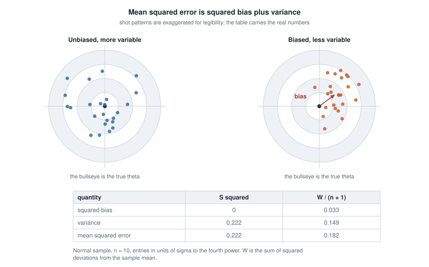
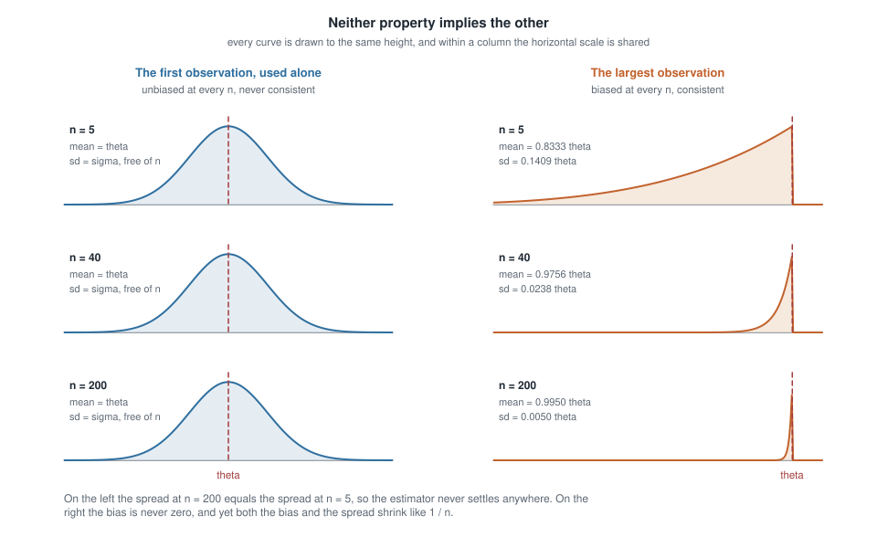
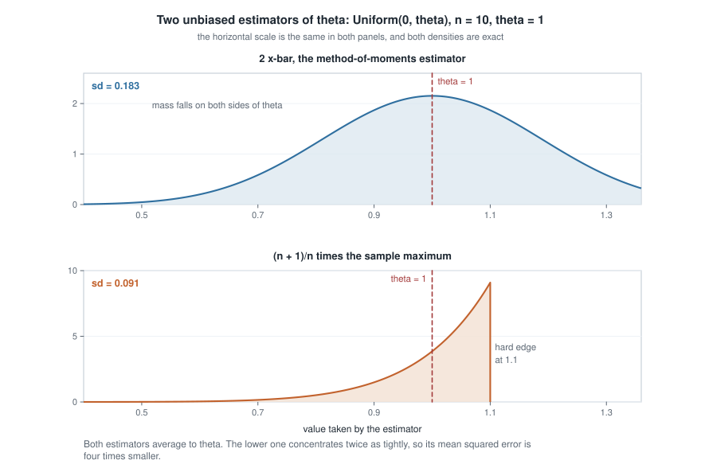
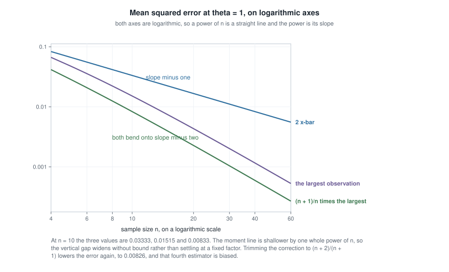

# Week 6 — Estimation: moments, bias, variance, and consistency

## Where this week starts

Five weeks in, you can write down a model, derive the exact distribution of a statistic, and describe
what happens to it as the sample grows. What you have not done is build anything. Week 5 gave you tools
for describing an estimator somebody else proposed; this week you propose it, and a new problem arrives
with the job. Two reasonable people can offer two different functions of the same data as estimators of
the same $\theta$, and point estimation is not finished until you can say which one to reach for and
why.

The week has two halves. The first is construction: the method of moments is the oldest recipe in the
subject and still the one worth meeting first, because it is purely mechanical. Write down what the
model says the population moments are, set them equal to the sample moments, and solve. No likelihood,
no optimization, often no more than a line of algebra. The second half is evaluation. Bias, variance,
mean squared error and consistency are the words this course uses whenever it compares two procedures,
and each should leave this page as a quantity you can compute rather than a slogan.

Keep the Week 1 discipline in view: everything below assumes the estimand is settled, and an estimator
that is superb by every criterion here is worthless if it is aimed at the wrong target. By Thursday you
should be able to take an unfamiliar one-parameter model, produce two candidate estimators, compute the
bias and the variance of each in closed form, decide which has smaller mean squared error and at which
sample sizes, and say why the winner is frequently the biased one.

### Why this matters downstream

Here is the concrete stake. A calibration lab needs the upper limit of a rounding error modelled as
uniform on $(0, \theta)$. One analyst reports twice the sample mean; another reports a small multiple of
the largest reading. Both are unbiased, both look sensible, and at $n = 40$ the first carries fourteen
times the mean squared error of the second — the same error the second reaches from only ten readings.
Three quarters of the sample has been paid for and thrown away.

The second stake is a habit of mind. A student who leaves this week believing that unbiasedness is the
objective will reject shrinkage, penalized likelihood, and every Bayes estimator in the course on
principle, and each of those is biased on purpose for the reason this page is about to derive. Week 9
builds posterior estimators that are biased by construction and often better; Week 12 exhibits a family
where the biased estimator converges at a faster rate.

## What you will be able to do

- Derive a method-of-moments estimator for a one- or two-parameter model, and state the conditions
  under which its moment equations have one usable root.
- Exhibit a sample whose method-of-moments estimate is logically impossible, and say what the recipe
  ignored.
- Compute bias, variance and mean squared error in closed form, and say which of the two terms drives
  the total.
- Decide whether one estimator dominates another: no larger mean squared error at every parameter
  value, and strictly smaller somewhere.
- Produce an unbiased estimator that is not consistent and a biased one that is.
- Read and design a Monte Carlo comparison, including the paired scheme that resolves a difference of
  under one percent.

## Words worth owning

| Term | What it means in this course |
|------|------------------------------|
| estimator | A function of the data alone, fixed before any data arrive; a random variable |
| estimate | The number that estimator takes on for the sample in hand |
| sampling distribution | The distribution of the estimator under repeated sampling from $P_\theta$ |
| bias | $\mathbb{E}_\theta[\hat\theta] - \theta$, computed separately at each $\theta$ |
| mean squared error | $\mathbb{E}_\theta[(\hat\theta - \theta)^2]$; the risk of $\hat\theta$ under squared-error loss |
| consistency | $\hat\theta_n \xrightarrow{p} \theta$ for every $\theta$; a property of a whole sequence |
| dominates | Has mean squared error no larger at every $\theta$, and strictly smaller at some $\theta$ |
| relative efficiency | Ratio of two estimators' mean squared errors at the same $\theta$ and $n$ |

## Building estimators out of moments

Let $X_1, \dots, X_n$ be independent draws from $f(x \mid \theta)$ with $\theta \in \Theta \subseteq
\mathbb{R}^p$. In words: every observation comes from the same distribution, the observations carry no
information about each other beyond that, and the one unknown is $\theta$. Write the population moments
and the sample moments as

$$\mu_k(\theta) = \mathbb{E}_\theta[X^k], \qquad m_k = \frac{1}{n}\sum_{i=1}^{n} X_i^k, \qquad k = 1, 2, \dots$$

The population moment is a known function of the unknown parameter; the sample moment is a known
function of the observed data. The method of moments declares them equal for as many $k$ as there are
unknowns and solves for $\theta$.

### The recipe, and why it usually works

Formally, $\hat\theta_{\mathrm{MM}}$ is any solution in $\Theta$ of the $p$ equations
$\mu_k(\hat\theta_{\mathrm{MM}}) = m_k$, $k = 1, \dots, p$. For one parameter that is one equation in one
unknown, and it usually inverts by hand.

Three instances to keep at your fingertips. For Bernoulli($p$),
$\mu_1 = p$, so $\hat p = \bar{X}$. For Exponential with rate $\lambda$, $\mu_1 = 1/\lambda$, so
$\hat\lambda = 1/\bar{X}$. For Normal($\mu, \sigma^2$) we need two equations, $\mu_1 = \mu$ and
$\mu_2 = \sigma^2 + \mu^2$, whose root is $\hat\mu = \bar{X}$ together with

$$\hat\sigma^2 = m_2 - \bar{X}^2 = \frac{1}{n}\sum_{i=1}^{n} X_i^2 - \bar{X}^2 = \frac{1}{n}\sum_{i=1}^{n} (X_i - \bar{X})^2 .$$

Confirm that last equality with a pencil; the same rearrangement returns in the second worked
example.

Why should any of this be trustworthy? Because of the weak law of large numbers and the continuous
mapping theorem, both from Week 5. If the moments exist, then $m_k \xrightarrow{p} \mu_k(\theta)$ for
each $k$. Collect the first $p$ moments into a map $g : \Theta \to \mathbb{R}^p$ with
$g(\theta) = (\mu_1(\theta), \dots, \mu_p(\theta))$. If $g$ is one-to-one with a continuous inverse on a
neighbourhood of the true $\theta$, then applying $g^{-1}$ to the converging sample moments gives
$\hat\theta_{\mathrm{MM}} \xrightarrow{p} \theta$. So the recipe delivers consistency for free. That is a
real virtue and also the beginning of the trouble, because consistency is a low bar.

Notice the three conditions. The moments must exist, which rules out the Cauchy at once and rules out
heavy tails as soon as you reach for a second or third moment. The moment map must be invertible, an
identifiability condition of exactly the Week 1 kind. And its inverse must be continuous, so that small
wobbles in $m_k$ do not produce jumps in $\hat\theta$.

### Three ways the recipe misbehaves

**It is not unique.** Nothing forces you to use the first $p$ moments. For a Uniform($0, \theta$) sample,
matching the first moment gives $2\bar{X}$, because $\mathbb{E}_\theta[X] = \theta/2$. Matching the
second moment instead gives $\sqrt{3 m_2}$, because $\mathbb{E}_\theta[X^2] = \theta^2/3$. Both are
method-of-moments estimators in the same model, and they are different random variables. On the ten
readings in the first worked example below they return $3.30$ and $3.310$; elsewhere they disagree by
much more. A recipe with several outputs is not yet a principle, and Week 7 supplies the one that
replaces it.

**It can return an impossible estimate.** Take three uniform observations on $(0, \theta)$ equal to
$0.1$, $0.2$ and $0.9$. Then $\bar{x} = 0.4$ and the moment estimate is $2\bar{x} = 0.8$. But we
observed a value of $0.9$, so $\theta \ge 0.9$ with certainty. The estimate contradicts the data that
produced it. Nothing prevents this, because the recipe never looks at the support of the density, only
at averages. The same failure wears other clothes: a variance component estimated as a difference of
two mean squares can come out negative, and a negative variance is outside $\Theta$.

**It ignores structure.** Two moments summarize a density crudely. In the uniform model the largest
observation says far more about $\theta$ than the average does, and the recipe never consults it.
Week 10 names what is being discarded — sufficiency — and Week 12 prices it.

## What makes one estimator better than another

An estimator is a random variable, so comparing two estimators means comparing two distributions, and
distributions do not come pre-ordered. To rank them we compress each sampling distribution to one
number by choosing a loss. This course's default is squared-error loss, whose risk is the mean squared
error — a modelling decision like any other, and Week 9 shows what changes under absolute-error loss.

### The decomposition that organizes everything

Fix $\theta$ and write $b(\theta) = \mathbb{E}_\theta[\hat\theta] - \theta$ for the bias. Then

$$\begin{aligned}
\mathrm{MSE}_\theta(\hat\theta)
 &= \mathbb{E}_\theta\big[(\hat\theta - \theta)^2\big] \\
 &= \mathbb{E}_\theta\Big[\big\{(\hat\theta - \mathbb{E}_\theta[\hat\theta]) + b(\theta)\big\}^2\Big] \\
 &= \mathbb{E}_\theta\big[(\hat\theta - \mathbb{E}_\theta[\hat\theta])^2\big]
    + 2\, b(\theta)\, \mathbb{E}_\theta\big[\hat\theta - \mathbb{E}_\theta[\hat\theta]\big]
    + b(\theta)^2 \\
 &= \operatorname{Var}_\theta(\hat\theta) + b(\theta)^2 .
\end{aligned}$$

The middle term vanishes because $b(\theta)$ is a constant once $\theta$ is fixed and it multiplies the
expectation of a centred variable. Every step is elementary; the identity it produces is the most-used
one in estimation theory.

{fig-alt="Two targets. Left: shots scatter widely around the bullseye. Right: a tighter cluster sits off centre, with a red arrow marked bias. A table gives squared bias 0 and 0.033, variance 0.222 and 0.149, mean squared error 0.222 and 0.182."}

In the figure the left pattern is centred on the bullseye but sprays, the right is displaced but tight,
and the mean squared error — the average squared distance from the bullseye — is won by the right. The
table beneath carries the real numbers from the second worked example. Notice the subscript $\theta$ on
every symbol above: bias, variance and mean squared error are functions of the parameter, so two
estimators can trade places as $\theta$ moves. We say $\hat\theta_A$
**dominates** $\hat\theta_B$ when $\mathrm{MSE}_\theta(\hat\theta_A) \le \mathrm{MSE}_\theta(\hat\theta_B)$
for every $\theta \in \Theta$, with strict inequality somewhere; then $\hat\theta_B$ is inadmissible under
squared-error loss.

Now the general fact that both worked examples below turn out to be instances of. Suppose $\hat\theta$
is unbiased with variance $v = \operatorname{Var}_\theta(\hat\theta) \gt 0$, and shrink it toward zero by
a factor $c$. Then

$$\mathrm{MSE}_\theta(c\hat\theta) = c^2 v + (c-1)^2\theta^2 ,
\qquad \frac{d}{dc}\,\mathrm{MSE}_\theta(c\hat\theta)\Big|_{c=1} = 2v \gt 0 .$$

The derivative at $c = 1$ is strictly positive, so moving $c$ a little below one strictly reduces the
mean squared error. Setting the derivative to zero gives the best multiple and its risk,

$$c^\ast = \frac{\theta^2}{v + \theta^2}, \qquad
\mathrm{MSE}_\theta(c^\ast\hat\theta) = \frac{v\,\theta^2}{v + \theta^2} \lt v .$$

Read that as a sentence: **no unbiased estimator with positive variance is ever the best multiple of
itself.** The catch is that $c^\ast$ normally depends on $\theta$, so $c^\ast\hat\theta$ is not an
estimator at all. One situation removes the catch. If the variance is proportional to the squared
parameter, $v = k\theta^2$ with $k$ free of $\theta$, then

$$c^\ast = \frac{1}{1+k}, \qquad \mathrm{MSE}_\theta(c^\ast\hat\theta) = \frac{k\,\theta^2}{1+k},$$

and $c^\ast$ is a computable constant, so the shrunken estimator dominates the unbiased one everywhere.
Any estimator whose standard deviation scales with $\theta$ behaves this way, as does the normal
variance, which is why both worked examples end with a biased winner.

### Consistency is a separate promise

An estimator sequence $\hat\theta_n$ is **consistent** for $\theta$ if
$\hat\theta_n \xrightarrow{p} \theta$ under $P_\theta$, for every $\theta \in \Theta$. Note the shape: it
is a claim about a sequence indexed by $n$, and it must hold at every parameter value.

Chebyshev's inequality gives the workhorse sufficient condition. For any $\varepsilon \gt 0$,

$$P_\theta\big(|\hat\theta_n - \theta| \ge \varepsilon\big) \le \frac{\mathrm{MSE}_\theta(\hat\theta_n)}{\varepsilon^2},$$

so a vanishing mean squared error forces consistency; equivalently, it is enough that the bias and the
variance both vanish. The condition is sufficient and not necessary. In a model where $\bar{X}_n$ is
consistent for $\theta$, let $\hat\theta_n$ equal $\bar{X}_n$ with probability $1 - 1/n$ and equal $n$
otherwise, decided by an independent coin. It is consistent, since the bad event has probability
$1/n \to 0$, yet its mean squared error is at least $(n-\theta)^2/n$, which diverges.

More importantly, unbiasedness and consistency do not imply each other in either direction.

{fig-alt="Six small density panels in two columns at n equal to 5, 40 and 200. The left column keeps the same width at every n and stays centred on theta. The right column sits below theta but narrows sharply as n grows."}

The left column is the estimator "use only the first observation" in a Normal($\theta, \sigma^2$) model
with $\sigma^2$ known. Its expectation is $\theta$ at every $n$, so it is unbiased forever, and its
sampling distribution stays Normal($\theta, \sigma^2$) however much data you collect: it never settles,
so it is not consistent. The right column is the sample maximum in a Uniform($0, \theta$) model, whose
mean $n\theta/(n+1)$ sits below $\theta$ at every finite $n$. It is biased forever, but the bias
$-\theta/(n+1)$ and the standard deviation are the same order in $n$, so both vanish and the estimator
is consistent.

## Worked example — the uniform upper endpoint

**Setting.** A calibration rig reports a rounding error the lab models as Uniform($0, \theta$), with
$\theta$ unknown and the lower endpoint known to be zero. Ten independent readings, in micrometres, are

$$0.42,\; 1.83,\; 2.97,\; 0.15,\; 2.41,\; 1.06,\; 2.78,\; 0.63,\; 1.94,\; 2.31 .$$

Their total is $16.50$, so $\bar{x} = 1.650$, and the largest is $x_{(10)} = 2.97$.

**Step 1: the moments of the model.** For $X$ uniform on $(0, \theta)$ the density is $1/\theta$ on that
interval, so $\mathbb{E}[X] = \theta/2$, $\mathbb{E}[X^2] = \theta^2/3$, and therefore
$\operatorname{Var}(X) = \theta^2/3 - \theta^2/4 = \theta^2/12$.

**Step 2: the moment estimator.** Matching the first moment gives
$\hat\theta_1 = 2\bar{X}$, unbiased since $\mathbb{E}_\theta[2\bar{X}] = \theta$, with

$$\operatorname{Var}_\theta(2\bar{X}) = 4\cdot\frac{\operatorname{Var}(X)}{n} = \frac{4\theta^2}{12 n} = \frac{\theta^2}{3n},
\qquad \mathrm{MSE}_\theta(2\bar{X}) = \frac{\theta^2}{3n}.$$

On these data the estimate is $2(1.650) = 3.30$.

**Step 3: the competitor built from the largest reading.** Let $M = X_{(n)}$. The maximum is at most
$t$ exactly when all $n$ observations are, so

$$F_M(t) = P_\theta(M \le t) = \left(\frac{t}{\theta}\right)^{n}, \quad 0 \le t \le \theta,
\qquad f_M(t) = \frac{n t^{n-1}}{\theta^{n}} .$$

Integrating gives the two moments we need,

$$\mathbb{E}_\theta[M] = \int_0^\theta t \cdot \frac{n t^{n-1}}{\theta^n}\,dt = \frac{n\theta}{n+1},
\qquad \mathbb{E}_\theta[M^2] = \int_0^\theta t^2 \cdot \frac{n t^{n-1}}{\theta^n}\,dt = \frac{n\theta^2}{n+2},$$

and subtracting the squared mean,

$$\operatorname{Var}_\theta(M) = \frac{n\theta^2}{n+2} - \frac{n^2\theta^2}{(n+1)^2}
= \frac{n\theta^2\big\{(n+1)^2 - n(n+2)\big\}}{(n+2)(n+1)^2} = \frac{n\theta^2}{(n+2)(n+1)^2},$$

where the brace collapses because $(n+1)^2 - n(n+2) = n^2 + 2n + 1 - n^2 - 2n = 1$.

**Step 4: correcting the bias.** Since $\mathbb{E}_\theta[M] = n\theta/(n+1)$, multiplying by
$(n+1)/n$ produces an unbiased estimator $\hat\theta_2 = \frac{n+1}{n}M$ with

$$\operatorname{Var}_\theta(\hat\theta_2) = \frac{(n+1)^2}{n^2}\cdot\frac{n\theta^2}{(n+2)(n+1)^2}
= \frac{\theta^2}{n(n+2)} = \mathrm{MSE}_\theta(\hat\theta_2).$$

On these data the estimate is $\tfrac{11}{10}(2.97) = 3.267$.

**Step 5: compare the two unbiased estimators.** Both are exactly unbiased, so the comparison is purely
a variance comparison, and the ratio is

$$\frac{\mathrm{MSE}_\theta(2\bar{X})}{\mathrm{MSE}_\theta(\hat\theta_2)} = \frac{\theta^2/(3n)}{\theta^2/(n(n+2))} = \frac{n+2}{3}.$$

At $n = 10$ the ratio is four and at $n = 40$ it is fourteen. At $n = 1$ it is one, as it must be: with
a single observation $2\bar{X}$ and $\frac{n+1}{n}X_{(n)}$ are the same random variable $2X_1$. That
agreement is a free audit of the derivation, and exactly the check to run before believing algebra.

{fig-alt="Two stacked density panels on one horizontal scale. The top, two times the sample mean, is nearly symmetric about theta equals 1 with sd 0.183. The bottom, 1.1 times the sample maximum, is left skewed with sd 0.091."}

The figure draws both exact sampling distributions at $n = 10$, $\theta = 1$. They average to the same
place and look nothing alike: the moment estimator is nearly symmetric, while the corrected maximum is
sharply left-skewed with a hard edge at $1.1\theta$, since $M$ can never exceed $\theta$. Only the second
moment of that picture reaches the mean squared error.

**Step 6: let the shrinkage lemma finish the job.** $\hat\theta_2$ is unbiased with variance
$v = \theta^2/(n(n+2))$, which is $k\theta^2$ with $k = 1/(n(n+2))$ free of $\theta$. The lemma from the
concept section therefore applies with a computable constant:

$$c^\ast = \frac{1}{1+k} = \frac{n(n+2)}{(n+1)^2}, \qquad
c^\ast\hat\theta_2 = \frac{n(n+2)}{(n+1)^2}\cdot\frac{n+1}{n}M = \frac{n+2}{n+1}\,M .$$

Its mean squared error is $k\theta^2/(1+k) = \theta^2/\{n(n+2)+1\} = \theta^2/(n+1)^2$, and its bias is
$-\theta/(n+1)^2$. On these data the estimate is $\tfrac{12}{11}(2.97) = 3.24$.

| Estimator | Bias | Mean squared error | MSE at $n = 10$ | Estimate |
|-----------|------|--------------------|-----------------|----------|
| $2\bar{X}$ | $0$ | $\theta^2/(3n)$ | $0.03333\,\theta^2$ | $3.30$ |
| $M = X_{(n)}$ | $-\theta/(n+1)$ | $2\theta^2/\{(n+1)(n+2)\}$ | $0.01515\,\theta^2$ | $2.97$ |
| $\frac{n+1}{n}M$ | $0$ | $\theta^2/\{n(n+2)\}$ | $0.00833\,\theta^2$ | $3.267$ |
| $\frac{n+2}{n+1}M$ | $-\theta/(n+1)^2$ | $\theta^2/(n+1)^2$ | $0.00826\,\theta^2$ | $3.24$ |

{fig-alt="Log-log plot of mean squared error against n from 4 to 60 at theta equals 1. The line for two times the sample mean is highest with slope minus one; the two maximum-based curves are twice as steep, bending onto slope minus two."}

The second row is worth re-deriving: $\mathrm{MSE}(M) = \operatorname{Var}(M) + \theta^2/(n+1)^2$, and
over the common denominator $n/\{(n+2)(n+1)^2\} + 1/(n+1)^2 = 2/\{(n+1)(n+2)\}$. The figure plots the
first three rows with **both** axes logarithmic, and that choice is the whole point of the picture: a
pure power $c\,n^{-r}$ has $\log(\mathrm{MSE}) = \log c - r \log n$, a straight line in $\log n$ whose
slope is exactly the rate $-r$. The uneven tick spacing along the bottom is the visual signature that
the horizontal axis has been logged too; on a plot with $n$ spaced evenly, none of these graphs would
be straight and no slope would be readable. The moment estimator's error is the pure power $1/(3n)$,
so its graph is exactly straight with slope $-1$, the shallower of the two rates on show. The two
maximum-based errors, $2/\{(n+1)(n+2)\}$ and $1/\{n(n+2)\}$, are not quite pure powers — each is a
power times a factor tending to one — so their graphs bend gently and settle onto slope $-2$: twice as
steep, an error shrinking one whole power of $n$ faster. Read the vertical gap rather than the heights.
It widens without bound, because a difference of rate, unlike a difference in the constant out front, is
not a fixed handicap. Week 12 explains why the usual information bound has nothing to say about any of
this.

**What this assumed.** Everything above used the uniform model exactly, including the known lower
endpoint of zero. The maximum-based estimators are superb under that model and fragile away from it.
Inflate one reading by $\delta$: if it is the largest, $\frac{n+1}{n}M$ moves by $1.1\delta$ at $n = 10$,
while $2\bar{X}$ moves by only $\delta/5$. Efficiency under a model and robustness to a wrong model are
different goods, and Week 14 prices the trade.

### The same reasoning, transferred

Run the same ledger on a Poisson($\lambda$) sample, where the mean and the variance are both
$\lambda$. Matching the first moment gives $\hat\lambda_1 = \bar{X}$ at once. Matching the second is
worth doing slowly, because this is where a plausible-sounding sentence goes wrong. The definition at
the top of this page sets a *population raw moment* equal to a *sample raw moment*, and
$\mathbb{E}_\lambda[X^2] = \operatorname{Var}(X) + \{\mathbb{E}_\lambda[X]\}^2 = \lambda + \lambda^2$,
so the second moment equation is the quadratic $\hat\lambda + \hat\lambda^2 = m_2$, whose positive root
is

$$\hat\lambda_2 = \frac{\sqrt{1 + 4m_2} - 1}{2} .$$

This is the same manoeuvre the uniform model asked for two sections above, where $\mathbb{E}[X^2] =
\theta^2/3$ gave $\sqrt{3m_2}$; here the population second moment is quadratic in the parameter rather
than a perfect square, so inverting it takes the quadratic formula. Non-uniqueness bites again:
$\hat\lambda_1$ and $\hat\lambda_2$ are different random variables solving the recipe in one model.
The second is consistent, by the continuous-mapping argument above, and its exact expectation is not
available in closed form — which is itself the lesson that the recipe hands you consistency cheaply and
finite-sample properties not at all.

What $\hat\lambda_2$ is *not* is the sample variance. Substituting the first equation into the second
instead of solving it outright gives the plug-in $m_2 - \bar{X}^2 = \frac{1}{n}\sum_i (X_i -
\bar{X})^2 = \frac{n-1}{n}S^2$ — exactly the rearrangement you were asked to confirm with a pencil for
the normal, and note the divisor $n$ rather than $n-1$. Its expectation is $(n-1)\lambda/n$, low by
$\lambda/n$. So neither route produces the unbiased $S^2$, and calling $S^2$ "the second moment
estimator" here would contradict the definition this page started from.

Compare $\bar{X}$ instead with the competitor that the model identity $\operatorname{Var}(X) = \lambda$
suggests to any working statistician: the unbiased $S^2$, which estimates $\lambda$ because in this
model the variance *is* the parameter. Both estimators are exactly unbiased, so this comparison, like
the uniform one, is purely a comparison of variances.

The first variance is immediate, $\operatorname{Var}_\lambda(\bar{X}) = \lambda/n$. The second needs the
standard identity $\operatorname{Var}(S^2) = \frac{1}{n}\{\mu_4 - \frac{n-3}{n-1}\sigma^4\}$, where
$\mu_4$ is the fourth central moment. For the Poisson every cumulant equals $\lambda$, so
$\mu_4 = \kappa_4 + 3\kappa_2^2 = \lambda + 3\lambda^2$, and

$$\operatorname{Var}_\lambda(S^2) = \frac{\lambda}{n} + \frac{\lambda^2}{n}\left\{3 - \frac{n-3}{n-1}\right\}
= \frac{\lambda}{n} + \frac{\lambda^2}{n}\cdot\frac{2n}{n-1} = \frac{\lambda}{n} + \frac{2\lambda^2}{n-1}.$$

So $\bar{X}$ wins by exactly $2\lambda^2/(n-1)$ at every $\lambda$ and every $n \ge 2$. At $\lambda = 4$
and $n = 25$ the two variances are $0.160$ and $1.493$, a relative efficiency of about eleven percent
for $S^2$.

The moment plug-in $\frac{n-1}{n}S^2$ is no rescue either. It is biased, so it must be judged on mean
squared error rather than variance, and that error is $\big(\frac{n-1}{n}\big)^2
\operatorname{Var}_\lambda(S^2) + \lambda^2/n^2$, which at the same $\lambda = 4$ and $n = 25$ comes to
$0.9216(1.493) + 0.0256 = 1.402$ against $0.160$ for $\bar{X}$. Shrinking a very noisy estimator toward
zero shaves a little off a large error and leaves it large; the shrinkage lemma promises an improvement
over the estimator you started from, never a competitive one.

What stayed the same is the procedure: write down the population moments, match them, notice that the
recipe again offers more than one root, then take expectations and variances and compare at a common
$n$. What changed is the verdict. In the uniform model the mean-based estimator lost badly to one built
from an extreme order statistic; here it wins by a factor of nine, since $1.493/0.160 = 9.3$. There is
no rule of thumb behind these examples — the arithmetic is the rule. Week 10
notes that $\bar{X}$ is a function of the sufficient statistic $\sum_i X_i$ while $S^2$ is not, and
Week 11 makes that the reason the contest was never close.

## Second worked example — shrinking the sample variance

**Setting.** A filling line is checked by weighing ten cartons; the weights, in grams, are modelled as
independent Normal($\mu, \sigma^2$), both parameters unknown. They are

$$17.4,\; 18.4,\; 18.4,\; 19.4,\; 20.4,\; 20.4,\; 21.4,\; 22.4,\; 22.4,\; 23.4 .$$

They total $204.0$, so $\bar{x} = 20.40$, and the deviations from the mean are $-3, -2, -2, -1, 0, 0, 1,
2, 2, 3$, whose squares total $W = 36.0$.

**Step 1: what Week 4 already gives.** Writing $W = \sum_i (X_i - \bar{X})^2$, normal theory gives
$W/\sigma^2 \sim \chi^2_{n-1}$. A chi-square with $m$ degrees of freedom has mean $m$ and variance $2m$,
so with $m = n-1$,

$$\mathbb{E}[W] = (n-1)\sigma^2, \qquad \operatorname{Var}(W) = 2(n-1)\sigma^4 .$$

**Step 2: study one whole family at once.** Restrict attention for the moment to the scale family
$\hat\sigma^2_c = cW$ with $c \gt 0$ — the estimators that use the data only through the sum of squared
deviations — and let the mean squared error pick $c$ within that family:

$$\mathrm{MSE}(cW) = c^2 \operatorname{Var}(W) + \big\{c\,\mathbb{E}[W] - \sigma^2\big\}^2
= \sigma^4\Big[2(n-1)c^2 + \big\{(n-1)c - 1\big\}^2\Big].$$

**Step 3: minimize.** Write $m = n-1$ and differentiate the bracket with respect to $c$:

$$4mc + 2m(mc - 1) = 0 \;\Longrightarrow\; 2c + (mc - 1) = 0 \;\Longrightarrow\; c^\ast = \frac{1}{m+2} = \frac{1}{n+1}.$$

The bracket is a strictly convex quadratic in $c$, its $c^2$ coefficient being $m^2 + 2m \gt 0$, so the
stationary point is the minimum, and substituting it back gives $\mathrm{MSE}(W/(n+1)) = 2\sigma^4/(n+1)$.
State the conclusion at exactly its true strength: $W/(n+1)$ is the minimum-error *member of the family*
$\{cW\}$. Nothing here says it is the best estimator of $\sigma^2$ in any wider sense, and Step 5 will
not need it to be.

**Step 4: name the three familiar members.** Taking $c = 1/(n-1)$ gives the unbiased $S^2$; $c = 1/n$
gives the maximum likelihood estimator Week 7 will derive; $c = 1/(n+1)$ gives the minimum-error member,
biased downward by $-2\sigma^2/(n+1)$.

| Estimator | Bias | Mean squared error | Value at $n = 10$, $W = 36$ |
|-----------|------|--------------------|------------------------------|
| $S^2 = W/(n-1)$ | $0$ | $2\sigma^4/(n-1) = 0.2222\,\sigma^4$ | $4.000$ |
| $W/n$ | $-\sigma^2/n$ | $(2n-1)\sigma^4/n^2 = 0.1900\,\sigma^4$ | $3.600$ |
| $W/(n+1)$ | $-2\sigma^2/(n+1)$ | $2\sigma^4/(n+1) = 0.1818\,\sigma^4$ | $3.273$ |

**Step 5: read the verdict honestly.** The ordering $0.1818 \lt 0.1900 \lt 0.2222$ holds at every
$(\mu, \sigma^2)$, since all three errors are the same constant times $\sigma^4$. So $W/(n+1)$ dominates
$S^2$, and $S^2$ — the estimator every software package reports — is inadmissible under squared-error
loss. It is the shrinkage lemma again: $S^2$ is unbiased with variance $k(\sigma^2)^2$ for
$k = 2/(n-1)$, so $c^\ast = 1/(1+k) = (n-1)/(n+1)$ and $c^\ast S^2 = W/(n+1)$.

That is not a recommendation to stop reporting $S^2$. At $n = 10$ the shrunken estimator runs eighteen
percent low in expectation, a real distortion if the number is read as a variance rather than fed into
a squared-error decision, and the optimal $c$ leaned on normality through
$\operatorname{Var}(W) = 2(n-1)\sigma^4$. Note also what fails to discriminate: all three are consistent,
so consistency cannot choose among them.

And $W/(n+1)$ is not itself the bottom of anything. Step 2 fenced off a one-parameter family and Step 3
searched inside the fence; leaving the fence changes the picture. Note that $W + n\bar{X}^2 = \sum_i
X_i^2$, a sum of squares about the *known* value zero rather than about $\bar{X}$. Were $\mu$ actually
zero, that sum over $\sigma^2$ would be $\chi^2_n$ — one more degree of freedom than $W$ carries — and
Steps 2 and 3 rerun with $m = n$ would name $\sum_i X_i^2/(n+2)$ as the minimum-error multiple of it.
Stein's estimator $\min\{W/(n+1),\, (W + n\bar{X}^2)/(n+2)\}$ reports whichever of those two is the
smaller, and has uniformly smaller mean squared error than $W/(n+1)$ at every $(\mu, \sigma^2)$,
including $\mu \ne 0$. It is not a multiple of $W$, so it lives outside the family Step 2 fixed,
and its existence makes $W/(n+1)$ inadmissible in turn. That is the honest shape of every verdict on
this page: a domination claim is a statement about the estimators actually put side by side, never a
proof that no further candidate exists.

## Checking the algebra with a simulation

Proof and computation are complementary evidence here, so confirm the table. The block below forms all
four uniform estimators from the same draws and compares simulated error against the closed forms.

```
set.seed(75063)
theta <- 1
n     <- 10
reps  <- 200000

sim <- t(replicate(reps, {
  x <- runif(n, 0, theta)
  c(mom = 2 * mean(x), mx = max(x))
}))

est <- cbind(mom      = sim[, "mom"],
             raw_max  = sim[, "mx"],
             unbiased = (n + 1) / n * sim[, "mx"],
             min_mse  = (n + 2) / (n + 1) * sim[, "mx"])

round(colMeans(est) - theta, 5)        # simulated bias
round(colMeans((est - theta)^2), 6)    # simulated mean squared error
round(c(1 / (3 * n),
        2 / ((n + 1) * (n + 2)),
        1 / (n * (n + 2)),
        1 / (n + 1)^2), 6)             # the closed forms derived above
```

Two features of the design matter. All three maximum-based estimators are built from the same stored
maxima, so the comparison is paired: the difference in squared error on each replicate is a fixed
function of one random quantity, and a gap of well under one percent is resolved that two independent
runs of this length would leave in the noise. And a simulation confirms rather than proves. Agreement
at $\theta = 1$ and $n = 10$ is consistent with an algebra error that cancels there, which is why the
$n = 1$ check in Step 5 is worth as much as the Monte Carlo run.

## The misreading to avoid

Here is the sentence graduate students write this week, almost verbatim: *"Since $\frac{n+1}{n}X_{(n)}$
is unbiased and $\frac{n+2}{n+1}X_{(n)}$ is not, the first is the estimator to use."* Or: *"$S^2$ is
right for $\sigma^2$ because it is unbiased."* Unbiasedness is being treated as the objective rather
than as one coordinate of a two-coordinate description.

Four things are wrong with that. **First, the arithmetic on this page refutes it.** The biased
$\frac{n+2}{n+1}X_{(n)}$ has error $\theta^2/(n+1)^2$ against $\theta^2/\{n(n+2)\}$ for the unbiased
competitor, and $(n+1)^2 = n(n+2) + 1$ exceeds $n(n+2)$, so the biased estimator is strictly better at
every $\theta \gt 0$ and every $n$. Likewise $W/(n+1)$ dominates $S^2$. Domination is not a matter of
preference.

**Second, the shrinkage lemma says this is no accident.** An unbiased estimator with positive variance
sits at $c = 1$ on a curve whose derivative there is $2v \gt 0$, so it is never at the bottom of its own
family. Unbiasedness places you at a point guaranteed not to be optimal.

**Third, unbiasedness is not preserved by reparameterization.** $S^2$ is unbiased for $\sigma^2$, but
the square root is strictly concave, so Jensen's inequality gives $\mathbb{E}[S] \lt \sigma$ whenever
$S^2$ is non-degenerate. For the normal at $n = 10$,
$\mathbb{E}[S] = \sigma\sqrt{2/9}\,\Gamma(5)/\Gamma(4.5) \approx 0.9727\,\sigma$, low by nearly three
percent. The same procedure is "unbiased" on the variance scale and biased on the standard deviation
scale, and a property that flips when you relabel the parameter cannot by itself be the goal.

**Fourth, unbiased estimators can be ridiculous.** Take one observation $X \sim$ Poisson($\lambda$) with
target $e^{-2\lambda}$, a number in $(0, 1)$. Then

$$\mathbb{E}_\lambda\big[(-1)^X\big] = \sum_{x=0}^{\infty} (-1)^x \frac{e^{-\lambda}\lambda^x}{x!}
= e^{-\lambda}\sum_{x=0}^{\infty}\frac{(-\lambda)^x}{x!} = e^{-\lambda}e^{-\lambda} = e^{-2\lambda},$$

so $(-1)^X$ is unbiased. It also takes only the values $+1$ and $-1$: one lies outside the range of the
target, and the other is a supremum the target only approaches. Unbiasedness has been satisfied to the
letter and the estimator is useless.

The opposite overcorrection is its own error, though. Restricting attention to unbiased estimators is
what makes an optimality theory possible: without some restriction the constant
$\hat\theta \equiv \theta_0$ has zero variance and beats everything near $\theta_0$. Week 11 shows what
the unbiased class buys — Rao-Blackwell improvement, completeness, a genuinely best unbiased estimator
— and says just as plainly that the class is not sacred. Treat unbiasedness as a modelling choice you
can defend.

## Practice on your own

For your own checking, not for submission. Attempt them before looking anything up.

1. **Two-endpoint moments.** For a Uniform($a, b$) sample with both endpoints unknown, derive the
   moment estimators from the first two moments; you should reach
   $\hat a = \bar{X} - \sqrt{3\hat\sigma^2}$ and $\hat b = \bar{X} + \sqrt{3\hat\sigma^2}$ with
   $\hat\sigma^2 = m_2 - \bar{X}^2$. Then build a small sample for which $\hat a$ exceeds the smallest
   observation, and say what the recipe failed to consult.
2. **Chebyshev in both directions.** Prove that $\mathrm{MSE}_\theta(\hat\theta_n) \to 0$ implies
   consistency, then verify the converse fails using the coin-flip construction above and find how fast
   its error diverges.
3. **A counterexample hunt.** Find two estimators of a normal mean whose risk curves cross, so neither
   dominates. Start from $\bar{X}$ and $c\bar{X}$ with fixed $c \lt 1$, plot both risks against $\mu$,
   and identify the interval of $\mu$ where shrinkage wins.
4. **Simulation at the extremes.** Rerun the R block at $n = 3$ and at $n = 100$, and check the simulated
   ratio of the two unbiased errors against the predicted $(n+2)/3$. Explain why the maximum-based
   estimator's simulated distribution looks less normal as $n$ grows, not more.
5. **Audit a plausible wrong argument.** Someone writes: "Because $\mathbb{E}[X_{(n)}] = \frac{n}{n+1}
   \theta$ and $\frac{n}{n+1} \to 1$, the sample maximum is asymptotically unbiased, so for large $n$ its
   mean squared error is the same as that of the corrected $\frac{n+1}{n}X_{(n)}$." Locate the false step
   and compute the limiting ratio of the two errors. It is not one.

## Where to read more

- [MIT OpenCourseWare 18.655, Mathematical Statistics](https://ocw.mit.edu/courses/18-655-mathematical-statistics-spring-2016/) — the decision-theoretic framing of loss, risk and domination that this page uses informally.
- [MIT OpenCourseWare 18.650, Statistics for Applications](https://ocw.mit.edu/courses/18-650-statistics-for-applications-fall-2016/) — the method of moments and estimator comparison at a gentler pace.
- [Penn State STAT 414](https://online.stat.psu.edu/stat414/) — a refresher on order statistics and moments of standard families, if Step 3 moved too fast.
- [The R Project](https://www.r-project.org/) — the environment the simulation block runs in.
- Hogg, McKean and Craig chapter 7 covers this material in the conventional order; the course notes remain the primary source and nothing needs to be purchased.
- Course pages: the [syllabus](../syllabus.qmd) carries the course policies, and the [resources page](../resources/index.qmd) collects the computing setup.

## Where this goes next

Next week replaces the recipe with a principle. The method of moments works because averages converge,
which says nothing about which function of the data to average. Likelihood asks a sharper question —
which parameter value makes the data actually observed most probable — and answers it with one
construction that fits every model in this course. Its estimator in the uniform model turns out to be
$X_{(n)}$ itself, reached without any moment matching, and the curvature of the log-likelihood predicts
variances of the kind you computed by hand here. Read [Week 7](week-07.qmd) with this week's table
beside you, and notice which of the four uniform estimators likelihood hands you and which it does not.
If the convergence language above felt thin, [Week 5](week-05.qmd) repairs it.

The Bayesian thread picks up here too. A posterior mean is a weighted average of a prior mean and the
data, so it is shrunken by construction, and the lemma on this page already predicts that it will often
beat the unbiased estimator on mean squared error. Week 9 draws those risk curves. Return to the
[notes index](../index.qmd) for the full sequence.
