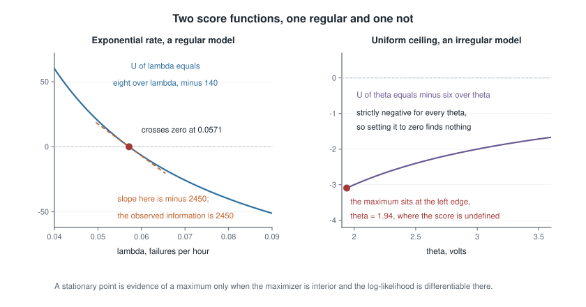
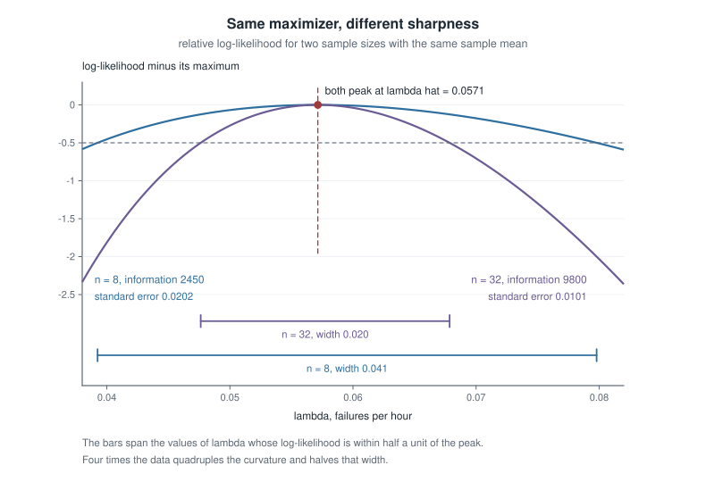
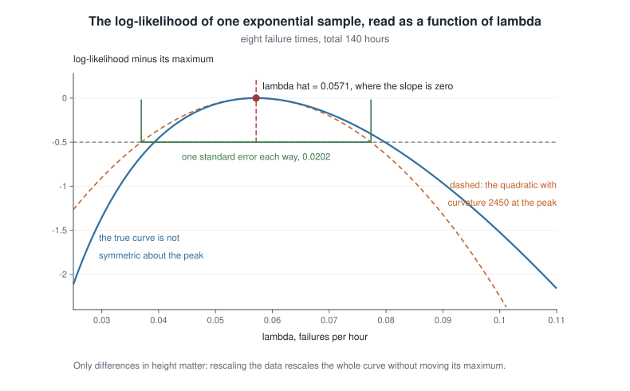
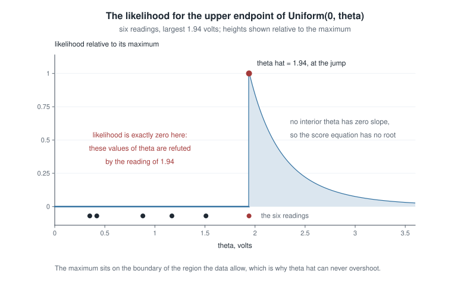

# Week 7 — Likelihood, score, Fisher information, and maximum likelihood

## Where this week starts

Week 6 gave you a way to manufacture estimators and a way to rank them: set population moments equal to sample moments and solve, then compare candidates on bias, variance and mean squared error. What it could not say is which estimator should have been proposed. Matching the first moment is one choice, matching the second another, and they can disagree. For Uniform($0, \theta$) the estimator $2\bar{X}$ can even return a number smaller than a value you already recorded — a construction that never consulted the model.

This week installs the missing generator, by one change of viewpoint. Until now you read a density left to right: fix $\theta$, and $f(x \mid \theta)$ says which data are probable. Read it right to left — fix the data you recorded, let $\theta$ move — and the same formula becomes the likelihood function, ranking parameter values by how well each would have anticipated the data in hand. Everything after that is calculus on one function: its derivative is the score, the expected squared score is the Fisher information, and the sharpness of the top is what a standard error is made of.

Every clean statement about score and information is bought by interchanging a derivative and an integral, and that is licensed only under conditions some ordinary models violate. So the page runs two tracks. On the regular one the machinery finds a stationary point and hands you a standard error. On the irregular one — Uniform($0, \theta$), whose support moves with the parameter — it reports a stationary point that does not exist, an information that is negative, and a maximizer on a boundary no derivative would find.

By Thursday you should be able to take an unfamiliar one-parameter family, write $\ell(\theta)$, differentiate it, decide whether the score equation is the right tool at all, and when it is, deliver an estimate with a curvature-based standard error.

### Why this matters downstream

A laboratory models a sensor's readings as uniform on $(0, \theta)$ and asks for the full-scale value. An analyst trained on score equations differentiates, finds no root, decides likelihood has failed, and falls back on $2\bar{X}$. That estimator does not know it must exceed every observation, so on some samples it returns a ceiling below a reading already in the notebook — an estimate the data refute. The likelihood assigns zero to every $\theta$ the data have ruled out, so it cannot make that mistake.

The second stake is structural. Sufficiency in Week 10 is read off the shape of the likelihood. The Cramer-Rao bound in Week 12 says that any *unbiased* estimator has variance at least $1/(nI_1(\theta))$ — the restriction to unbiased estimators is doing real work, since the constant estimator $\hat\theta \equiv 0$ has variance zero and would otherwise be a counterexample — and both that bound and the asymptotic normality of $\hat\theta$ need the regularity conditions below. Week 13's likelihood-ratio interval is a horizontal cut through the curves below, and Week 9's Bayes theorem multiplies this likelihood by a prior. A student who leaves believing the likelihood is a probability distribution over $\theta$ misreads all four.

## What you will be able to do

- Write the likelihood and log-likelihood for an independent sample, and say why the data are constants and the parameter the variable.
- Derive the score $U(\theta)$, verify that it has mean zero, and name which regularity condition fails when it does not.
- Compute Fisher information as the variance of the score and as minus the expected second derivative, using their agreement as a check.
- Solve a score equation, confirm the second-order condition, and say whether the maximum is interior, on a boundary, or not unique.
- Move an estimate between parameterizations by invariance, and attach a standard error from observed information.
- Diagnose a likelihood the routine cannot handle — boundary, ridge, kink, several modes, unbounded — and name the assumption responsible.

## Words worth owning

| Term | What it means in this course |
|------|------------------------------|
| Likelihood $L(\theta)$ | The sample's joint density or mass function, read as a function of $\theta$ with the data fixed, and defined only up to a positive factor free of $\theta$. |
| Log-likelihood $\ell(\theta)$ | $\log L(\theta)$: same maximizer, additive over independent observations, and the object you differentiate. |
| Score $U(\theta)$ | The derivative $\partial \ell / \partial \theta$: a function of the data *and* of $\theta$, so not a statistic. |
| Score equation | The condition $U(\theta) = 0$, whose roots are candidate maximizers when $\ell$ is differentiable and the maximum interior. |
| Fisher information $I_1(\theta)$ | One observation's score variance, equal to $-\mathbb{E}[\partial^2 \log f / \partial\theta^2]$ under regularity. Additive: $I_n(\theta) = nI_1(\theta)$. |
| Observed information $J(\hat\theta)$ | $-\ell''$ at the maximizer: computed from your data, unlike the expectation $I_n(\theta)$. |
| Regularity conditions | Fixed support, interior parameter, smoothness, a licensed interchange of derivative and integral, and information that is finite and positive. |
| Invariance | The maximizer of the likelihood for $g(\theta)$ is $g(\hat\theta)$, so estimates transport across parameterizations. |

## The likelihood function and the score

Let $X_1, \dots, X_n$ be independent draws from a common density or mass function $f(x \mid \theta)$, with $\theta$ ranging over a parameter space $\Theta \subseteq \mathbb{R}$, and let $x = (x_1, \dots, x_n)$ be the numbers you observed. One model, one unknown number, $n$ observations the model treats as unrelated once $\theta$ is fixed. The likelihood is that joint density read as a function of the parameter:

$$L(\theta) = \prod_{i=1}^{n} f(x_i \mid \theta), \qquad \ell(\theta) = \log L(\theta) = \sum_{i=1}^{n} \log f(x_i \mid \theta).$$

Nothing new has been computed; what changed is which symbol is free. Before this week $\theta$ was a fixed unknown and $x$ ranged over the sample space. From here on $x$ is a list of recorded numbers and $\theta$ is the variable.

### Reading the likelihood as a function of the parameter

Two properties follow before any calculus. First, $L$ is defined only up to a positive constant free of $\theta$: $L$ and $cL$ rank parameter values identically, so the maximizer, the curvature there, and every ratio are unchanged. This is why binomial and Bernoulli data support the same inference about $p$ despite the combinatorial factor.

Second, for continuous data the *value* of $L$ means nothing alone: it is a product of $n$ densities, so recording times in minutes rather than hours rescales every value at once. What survives is the shape — where the function peaks, how sharply, and how far below the peak a rival value sits. Read likelihood curves as landscapes, never as heights above sea level. Logarithms are then not cosmetic: a product of $n$ small numbers underflows to zero in floating-point arithmetic while a sum of logarithms does not, and $\log$ is strictly increasing, so the maximizers are unchanged.

### The score and the two faces of information

Assume here that $f(x \mid \theta)$ is differentiable in $\theta$ and that the conditions listed next hold. The score is the derivative of the log-likelihood,

$$U(\theta) = \frac{\partial \ell(\theta)}{\partial \theta} = \sum_{i=1}^{n} \frac{\partial}{\partial\theta} \log f(X_i \mid \theta) = \sum_{i=1}^{n} \frac{\partial_\theta f(X_i \mid \theta)}{f(X_i \mid \theta)},$$

with $\partial_\theta$ abbreviating $\partial / \partial\theta$. The capital letters matter: to study the score's distribution we treat the observations as random again. Write $u(\theta; X) = \partial_\theta \log f(X \mid \theta)$ for one observation's contribution. The first structural fact is that the score is centred at the true parameter value:

$$\mathbb{E}_\theta[u(\theta; X)] = \int \frac{\partial_\theta f(x \mid \theta)}{f(x \mid \theta)} f(x \mid \theta)\, dx = \int \partial_\theta f(x \mid \theta)\, dx = \frac{\partial}{\partial\theta} \int f(x \mid \theta)\, dx = \frac{\partial}{\partial\theta} 1 = 0.$$

Notice where the work sits. The second equality is cancellation; the third interchanges $\partial_\theta$ with $\int$ and is the only step that can fail; the fourth uses the fact that a density integrates to one *for every* $\theta$, so its derivative is that of a constant. Summing, $\mathbb{E}_\theta[U(\theta)] = 0$.

A mean-zero variable has variance equal to its second moment, so define $I_1(\theta) = \operatorname{Var}_\theta\{u(\theta; X)\} = \mathbb{E}_\theta[u(\theta; X)^2]$. Differentiating the centring identity $\int u(\theta; x) f(x \mid \theta)\, dx = 0$ once more in $\theta$, again moving the derivative inside,

$$\int \left( \frac{\partial^2}{\partial\theta^2} \log f(x \mid \theta) \right) f(x \mid \theta)\, dx + \int \left( \frac{\partial}{\partial\theta} \log f(x \mid \theta) \right) \partial_\theta f(x \mid \theta)\, dx = 0.$$

In the second integral substitute $\partial_\theta f = (\partial_\theta \log f) f$, the earlier cancellation run backwards. The terms become $\mathbb{E}_\theta[\partial_\theta^2 \log f(X \mid \theta)]$ and $\mathbb{E}_\theta[u(\theta; X)^2]$, so

$$I_1(\theta) = -\mathbb{E}_\theta\left[ \frac{\partial^2}{\partial\theta^2} \log f(X \mid \theta) \right].$$

The two expressions look nothing alike — a second moment of a first derivative on one side, an average curvature on the other — and their agreement is a real constraint that regularity purchases. Independent observations contribute independent mean-zero scores, so variances add and $I_n(\theta) = n I_1(\theta)$: information is linear in the amount of data, which is where every $\sqrt{n}$ in this course comes from. Computing $I_1(\theta)$ both ways then checks your algebra for free.

::: {.callout-note}
**Audit habit — check the support before trusting the formula.** Every identity above came from moving $\partial_\theta$ through an integral sign. Before using one, ask whether the set where $f(x \mid \theta) > 0$ moves when $\theta$ moves. If it does, stop: the interchange is not licensed and the identities can fail together, silently.
:::

### Where the regularity conditions bite

The standard conditions for a one-parameter family:

1. **Common support.** The set $\{x : f(x \mid \theta) > 0\}$ is the same for every $\theta \in \Theta$.
2. **Interior parameter.** The true $\theta$ lies in the interior of $\Theta$, not on its edge.
3. **Smoothness.** $\theta \mapsto f(x \mid \theta)$ is twice continuously differentiable for each $x$ in the support.
4. **Licensed interchange.** Differentiation under the integral sign is valid for $\int f$ and $\int \partial_\theta f$, which in practice means exhibiting an integrable envelope for the derivatives near $\theta$.
5. **Identifiability.** Distinct parameter values give distinct distributions — Week 1's condition, constraining the model rather than the calculus. Read the implication in one direction only: if identifiability fails, some flat ridge runs through the likelihood for *every* sample, because two parameter values with the same distribution give the same $L$. The converse is false. Uniform($\theta, \theta+1$) is identifiable, yet $L(\theta) = 1$ for every $\theta$ between $x_{(n)} - 1$ and $x_{(1)}$ and zero outside, a genuinely flat top with no unique maximizer. Identifiability rules out a ridge forced by the model, not a ridge produced by a particular sample.
6. **Finite, positive information.** $0 < I_1(\theta) < \infty$ for every $\theta \in \Theta$, so that the score has a finite second moment and $1/I_1(\theta)$ is a defined quantity. It is the condition most often left implicit, and everything numerical here needs it: conditions one through five do not by themselves make $\operatorname{Var}_\theta\{u(\theta; X)\}$ finite, and an $I_1$ that is zero or infinite empties $I_n = nI_1$, the standard error $1/\sqrt{J(\hat\theta)}$ and the Week 12 bound alike.

Now break them. Let $f(x \mid \theta) = 1/\theta$ for $0 \le x \le \theta$ and zero otherwise, with $\theta > 0$; the support grows with $\theta$, so condition one fails. Push the formulas through anyway. On the support $\log f = -\log\theta$, so $\partial_\theta \log f = -1/\theta$ and $\partial_\theta^2 \log f = 1/\theta^2$. Centring gives $\mathbb{E}[-1/\theta] = -1/\theta$, not zero. The variance route gives $\operatorname{Var}(-1/\theta) = 0$, since a constant has no variance. The curvature route gives $-\mathbb{E}[1/\theta^2] = -1/\theta^2$, which is negative — and a variance is never negative. Three routes, three incompatible numbers, one impossible. Two of them fail condition six on their face as well: a zero information and a negative one both sit outside $(0, \infty)$, which is the diagnostic to notice first. Nothing was mistyped: a derivative cannot be moved through an integral whose limits depend on $\theta$, and the boundary term a correct Leibniz rule would supply has been discarded.

{fig-alt="Left panel: a falling score line crossing zero at 0.0571 with a dashed tangent of slope minus 2450. Right panel: a score curve for the uniform model that stays below zero everywhere, so it never crosses."}

The figure puts both cases at the level of the score. On the left the exponential score falls through zero at one point with tangent slope $-2450$, which is minus the observed information; a steep crossing means only a narrow band of parameter values is compatible with the data. On the right the uniform score is $-n/\theta$ — here $-6/\theta$, for the six readings of the second worked example — strictly negative for every admissible $\theta$, and never zero. Setting it to zero finds nothing — not because no maximum exists, but because the maximum sits at the left edge of the admissible region, where $\ell$ is not differentiable. Solving a score equation is a technique for finding a maximum, and confusing the technique with the goal is this week's most expensive mistake.

## Maximum likelihood as a working procedure

The maximum likelihood estimate is any $\hat\theta$ with $L(\hat\theta) \ge L(\theta)$ for all $\theta \in \Theta$. One word carries weight: *any*, because a maximizer need not be unique. And notice what the definition does not mention. Differentiation is a tool for finding maximizers of smooth functions, not part of what a maximizer is.

### From the score equation to a verified maximum

The routine has four steps, and the last two are the ones students skip. **One, write $\ell(\theta)$** and drop additive constants free of $\theta$. **Two, differentiate and solve** $U(\theta) = 0$. **Three, verify** that a root is a maximum: check $\ell''(\hat\theta) < 0$, or better, show $\ell$ is concave on all of $\Theta$, which upgrades a local claim to a global one at no cost. **Four, check the edges**, since a continuous function on an interval can be maximized at an endpoint where no derivative vanishes. Skipping the third step is how a student reports a minimum; skipping the fourth is how a student concludes that no estimate exists for a Bernoulli sample of all failures, where $\hat p = 0$ sits on the boundary of $[0,1]$.

The routine breaks in four recognizable ways.

- **Boundary maximum.** The maximizer sits where no derivative vanishes: on the edge of $\Theta$ for a Bernoulli sample with zero or $n$ successes, or at the edge of the region the data allow for Uniform($0, \theta$).
- **Flat ridge.** The model is not identifiable. Observe only $Y \sim N(\alpha + \beta, 1)$ and $\ell$ depends on $(\alpha, \beta)$ through the sum alone, so every point of the line $\alpha + \beta = y$ maximizes it. An optimizer will not say so; it returns wherever it stopped.
- **Several modes.** A Cauchy location parameter or a two-component mixture can give several local maxima, and an optimizer started in the wrong basin converges confidently to the wrong number.
- **Kinked or unbounded.** For a Laplace location model $\ell(\theta) = -\sum_i \lvert x_i - \theta \rvert / b$ plus a constant is kinked at every observation and maximized at a sample median, which no derivative locates. For a normal mixture with free variances the likelihood is unbounded: put one mean at $x_1$ and shrink that component's variance.

### Invariance and the standard error from curvature

Suppose you want $\eta = g(\theta)$ — a mean instead of a rate, odds instead of a probability. Invariance says $\hat\eta = g(\hat\theta)$, with no new maximization. For one-to-one $g$ this is a relabelling: the two maximizations rank the same distributions. For general $g$ the device is the induced likelihood $L^{*}(\eta) = \sup\{L(\theta) : g(\theta) = \eta\}$, maximized at $g(\hat\theta)$ by construction. What invariance does *not* transport is unbiasedness: if $\bar{X}$ is unbiased for $\mu$ then $1/\bar{X}$ is not unbiased for $1/\mu$, since expectation does not commute with a nonlinear function.

For uncertainty, keep two quantities apart. **Observed information** is $J(\theta) = -\ell''(\theta)$, computed from your data; at the maximizer it is a number, $J(\hat\theta)$. **Expected information** is $I_n(\theta) = \mathbb{E}_\theta[J(\theta)] = n I_1(\theta)$, a function of the unknown $\theta$. The standard error in near-universal use is

$$\widehat{\operatorname{se}}(\hat\theta) = \frac{1}{\sqrt{J(\hat\theta)}}.$$

Why curvature governs uncertainty is visible before any theorem: a sharp peak leaves only a narrow band of well-supported parameter values, a flat one a wide band. The theorem turning that into a coverage statement is the asymptotic normality of $\hat\theta$, which belongs to Week 12; until then the formula is a convention with a proof pending, and an $n \to \infty$ argument used at whatever $n$ you have.

{fig-alt="Two humps peaking at the same value 0.0571; the n equals 32 curve is far sharper than the n equals 8 curve, and bars below show the half-unit width shrinking from 0.041 to 0.020."}

Both curves come from exponential data with the same sample mean, so both peak at $\hat\lambda = 0.0571$; only the sample size differs. At $n = 8$ the observed information is $2450$ and the standard error $0.0202$; at $n = 32$ they are $9800$ and $0.0101$. Four times the data quadruples the curvature, and since the standard error is one over its square root, the error halves. The bars beneath measure the same thing without any normal approximation: they span the parameter values within half a log-likelihood unit of the peak, and that width falls from $0.041$ to $0.020$ — each close to twice the standard error, because a quadratic that has dropped by one half has moved one standard error from its peak.

### Maximizing numerically when no closed form exists

Most real likelihoods have no closed-form maximizer, so maximize numerically and then check. Minimize the negative log-likelihood rather than maximizing the likelihood, which avoids underflow and suits the standard optimizers, and always recover the curvature at the reported maximizer, since an optimizer that stops early reports a location with no warning attached.

```
# eight recorded failure times, in hours
x <- c(12.4, 5.1, 30.7, 8.9, 21.3, 3.6, 15.5, 42.5)

negll <- function(rate) -sum(dexp(x, rate = rate, log = TRUE))

fit <- optimize(negll, interval = c(1e-4, 1))
fit$minimum        # 0.05714 -- the numerical maximizer of the log-likelihood
1 / mean(x)        # 0.05714 -- the closed form, for comparison

# curvature at the maximizer, by a symmetric second difference
h    <- 1e-4
lhat <- fit$minimum
Jobs <- (negll(lhat + h) - 2 * negll(lhat) + negll(lhat - h)) / h^2
Jobs               # about 2450, matching n / lhat^2
1 / sqrt(Jobs)     # about 0.0202, the estimated standard error
```

That is three independent confirmations of one number: the optimizer's stopping point, the algebraic formula, and a numerical second difference matching $n/\hat\lambda^2$. Where the algebra is unavailable the other two still are, and a mismatch signals that the optimizer stopped somewhere that is not a stationary point. A simulation adds a fourth check: refit many samples drawn from the fitted model and compare the spread of the estimates with what the curvature predicted. At $n = 8$ that spread runs wider than $0.0202$ and the estimates skew right.

## Worked example — the exponential rate from failure times

**Setting.** A reliability laboratory runs eight nominally identical components to failure and records the hours:

$$12.4, \quad 5.1, \quad 30.7, \quad 8.9, \quad 21.3, \quad 3.6, \quad 15.5, \quad 42.5.$$

Model these as independent exponential with rate $\lambda > 0$, so $f(x \mid \lambda) = \lambda e^{-\lambda x}$ for $x > 0$. The total is $\sum_i x_i = 140.0$ hours and $\bar{x} = 17.5$ hours.

**Step one — the likelihood.** The support $(0, \infty)$ does not move with $\lambda$, so the regularity conditions hold. Multiplying densities,

$$L(\lambda) = \prod_{i=1}^{n} \lambda e^{-\lambda x_i} = \lambda^{n} \exp\left(-\lambda \sum_{i=1}^{n} x_i\right), \qquad \ell(\lambda) = n \log \lambda - \lambda \sum_{i=1}^{n} x_i.$$

The data enter only through $n$ and the total — a sufficiency statement hiding in plain sight, which Week 10 makes official.

**Step two — the score.** $U(\lambda) = n/\lambda - \sum_i x_i$. As a check, one observation contributes $u(\lambda; X) = 1/\lambda - X$, whose mean is $1/\lambda - \mathbb{E}[X] = 1/\lambda - 1/\lambda = 0$, as centring requires.

**Step three — the root.** Setting $n/\lambda = \sum_i x_i$ and solving,

$$\hat\lambda = \frac{n}{\sum_{i} x_i} = \frac{1}{\bar{x}} = \frac{8}{140} = 0.05714 \text{ per hour}.$$

**Step four — verify a maximum.** $\ell''(\lambda) = -n/\lambda^2 < 0$ for every $\lambda > 0$, so $\ell$ is strictly concave and this stationary point is the unique global maximizer; $\ell \to -\infty$ at both ends, so no boundary case competes.

**Step five — information, computed twice.** From the second derivative, $\partial_\lambda^2 \log f(x \mid \lambda) = -1/\lambda^2$, a constant, so $I_1(\lambda) = 1/\lambda^2$. From the variance of the score, $\operatorname{Var}(1/\lambda - X) = \operatorname{Var}(X) = 1/\lambda^2$. They agree, and $I_n(\lambda) = n/\lambda^2$.

**Step six — observed information and a standard error.** Here $J(\lambda) = n/\lambda^2$, so

$$J(\hat\lambda) = \frac{8}{(0.05714)^2} = 8 \times 306.25 = 2450, \qquad \widehat{\operatorname{se}}(\hat\lambda) = \frac{1}{\sqrt{2450}} = 0.0202 \text{ per hour}.$$

Equivalently $\hat\lambda/\sqrt{n} = 0.05714/2.8284 = 0.0202$, which displays the $n^{-1/2}$ rate. Note that $J(\hat\lambda) = I_n(\hat\lambda)$ here. That is not general; it holds because this is a one-parameter exponential family, where the data-dependent part of $\ell''$ is multiplied by the score and so vanishes at $\hat\lambda$.

{fig-alt="A smooth hump peaking at lambda equal to 0.0571, with a dashed parabola of curvature 2450 fitted at the peak and a bar marking one standard error, 0.0202, on each side of the maximum."}

The figure draws this log-likelihood shifted so its maximum is zero. The dashed parabola has the same peak and the same curvature $2450$, and the marked band of one standard error either side is where that parabola has dropped by one half. The true curve is visibly asymmetric: step the same distance $0.02$ to each side of the peak and it has fallen by $0.65$ on the left but only $0.40$ on the right. A symmetric interval built from the quadratic is therefore already imperfect at $n = 8$, and Week 13 builds one that respects the asymmetry.

**Step seven — invariance.** The laboratory wants a mean lifetime $\mu = 1/\lambda$. Since $g(\lambda) = 1/\lambda$ is one-to-one on $(0, \infty)$, $\hat\mu = 1/\hat\lambda = \bar{x} = 17.5$ hours with no further work, and the Week 5 delta method gives $\widehat{\operatorname{se}}(\hat\mu) \approx \hat\mu/\sqrt{n} = 6.19$ hours.

**Step eight — critique.** First, $\hat\lambda$ is biased: $\sum_i X_i$ is gamma with shape $n$ and rate $\lambda$, and $\mathbb{E}[1/\sum_i X_i] = \lambda/(n-1)$, so $\mathbb{E}[\hat\lambda] = n\lambda/(n-1) = 8\lambda/7$, about fourteen percent high here, while $\hat\mu = \bar{X}$ is exactly unbiased — invariance moved the estimate but not the unbiasedness. Second, the model assumed a constant hazard and complete observation. Had two components still been running when the study ended at $50$ hours, each would contribute $\mathbb{P}(X > 50) = e^{-50\lambda}$ rather than a density, changing the score and the maximizer, and treating them as failures at the censoring time would bias $\hat\lambda$ upward.

### The same reasoning, transferred

Run the identical steps on a Bernoulli model. A germination trial sows $n = 40$ seeds and $s = 26$ sprout. Let the $X_i$ be independent Bernoulli($p$) with $f(x \mid p) = p^{x}(1-p)^{1-x}$ for $x \in \{0, 1\}$, and take the parameter space to be the closed interval $\Theta = [0,1]$. Declaring it closed is deliberate. On the open interval $(0,1)$ a sample of all failures has $L(p) = (1-p)^{n}$, whose supremum $1$ is approached as $p$ decreases toward zero but never attained, so no maximizer exists at all — a genuine but different pathology, and not the one this example is here to show. On $[0,1]$ the maximizer is attained, and what goes wrong at an all-failure or all-success sample is that it lands on the edge of $\Theta$, where a first-order condition carries no force. For $0 < p < 1$ the log-likelihood is $\ell(p) = s\log p + (n-s)\log(1-p)$, and the score is

$$U(p) = \frac{s}{p} - \frac{n - s}{1 - p},$$

and setting it to zero gives $s(1-p) = (n-s)p$, hence $\hat p = s/n = 26/40 = 0.65$. Since $\ell''(p) = -s/p^2 - (n-s)/(1-p)^2 < 0$ whenever $0 < s < n$, and $L$ vanishes at both endpoints of $[0,1]$, that root is the unique maximizer. For the information, $\partial_p^2 \log f = -x/p^2 - (1-x)/(1-p)^2$, and with $\mathbb{E}[X] = p$,

$$I_1(p) = \frac{p}{p^2} + \frac{1-p}{(1-p)^2} = \frac{1}{p} + \frac{1}{1-p} = \frac{1}{p(1-p)}.$$

So $J(\hat p) = n/\{\hat p(1-\hat p)\} = 40/0.2275 = 175.8$ and $\widehat{\operatorname{se}}(\hat p) = 1/\sqrt{175.8} = 0.0754$, the familiar $\sqrt{\hat p(1-\hat p)/n}$ in disguise. Invariance transports the estimate to the odds, $0.65/0.35 = 1.857$, and the log-odds, $\log(1.857) = 0.619$. What stayed the same: fix the data, differentiate, solve, verify concavity, read the curvature, transport by invariance. What changed: the parameter lives in a bounded interval and $I_1(p)$ blows up as $p$ nears zero or one, so condition six fails at the two endpoints of $\Theta$. What breaks: at $s = 0$ or $s = n$ the estimate $\hat p = s/n$ is attained at an endpoint of $[0,1]$, where $\ell$ is maximized with no derivative vanishing — the score there is $-n$ or $+n$, not zero — so the score equation has no root. That is the next example in miniature.

## Second worked example — the uniform upper endpoint, where the score equation fails

**Setting.** A sensor's output is modelled as uniform on $[0, \theta]$, with $\theta$ an unknown full-scale value in volts. Six independent readings:

$$0.35, \quad 0.42, \quad 0.88, \quad 1.17, \quad 1.51, \quad 1.94.$$

Every step behaves differently from the previous example, and every difference traces to one violated condition.

**Step one — the likelihood.** With $f(x \mid \theta) = \theta^{-1}$ for $0 \le x \le \theta$ and zero otherwise, writing $x_{(n)} = \max_i x_i$,

$$L(\theta) = \prod_{i=1}^{n} \frac{1}{\theta}\mathbf{1}\{0 \le x_i \le \theta\} = \theta^{-n}\, \mathbf{1}\{\theta \ge x_{(n)}\},$$

since all $n$ constraints $\theta \ge x_i$ hold precisely when the largest does. Here $n = 6$ and $x_{(n)} = 1.94$.

**Step two — the score, where it exists.** For $\theta > x_{(n)}$, $\ell(\theta) = -n\log\theta$ and $U(\theta) = -n/\theta$, strictly negative and never zero. For $\theta < x_{(n)}$ the likelihood is exactly zero. At $\theta = x_{(n)}$ the function jumps and no derivative exists.

**Step three — maximize by inspection.** On the admissible region $\theta \ge x_{(n)}$, $\theta^{-n}$ is strictly decreasing, so it is largest at the smallest admissible value:

$$\hat\theta = x_{(n)} = 1.94 \text{ volts}.$$

No calculus was used, and none could have been. The maximum is real, unique, and attained.

{fig-alt="A likelihood flat at zero until theta reaches 1.94, where it jumps to its maximum and then falls away smoothly; the six readings are marked below the axis with the largest highlighted."}

To the left of $1.94$ the likelihood is not small, it is exactly zero: a uniform on $[0, \theta]$ with $\theta < 1.94$ gives no probability at all to the reading that was observed, so those parameter values are refuted rather than disfavoured. At $1.94$ the curve jumps to its maximum and then decays like $\theta^{-6}$, because a larger ceiling spreads the same probability over a wider interval. The maximizer sits at a corner of the admissible region, which no first-order condition can detect.

**Step four — name the failed condition.** Common support. Since $[0, \theta]$ depends on $\theta$, the interchange is illegal, and the three information routes give three contradictory values, one of them a negative variance. That is not a subtlety hiding in an epsilon; it is a wrong sign visible in one line.

**Step five — get the exact sampling behaviour, since the usual $\sqrt{n}$ asymptotics do not apply.** For $0 \le t \le \theta$ all $n$ observations fall below $t$ independently, so

$$\mathbb{P}(X_{(n)} \le t) = \left(\frac{t}{\theta}\right)^{n}, \qquad f_{X_{(n)}}(t) = \frac{n t^{n-1}}{\theta^{n}}.$$

Integrating gives $\mathbb{E}[X_{(n)}] = n\theta/(n+1)$ and $\mathbb{E}[X_{(n)}^2] = n\theta^2/(n+2)$, so the bias is $-\theta/(n+1)$ and

$$\operatorname{Var}(X_{(n)}) = \frac{n\theta^{2}}{n+2} - \frac{n^{2}\theta^{2}}{(n+1)^{2}} = \frac{n\theta^{2}}{(n+2)(n+1)^{2}}.$$

At $n = 6$ the bias is $-\theta/7 \approx -0.143\theta$, the variance is $6\theta^2/392 = 0.0153\theta^2$, and the mean squared error is $\theta^2/49 + 0.0153\theta^2 = 0.0357\theta^2$, matching the compact form $2\theta^2/\{(n+1)(n+2)\} = 2\theta^2/56$. The estimate can never exceed the truth, so the boundary shows up as systematic downward bias.

**Step six — correct the bias and compare.** The rescaled $\tilde\theta = \frac{n+1}{n}X_{(n)}$ is exactly unbiased, here $\frac{7}{6}(1.94) = 2.263$ volts, with mean squared error $\theta^2/\{n(n+2)\} = \theta^2/48 = 0.0208\theta^2$ against $0.0357\theta^2$ for the maximum likelihood estimate — a ratio of $2n/(n+1) = 12/7 \approx 1.71$ favouring the correction, exactly the Week 6 comparison again.

**What this buys.** Notice the rate: the standard deviation of $X_{(n)}$ is of order $1/n$, not $1/\sqrt{n}$, so quadrupling the sample shrinks the uncertainty fourfold. Make the comparison with the unbiased $\tilde\theta$ rather than with $X_{(n)}$, since the Cramer-Rao bound constrains unbiased estimators only and $X_{(n)}$ is biased by step five. Its variance is $\theta^2/\{n(n+2)\}$, of order $n^{-2}$, while in a regular model no unbiased estimator can have variance below $1/(nI_1(\theta))$, of order $n^{-1}$. So $\tilde\theta$ is what genuinely escapes the bound, and it escapes because regularity fails and the bound does not apply at all.

What has *not* happened is the disappearance of asymptotic theory; only its scaling changes. Take $n$ rather than $\sqrt{n}$ as the multiplier: for $0 \le t \le n$,

$$\mathbb{P}\left\{ \frac{n(\theta - X_{(n)})}{\theta} > t \right\} = \mathbb{P}\{X_{(n)} < \theta(1 - t/n)\} = \left(1 - \frac{t}{n}\right)^{n},$$

using the step-five formula $\mathbb{P}(X_{(n)} \le a) = (a/\theta)^{n}$ at $a = \theta(1 - t/n)$. That last expression tends to $e^{-t}$ as $n \to \infty$, so $n(\theta - X_{(n)})/\theta$ converges in distribution to an Exp(1) variable. That is the canonical non-regular limit, and it is worth naming plainly: what fails here is the $\sqrt{n}$-and-normal machinery of Weeks 12 and 13, not asymptotics as such. The limit is exponential rather than normal, one-sided rather than symmetric, and approached at rate $1/n$ — the fourfold shrinkage noticed above, seen from the other end. Practice problem 2 walks the same road for the shifted exponential and reaches an exponential limit again. Since the exact distribution of $X_{(n)}$ is available in closed form, it stays the cleaner account at any finite $n$, and the limit says what that exact account settles down to.

## The misreading to avoid

**"The likelihood is the probability that $\theta$ is the true value."** Almost every student writes some version of this, usually while doing correct algebra. Three ways to dismantle it.

It is not normalized. Integrate the exponential likelihood from the first example over all admissible rates: $\int_0^\infty \lambda^{8} e^{-140\lambda}\, d\lambda = 8!/140^{9} \approx 2 \times 10^{-15}$. A function with that total mass is not a probability distribution over $\lambda$.

It is not even scale-stable. Record the same failure times in minutes: every $x_i$ multiplies by $60$, the rate divides by $60$, and the likelihood at corresponding parameter values multiplies by $60^{-8}$. The estimate and every likelihood ratio are unchanged, but the heights are not, so a "probability" read off a height would depend on the units in the notebook.

And the sentence describes an object this week has not built. The thing for which "the probability that $\theta$ lies in this set" is meaningful is a posterior, and getting one needs a prior: $\pi(\theta \mid x) \propto L(\theta)\,\pi(\theta)$. That is Week 9. On its own the likelihood licenses only comparisons: this parameter value made the observed data $k$ times more probable than that one.

**"A high likelihood value means a good model."** This survives the first correction and fails differently: likelihood values compare parameter values *within one family*, and nothing calibrates them across families with different parameter counts or data units. Nesting guarantees a wrong conclusion, since adding a parameter can never decrease the maximized likelihood, so picking the highest one always picks the most complicated model on offer. A likelihood is computed *given* the family and says nothing about whether the family was right; that needs residuals, predictive checks, and the Week 14 account of what an estimate converges to when the family is wrong.

**A smaller confusion.** Some students begin treating $U(\theta)$ as a statistic. It is a function of the parameter as well as the data, and at an interior maximizer it is zero by construction, so $U(\hat\theta)$ carries no information. The informative quantities are $U(\theta_0)$ at a hypothesized value and the slope of $U$ at $\hat\theta$, which is minus the observed information.

## Practice on your own

These are for self-checking, not submission. Attempt them with a pencil before running anything.

1. **Poisson, end to end.** For independent Poisson($\lambda$) observations, derive $\ell(\lambda)$, the score, the maximizer, and $I_1(\lambda)$ by both routes, confirming they agree. Then for $n = 15$ counts totalling $47$ events, report the estimate and a curvature-based standard error, and say what the units of $I_n(\lambda)$ are.
2. **Counterexample hunt.** Consider the shifted exponential $f(x \mid \theta) = e^{-(x - \theta)}$ for $x \ge \theta$. Which regularity condition fails? Show the maximizer is $X_{(1)}$, find the exact distribution of $X_{(1)} - \theta$, and compute the bias. Compare the rate at which it vanishes with the $n^{-1/2}$ behaviour of a regular model.
3. **Audit a plausible derivation.** A colleague writes: "For Uniform($0, \theta$) the information is $I_n(\theta) = -\mathbb{E}[\ell''(\theta)] = -n/\theta^2$, so the standard error of $\hat\theta$ is $\theta/\sqrt{n}$." Identify every wrong step, name the single assumption failure behind all of them, and say which feature of the reported information should have stopped the calculation at once.
4. **A simulation to describe.** Describe a study drawing $2000$ exponential samples of size $n = 8$ with $\lambda = 0.05$, computing $\hat\lambda$ each time, and comparing the average of the estimates with $8\lambda/7$ and their standard deviation with the curvature-based $\lambda/\sqrt{n}$. State in advance what you expect of each, then say what you would conclude if the average matched but the spread did not.
5. **A kink instead of a peak.** For the Laplace location model with density proportional to $e^{-\lvert x - \theta\rvert}$, show that maximizing $\ell$ means minimizing $\sum_i \lvert x_i - \theta\rvert$, and argue from a sketch that a sample median achieves it. Why does the score equation say nothing useful here, and how does that reason differ from the uniform's?

## Where to read more

- [MIT OpenCourseWare 18.655, Mathematical Statistics](https://ocw.mit.edu/courses/18-655-mathematical-statistics-spring-2016/) — lecture notes on likelihood, score and information, with the regularity conditions stated more formally.
- [MIT OpenCourseWare 18.650, Statistics for Applications](https://ocw.mit.edu/courses/18-650-statistics-for-applications-fall-2016/) — the maximum likelihood lectures, at a gentler pace and with more worked models.
- [Penn State STAT 414, Introduction to Probability Theory](https://online.stat.psu.edu/stat414/) — the distributional facts leaned on here: the gamma distribution of a sum of exponentials, and the distribution of a sample maximum.
- [The R Project](https://www.r-project.org/) — home of the software above; `optimize`, `optim` and `nlm` are all in the base distribution.
- Hogg, McKean and Craig's chapter on maximum likelihood methods covers this ground in the same order. It is optional.
- Course pages: the [resources index](../resources/index.qmd) and the [schedule](../schedule.qmd).

## Where this goes next

Week 8 is a synthesis unit whose work is method selection and verification: given an unfamiliar problem, deciding which tool from Weeks 1 through 7 applies, then checking the result four independent ways. The likelihood machinery sits at the centre of that chain, and the flawed derivation you will audit there is of the kind the uniform example illustrates. Read [Week 8](week-08.qmd) with the four-step routine and the four failure modes in mind, and revisit [Week 6](week-06.qmd) if the mean-squared-error comparison above felt unfamiliar.

Three threads start here. Week 10 reads sufficiency off the shape of $L(\theta)$; the exponential likelihood's dependence on the data only through $\sum_i x_i$ is the whole factorization theorem in that case. Week 12 supplies the theorem justifying the standard error this page used on faith, and states the Cramer-Rao bound in full, with the unbiasedness restriction that let the uniform's rescaled estimator slip past it. And Week 9 puts a prior in front of this likelihood to produce the posterior, for which "the probability that $\theta$ lies in this interval" is finally legitimate — the Bayesian connection this week has pointed at throughout. The [notes index](../index.qmd) has the full sequence.
