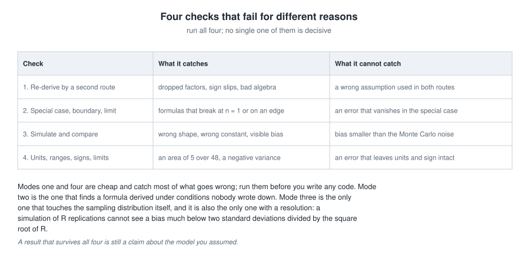
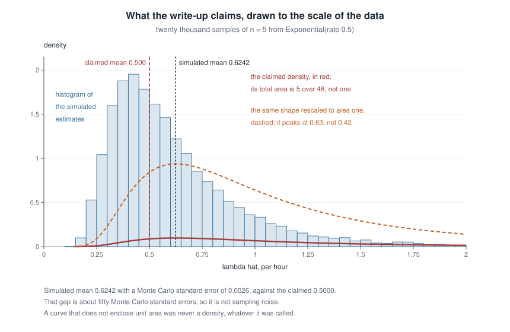
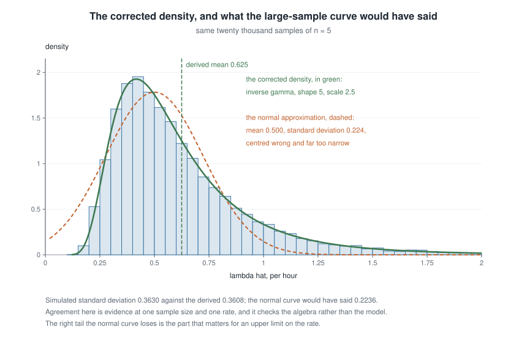

# Week 8 — Synthesis and likelihood computation

## Where this week starts

Seven weeks have handed you seven kinds of instrument: models and estimands; three routes from the distribution of the data to the distribution of a function of it; order statistics and exponential families; the exact normal-theory distributions and the pivot that inverts into an interval; convergence, the central limit theorem and the delta method; bias, variance and mean squared error as the language of comparison; and the likelihood, the score and Fisher information as an engine for building estimators.

Each arrived with its worked case attached, so the tool and the problem came together. A problem you meet outside this course arrives with no label: nobody tells you whether an exact distribution is available, whether the regularity conditions hold, or whether the quantity you were asked about is even identified. Choosing among seven tools is a skill, and not the same skill as operating any one of them.

That is the first half of this week: a fixed order of questions, answered in that order rather than by reaching for whichever tool you used most recently. The second half is knowing whether what came out is right — which takes checks that fail for *different reasons*, and advance knowledge of which errors each one is blind to.

By Thursday you should be able to take a two-parameter model you have not seen before, walk it through the chain, maximize its likelihood numerically, attach standard errors, and then subject the whole result to four independent audits — including one that a simulation, by construction, cannot perform.

### Why this matters downstream

A consultancy fits a lifetime model to five test units, reports an estimated failure rate with a standard error from a large-sample formula, and a warranty period is set from it. At that sample size the formula understates the true spread of the estimate by nearly forty percent and misses its bias entirely, so the warranty is priced from an interval far too narrow and centred in the wrong place. Nothing looks careless; every symbol is in the right place. The failure is that no step was checked by any means other than reading it again.

The second stake: from here on, more of the mathematics you meet will be *generated* — by a colleague under time pressure, by a template, by a machine. Generated mathematics is a candidate claim, not evidence, and what converts one into the other is an audit you can perform yourself. Weeks 9 through 15 all lean on this; each is a verification habit dressed as a topic.

## What you will be able to do

- Take an unfamiliar estimation problem through a fixed sequence of questions, naming which earlier week supplies the tool at each step.
- Separate an observed-data estimand from the scientific target, and state the assumption that would join them.
- Profile a two-parameter log-likelihood to one dimension, maximize it numerically, and read standard errors from the observed information matrix.
- Run four independent checks on an estimation result, and say what each can and cannot detect.
- Audit a written derivation line by line, locate the first failed step, and name the condition it violated.
- Compute the Monte Carlo standard error of a simulation and decide, before running it, whether it could detect the error you are hunting.

## Words worth owning

| Term | What it means in this course |
|------|------------------------------|
| Decision chain | The fixed order of questions asked before any estimator is proposed: model, estimand, identification, exactness, asymptotics, likelihood, posterior. |
| Profile log-likelihood | $\ell_p(\alpha) = \max_{\beta} \ell(\alpha, \beta)$: the two-parameter surface collapsed onto one coordinate by maximizing out the other. |
| Observed information matrix | Minus the matrix of second derivatives of $\ell$ at the maximizer; its inverse supplies variances and covariances of the estimates. |
| Verification mode | One of four checks that fail for independent reasons: re-derivation, a special case, a simulation, a check of units and ranges. |
| Monte Carlo standard error | The sampling standard deviation of a simulation summary, roughly $\mathrm{sd}/\sqrt{R}$ over $R$ replications. |
| Right number by a wrong route | A step whose conclusion is correct but whose justification is invalid. Numerical checks pass it; only re-derivation catches it. |
| Audit | Reading a derivation as an adversary: locating the first step that does not follow, and naming the assumption it needed. |
| Resolution of a check | The smallest error a check could have revealed. A check coarser than the error is not evidence of anything. |

## A decision chain for an unfamiliar problem

The chain is an order, not a menu: the questions cheapest to skip come first, and skipping them is what makes an analysis fail late and expensively.

### The seven questions, and the week each one comes from

**One: what is the model?** Name the family $\{P_\theta : \theta \in \Theta\}$ and, separately, the assumptions that make it a model rather than a wish — independence, a common distribution, a support, a parameter space. "Let $X_1, \dots, X_n$ be independent draws from $f(x \mid \theta)$" is a claim about the world, and you should be able to say what would falsify it. Week 1.

**Two: what is the estimand?** A function of the observed-data distribution, written before any estimator exists — and beside it, the scientific target somebody actually wanted, often a different object. The two are joined only by an assumption; if you cannot write that assumption down, report the observed-data estimand alone. Also Week 1.

**Three: is the estimand identified?** Do distinct parameter values give distinct distributions of the data? If not, no estimator and no sample size repairs it: the likelihood carries a flat ridge for every possible sample, and an optimizer reports a point on that ridge without complaint. Stop, and change the design or add an assumption. Still Week 1, and the step most often skipped.

**Four: is an exact distribution available?** Sometimes the sampling distribution of the natural statistic is known in closed form — a sum of $n$ independent exponentials at a common rate is gamma with shape $n$, $(n-1)S^2/\sigma^2$ is $\chi^2_{n-1}$ under normality, a sample maximum from Uniform($0, \theta$) has distribution function $(t/\theta)^n$. Take it when it is there: an exact pivot beats an approximation at every sample size and costs nothing extra. Weeks 2, 3 and 4.

**Five: if not, does an asymptotic argument apply?** The weak law, the central limit theorem, Slutsky's theorem and the delta method cover most of what is left, but every one is a statement about a limit. The operative question is never "does it hold as $n \to \infty$" but "how wrong is it at the $n$ I have", and the honest way to find out is to simulate. Week 5.

**Six: what does the likelihood give?** Write $\ell(\theta)$, check the regularity conditions *before* differentiating, then maximize. If the support moves with the parameter, or the maximizer sits on a boundary, the score equation is the wrong instrument: go back to step four for an exact argument. Week 7 supplies the score, the information and the maximizer; Week 6 supplies the moment estimates that start the search and the bias, variance and mean squared error criteria that judge what it returns.

**Seven: what would a posterior add?** A prior turns the likelihood into a distribution over $\theta$ for which the sentence "the probability that $\theta$ lies in this interval is $0.95$" is legitimate, and it supplies shrinkage when $n$ is small. That is Week 9, but the question belongs in the chain now, because deciding at the end that you wanted a posterior usually means redoing the modelling.

{fig-alt="Seven stacked boxes numbered one to seven, from what is the model down to what would a posterior add, each with a side note naming the exit it opens, and a return arrow from a verification box at the bottom back to the first question."}

### Where the chain branches, and where it stops

The side exits marked in the figure are the working part. Question three has no exit: a negative reply terminates the analysis rather than redirecting it, which is why it sits early. Question four exits *upward* in quality — if an exact distribution exists you leave the chain with something better than the later steps produce. Question six exits *backward*: a support that depends on $\theta$ sends you to step four, exactly the route Week 7 took for Uniform($0, \theta$), where the score equation has no root and the exact distribution of $X_{(n)}$ carries the analysis.

The return arrow matters too. The chain is not traversed once: a failed check at the end sends you back up, usually to a box where an assumption was stated and never tested. That is why the course's cycle is Model, Derive, Compute, Critique, Connect rather than Model, Derive, Compute, Publish.

## Verification as a working discipline

You have a formula. It might be wrong. Rereading it is nearly worthless, because rereading reproduces the reasoning that generated the error. What works is running checks whose failure modes do not overlap.

### Four checks that fail independently

**Mode one: re-derive by a second route.** Get to the same object a different way — a different parameterization, a different order of integration, a moment generating function instead of a Jacobian, or the two expressions for Fisher information from Week 7, which agree only if both are right. Routes that share no algebra are nearly independent.

**Mode two: check a special case, a boundary, or a limit.** Set $n = 1$. Set a shape parameter to the value that collapses the family to one you already know. Push a parameter to the edge of its space and see whether the formula stays finite and positive. A general result must reduce to every special case it contains, and this is the check that finds a formula silently derived under conditions nobody wrote down.

**Mode three: simulate and compare.** Draw many samples from the model at a known parameter value, recompute the statistic each time, and compare the empirical distribution with the analytic claim. This is the only mode that touches the sampling distribution rather than the algebra.

**Mode four: check units, ranges, signs, and limits.** Is a variance positive? Does a claimed density integrate to one? Does an estimate of a rate carry units of one over time? Does the variance decrease in $n$ and increase in the noise? Does the expression tend to the right thing as $n \to \infty$? The cheapest mode, and it catches an unreasonable share of real errors.

{fig-alt="A four-row table of verification modes — re-derive, special case, simulate, check units — with one column for what each catches and one for what each misses, and a note that a simulation cannot see a bias below its Monte Carlo noise."}

### What each check cannot see

The right-hand column of that figure is the part worth memorizing. Re-derivation is blind to a modelling assumption used in both routes: derive the variance of the sample mean twice under independence and both derivations are wrong together if the data are dependent. A special case is blind to any error that vanishes in that case — checking a two-parameter formula only where the two parameters are equal will not find a term proportional to their difference.

Simulation has a *resolution*, the fact students most often overlook. If you estimate the mean of an estimator from $R$ replications, your estimate carries a Monte Carlo standard error of about $\mathrm{sd}/\sqrt{R}$, and a bias much smaller than twice that is invisible: detecting a bias $b$ needs roughly $R \gtrsim (2\,\mathrm{sd}/b)^2$ replications. The misreading section below works that out in numbers, with the two further limits on what a simulation can see.

Mode four is blind to any error that preserves units and sign, which includes most wrong constants. And no mode catches a *right number reached by a wrong route*: every numerical check passes, and only re-derivation notices that the justification was invalid. That case is dangerous precisely because it stays invisible until the same invalid step is reused in a model where it does not happen to work.

::: {.callout-note}
**Audit habit — decide the resolution before you run.** Before starting a simulation, write down the size of the error you are hoping to see and the number of replications needed to see it. If the arithmetic says forty thousand and you were planning a thousand, the simulation is not a check; it is a reassurance.
:::

## Worked example — a two-parameter gamma taken end to end

**Setting.** A hydrology laboratory records the total depth, in millimetres, of each of twenty rainstorms at one gauge over a wet season:

$$8.1,\; 9.2,\; 9.3,\; 9.4,\; 9.8,\; 10.8,\; 14.6,\; 16.6,\; 17.6,\; 19.0,\; 20.1,\; 20.1,\; 20.3,\; 28.3,\; 29.7,\; 31.1,\; 34.4,\; 41.9,\; 49.4,\; 62.1.$$

The sum is $\sum_i x_i = 461.8$, so $\bar{x} = 23.09$ mm; the sum of the logarithms is $\sum_i \log x_i = 59.2318$, so the mean logarithm is $2.96159$ and the geometric mean is $19.33$ mm.

**Step one — the model.** Take $X_1, \dots, X_n$ independent with the gamma density

$$f(x \mid \alpha, \beta) = \frac{\beta^{\alpha}}{\Gamma(\alpha)} x^{\alpha - 1} e^{-\beta x}, \qquad x > 0, \; \alpha > 0, \; \beta > 0,$$

with $\alpha$ a dimensionless shape and $\beta$ a rate in units of one over millimetres. The assumptions are that storms are exchangeable within the season, that depths are independent across storms, and that a two-parameter family suffices for the shape of the right tail. The third is the one a hydrologist would argue about.

**Step two — the estimand, and the target.** The observed-data estimand is the mean storm depth $\mu = \alpha/\beta$. The scientific target is the expected seasonal total, which is $\mu$ multiplied by the expected number of storms — a quantity this sample says nothing about, since the storm count was not modelled. That sentence is Week 1 applied here: report $\mu$, and name the extra model the target would need.

**Step three — identification.** The map $(\alpha, \beta) \mapsto (\alpha/\beta, \alpha/\beta^2)$ from parameters to the mean and variance is one-to-one on $(0,\infty)^2$: given $m = \alpha/\beta$ and $v = \alpha/\beta^2$, invert to $\beta = m/v$ and $\alpha = m^2/v$. A distribution determines its mean and variance, so distinct $(\alpha,\beta)$ give distinct laws and the model is identified. What would break that: had the gauge only recorded whether each storm exceeded $25$ mm, the data would carry a single number, $\mathbb{P}(X > 25)$, and two parameters cannot be recovered from one — the likelihood would be flat along a curve, and step three would stop the analysis.

**Step four — is an exact distribution available?** For $\alpha$ known, yes: $\sum_i X_i$ is gamma with shape $n\alpha$ and rate $\beta$, and exact inference for $\beta$ follows. With $\alpha$ unknown there is no closed-form sampling distribution for its maximizer, so the exact route closes and we move on.

**Step five — the likelihood, profiled.** The log-likelihood is

$$\ell(\alpha, \beta) = n\alpha \log \beta - n \log \Gamma(\alpha) + (\alpha - 1)\sum_{i=1}^{n} \log x_i - \beta \sum_{i=1}^{n} x_i.$$

The support $(0, \infty)$ does not move with either parameter and both parameters are interior, so the Week 7 conditions hold and differentiation is legal. Setting $\partial \ell / \partial \beta = n\alpha/\beta - \sum_i x_i$ to zero gives $\hat\beta = \alpha/\bar{x}$ for any fixed $\alpha$. Substituting that back collapses the surface to one dimension,

$$\ell_p(\alpha) = n\alpha \log \frac{\alpha}{\bar{x}} - n\log\Gamma(\alpha) + (\alpha - 1)\sum_{i=1}^{n}\log x_i - n\alpha,$$

and differentiating once in $\alpha$, with $\psi = \Gamma'/\Gamma$ the digamma function, the two terms in $n\alpha$ cancel and what is left is

$$\log \alpha - \psi(\alpha) = \log \bar{x} - \frac{1}{n}\sum_{i=1}^{n} \log x_i.$$

The right-hand side is the log of the arithmetic mean minus the log of the geometric mean, a nonnegative number by the arithmetic-geometric mean inequality, strictly positive unless every observation is equal. Here it equals $3.13940 - 2.96159 = 0.17781$. The left-hand side is strictly decreasing, because its derivative is $1/\alpha - \psi'(\alpha)$ and $\alpha\psi'(\alpha) > 1$ for every $\alpha > 0$; it runs from $+\infty$ down to $0$. A unique root therefore exists, and no elementary formula produces it.

**Step six — maximize numerically, twice.** Two independent routes, which is verification mode one built into the computation.

```
depth <- c(8.1,  9.2,  9.3,  9.4,  9.8, 10.8, 14.6, 16.6, 17.6, 19.0,
           20.1, 20.1, 20.3, 28.3, 29.7, 31.1, 34.4, 41.9, 49.4, 62.1)
n <- length(depth)

# route one: the profiled score equation, in one dimension
gap   <- log(mean(depth)) - mean(log(depth))          # 0.17781
prof  <- function(a) log(a) - digamma(a) - gap
alpha <- uniroot(prof, c(0.05, 500), tol = 1e-12)$root    # 2.96819
beta  <- alpha / mean(depth)                              # 0.128549

# route two: maximize both coordinates, started from the moment estimates
negll <- function(p) -sum(dgamma(depth, shape = p[1], rate = p[2], log = TRUE))
v     <- var(depth)
start <- c(mean(depth)^2 / v, mean(depth) / v)            # 2.4466, 0.10596
fit   <- optim(start, negll, hessian = TRUE)
fit$par                                                   # 2.9682, 0.12855
-fit$value                                                # -77.846

# standard errors from the observed information matrix
sqrt(diag(solve(fit$hessian)))                            # 0.891, 0.04204
```

Both routes give $\hat\alpha = 2.9682$ and $\hat\beta = 0.12855$ per millimetre. Route two starts from the Week 6 method-of-moments estimates $\tilde\alpha = \bar{x}^2/s^2 = 2.447$ and $\tilde\beta = \bar{x}/s^2 = 0.10596$ — respectable starting values, and visibly not the maximizers, because the two construction principles disagree as Week 6 promised. Had the routes differed in the third decimal, tighten the optimizer's tolerance before believing either.

**Step seven — uncertainty.** Differentiating twice gives $\partial^2\ell/\partial\alpha^2 = -n\psi'(\alpha)$, $\partial^2 \ell / \partial\alpha\,\partial\beta = n/\beta$ and $\partial^2\ell/\partial\beta^2 = -n\alpha/\beta^2$, none of which involve the data, so here the observed and expected information matrices coincide:

$$I_n(\alpha, \beta) = n \begin{pmatrix} \psi'(\alpha) & -1/\beta \\ -1/\beta & \alpha/\beta^2 \end{pmatrix}, \qquad I_n^{-1} = \frac{1}{n\{\alpha\psi'(\alpha) - 1\}} \begin{pmatrix} \alpha & \beta \\ \beta & \psi'(\alpha)\beta^2 \end{pmatrix}.$$

At the estimates, $\psi'(\hat\alpha) = 0.39990$ and $\hat\alpha\psi'(\hat\alpha) - 1 = 0.18697$, a positive number, so the matrix is positive definite and the inverse is legitimate. The standard errors are $\widehat{\operatorname{se}}(\hat\alpha) = 0.891$ and $\widehat{\operatorname{se}}(\hat\beta) = 0.04204$, with an estimated correlation of $0.918$ — the two estimates are almost collinear, which is why an optimizer travelling along that ridge converges slowly and why reporting either one alone is misleading.

**Step eight — the estimand, with its standard error.** By invariance $\hat\mu = \hat\alpha/\hat\beta$, and since $\hat\beta = \hat\alpha/\bar{x}$ this is exactly $\bar{x} = 23.09$ mm. The delta method with $g(\alpha,\beta) = \alpha/\beta$ and gradient $(1/\beta, -\alpha/\beta^2)$ gives

$$\operatorname{Var}(\hat\mu) \approx \frac{1}{n\{\alpha\psi'(\alpha) - 1\}}\left\{\frac{\alpha}{\beta^2} - \frac{2\alpha}{\beta^2} + \frac{\alpha^2\psi'(\alpha)}{\beta^2}\right\} = \frac{\alpha\{\alpha\psi'(\alpha) - 1\}}{n\beta^2\{\alpha\psi'(\alpha)-1\}} = \frac{\alpha}{n\beta^2}.$$

Every digamma term cancels, and what survives is $\operatorname{Var}(X)/n$ — the exact variance of a sample mean. That is not a coincidence to admire and move past; it is a hard check on the whole information calculation, since $\hat\mu$ *is* $\bar{x}$, whose variance was known without any of this machinery. Numerically $\widehat{\operatorname{se}}(\hat\mu) = \sqrt{2.9682/(20 \times 0.12855^2)} = 3.00$ mm.

**Step nine — audit the result.** Mode one is done: two maximization routes agreed, and the delta method reproduced an exactly known variance. For mode two, set $\alpha = 1$: the gamma collapses to the exponential, $\hat\beta = 1/\bar{x}$, and $I_n$ reduces to $n/\beta^2$, recovering Week 7 exactly. At the other boundary, if every depth were identical the right-hand side of the profile equation would be zero, no finite root would exist, and $\hat\alpha$ would diverge — correct behaviour for data with no spread. For mode four, $\hat\alpha$ is dimensionless, $\hat\beta$ is per millimetre and $\hat\mu$ is in millimetres; the fitted standard deviation $\sqrt{\hat\alpha}/\hat\beta = 13.40$ mm sits near the sample value $14.76$ mm, and the model-based $\widehat{\operatorname{se}}(\hat\mu) = 3.00$ mm sits near the model-free $s/\sqrt{n} = 3.30$ mm. Mode three remains outstanding: draw many samples of size twenty from Gamma($2.968, 0.1285$), refit each, and compare the spread of $\hat\alpha$ with $0.891$. Expect a right-skewed $\hat\alpha$ and a curvature-based standard error that is somewhat optimistic, because $0.891$ is an $n \to \infty$ quantity being used at twenty.

### The same reasoning, transferred

Now run the same four checks on a different model and a simpler claim, to see what passing looks like. Let $X_1, \dots, X_n$ be independent Exponential(rate $\lambda$), let $S = \sum_i X_i$, and consider the bias-corrected estimator $\tilde\lambda = (n-1)/S$. The claim to audit is that $\tilde\lambda$ is unbiased with $\operatorname{Var}(\tilde\lambda) = \lambda^2/(n-2)$.

*Mode one, two routes.* Directly, $S$ is gamma with shape $n$ and rate $\lambda$, so $\mathbb{E}[1/S] = \int_0^\infty s^{-1}\lambda^n s^{n-1}e^{-\lambda s}\,ds/\Gamma(n) = \lambda\Gamma(n-1)/\Gamma(n) = \lambda/(n-1)$, giving $\mathbb{E}[\tilde\lambda] = \lambda$. Alternatively, $\tilde\lambda = (1 - 1/n)\hat\lambda$ where $\hat\lambda = n/S$ is the Week 7 maximizer with $\mathbb{E}[\hat\lambda] = n\lambda/(n-1)$; multiplying gives $\lambda$ again. The same two routes on the second moment give $\mathbb{E}[1/S^2] = \lambda^2/\{(n-1)(n-2)\}$ and hence $\operatorname{Var}(\tilde\lambda) = \lambda^2/(n-2)$.

*Mode two, boundaries.* At $n = 2$ the variance formula returns $\lambda^2/0$, and indeed $\mathbb{E}[1/S^2]$ diverges there — the formula announces its own domain, $n \ge 3$. At $n = 1$ it returns $-\lambda^2$, a negative variance, shouting that it was never derived for that case. As $n \to \infty$ it tends to $\lambda^2/n$, the Week 12 information floor.

*Mode three, simulate.* Twenty thousand samples of size $n = 5$ at $\lambda = 0.5$ gave a mean of $0.4993$ with a Monte Carlo standard error of $0.0021$, against the claimed $0.5000$, and a standard deviation of $0.2904$ against the derived $\lambda/\sqrt{n-2} = 0.2887$. Both agree to within the resolution of the run.

*Mode four, ranges.* The variance is positive for $n \ge 3$, decreasing in $n$, proportional to $\lambda^2$ as a rate-squared quantity must be, and it exceeds $\lambda^2/n = 1/I_n(\lambda)$ — as any unbiased estimator's variance must, by the bound Week 12 will prove. The efficiency $(n-2)/n$ equals $0.6$ at $n = 5$ and rises to one. What stayed the same: four checks, run in the same order. What changed: the model, the estimand, and the fact that here every check passes, so the mode-two boundary behaviour is the only thing that teaches you anything new.

## Second worked example — auditing a derivation that looks right

**Setting.** Same model, same estimator, opposite outcome. A colleague sends the following account of the maximum likelihood estimator $\hat\lambda = n/S = 1/\bar{X}$ for an exponential rate. Read it before the audit; every line is in standard notation and none is obviously silly.

::: {.callout-note}
**The write-up as received.**
(i) $S = \sum_i X_i$ is gamma with shape $n$ and rate $\lambda$.
(ii) Since $\hat\lambda = n/S$, substituting $s = n/t$ into the gamma density gives the density of $\hat\lambda$ as $f_{\hat\lambda}(t) = \lambda^n (n/t)^{n-1} e^{-n\lambda/t}/\Gamma(n)$.
(iii) Hence $\mathbb{E}[\hat\lambda] = \mathbb{E}[n/S] = n/\mathbb{E}[S] = n/(n/\lambda) = \lambda$, so $\hat\lambda$ is unbiased at every $n$.
(iv) This is confirmed asymptotically: $\hat\lambda$ is a continuous function of $\bar{X}$, and $\bar{X} \to 1/\lambda$ almost surely, so $\hat\lambda \to \lambda$ almost surely and therefore $\mathbb{E}[\hat\lambda] \to \lambda$.
(v) Finally $\ell''(\lambda) = -n/\lambda^2$, so $I_n(\lambda) = \mathbb{E}[\ell''(\lambda)] = -n/\lambda^2$; taking the magnitude, $\operatorname{se}(\hat\lambda) = 1/\sqrt{n/\lambda^2} = \lambda/\sqrt{n}$.
:::

**Auditing (i).** Correct. Sums of independent exponentials at a common rate are gamma with shape $n$; this is the moment generating function argument from Week 0.

**Auditing (ii) — a dropped Jacobian.** The map $t \mapsto n/t$ is monotone on $(0,\infty)$, so the change-of-variables formula from Week 2 applies, but it carries the factor $\lvert ds/dt \rvert = n/t^2$, and that factor is missing. With it,

$$f_{\hat\lambda}(t) = f_S(n/t)\left\lvert \frac{ds}{dt} \right\rvert = \frac{\lambda^n (n/t)^{n-1} e^{-n\lambda/t}}{\Gamma(n)} \cdot \frac{n}{t^2} = \frac{(n\lambda)^n}{\Gamma(n)}\, t^{-(n+1)} e^{-n\lambda/t},$$

which is an inverse-gamma density with shape $n$ and scale $n\lambda$. Mode four kills the original in one line: the claimed expression integrates to $\mathbb{E}[T^2]/n = n\lambda^2/\{(n-1)(n-2)\}$, which at $n = 5$ and $\lambda = 0.5$ is $5/48 = 0.1042$ and at $\lambda = 1$ is $5/12$. A function whose total area depends on the parameter was never a density.

**Auditing (iii) — a nonlinear function moved through an expectation.** The step $\mathbb{E}[n/S] = n/\mathbb{E}[S]$ is the same species of error as an unlicensed interchange of derivative and integral: a rule for linear operations applied to one that is not linear. Since $t \mapsto 1/t$ is strictly convex on $(0,\infty)$, Jensen's inequality makes $\mathbb{E}[1/S] > 1/\mathbb{E}[S]$ strictly, so the direction of the error is knowable before any computation. The correct value, from the transfer section above, is $\mathbb{E}[\hat\lambda] = n\lambda/(n-1)$, so the bias is $\lambda/(n-1)$ — twenty-five percent of $\lambda$ at $n = 5$.

**Auditing (iv) — a limit statement standing in for a finite-$n$ statement.** Two failures. Almost sure convergence does not imply convergence of expectations without a domination or uniform-integrability condition; the standard counterexample is $Y_n = n\,\mathbf{1}\{U \lt 1/n\}$ for $U$ uniform on $(0,1)$, which tends to $0$ almost surely while $\mathbb{E}[Y_n] = 1$ at every $n$. The hypothesis is not free here either: at $n = 1$, $\hat\lambda = 1/X_1$ and $\mathbb{E}[1/X_1] = \int_0^\infty x^{-1}\lambda e^{-\lambda x}dx$ diverges, so the expectations need not even exist. In this model the stated limit does hold — $\mathbb{E}[\hat\lambda] = n\lambda/(n-1) \to \lambda$ — so (iv) is another right number reached by a wrong route. Second, even a correct limit says nothing about any particular $n$; "confirmed asymptotically" cannot confirm a claim made at every $n$.

**Auditing (v) — a sign error with the right number attached.** Fisher information is $I_n(\lambda) = -\mathbb{E}[\ell''(\lambda)]$, not $+\mathbb{E}[\ell''(\lambda)]$, and "taking the magnitude" is not a repair, it is a way of not noticing. Here it lands on $n/\lambda^2$, so every numerical check passes this step. Run the same three lines on Uniform($0, \theta$), as Week 7 did, and the habit returns a confident $\theta/\sqrt{n}$ for an estimator whose standard deviation is of order $1/n$. This is the *right number by a wrong route*, and mode one is the only check that finds it. Even the number is only an asymptotic standard deviation: at $n = 5$ and $\lambda = 0.5$ it equals $0.2236$, while the exact standard deviation of $\hat\lambda$ is $n\lambda/\{(n-1)\sqrt{n-2}\} = 0.3608$.

**Mode three, applied.** Draw twenty thousand samples of size five at $\lambda = 0.5$ and recompute $\hat\lambda$ each time.

```
set.seed(1)
reps <- 20000; n <- 5; lambda <- 0.5
lhat <- replicate(reps, n / sum(rexp(n, rate = lambda)))

mean(lhat)                    # about 0.624, not the claimed 0.500
sd(lhat)                      # about 0.363, not the claimed 0.224
sd(lhat) / sqrt(reps)         # about 0.0026 -- the resolution of this run

claimed <- function(t) lambda^n * (n / t)^(n - 1) * exp(-n * lambda / t) / gamma(n)
integrate(claimed, 0, Inf)$value      # 0.1042, not 1
```

{fig-alt="A histogram of twenty thousand simulated values of lambda hat peaks near 0.42 at a height of about 1.95, while the claimed density is a nearly flat red curve peaking at 0.10, and its rescaled dashed version peaks in the wrong place at 0.63."}

The run drawn in the figure gave a mean of $0.6242$ with a Monte Carlo standard error of $0.0026$: a third of one standard error from the derived $0.6250$, and about fifty from the claimed $0.5000$, so the disagreement is not sampling noise. The claimed density, drawn to the same scale as the histogram, lies almost flat along the axis — the missing area made visible. The dashed curve is the same shape divided by its own area, a legitimate density (inverse-gamma with shape $3$ rather than $5$), and it still peaks at $0.63$ where the data peak at $0.42$. So the shape is wrong as well as the scale, and rescaling does not rescue it.

{fig-alt="The corrected inverse-gamma density in green tracks the histogram closely, peaking near 0.42, while a dashed orange normal curve centred at 0.50 is symmetric, too narrow, and misses the long right tail."}

The second figure repeats the comparison for the corrected inverse-gamma density, which follows the histogram through the peak and along the right tail. The dashed curve is the normal approximation the write-up's standard error would license, centred at $0.500$ with standard deviation $0.224$: symmetric where the truth is strongly right-skewed, centred where the estimator is not, too narrow, and placing visible mass below zero, impossible for a positive rate. At $n = 5$ it is not a small refinement away from correct. The figure shows what *passing* looks like for mode three, and what it costs: agreement at one sample size and one rate, checking the algebra and not the model.

## The misreading to avoid

**"The simulation agreed, so the derivation is right."** This is the week's characteristic error, attractive because the simulation feels like contact with reality. Four reasons it is not a proof.

First, resolution. A simulation of $R$ replications estimates a mean with a Monte Carlo standard error of about $\mathrm{sd}/\sqrt{R}$, and cannot see a bias much smaller than twice that. Take the same exponential estimator at $n = 100$: the bias $\lambda/(n-1)$ is $0.00505$ and the standard deviation of $\hat\lambda$ is $0.0510$, so detecting the bias at two Monte Carlo standard errors needs about four hundred replications. A run of two hundred puts the observed discrepancy at $1.4$ Monte Carlo standard errors — indistinguishable from zero. The bias has not gone anywhere; the instrument cannot resolve it. At $n = 5$, by contrast, thirty-four replications suffice, which is why the same wrong claim is obvious at one sample size and invisible at another.

Second, a simulation is run at particular parameter values, and a formula can be right there and wrong elsewhere. Simulating at $\lambda = 1$ — the reflexive choice — cannot distinguish $\lambda/\sqrt{n}$ from $\lambda^2/\sqrt{n}$ or $\sqrt{\lambda}/\sqrt{n}$, because all three coincide at one. Vary every parameter over a range, or the check is only about a point.

Third, and most seriously, simulating from the fitted model shares the derivation's assumptions. If both assume independence, their agreement is not evidence about independence; it is two statements from one premise. A simulation validates mathematics, never a model. Week 14 is about what happens when that distinction is ignored.

Fourth, agreement cannot detect a right number reached by a wrong route, as step (v) demonstrates. The number matches, the reasoning is invalid, and the invalidity surfaces later in a model where the same manipulation gives a different number.

The mirror-image error deserves a sentence too: "the simulation disagreed, so the derivation is wrong." Simulation code is code, and a mismatch localizes nothing until you have checked the generator, the estimator and the summary. A disagreement establishes that at least one of two things is wrong — genuine information, and the reason to write the simulation before you are sure of the algebra rather than after.

## Practice on your own

These are for self-checking, not submission. Work them with a pencil first.

1. **Walk the chain.** A laboratory measures times to a chemical reaction and models them as Weibull with unknown shape $k$ and scale $b$. Take the problem through all seven questions in writing. At step four, say which quantity has an exact distribution and which does not. At step six, state whether the regularity conditions hold and why.
2. **Profile a second model.** For the same gamma data, hold $\beta$ fixed instead of $\alpha$ and profile in the other direction. Show that this does not collapse to one dimension as cleanly, and say what the asymmetry reveals about which parameter carries the difficulty.
3. **Audit a plausible derivation.** A colleague writes: "For a Poisson sample, $\hat\lambda = \bar{X}$, so by invariance $\widehat{e^{-\lambda}} = e^{-\bar{X}}$, and since $\mathbb{E}[\bar{X}] = \lambda$ we have $\mathbb{E}[e^{-\bar{X}}] = e^{-\lambda}$, so the estimator is unbiased." Locate the failed step, name the inequality that fixes the direction of the error, and describe the simulation that would expose it. Week 11 supplies the estimator that is genuinely unbiased here.
4. **Decide the resolution first.** You suspect an estimator has a bias of about two percent of its standard deviation. How many replications would you need to detect it at two Monte Carlo standard errors? Now suppose it is twenty percent. Say which study is worth running, and what you would report if you ran the first with a thousand replications and saw nothing.
5. **Choose an informative special case.** State a rule for picking special cases that could actually fail, then apply it to the gamma model: $\alpha = 1$ collapses the family to the exponential, so say which entries of $I_n(\alpha,\beta)$ that case can test and which it leaves unchecked.

## Where to read more

- [MIT OpenCourseWare 18.655, Mathematical Statistics](https://ocw.mit.edu/courses/18-655-mathematical-statistics-spring-2016/) — the general estimation framework the chain above is a working procedure for, including multiparameter likelihood and information matrices.
- [MIT OpenCourseWare 18.650, Statistics for Applications](https://ocw.mit.edu/courses/18-650-statistics-for-applications-fall-2016/) — the same material at a gentler pace, with more numerically worked models at moderate $n$.
- [Penn State STAT 414, Introduction to Probability Theory](https://online.stat.psu.edu/stat414/) — the distributional facts leaned on here: the gamma distribution of a sum of exponentials, and the change-of-variables formula whose Jacobian the audited write-up dropped.
- [The R Project](https://www.r-project.org/) — `uniroot`, `optim`, `integrate` and `replicate` are all in the base distribution, so every block above runs without a package.
- Hogg, McKean and Craig treat multiparameter maximum likelihood and the information matrix in their likelihood chapter, in the same order used here. Optional.
- Course pages: the [schedule](../schedule.qmd) and the [resources index](../resources/index.qmd).

## Where this goes next

Week 9 adds the seventh box of the chain in full. A prior in front of the likelihood produces a posterior, and with it a distribution over the parameter, a credible interval, and shrinkage — plus a second reason to care about the two-parameter geometry above, since a posterior over a ridge as correlated as the gamma example's looks nothing like two independent margins. Read [Week 9](week-09.qmd) with the decision chain beside you: this week's verification section applies there unchanged, since a Markov chain that has not converged is exactly a numerical maximizer that stopped early.

Beyond that, the checks reappear as named results. Week 12 turns mode four into a theorem: the Cramer-Rao bound is a range check an unbiased estimator's variance must pass. Week 13 turns the curvature measured here into an interval — the Wald interval $\hat\theta \pm z\,\widehat{\operatorname{se}}(\hat\theta)$, which cuts the quadratic approximation to the log-likelihood at a fixed height — then shows what the likelihood-ratio interval recovers by cutting the log-likelihood itself. Week 14 attacks the assumption mode three shares with the derivation it checks. If the gamma profiling felt unfamiliar, revisit [Week 7](week-07.qmd) for the one-parameter version. The [notes index](../index.qmd) has the full sequence.
