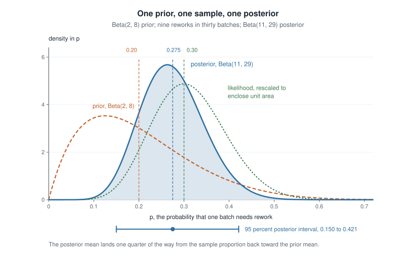
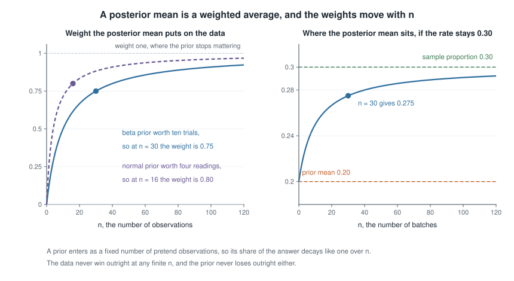
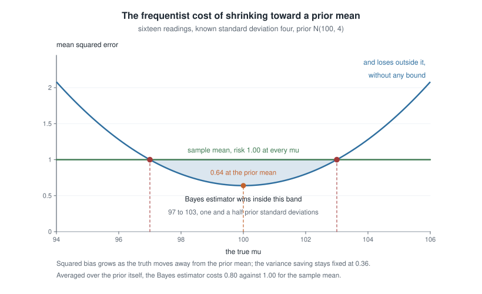
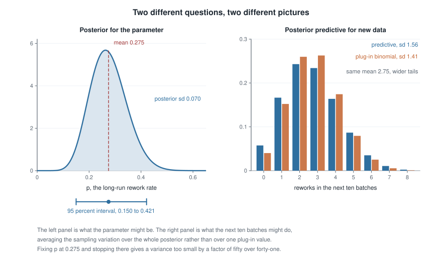

# Week 9 — Bayesian estimation: prior, posterior, prediction, and loss

## Where this week starts

Week 7 handed you the likelihood function and Week 8 turned method selection and verification into a routine. Both stopped at the same wall. The likelihood $L(\theta)$ ranks parameter values against one another and does nothing else: it is not a probability distribution over $\Theta$, it does not integrate to one, and its height changes if you record failure times in minutes rather than hours. So "there is a ninety-five percent probability that $\theta$ lies between these two numbers" has been out of order since Week 4, where a confidence interval could only be described by what happens across repeated samples, never by what is true of the interval in front of you.

This week supplies the missing ingredient, exactly one thing: a probability distribution $\pi(\theta)$ over the parameter space, written down before the data arrive. Once $\theta$ has a distribution the pair $(\theta, X)$ has a joint distribution, and everything afterwards is the ordinary conditional probability of Week 0. Bayes' theorem converts $\pi(\theta)$ into the posterior $\pi(\theta \mid x)$, which becomes the object of inference: every summary you might want — a point estimate, an interval, a forecast of the next observation, the probability that $\theta$ clears a threshold — is a functional of that one object.

Notice how little else moves: same model, same estimand, literally the same likelihood you differentiated in Week 7. Three things change. An interval now speaks about $\theta$ given your data rather than about a procedure across hypothetical repetitions. An estimator is derived from an explicit loss function rather than proposed and then evaluated. And bias stops being embarrassing, since this week's estimators are deliberately biased and often beat the maximum likelihood estimator on mean squared error for that reason. By Thursday you should be able to update a conjugate model in one line and read every summary off the posterior, then — the harder half — step outside the Bayesian frame to compute that estimator's frequentist bias and mean squared error and say where it wins.

### Why this matters downstream

Take a hospital ward tracking a rare adverse event. Ten nights pass with no event. The maximum likelihood estimate of the nightly rate is $\hat\lambda = 0$ and the curvature-based standard error $\sqrt{\hat\lambda/n}$ is also zero, so the routine reports an interval of zero width asserting the event cannot happen. No care with the algebra fixes that: the maximum sits on the boundary of the parameter space, where Week 7 warned the machinery fails. A posterior built from even a very weak prior returns a positive estimate and an upper end where it should be. Week 13 shows the same boundary wrecking the Wald interval for a binomial proportion.

The structural stakes are larger than one ward. Every penalized regression fit you will run is a posterior mode under a prior — ridge regression under a normal prior on the coefficients, the lasso under a Laplace one — so a student who cannot read that sentence cannot read the modern regression literature. And the loss-and-risk vocabulary introduced here is the entry point to the decision theory, admissibility and minimaxity of Mathematical Statistics II.

## What you will be able to do

- Write Bayes' theorem for a parameter, name the marginal likelihood as its normalizing constant, and explain why the posterior is proportional to likelihood times prior.
- Recognize a conjugate pair, complete the kernel algebra, and read off a posterior mean that is a weighted average of prior mean and sample summary, with weights you can name and track in $n$.
- Derive the posterior predictive distribution and explain by the variance decomposition why it is wider than a plug-in.
- Match squared-error, absolute and near-zero-one loss to the posterior mean, median and mode, from the minimization rather than from memory.
- Compute the frequentist bias and mean squared error of a Bayes estimator and locate the region where it beats the maximum likelihood estimator.
- State what a credible interval claims, what a confidence interval claims, and produce a case where the two numbers differ.

## Words worth owning

| Term | What it means in this course |
|------|------------------------------|
| Prior $\pi(\theta)$ | A distribution on $\Theta$ fixed before the data are seen. Part of the model, and as open to criticism as the likelihood. |
| Posterior $\pi(\theta \mid x)$ | The conditional distribution of $\theta$ given the data. The object of Bayesian inference; everything else is a summary of it. |
| Marginal likelihood $m(x)$ | $\int f(x \mid \vartheta)\pi(\vartheta)\,d\vartheta$: the normalizing constant, free of $\theta$; also the prior predictive density. |
| Conjugate family | Priors closed under updating for a given likelihood, so the posterior keeps the functional form with new parameters. Convenience, not doctrine. |
| Credible interval | A set $C$ with $\mathbb{P}(\theta \in C \mid x) = 1 - \alpha$ under the posterior: data fixed, $\theta$ random — the reverse of Week 4. |
| Posterior predictive | $\int f(\tilde{x} \mid \vartheta)\pi(\vartheta \mid x)\,d\vartheta$: a future observation's distribution, averaging the sampling model over posterior uncertainty. |
| Loss and risk | $L(\theta, a)$ penalizes reporting $a$ when the truth is $\theta$; $R(\theta, \delta)$ averages it over data at fixed $\theta$; $r(\pi, \delta) = \int R(\theta, \delta)\pi(\theta)\,d\theta$ averages that curve over the prior. |

## From a prior to a posterior

Let $X_1, \dots, X_n$ be independent draws from $f(x \mid \theta)$ with $\theta \in \Theta$, exactly as in Week 7, and write $x = (x_1, \dots, x_n)$ for the recorded numbers. Add one object: a density $\pi(\theta)$ on $\Theta$. That single addition turns $\theta$ from a fixed unknown constant into a random variable, and $f(x \mid \theta)$ from a family of densities indexed by a parameter into a genuine conditional density.

### Bayes' theorem for a parameter

The joint density of parameter and data is $\pi(\theta) f(x \mid \theta)$. Dividing by the marginal density of the data gives the conditional density of $\theta$ given $X = x$:

$$\pi(\theta \mid x) = \frac{f(x \mid \theta)\,\pi(\theta)}{m(x)}, \qquad m(x) = \int_{\Theta} f(x \mid \vartheta)\,\pi(\vartheta)\, d\vartheta.$$

The dummy variable $\vartheta$ is deliberate: $m(x)$ has been integrated over the whole parameter space and no longer depends on $\theta$. Since we only ever want the posterior as a function of $\theta$, that denominator is a bookkeeping constant, and the working form of the theorem is

$$\pi(\theta \mid x) \propto L(\theta)\,\pi(\theta),$$

read as "the posterior is proportional to the likelihood times the prior". Three consequences follow. First, the constant of proportionality is whatever makes the right-hand side integrate to one, so if you recognize a known density's shape you never compute $m(x)$. Second, the data enter only through $L(\theta)$, itself defined only up to a positive factor free of $\theta$, so the posterior depends on the data only through whatever the likelihood does — the sufficiency statement of Week 10, a week early and for free. Third, the prior is part of the model: an assumption, capable of being wrong, deserving the interrogation you give any distributional assumption.

### Conjugacy, and the posterior mean as a weighted average

A family of priors is *conjugate* to a likelihood when the posterior stays inside the family — an algebraic convenience and nothing more, and a student who reads it as a philosophical position has misread it. The two pairs this course uses constantly are worth deriving rather than quoting.

**Beta and binomial.** Let $X \mid p \sim \text{Binomial}(n, p)$ and take $p \sim \text{Beta}(a, b)$, whose density is proportional to $p^{a-1}(1-p)^{b-1}$ on $(0,1)$. Multiplying prior by likelihood and discarding every factor free of $p$,

$$\pi(p \mid x) \propto p^{a-1}(1-p)^{b-1} \cdot p^{x}(1-p)^{n-x} = p^{a+x-1}(1-p)^{b+n-x-1}.$$

That is the kernel of a $\text{Beta}(a + x,\, b + n - x)$ density, and a density is determined by its kernel, so the posterior *is* that beta distribution; the binomial coefficient and the beta function vanished into the proportionality sign. In words: the prior contributes $a$ pretend successes and $b$ pretend failures, the data add $x$ real successes and $n - x$ real failures, and $a + b$ is therefore an equivalent prior sample size measured in trials.

The posterior mean splits into a weighted average of the prior mean and the sample proportion,

$$\mathbb{E}[p \mid x] = \frac{a + x}{a + b + n} = \frac{a+b}{a+b+n}\cdot\frac{a}{a+b} \; + \; \frac{n}{a+b+n}\cdot\frac{x}{n},$$

which you can verify by clearing denominators on the right: the two numerators are $a$ and $x$. The weights sum to one and depend only on the two sample sizes, real and pretend.

**Normal and normal.** Let $X_1, \dots, X_n$ be independent $N(\mu, \sigma^2)$ with $\sigma^2$ **known**, and let $\mu \sim N(\mu_0, \tau^2)$. Using the identity $\sum_i (x_i - \mu)^2 = \sum_i (x_i - \bar{x})^2 + n(\bar{x} - \mu)^2$ and dropping everything free of $\mu$,

$$\pi(\mu \mid x) \propto \exp\left\{-\frac{1}{2}\left[\frac{(\mu - \mu_0)^2}{\tau^2} + \frac{n(\mu - \bar{x})^2}{\sigma^2}\right]\right\}.$$

Expand the bracket and collect powers of $\mu$. The coefficient of $\mu^2$ is $\tau^{-2} + n\sigma^{-2}$ and the coefficient of $-2\mu$ is $\mu_0\tau^{-2} + n\bar{x}\sigma^{-2}$, so completing the square gives a normal posterior:

$$\mu \mid x \sim N(\mu_n, \tau_n^2), \qquad \frac{1}{\tau_n^{2}} = \frac{1}{\tau^{2}} + \frac{n}{\sigma^{2}}, \qquad \mu_n = \tau_n^{2}\left(\frac{\mu_0}{\tau^{2}} + \frac{n\bar{x}}{\sigma^{2}}\right).$$

Call $1/\text{variance}$ a *precision*. The statement is then exact: **precisions add**, and the posterior mean is the precision-weighted average of prior mean and sample mean. Two audits. Let $\tau^2 \to \infty$, a prior carrying no information: the weight on $\mu_0$ vanishes, $\mu_n \to \bar{x}$, $\tau_n^2 \to \sigma^2/n$, recovering the Week 4 result exactly. Let $n \to \infty$ with everything else fixed: again $\mu_n \to \bar{x}$, and $\tau_n^2 \approx \sigma^2/n \to 0$, so the prior washes out and the posterior concentrates on the truth. Run both limits on any posterior you derive.

{fig-alt="Three curves over p: a broad dashed prior peaking near 0.125, a dotted likelihood peaking at 0.30, and a solid posterior peaking at 0.263, narrower than either and lying between them, with a 95 percent interval from 0.150 to 0.421."}

The figure draws the beta-binomial update of the first worked example. The prior is broad and pulls low; the rescaled likelihood — scaled to unit area, which makes it exactly the posterior a uniform prior would have produced — peaks at the sample proportion $0.30$; the posterior lies between them, peaking at $0.263$ with its mean at $0.275$, narrower than either input. That narrowing is the graphical face of "precisions add", and the mean is *not* halfway between: it lands three quarters of the way from the prior mean to the sample proportion, because thirty real observations outweigh ten pretend ones.

{fig-alt="Left: two rising curves of the data weight against n, reaching 0.75 at n equals 30 for a prior worth ten trials and 0.80 at n equals 16 for one worth four. Right: the posterior mean climbing from 0.20 toward 0.30."}

The second figure follows those weights as $n$ grows. The weight on the data is $n/(n + n_0)$, with $n_0$ the prior's equivalent sample size — ten trials for the $\text{Beta}(2,8)$ prior, four readings for the normal prior below, where $\tau^2 = 4$ and $\sigma^2 = 16$ make $\sigma^2/\tau^2 = 4$. The curve rises steeply then flattens: the prior's share decays like $1/n$, never vanishing at finite $n$ but quickly ceasing to matter. That is the reply when someone asks whether the prior "took over": the weight is a number you can state rather than a thing to argue about.

### The posterior predictive distribution

Suppose the question is not "what is $\theta$" but "what will the next observation do". Let $\tilde{X}$ be a future draw from the same model, independent of $X$ given $\theta$. Its distribution given the data averages the sampling density over the posterior:

$$p(\tilde{x} \mid x) = \int_{\Theta} f(\tilde{x} \mid \vartheta)\,\pi(\vartheta \mid x)\, d\vartheta.$$

The tempting shortcut is to estimate $\theta$, plug it in, and use $f(\tilde{x} \mid \hat\theta)$. That gets the centre roughly right and the spread systematically too small, and the variance decomposition of Week 0 says by how much:

$$\operatorname{Var}(\tilde{X} \mid x) = \mathbb{E}\big[\operatorname{Var}(\tilde{X} \mid \theta) \,\big|\, x\big] + \operatorname{Var}\big(\mathbb{E}[\tilde{X} \mid \theta] \,\big|\, x\big).$$

The first term is the sampling variation you would get if $\theta$ were known; the second is the extra spread from not knowing it, and a plug-in forecast keeps the first while discarding the second. In the normal-normal model the arithmetic is transparent: $\tilde{X} \mid x \sim N(\mu_n, \sigma^2 + \tau_n^2)$, sampling variance plus posterior variance, term by term.

### Computing the posterior without conjugacy

Conjugacy is a happy accident of a few families. When it fails the posterior is still perfectly well defined, and the only difficulty is the integral in $m(x)$. In one dimension a grid is usually enough, and writing it out makes the normalizing constant concrete.

```
# a grid approximation to the same beta-binomial posterior
grid  <- seq(0.001, 0.999, length.out = 2000)
width <- grid[2] - grid[1]

lik   <- dbinom(9, size = 30, prob = grid)   # the likelihood, as a function of p
prior <- dbeta(grid, 2, 8)
post  <- lik * prior
post  <- post / sum(post * width)            # divide by the marginal, computed numerically

sum(grid * post * width)                     # 0.2750 -- the posterior mean
sum((grid - 0.275)^2 * post * width)         # 0.004863 -- the posterior variance
```

Both printed values match the closed forms below to four decimal places — the Week 8 verification habit applied to a Bayesian calculation: one symbolic route, one numerical route, agreement between them. In higher dimensions a grid becomes hopeless and Markov chain Monte Carlo replaces it, but the object being approximated never changes.

## Loss, risk, and the Bayes estimator

A posterior is a distribution, and a distribution is not a number. Turning it into an estimate requires saying what a mistake costs — a modelling decision, and making it explicit is the main methodological gain of this section.

A **loss function** $L(\theta, a) \ge 0$ gives the penalty for reporting $a$ when the truth is $\theta$; an estimator is a rule $\delta$ mapping data to reports; its **frequentist risk** averages the loss over the data at a fixed parameter value, $R(\theta, \delta) = \mathbb{E}_{X \mid \theta}[L(\theta, \delta(X))]$, which under squared-error loss is the mean squared error of Week 6. The trouble Week 6 ran into is that $R(\cdot, \delta)$ is a *function* of $\theta$, and two risk functions usually cross, leaving most pairs of estimators incomparable. Averaging over the prior collapses that curve to the single number **Bayes risk**, $r(\pi, \delta) = \int_\Theta R(\theta, \delta)\pi(\theta)\, d\theta$, and single numbers can be ranked.

### Which summary each loss function picks out

Minimizing Bayes risk looks like a hard problem in the space of all functions $\delta$. It is not. Write the double integral out and exchange the order of integration, licensed because the integrand is nonnegative:

$$r(\pi, \delta) = \int_\Theta \int_{\mathcal{X}} L(\theta, \delta(x))\, f(x \mid \theta)\, dx \; \pi(\theta)\, d\theta = \int_{\mathcal{X}} \left[ \int_\Theta L(\theta, \delta(x))\, \pi(\theta \mid x)\, d\theta \right] m(x)\, dx,$$

where the inner rearrangement used $f(x \mid \theta)\pi(\theta) = \pi(\theta \mid x)\,m(x)$, Bayes' theorem cleared of its denominator. The outer integrand is a nonnegative weight $m(x)$ times a bracket depending on $\delta$ only through the single number $\delta(x)$, so choosing $\delta(x)$ separately for each $x$ to minimize the bracket minimizes the whole integral. The global problem has become a pointwise one: **the Bayes rule minimizes posterior expected loss at each observed dataset**. No calculus of variations, only a minimization over one real number.

Now run that minimization for three losses.

**Squared error, $L(\theta, a) = (\theta - a)^2$.** Add and subtract the posterior mean $\mu_\pi = \mathbb{E}[\theta \mid x]$ inside the square. The cross term has expectation zero, so

$$\mathbb{E}[(\theta - a)^2 \mid x] = \operatorname{Var}(\theta \mid x) + (\mu_\pi - a)^2 .$$

The first term is free of $a$ and the second is a nonnegative square, so the minimizer is $a = \mu_\pi$, the posterior mean, with minimum value the posterior variance. Averaged over $x$, the Bayes risk of the Bayes rule under squared error is $\mathbb{E}[\operatorname{Var}(\theta \mid X)]$, the average posterior variance.

**Absolute error, $L(\theta, a) = \lvert \theta - a \rvert$.** Split the expectation at $a$ and differentiate:

$$\frac{d}{da}\left[ \int_{-\infty}^{a} (a - \vartheta)\pi(\vartheta \mid x)\,d\vartheta + \int_{a}^{\infty} (\vartheta - a)\pi(\vartheta \mid x)\,d\vartheta \right] = F(a \mid x) - \{1 - F(a \mid x)\} = 2F(a \mid x) - 1,$$

with $F(\cdot \mid x)$ the posterior distribution function. Setting this to zero gives $F(a \mid x) = 1/2$, the posterior median; the derivative is nondecreasing in $a$, so the stationary point is a minimum.

**Near-zero-one loss.** For discrete $\theta$, $L(\theta, a) = \mathbf{1}\{\theta \ne a\}$ has posterior expected loss $1 - \mathbb{P}(\theta = a \mid x)$, minimized at the posterior mode. For continuous $\theta$ every single value has posterior probability zero, so the loss must be widened to $L_\varepsilon(\theta, a) = \mathbf{1}\{\lvert \theta - a \rvert > \varepsilon\}$, whose posterior expected loss is $1 - \mathbb{P}(\lvert \theta - a\rvert \le \varepsilon \mid x) \approx 1 - 2\varepsilon\,\pi(a \mid x)$ for small $\varepsilon$. Minimizing that means maximizing the posterior density, so as $\varepsilon \to 0$ the minimizer approaches the posterior mode whenever the posterior is continuous and unimodal. The mode is the summary that most resembles maximum likelihood: with a flat prior on a bounded space it *is* the maximum likelihood estimate.

::: {.callout-note}
**Check the special case.** When the posterior is symmetric and unimodal — the normal-normal model, for instance — mean, median and mode coincide and the choice of loss is invisible. Skewed posteriors are where it bites. For the $\text{Beta}(11, 29)$ posterior below, the mode is $0.2632$, the median $0.2712$ and the mean $0.2750$: three defensible estimates spread across about a sixth of a posterior standard deviation. If your conclusion depends on which you picked, say so out loud.
:::

### Frequentist risk against Bayes risk

A Bayes estimator is a function of the data, so it has a sampling distribution and a frequentist risk function like any other estimator, and this course's stance is that you compute it. In the normal-normal model write $w = \{n/\sigma^2\}/\{1/\tau^2 + n/\sigma^2\}$ for the weight on the data, so $\hat\mu_B = w\bar{X} + (1 - w)\mu_0$. Treating $\mu$ as a fixed unknown constant once more,

$$\mathbb{E}_\mu[\hat\mu_B] = w\mu + (1 - w)\mu_0, \qquad \text{bias} = (1 - w)(\mu_0 - \mu), \qquad \operatorname{Var}_\mu(\hat\mu_B) = w^2 \frac{\sigma^2}{n},$$

and therefore, by the Week 6 decomposition,

$$\mathrm{MSE}_\mu(\hat\mu_B) = w^{2}\frac{\sigma^{2}}{n} + (1 - w)^{2}(\mu - \mu_0)^{2}.$$

Read the two terms. The variance is *reduced* by the factor $w^2 < 1$, uniformly in $\mu$, because shrinking toward a fixed number damps the sampling noise; the price is a squared bias growing without bound as the truth moves away from the prior mean. Set the expression equal to the maximum likelihood estimator's constant risk $\sigma^2/n$ and solve:

$$(1 - w)^2 (\mu - \mu_0)^2 = (1 - w^2)\frac{\sigma^2}{n} \quad \Longrightarrow \quad \lvert \mu - \mu_0 \rvert = \sqrt{\frac{1 + w}{1 - w}} \cdot \frac{\sigma}{\sqrt{n}},$$

using $1 - w^2 = (1-w)(1+w)$ and dividing by $(1-w)^2$. Inside that distance the Bayes estimator wins on mean squared error, outside it loses. This is the Week 6 lesson at its sharpest: unbiasedness is not the goal, and a biased estimator can dominate over a wide and specifiable region.

Average that risk function over the prior itself and something clean happens. With $v = \sigma^2/n$ and $w = \tau^2/(v + \tau^2)$, and using $\mathbb{E}_\pi[(\mu - \mu_0)^2] = \tau^2$,

$$r(\pi, \hat\mu_B) = w^2 v + (1 - w)^2\tau^2 = \frac{\tau^4 v + v^2 \tau^2}{(v + \tau^2)^2} = \frac{v\tau^2(\tau^2 + v)}{(v + \tau^2)^2} = \frac{v\tau^2}{v + \tau^2} = \tau_n^2,$$

the posterior variance, which in this model does not depend on the data at all. That is the previous subsection's identity — Bayes risk equals average posterior variance — by a completely different route, the two-route agreement Week 8 asked for. Since the maximum likelihood estimator has constant risk $v$ and $\tau_n^2 < v$ whenever $\tau^2 < \infty$, the Bayes estimator has strictly smaller Bayes risk. Neither dominates pointwise, though: their risk curves cross, and crossing risk curves are the normal state of affairs.

{fig-alt="A flat green line at 1.00 for the sample mean and a blue upward parabola for the Bayes estimator with minimum 0.64 at mu equal to 100; the two cross at 97 and 103, and the region between them is shaded."}

The figure plots both risk functions for the second worked example, where $w = 0.8$ and $\sigma^2/n = 1$. The parabola bottoms out at $0.64$ under the prior mean, a thirty-six percent risk reduction, and crosses the flat line at $97$ and $103$, one and a half prior standard deviations either side. The asymmetry is what to take away: the gain is bounded by $\sigma^2/n$ and the loss is not. A prior mean badly wrong together with a prior standard deviation too small produces an estimator worse than doing nothing, and no amount of internal Bayesian consistency protects you. The prior is a bet on where $\theta$ lives, and the figure is its payoff table.

## Worked example — a rework rate from thirty production batches

**Setting.** A manufacturing team monitors the proportion of production batches needing rework. Experience on earlier product lines suggests a rate near twenty percent, with real uncertainty around it. Thirty batches are run under the new process and nine need rework.

**Step one — model, prior, estimand.** Let $X$ be the number of batches needing rework, $X \mid p \sim \text{Binomial}(30, p)$, treating batches as independent with a common rate. The estimand is $p$, the long-run rework proportion under this process. Encode the historical belief as $p \sim \text{Beta}(2, 8)$: mean $2/10 = 0.20$, standard deviation $\sqrt{(0.2)(0.8)/11} = 0.121$, equivalent prior sample size $a + b = 10$ trials. Ten pretend trials against thirty real ones is a deliberate choice, informative enough to matter and weak enough to be overruled.

**Step two — the posterior.** By the kernel algebra above, the posterior is

$$p \mid x \sim \text{Beta}(a + x,\ b + n - x) = \text{Beta}(2 + 9,\ 8 + 21) = \text{Beta}(11, 29).$$

**Step three — summarize it.** A $\text{Beta}(\alpha, \beta)$ has mean $\alpha/(\alpha+\beta)$, mode $(\alpha - 1)/(\alpha + \beta - 2)$ for $\alpha, \beta > 1$, and variance $\alpha\beta/\{(\alpha+\beta)^2(\alpha+\beta+1)\}$. Here

$$\mathbb{E}[p \mid x] = \frac{11}{40} = 0.275, \qquad \text{mode} = \frac{10}{38} = 0.2632, \qquad \operatorname{Var}(p \mid x) = \frac{11 \times 29}{40^2 \times 41} = \frac{319}{65600} = 0.004863,$$

so the posterior standard deviation is $\sqrt{0.004863} = 0.0697$; the median, which needs a numerical routine, is $0.2712$. Check the mean against the weighted-average formula: $\tfrac{10}{40}(0.20) + \tfrac{30}{40}(0.30) = 0.05 + 0.225 = 0.275$, which agrees. The three summaries are ordered mode, median, mean, the signature of a right-skewed posterior, and they answer to near-zero-one, absolute and squared-error loss respectively.

**Step four — a credible interval.** The equal-tailed ninety-five percent interval takes the $0.025$ and $0.975$ quantiles of $\text{Beta}(11, 29)$, giving $(0.150,\ 0.421)$. Its claim is direct: given this model, this prior and these data, the posterior probability that $p$ lies between $0.150$ and $0.421$ is $0.95$. The shortest interval of the same posterior probability runs $(0.143,\ 0.413)$, width $0.270$ against $0.271$ — barely shorter, the posterior being only mildly skewed. Neither the prior mean $0.20$ nor the sample proportion $0.30$ is excluded.

**Step five — the posterior predictive.** Ten further batches are planned; let $Y$ be how many need rework. Averaging the binomial over the posterior gives the beta-binomial distribution,

$$\mathbb{P}(Y = y \mid x) = \binom{10}{y}\frac{B(11 + y,\ 29 + 10 - y)}{B(11, 29)}, \qquad y = 0, 1, \dots, 10,$$

with $B$ the beta function. Its mean is $10 \times 0.275 = 2.75$ and its variance is

$$\operatorname{Var}(Y \mid x) = 10\,\bar{p}(1 - \bar{p})\,\frac{\alpha + \beta + 10}{\alpha + \beta + 1} = 10(0.275)(0.725)\frac{50}{41} = 1.994 \times 1.2195 = 2.431,$$

against $1.994$ for a binomial with $p$ fixed at $0.275$. Verify a second way with the variance decomposition: $10\{\mathbb{E}[p \mid x] - \mathbb{E}[p^2 \mid x]\} + 100\operatorname{Var}(p \mid x) = 10(0.275 - 0.080488) + 100(0.004863) = 1.945 + 0.486 = 2.431$, which matches. The inflation factor $50/41$ is small because thirty observations have pinned $p$ down fairly well; with $n = 3$ it would be large. In the tails, the predictive puts $0.224$ on one batch or fewer against the plug-in binomial's $0.192$, and $0.048$ on six or more against $0.031$ — an understatement of the upper tail by thirty-five percent of its correct value.

{fig-alt="Left: a single-peaked posterior for p with mean 0.275 and a 95 percent interval from 0.150 to 0.421. Right: paired bars for reworks in ten more batches, the predictive wider at standard deviation 1.56 against the plug-in 1.41."}

The two panels answer different questions. The left is about the parameter: continuous on $(0,1)$, narrowing without limit as $n$ grows. The right is about data: it lives on the integers zero through ten and does *not* collapse as $n$ grows, since even perfect knowledge of $p$ leaves binomial sampling variation behind. Students conflate the two and report a posterior interval for $p$ when asked how many batches will need rework next month.

**Step six — critique.** Two assumptions carry the result. Independence across batches with a common rate would fail if one bad lot of raw material spanned several batches, making the real spread of $Y$ larger than either curve on the right-hand panel. The prior is the second: with a uniform $\text{Beta}(1,1)$ prior the posterior becomes $\text{Beta}(10, 22)$, mean $0.3125$, interval $(0.167, 0.480)$; with the $\text{Beta}(0.5, 0.5)$ prior often used as a default, $\text{Beta}(9.5, 21.5)$, mean $0.3065$. The estimate moves about half a posterior standard deviation across the three. Report that sensitivity; do not hide the prior in a footnote.

```
a0 <- 2;  b0 <- 8                    # prior Beta(2, 8): mean 0.2, worth ten trials
x  <- 9;  n  <- 30                   # nine of thirty batches needed rework
a1 <- a0 + x;  b1 <- b0 + n - x      # posterior Beta(11, 29)

a1 / (a1 + b1)                                   # 0.2750  posterior mean
sqrt(a1 * b1 / ((a1 + b1)^2 * (a1 + b1 + 1)))    # 0.06973 posterior standard deviation
qbeta(c(0.025, 0.975), a1, b1)                   # 0.1500  0.4213

m  <- 10;  y <- 0:m                              # the next ten batches
pp <- choose(m, y) * beta(a1 + y, b1 + m - y) / beta(a1, b1)
sum(pp)                                          # 1.000  it is a distribution
sum(y * pp)                                      # 2.750  predictive mean
sum((y - 2.75)^2 * pp)                           # 2.431  against 1.994 for the plug-in
```

### The same reasoning, transferred

Run the identical argument on counts. A ward records the nightly number of a rare adverse event, $X_i \mid \lambda \sim \text{Poisson}(\lambda)$, independent across nights. The conjugate prior is a gamma: take $\lambda \sim \text{Gamma}(\text{shape } \alpha_0 = 3, \text{rate } \beta_0 = 2)$, mean $\alpha_0/\beta_0 = 1.5$ events per night, standard deviation $\sqrt{3}/2 = 0.866$. Ten nights bring eight events. Multiplying prior by likelihood and dropping constants,

$$\pi(\lambda \mid x) \propto \lambda^{\alpha_0 - 1}e^{-\beta_0\lambda} \cdot \lambda^{\sum_i x_i}e^{-n\lambda} = \lambda^{\alpha_0 + \sum_i x_i - 1}e^{-(\beta_0 + n)\lambda},$$

the kernel of a $\text{Gamma}(\alpha_0 + \sum_i x_i,\ \beta_0 + n)$ density — here $\text{Gamma}(11, 12)$, mean $11/12 = 0.917$, standard deviation $\sqrt{11}/12 = 0.276$, equal-tailed ninety-five percent credible interval $(0.458,\ 1.533)$. The posterior mean again splits:

$$\frac{\alpha_0 + \sum_i x_i}{\beta_0 + n} = \frac{\beta_0}{\beta_0 + n}\cdot\frac{\alpha_0}{\beta_0} + \frac{n}{\beta_0 + n}\cdot\bar{x} = \tfrac{2}{12}(1.5) + \tfrac{10}{12}(0.8) = 0.25 + 0.667 = 0.917 .$$

What stayed the same: multiply prior by likelihood, recognize a kernel, read off parameters, and find the posterior mean between the prior mean and the sample mean with weights set by two sample sizes. What changed: the prior's equivalent sample size is now the rate $\beta_0$, measured in *nights* rather than trials, its "pretend data" being $\alpha_0 = 3$ events over $\beta_0 = 2$ nights. What is genuinely different: the Poisson has no free variance parameter, so "precision" here is an analogy for the weighting rather than a literal ratio of reciprocal variances. And the predictive for the next night's count is negative binomial with mean $11/12$ and variance $(11/12)(13/12) = 0.993$, overdispersed relative to a Poisson by $(\beta_0 + n + 1)/(\beta_0 + n) = 13/12$ — the same "plug-in is too narrow" phenomenon in a third family.

## Second worked example — a normal mean, and the price of shrinking

**Setting.** An optical bench measures a reference artefact. Its repeatability is established from long experience, so treat $\sigma = 4$ micrometres as known and the sixteen readings as independent $N(\mu, \sigma^2)$, with mean $\bar{x} = 103.0$. The artefact's certificate from its previous calibration gives a prior $\mu \sim N(100, 2^2)$.

**Step one — precisions.** The prior precision is $1/\tau^2 = 0.25$ and the data precision is $n/\sigma^2 = 16/16 = 1.00$. They add to $1.25$, so $\tau_n^2 = 1/1.25 = 0.8$ and the posterior standard deviation is $\sqrt{0.8} = 0.894$ micrometres. The data are four times as informative as the prior, the same statement as "the prior is worth four readings", since $\sigma^2/\tau^2 = 16/4 = 4$.

**Step two — the posterior.** The weight on the data is $w = 1.00/1.25 = 0.8$, so

$$\mu \mid x \sim N(102.4,\ 0.8), \qquad \mu_n = 0.8(103.0) + 0.2(100.0) = 82.4 + 20.0 = 102.4 .$$

The estimate has been pulled $0.6$ micrometres back from $\bar{x}$ toward the prior mean. That pull is *shrinkage*, of size $(1-w)(\bar{x} - \mu_0) = 0.2(3.0) = 0.6$.

**Step three — two intervals, and they are not the same.** The ninety-five percent credible interval is $102.4 \pm 1.96(0.894) = (100.65,\ 104.15)$, width $3.51$. The Week 4 confidence interval with $\sigma$ known is $103.0 \pm 1.96(1.00) = (101.04,\ 104.96)$, width $3.92$. Different centre, different width, different claim. The credible interval is narrower because it uses information the confidence interval refuses to use, and shifted because that information points low.

**Step four — frequentist operating characteristics.** Abandon the prior and ask how $\hat\mu_B = 0.8\bar{X} + 0.2(100)$ behaves under repeated sampling at a fixed true $\mu$. From the general formulas,

$$\text{bias} = 0.2(100 - \mu), \qquad \operatorname{Var}_\mu(\hat\mu_B) = (0.8)^2(1.00) = 0.64, \qquad \mathrm{MSE}_\mu(\hat\mu_B) = 0.64 + 0.04(\mu - 100)^2 .$$

The maximum likelihood estimator $\bar{X}$ is unbiased with $\mathrm{MSE} = \sigma^2/n = 1.00$ at every $\mu$. A few values: at $\mu = 100$ the Bayes estimator costs $0.64$; at $\mu = 102$, $0.80$; at $\mu = 103$, exactly $1.00$; at $\mu = 104$, $1.28$; at $\mu = 108$, $3.20$. The crossing is where $0.04(\mu - 100)^2 = 0.36$, that is $\lvert \mu - 100\rvert = 3$, matching $\sqrt{(1+w)/(1-w)}\,\sigma/\sqrt{n} = \sqrt{1.8/0.2}\,(1) = 3$, or $3/\tau = 1.5$ prior standard deviations.

**Step five — the Bayes risk.** Averaging over the prior, $r(\pi, \hat\mu_B) = 0.64 + 0.04\,\mathbb{E}_\pi[(\mu - 100)^2] = 0.64 + 0.04(4) = 0.80$, which equals $\tau_n^2$ as the identity predicted, against $1.00$ for $\bar{X}$. If the prior fairly describes where $\mu$ lives, shrinking cuts expected squared error by twenty percent.

**Step six — critique, and the assumption that carries everything.** The comparison rests on $\sigma$ being known; estimating it turns the posterior into a $t$-shaped object and the clean precision arithmetic becomes approximate. The second assumption is the prior mean, and step four is the price list: at $\mu = 108$, four prior standard deviations out, the Bayes estimator is more than three times worse than doing nothing. A prior that is confident and wrong is the one genuinely dangerous configuration in this week's material, and the defence is not more Bayesian machinery but a wider $\tau$ — honesty about how much you actually knew.

**Step seven — what happens as $n$ grows.** With $\sigma$ and $\tau$ fixed, $w = n\tau^2/(\sigma^2 + n\tau^2) \to 1$, so the shrinkage $(1-w)(\bar{x} - \mu_0)$ vanishes at rate $1/n$ while the posterior standard deviation shrinks at rate $n^{-1/2}$. The bias becomes negligible *relative to* the spread, and the two intervals converge: visibly different at $n = 16$, nearly coincident at $n = 400$, where the weight is $0.99$. That limit is a genuine theorem in wide generality, treated properly in Week 13 — but it is no excuse to ignore the prior at the sample sizes you actually have.

## The misreading to avoid

**"A credible interval and a confidence interval are the same thing with different words."** Nearly everyone arrives at this, encouraged by the fact that both are intervals, both carry a number like ninety-five percent, and in textbook examples they often print similar values. It is wrong in two separate ways.

First, they are statements about different random objects. A confidence interval $C(X)$ is random and $\theta$ is fixed; the guarantee $\mathbb{P}_\theta(\theta \in C(X)) \ge 1 - \alpha$ holds for every $\theta$ and is a property of the *procedure* across samples you did not take. A credible interval is a fixed set of numbers computed from the data you did take, and $\theta$ is the random thing; $\mathbb{P}(\theta \in C \mid X = x) = 1 - \alpha$ is a probability under the posterior, which exists only because a prior was supplied. Swap them and you have said something false in both directions.

Second, they are numerically different, so the confusion cannot be defended as harmless. The second worked example gives $(100.65,\ 104.15)$ and $(101.04,\ 104.96)$ from identical data. The credible interval also has no fixed frequentist coverage: $\mathbb{P}_\mu(\mu \in C)$ for the shrunken interval is $0.972$ at $\mu = 100$, $0.951$ at $102$, $0.882$ at $104$, $0.755$ at $106$ and $0.576$ at $108$. It over-covers near the prior mean and buys that with severe under-coverage far from it, averaging over the prior to the advertised level. So the credible interval is not a ninety-five percent confidence interval, and the confidence interval carries ninety-five percent posterior probability only if the prior is flat.

That flat-prior case is where the confusion breeds, so face it. Let $\tau^2 \to \infty$ in the normal model: the posterior becomes $N(\bar{x}, \sigma^2/n)$ and the credible interval matches the Week 4 confidence interval to the last decimal. The *numbers* agree; the *claims* still do not, and the agreement is a coincidence of one model with one improper prior. In the beta-binomial example the two never coincide.

**A smaller confusion, and a sharp one.** Students who absorbed the invariance property of maximum likelihood in Week 7 often assume it carries over. It does not. If $\hat\theta$ maximizes the likelihood then $g(\hat\theta)$ maximizes the likelihood for $g(\theta)$, but posterior means are expectations, and expectations do not commute with nonlinear functions. For the $\text{Beta}(11, 29)$ posterior, the posterior mean of the odds $p/(1-p)$ is $\alpha/(\beta - 1) = 11/28 = 0.3929$, while the odds computed from the posterior mean are $0.275/0.725 = 0.3793$. Both are correct replies to different questions, and only one is the Bayes estimator of the odds under squared-error loss. The posterior *median* does transport, since medians survive increasing transformations, which is one practical argument for reporting it.

## Practice on your own

For self-checking, not submission. Work them with a pencil before opening R.

1. **The update, twice.** Redo the beta-binomial calculation with a $\text{Beta}(8, 2)$ prior — same strength, opposite belief — and report the posterior mean, standard deviation and credible interval. Then say in one sentence how far a prior worth ten trials can move a conclusion drawn from thirty, checking that sentence against the weighted-average formula.
2. **Derive the three summaries.** Prove that posterior expected squared-error loss equals the posterior variance plus the squared distance from the posterior mean, and deduce the minimizer. Carry out the absolute-loss differentiation and confirm the minimizer is the posterior median. Then say why the $\text{Beta}(11,29)$ mode, median and mean fall in that order, and what feature of the density forces it.
3. **Counterexample hunt.** Find a prior and a likelihood for which the posterior mean lies *outside* the interval between the prior mean and the maximum likelihood estimate; a bimodal prior on a bounded parameter is a good place to look. Then say what property of this page's conjugate examples rules that out there.
4. **A simulation to describe.** Describe a study drawing five thousand samples of size $n = 16$ from $N(\mu, 16)$ at each of $\mu = 100, 102, 104, 106, 108$, forming the shrunken credible interval each time and recording how often it covers. State the five coverage figures you expect in advance, then say what you would conclude if the one at $\mu = 100$ came out near $0.95$ rather than near $0.97$.
5. **Audit a plausible argument.** A colleague writes: "The posterior for $\lambda$ is $\text{Gamma}(11, 12)$, so its mean is $11/12 = 0.917$, and hence the posterior mean of the waiting time $1/\lambda$ is $12/11 = 1.091$." Identify the error, compute $\mathbb{E}[1/\lambda \mid x]$ correctly for a $\text{Gamma}(\alpha, \beta)$ posterior, evaluate it here, and say for which $\alpha$ it fails to exist.

## Where to read more

- [MIT OpenCourseWare 18.655, Mathematical Statistics](https://ocw.mit.edu/courses/18-655-mathematical-statistics-spring-2016/) — loss, risk, Bayes rules and admissibility, treated more formally than here.
- [MIT OpenCourseWare 18.650, Statistics for Applications](https://ocw.mit.edu/courses/18-650-statistics-for-applications-fall-2016/) — the Bayesian lectures, with the conjugate updates worked slowly.
- [Penn State STAT 414, Introduction to Probability Theory](https://online.stat.psu.edu/stat414/) — the distributions leaned on here: beta, gamma, negative binomial, plus the conditional-probability machinery behind the update.
- [The R Project](https://www.r-project.org/) — `dbeta`, `qbeta`, `dgamma` and `dnbinom` all ship in the base distribution, so nothing here needs an add-on package.
- Hogg, McKean and Craig devote an optional chapter to Bayesian statistics covering these conjugate families in the same order.
- Course pages: the [resources index](../resources/index.qmd) and the [schedule](../schedule.qmd).

## Where this goes next

Week 10 asks how much of the data you can discard without losing anything about $\theta$, and this week has already supplied the cleanest motivation: since the posterior depends on the data only through the likelihood, Bayesian and frequentist inference agree completely about what a sufficient statistic is, even where they disagree about everything else. Read [Week 10](week-10.qmd) with the beta-binomial update in mind — the posterior used only $x = 9$ and $n = 30$, never which batches needed rework. If the risk arithmetic felt unfamiliar, [Week 8](week-08.qmd) has the verification habits that make it checkable.

Two threads then run forward. Week 11 sharpens the question of when unbiasedness is worth insisting on, and the shrinkage estimator above is the standing reminder that it often is not. Week 13 puts the credible interval on one axis beside the pivotal interval of Week 4 and the likelihood-ratio interval, and explains when the three agree. The [notes index](../index.qmd) has the full sequence.
