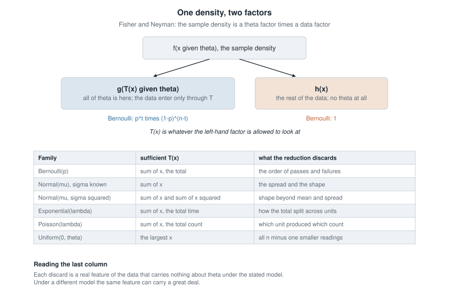
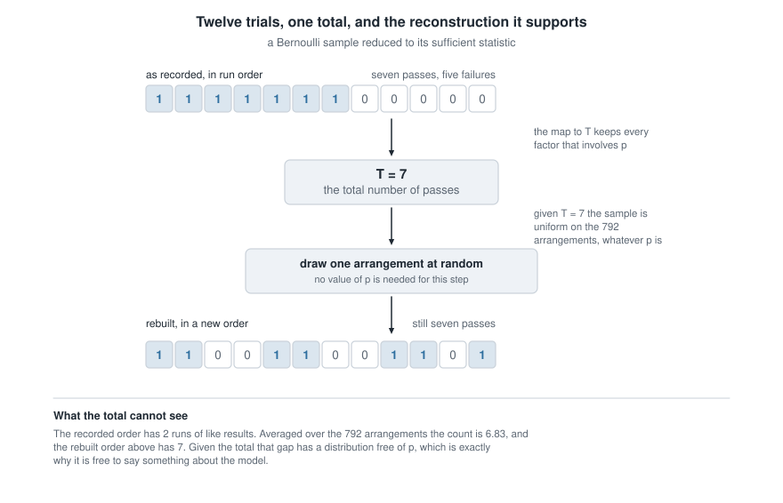
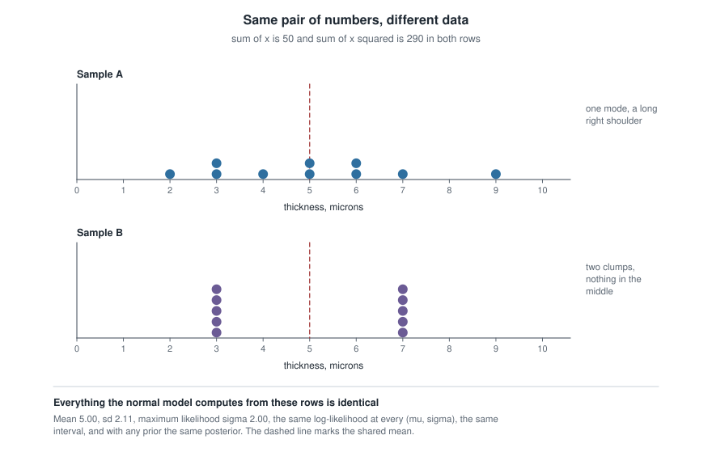
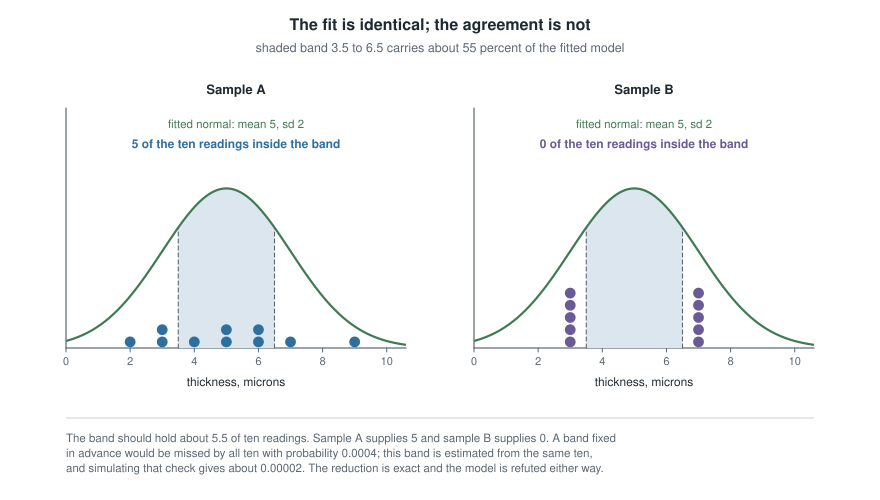

# Week 10 — Sufficiency, factorization, and data reduction

## Where this week starts

Something kept happening in Weeks 7 and 9 that nobody stopped to name. The exponential log-likelihood built from eight failure times depended on those eight numbers only through their total; the beta-binomial posterior depended on the trial record only through the count of successes; the normal-normal posterior mean used $\bar{x}$ and never asked which observation was which. Each time $n$ numbers walked in and one walked out, and no later step went back for the other $n-1$. Either that is luck peculiar to the families this course likes, or it is a theorem waiting for a statement.

This week it becomes a theorem. The question is how much of the data you can throw away without losing anything about $\theta$, and the work begins with "without losing anything", which is not yet mathematics. The definition this course uses is conditional: $T$ is sufficient when, once you are told its value, the remaining variation in the sample follows a distribution that no longer involves $\theta$.

That definition says the right thing and is nearly useless as a test, since checking it means computing a conditional distribution before you know which statistic to condition on. Fisher and Neyman's factorization theorem repairs this: split the joint density into a factor that carries $\theta$ and a factor that carries the rest of the data, and whatever the first factor is allowed to look at is sufficient. A question about conditional distributions becomes an exercise in staring at a formula, and the second half of the page pushes that reduction as far as it will go.

Then the caution, which matters as much as the theorem. Sufficiency is defined relative to a model: change the family and the same statistic stops being sufficient, and assume a wrong family and the reduction is still exact, still tidy, and authoritative about nothing. By Thursday you should be able to take an unfamiliar family, factor its joint density, name the sufficient statistic and the discarded structure, and say which model check the reduction has just made impossible.

### Why this matters downstream

A laboratory logs a production run by storing the count of items, the sum of the thicknesses, and the sum of the squared thicknesses, then deletes the individual readings. Under a normal model that is a lossless archive: every estimate, interval and posterior formable from the full run can still be formed. Two runs sharing those three numbers are indistinguishable forever — and this page exhibits two ten-reading runs that do, one a plausible sample from a stable process, the other two machines running four microns apart. The reduction was correct; the archive is still ruined, because the evidence that would have separated the two stories lived entirely in what was thrown away.

Week 11 conditions an unbiased estimator on a sufficient statistic and proves the result cannot be worse, so Rao-Blackwell has nothing to condition on until this week supplies it. Week 12's Cramer-Rao bound is attained, when it is attained, by functions of a sufficient statistic, and Week 13's likelihood-ratio interval depends on the data only through the same reduction. For a Bayesian the statement is shorter still: two samples with the same sufficient statistic have the same posterior under every prior.

## What you will be able to do

- State the conditional definition of sufficiency and defend it with the reconstruction argument rather than a slogan.
- Apply the factorization theorem to a named family, name the factor carrying $\theta$ and the factor free of it, and read the statistic off the split.
- Verify sufficiency directly for a discrete model by computing the conditional distribution given $T$ and exhibiting the cancellation.
- Decide whether a sufficient statistic is minimal with the Lehmann-Scheffe ratio criterion, and say why a one-to-one relabelling changes nothing.
- Read a minimal sufficient statistic off an exponential-family representation, and recognize the curved and moving-support cases where that shortcut fails.
- Describe what a sufficient statistic does not carry, and build a model check out of the discarded structure.

## Words worth owning

| Term | What it means in this course |
|------|------------------------------|
| Statistic | A function $T(X)$ of the data alone. It must not involve $\theta$, so $\sum_i X_i$ qualifies and $\sum_i (X_i - \mu)^2$ with $\mu$ unknown does not. |
| Sufficient statistic | A statistic $T$ for which the conditional distribution of the whole sample given $T = t$ is the same for every $\theta \in \Theta$. |
| Factorization | The Fisher-Neyman criterion $f(x \mid \theta) = g\{T(x) \mid \theta\}\,h(x)$: sufficiency rewritten as something you check by algebra. |
| Likelihood equivalence | Two samples are likelihood-equivalent when their likelihood functions are proportional in $\theta$, so every likelihood-based or Bayesian conclusion about $\theta$ agrees. |
| Minimal sufficient statistic | A sufficient statistic that is a function of every other sufficient statistic: the coarsest reduction that still loses nothing about $\theta$. |
| Ancillary statistic | A statistic whose distribution is the same for every $\theta$. It carries nothing about $\theta$, which frees it to carry a great deal about the model. |
| Full-rank exponential family | An exponential family whose natural parameter set contains an open set; its natural statistic is then automatically minimal sufficient. |
| Curved exponential family | One whose natural parameter is confined to a lower-dimensional curve, so the minimal sufficient statistic can have more coordinates than $\theta$ has. |

## Sufficiency and the factorization theorem

Let $X = (X_1, \dots, X_n)$ be a sample from a model $\{f(\cdot \mid \theta) : \theta \in \Theta\}$, where $f$ is a joint density or joint mass function for the whole sample. Nothing below needs the observations to be independent, though every example here has them so. A statistic is a function $T = T(X)$ computable from the data alone: it may not contain $\theta$, because you have to be able to evaluate it.

### What a sufficient statistic promises

**Definition.** $T$ is *sufficient for $\theta$* if, for every value $t$ that $T$ takes with positive probability, the conditional distribution of $X$ given $T = t$ is the same for every $\theta \in \Theta$.

Read the definition as a promise about what is left over: once $T$ is fixed, the parameter has nowhere left to hide. To see that this is the right notion, run the reduction backwards. Suppose you are handed only $t$, with the data destroyed. Because the conditional law of $X$ given $T = t$ involves no unknown, you can *draw from it* without knowing $\theta$. Call the result $\tilde{X}$. In the discrete case, for any sample value $x$,

$$\mathbb{P}_\theta(\tilde{X} = x) = \sum_{t} \mathbb{P}_\theta(T = t)\, \mathbb{P}(X = x \mid T = t) = \mathbb{P}_\theta(X = x),$$

for every $\theta$, because the sum is the law of total probability run in reverse. So someone holding $T$ and a source of randomness the model does not care about can manufacture a data set statistically indistinguishable from the one you deleted, without ever being told the parameter. That is what "no information about $\theta$ was lost" means, and it is much stronger than "the estimator only uses $T$".

Two consequences follow immediately. First, sufficiency is cheap without reduction: $T(X) = X$ is sufficient, since the conditional law of $X$ given $X = x$ is a point mass free of $\theta$, and for an independent and identically distributed sample the order statistics are sufficient too, because $\prod_i f(x_i \mid \theta)$ is symmetric in the observations. Sufficiency alone is not the goal; sufficiency *with* reduction is. Second, if $\psi$ is one-to-one on the range of a sufficient $T$, then $\psi(T)$ is sufficient as well. Speaking of "the" sufficient statistic is an abuse of language: what is determined is the partition of the sample space into the sets on which $T$ is constant.

### The factorization theorem as the working tool

**Theorem (Fisher-Neyman).** $T$ is sufficient for $\theta$ if and only if there are nonnegative functions $g$ and $h$, with $h$ free of $\theta$, such that

$$f(x \mid \theta) = g\{T(x) \mid \theta\}\, h(x) \qquad \text{for all } x \text{ and all } \theta \in \Theta.$$

The discrete proof is short, and it explains why the criterion works rather than only that it does.

*Working, the direction that gets used.* Suppose the factorization holds. Fix $t$ with $\mathbb{P}_\theta(T = t) > 0$ and sum over the samples that produce it:

$$\mathbb{P}_\theta(T = t) = \sum_{x : T(x) = t} g(t \mid \theta) h(x) = g(t \mid \theta) H(t), \qquad H(t) = \sum_{x : T(x) = t} h(x).$$

The factor $g(t \mid \theta)$ came outside the sum because on that set $T(x)$ equals $t$ and nothing else varies with $\theta$. Then for any $x$ with $T(x) = t$,

$$\mathbb{P}_\theta(X = x \mid T = t) = \frac{g(t \mid \theta) h(x)}{g(t \mid \theta) H(t)} = \frac{h(x)}{H(t)},$$

and $\theta$ has cancelled. The conditional law is the same for every parameter value, so $T$ is sufficient. *The converse.* If $T$ is sufficient, write $\mathbb{P}_\theta(X = x) = \mathbb{P}_\theta\{T = T(x)\}\cdot \mathbb{P}\{X = x \mid T = T(x)\}$. The first factor depends on the data only through $T(x)$, so call it $g$; the second is free of $\theta$ by hypothesis, so call it $h$. In the continuous case the same statement holds with respect to a dominating measure and with the identity required only outside a null set; the extra care is real but it changes no calculation you will do this term.

Three corollaries do most of the work later. Write $L_x(\theta)$ for the likelihood from sample $x$. If $T(x) = T(y)$ and $h(y) > 0$, then $L_x(\theta) = \{h(x)/h(y)\}L_y(\theta)$, a positive multiple free of $\theta$: the two samples are likelihood-equivalent. Since $\ell_x$ and $\ell_y$ differ by an additive constant, they have the *same* score, the same observed information, and the same set of maximizers. And multiplying by any prior, $\pi(\theta \mid x) \propto \pi(\theta)\,g\{T(x) \mid \theta\}$, so two samples sharing $T$ share the posterior, the credible interval, and the posterior predictive distribution as well. Sufficiency is one statement with a frequentist face and a Bayesian face.

### The split, family by family

Take the normal with known variance first, since the algebra shows where the split comes from. With $X_1, \dots, X_n$ independent $N(\mu, \sigma^2)$ and $\sigma^2$ known, expand the exponent using $\sum_i (x_i - \mu)^2 = \sum_i x_i^2 - 2\mu\sum_i x_i + n\mu^2$:

$$f(x \mid \mu) = (2\pi\sigma^2)^{-n/2} \exp\left\{-\frac{1}{2\sigma^2}\sum_{i=1}^{n}(x_i - \mu)^2\right\} = \underbrace{\exp\left\{\frac{\mu \sum_i x_i}{\sigma^2} - \frac{n\mu^2}{2\sigma^2}\right\}}_{g\{T(x) \mid \mu\}} \cdot \underbrace{(2\pi\sigma^2)^{-n/2}\exp\left\{-\frac{\sum_i x_i^2}{2\sigma^2}\right\}}_{h(x)}.$$

Every appearance of $\mu$ sits in the first factor, and inside it the data appear only as $\sum_i x_i$. So $T = \sum_i X_i$ is sufficient, and so is $\bar{X}$, a one-to-one relabelling of it. Notice what landed in $h$: the sum of squares. With $\sigma^2$ known, the observed spread carries nothing about $\mu$ — and it is exactly the quantity you would use to ask whether the assumed $\sigma^2$ was right.

{fig-alt="A box for the sample density splits by two arrows into a shaded box for the factor carrying theta through T and a box for the factor free of theta, above a six-row table of families, their sufficient statistic, and what is lost."}

The figure fixes the shape of the argument and runs it across the recurring families. The two boxes are the only places anything can go: a symbol involving $\theta$ must sit on the left and must reach the data through $T$ alone; everything else goes right and never matters again. For Poisson($\lambda$) the product is $\lambda^{t}e^{-n\lambda} \cdot \prod_i (x_i!)^{-1}$ with $t = \sum_i x_i$, so the total count is sufficient and which unit produced which count is not. For Exponential(rate $\lambda$) it is $\lambda^n e^{-\lambda t}$: the total time on test is everything, and how it divided across units is discarded. The Bernoulli and the uniform are worked in full below.

Read the last column slowly: each entry is a visible feature of the data — order, spread, shape — that the theorem certifies as carrying nothing about $\theta$ *once $T$ is fixed*, and only under the model as written. Both qualifiers are load-bearing.

## Minimal sufficiency and the limits of reduction

If the whole sample is sufficient and $\sum_i X_i$ is sufficient, the question is not whether a reduction exists but how far one can go. That needs a comparison: one sufficient statistic is coarser than another when it can be computed from it.

### The Lehmann-Scheffe criterion for minimality

**Definition.** A sufficient statistic $T$ is *minimal sufficient* if for every sufficient statistic $S$ there is a function $\psi$ with $T = \psi(S)$. Minimal statistics are unique only up to one-to-one transformation; the partition they induce is the coarsest any sufficient statistic can.

**Criterion (Lehmann and Scheffe).** Suppose that for all $x$ and $y$ in the set where the density is positive,

$$\frac{f(x \mid \theta)}{f(y \mid \theta)} \text{ does not depend on } \theta \iff T(x) = T(y).$$

Then $T$ is minimal sufficient. The argument is two short moves. For sufficiency, note that the relation "the ratio is $\theta$-free" is an equivalence relation whose classes are, by assumption, the level sets of $T$; choose one representative $x_t$ from each class and write $f(x \mid \theta) = \{f(x \mid \theta)/f(x_{T(x)} \mid \theta)\} \cdot f(x_{T(x)} \mid \theta)$. The first bracket is $\theta$-free, so it is a legitimate $h(x)$; the second depends on the data only through $T(x)$, so it is a legitimate $g$. That is the factorization. For minimality, let $S$ be any sufficient statistic, with $f(x \mid \theta) = \tilde{g}\{S(x) \mid \theta\}\tilde{h}(x)$. If $S(x) = S(y)$, the ratio $f(x \mid \theta)/f(y \mid \theta) = \tilde{h}(x)/\tilde{h}(y)$ is $\theta$-free, and the criterion then forces $T(x) = T(y)$. So $T$ is constant on the level sets of $S$, which is precisely the statement that $T$ is a function of $S$.

Try it on the Bernoulli. With $t_x = \sum_i x_i$ and $t_y = \sum_i y_i$,

$$\frac{f(x \mid p)}{f(y \mid p)} = \frac{p^{t_x}(1-p)^{n-t_x}}{p^{t_y}(1-p)^{n-t_y}} = \left(\frac{p}{1-p}\right)^{t_x - t_y}.$$

As $p$ ranges over $(0, 1)$ the odds $p/(1-p)$ range over all of $(0, \infty)$, and $c^{d}$ is constant in $c$ over an interval only when $d = 0$. So the ratio is free of $p$ exactly when $t_x = t_y$, and $\sum_i X_i$ is minimal sufficient. The same computation says why no further reduction is possible: a coarser statistic would merge two samples with different totals, whose likelihood ratio moves with $p$.

### Exponential families hand you the statistic

Week 3 introduced the $k$-parameter exponential family, $f(x \mid \theta) = h(x)\exp\{\sum_{j=1}^{k}\eta_j(\theta)T_j(x) - A(\theta)\}$. For an independent sample the product telescopes:

$$f(x \mid \theta) = \left\{\prod_{i=1}^{n} h(x_i)\right\}\exp\left\{\sum_{j=1}^{k}\eta_j(\theta)\sum_{i=1}^{n}T_j(x_i) - nA(\theta)\right\},$$

so $T(X) = \left(\sum_i T_1(X_i), \dots, \sum_i T_k(X_i)\right)$ is sufficient by inspection — the factorization is already written for you, with the brace as $h$ and the exponential as $g$. Its dimension is $k$ no matter how large $n$ becomes, which is the property that makes these families the workhorses of the subject.

Minimality needs one extra condition. Write $d_j = \sum_i T_j(x_i) - \sum_i T_j(y_i)$; the ratio of the two densities is $\exp\{\sum_j \eta_j(\theta) d_j\}$ up to the $\theta$-free $h$ factors, and it is constant in $\theta$ exactly when the linear functional $\theta \mapsto \sum_j \eta_j(\theta)d_j$ is constant. If the natural parameter set $\{(\eta_1(\theta), \dots, \eta_k(\theta)) : \theta \in \Theta\}$ contains $k+1$ affinely independent points — in particular if it contains an open subset of $\mathbb{R}^k$, which is what *full rank* means — then that forces $d = 0$, and $T$ is minimal sufficient.

The condition is not decoration. Consider $X_1, \dots, X_n$ independent $N(\theta, \theta^2)$ with $\theta > 0$, a model for a measurement whose noise scales with its size. Here $\eta_1(\theta) = 1/\theta$ and $\eta_2(\theta) = -1/(2\theta^2)$, so the natural parameter traces the parabola $\eta_2 = -\eta_1^2/2$ rather than filling a region: this is a *curved* exponential family. A parabola still contains three affinely independent points, so the criterion still gives minimality, and the minimal sufficient statistic is the two-coordinate $(\sum_i X_i, \sum_i X_i^2)$ even though $\theta$ is a single number. No cleverness pushes it to one.

Two boundary remarks. The Darmois-Koopman-Pitman theorem says that among families with smooth densities and a support that does not move with $\theta$, the exponential families are essentially the only ones admitting a sufficient statistic whose dimension stays bounded as $n$ grows. And Uniform($0, \theta$) is not an exponential family, yet reduces to one number — precisely because its support moves and that hypothesis fails. The same violated condition broke the score identities in Week 7, lets the uniform escape here, and will let it escape the Cramer-Rao bound in Week 12. One assumption, three consequences.

### Sufficiency is a claim about the model

Every statement above is conditional on the family $\{f(\cdot \mid \theta)\}$ you wrote down. Enlarge the family and sufficiency is generally lost: $\sum_i X_i$ is sufficient for $p$ under independent Bernoulli trials, but in a two-state Markov model with a transition parameter alongside $p$ the ordering becomes informative and the total drops out of the sufficient statistic altogether, as the last practice item works out. Nothing was wrong with the earlier calculation; the model changed. Sufficiency is a property of the pair (statistic, model), never of the statistic alone.

There is a positive reading, and it is the most useful idea on this page. What sufficiency discards is governed by the conditional law of $X$ given $T$, which involves no $\theta$ — and so neither does the conditional law of any feature computed from the sample. Reserve the word *ancillary* for the stronger property, a statistic whose own marginal distribution is $\theta$-free; conditional $\theta$-freeness is automatic once $T$ is sufficient. Either way you hold a reference distribution no unknown parameter can spoil, so comparing what it predicts against what you observed is a model check. That is the logic behind permutation and conditional tests, and the first worked example runs one. Data reduction and model criticism are not competitors; they partition the data between them.

## Worked example — the Bernoulli total, verified two ways

**Setting.** An inspection line tests twelve components in the order they come off the machine and records a pass as $1$:

$$1,\ 1,\ 1,\ 1,\ 1,\ 1,\ 1,\ 0,\ 0,\ 0,\ 0,\ 0.$$

Model these as independent Bernoulli($p$) with $0 < p < 1$, and write $T = \sum_{i=1}^{12} X_i$, so $t = 7$ here.

**Step one — factorization.** For $x \in \{0,1\}^{12}$,

$$f(x \mid p) = \prod_{i=1}^{12} p^{x_i}(1-p)^{1 - x_i} = p^{\sum_i x_i}(1-p)^{12 - \sum_i x_i},$$

which is $g(t \mid p) = p^{t}(1-p)^{12-t}$ times $h(x) = 1$. Every trace of $p$ reaches the data through $t$ alone, so $T$ is sufficient, and the Lehmann-Scheffe computation above makes it minimal.

**Step two — verify the definition head on.** Factorization is a shortcut; here the conditional distribution is available in closed form, so compute it. For any $x$ with $\sum_i x_i = 7$ the events $\{X = x\}$ and $\{T = 7\}$ coincide on that $x$, so

$$\mathbb{P}_p(X = x \mid T = 7) = \frac{p^{7}(1-p)^{5}}{\binom{12}{7}p^{7}(1-p)^{5}} = \frac{1}{\binom{12}{7}} = \frac{1}{792}.$$

Given the total, all $792$ arrangements of seven passes among twelve trials are equally likely, whatever $p$ is. The cancellation is the whole theorem in one line: the numerator and the denominator carry the same power of $p$ because every arrangement with seven passes has the same probability.

**Step three — a sub-total, for a second view.** Condition the number of passes among the first four trials on the same total. Choosing which seven of the twelve positions hold the passes uniformly at random,

$$\mathbb{P}_p\left(\sum_{i=1}^{4} X_i = k \,\Big\vert\, T = 7\right) = \frac{\binom{4}{k}\binom{8}{7-k}}{\binom{12}{7}}, \qquad k = 0, 1, 2, 3, 4,$$

the hypergeometric law of drawing four positions without replacement from twelve of which seven are passes. Numerically the five probabilities are $8/792$, $112/792$, $336/792$, $280/792$ and $56/792$, which sum to $792/792 = 1$, with mean $4 \times 7/12 = 2.33$. Not a $p$ in sight.

{fig-alt="A row of twelve boxes reading seven ones then five zeros funnels by arrows into a box labelled T equals 7, then into a box for drawing one of 792 arrangements at random, and out to a second row of twelve boxes in a new order."}

**Step four — what came off in the reduction.** The figure runs both directions. Downward, twelve recorded results collapse to the single number seven. Upward, a draw uniform on the $792$ arrangements rebuilds a twelve-trial record whose distribution is exactly the original one for every $p$ — the reconstruction argument made concrete. Compare the rows and you see what was lost: the recorded run put all its passes first, two runs of like results in total, while the rebuilt record has seven. Averaged over the $792$ arrangements the count of runs is $1 + 2 \times 7 \times 5/12 = 6.83$, and the chance of a record as clustered as the observed one is $2/792 = 0.0025$, since only two arrangements — all passes first or all failures first — have just two runs.

That $0.0025$ is a genuine tail probability computed without knowing $p$, because the distribution of the runs count *given the total* is $p$-free — its unconditional distribution is not, and would have been useless here. So the discarded structure is not merely interesting; it supports an exact model check, and this record fails it. Something drifted during the run.

```
x <- c(1,1,1,1,1,1,1,0,0,0,0,0)
runs <- function(z) 1 + sum(z[-1] != z[-length(z)])
runs(x)                                   # 2

set.seed(10)
perm <- replicate(40000, runs(sample(x)))  # sample() permutes the record
mean(perm)                                 # about 6.83
mean(perm <= 2)                            # about 0.0025, and free of p
```

**Step five — critique.** The conclusion "the total is all you need" is exactly as strong as the independence assumption that produced it, and the check above is the assumption's own audit, built from the leftovers. Notice also that sufficiency said nothing about estimation: $\hat{p} = 7/12 = 0.583$ and $17T$ are both functions of $T$, equally sufficient and not equally sensible. Choosing among them is Week 11's job.

### The same reasoning, transferred

Now Uniform($0, \theta$), where the same three steps run but the parameter hides in a different place. With $f(x \mid \theta) = \theta^{-1}$ for $0 \le x \le \theta$ and zero otherwise, and $x_{(n)} = \max_i x_i$,

$$f(x \mid \theta) = \prod_{i=1}^{n}\frac{1}{\theta}\mathbf{1}\{0 \le x_i \le \theta\} = \underbrace{\theta^{-n}\,\mathbf{1}\{x_{(n)} \le \theta\}}_{g\{x_{(n)} \mid \theta\}} \cdot \underbrace{\mathbf{1}\{x_{(1)} \ge 0\}}_{h(x)},$$

because all $n$ upper constraints hold exactly when the largest observation satisfies its own. So $X_{(n)}$ is sufficient. It is minimal too: for samples in the support the ratio $g\{x_{(n)} \mid \theta\}/g\{y_{(n)} \mid \theta\}$ equals one when both maxima are below $\theta$, but if $x_{(n)} \lt y_{(n)}$ then every $\theta$ in the interval between them makes the numerator positive and the denominator zero, so the ratio depends on $\theta$ unless the two maxima agree. And the conditional check works here as well: given $X_{(n)} = t$, the remaining $n-1$ observations behave as an independent sample from Uniform($0, t$), a law that mentions $t$ but never $\theta$.

What stayed the same: write the joint density, isolate every appearance of the parameter, read the statistic off the left-hand factor, confirm with a conditional distribution. What changed: the parameter enters through the *range* of an indicator rather than a smooth exponent, so the factorization is a statement about supports. What it costs: the exponential-family shortcut is gone, since a family whose support moves with $\theta$ is not an exponential family. Reduction from $n$ numbers to one still happens — it simply had to be earned by hand.

## Second worked example — the two-parameter normal and its minimal pair

**Setting.** Ten coating thicknesses from one production run, recorded to the nearest micron:

$$2,\ 3,\ 3,\ 4,\ 5,\ 5,\ 6,\ 6,\ 7,\ 9.$$

Model them as independent $N(\mu, \sigma^2)$ with both parameters unknown, so $\theta = (\mu, \sigma^2) \in \mathbb{R}\times(0,\infty)$. The two totals are $\sum_i x_i = 50$ and $\sum_i x_i^2 = 290$.

**Step one — factor the joint density.** Expanding the exponent exactly as before, but now keeping $\sigma^2$ variable,

$$f(x \mid \mu, \sigma^2) = (2\pi\sigma^{2})^{-n/2}\exp\left\{-\frac{1}{2\sigma^{2}}\left(\sum_i x_i^{2} - 2\mu\sum_i x_i + n\mu^{2}\right)\right\},$$

which is $g\{(t_1, t_2) \mid \mu, \sigma^2\}$ with $t_1 = \sum_i x_i$ and $t_2 = \sum_i x_i^2$, times $h(x) = 1$. So $T = \left(\sum_i X_i, \sum_i X_i^2\right)$ is sufficient: ten numbers reduce to two.

**Step two — check minimality.** For two samples $x$ and $y$ of the same size, the ratio of densities is

$$\frac{f(x \mid \mu, \sigma^{2})}{f(y \mid \mu, \sigma^{2})} = \exp\left\{-\frac{1}{2\sigma^{2}}\left(\sum_i x_i^{2} - \sum_i y_i^{2}\right) + \frac{\mu}{\sigma^{2}}\left(\sum_i x_i - \sum_i y_i\right)\right\}.$$

Write $a$ for the difference of the first totals and $b$ for the difference of the second. Hold $\sigma^{2} = 1$ and let $\mu$ vary: the exponent $\mu a - b/2$ is constant in $\mu$ only if $a = 0$. With $a = 0$ the exponent is $-b/(2\sigma^{2})$, constant in $\sigma^{2}$ only if $b = 0$. So the ratio is free of the parameter exactly when both totals match, and $T$ is minimal sufficient. Equivalently $(\bar{X}, S^2)$ is minimal sufficient, because for fixed $n$ the map $(t_1, t_2) \mapsto (t_1/n, \{t_2 - t_1^2/n\}/(n-1))$ is one-to-one.

**Step three — the numbers.** Here $\bar{x} = 50/10 = 5.00$ and $\sum_i (x_i - \bar{x})^2 = 290 - 10(5)^2 = 40$, so $s^2 = 40/9 = 4.44$ and $s = 2.11$, while the maximum likelihood estimates are $\hat{\mu} = 5.00$ and $\hat{\sigma}^2 = 40/10 = 4.00$. Every one of these is a function of $(50, 290)$ and of nothing else.

**Step four — the same pair, from very different data.** Now a second run of ten readings:

$$3,\ 3,\ 3,\ 3,\ 3,\ 7,\ 7,\ 7,\ 7,\ 7.$$

Its total is $5(3) + 5(7) = 50$ and its sum of squares is $5(9) + 5(49) = 45 + 245 = 290$. Identical. Under the normal model these two runs are likelihood-equivalent: the same log-likelihood surface at every $(\mu, \sigma^2)$, the same estimates, the same interval, and — with any prior at all — the same posterior and the same posterior predictive.

{fig-alt="Two dot plots on a shared thickness axis: sample A spreads from two to nine with one mode near five, while sample B sits as five dots at three and five dots at seven with nothing between; a dashed line marks the shared mean of five."}

Sample A looks like a draw from a single normal process. Sample B, in the lower panel, sits in two clumps four microns apart, every reading exactly two microns from the mean, so its sum of squared deviations is also $10 \times 2^2 = 40$ — and nothing lands near the centre. The reduction cannot see this, and it is not malfunctioning when it fails to: the two samples really do say the same thing about $(\mu, \sigma^2)$ *if* the normal model is true.

```
a <- c(2, 3, 3, 4, 5, 5, 6, 6, 7, 9)
b <- c(3, 3, 3, 3, 3, 7, 7, 7, 7, 7)
rbind(c(sum(a), sum(a^2)), c(sum(b), sum(b^2)))    # 50 290 in both rows

nll <- function(par, d) -sum(dnorm(d, par[1], par[2], log = TRUE))
c(nll(c(5, 2), a), nll(c(5, 2), b))                # 21.121 twice
c(nll(c(4, 3), a), nll(c(4, 3), b))                # equal again, at another point
```

**Step five — where the difference went.** It went into the conditional distribution given $T$. Writing $u_i = (x_i - \bar{x})/s$, the vector $u$ satisfies $\sum_i u_i = 0$ and $\sum_i u_i^2 = n-1 = 9$ for *every* sample, and its distribution under the normal model is the same for all $(\mu, \sigma^2)$ — it is ancillary. For sample A the coordinates $u_i^2$ range from $0$ to $3.60$, an unremarkable position on that sphere. For sample B every $u_i^2$ equals $9 \times 4/40 = 0.90$: ten identical coordinates, a corner of the region rather than a typical point in it. The reduction was exact, the discarded remainder was extraordinary, and only the remainder knows it.

## The misreading to avoid

**"A sufficient statistic contains all the information in the data."** Students write this sentence after doing every calculation correctly, and it is wrong in a way that costs real work later. The true statement carries two qualifiers that the slogan drops: a sufficient statistic contains all the information *about $\theta$*, *under the assumed model*. Remove either qualifier and the claim is false.

Take the second qualifier first, because the two samples above are built to break it.

{fig-alt="Two panels share a fitted bell curve with mean five and standard deviation two over a shaded band from 3.5 to 6.5. Sample A places five of ten dots inside the band; sample B places none, clumping at three and seven."}

Both panels carry the identical fitted normal, because the fit is a function of $(50, 290)$ and both runs supply the same pair. The shaded band from $3.5$ to $6.5$ reaches three-quarters of an estimated standard deviation each way and carries about $55$ percent of the fitted distribution, so ten readings should drop five or six inside it. Sample A supplies five; sample B supplies none. Were the band fixed in advance and the model exactly $N(5, 4)$, ten independent readings would all miss it with probability $(1 - 0.547)^{10} \approx 0.0004$; but the band is $\bar{x} \pm 0.75\hat{\sigma}$, built from the same ten readings, so that number is a heuristic and not a tail area. Simulating the check actually made — all ten readings landing outside $\bar{x} \pm 0.75\hat{\sigma}$ under a true normal model — puts the chance nearer two in a hundred thousand. Either way the estimate was computed correctly from a genuinely sufficient statistic, and the model it came from is refuted by the data it was computed from. Holding both sentences at once is the skill.

Now the first qualifier. "Information about $\theta$" is not a loose phrase here: what the theorem discards is a part of the data whose distribution, once $T$ is given, does not mention $\theta$. Such a quantity can still be the most useful number in the file. The runs count of the first example is not itself $p$-free — averaged over all twelve-trial records its mean is $1 + 22p(1-p)$, which moves with $p$ — but its distribution *given the total* is $p$-free, which is exactly why $0.0025$ could be computed without knowing $p$, and it is the statistic that caught the drift. The standardized residual vector is ancillary outright, $(\mu, \sigma^2)$-free in distribution, and its value for sample B is what exposes the two machines. Being uninformative about the parameter and being uninformative are different properties, and sufficiency guarantees only the first.

Three smaller confusions travel with the main one. *Sufficient does not mean good.* Sufficiency is a property of a statistic, not of an estimator: $17\sum_i X_i$ is sufficient for a Bernoulli sample and absurd as an estimator of $p$, and $X_{(n)}$ is sufficient for the uniform ceiling while biased downward by $\theta/(n+1)$. Week 11 builds the bridge from sufficiency to optimality, and needs an extra property — completeness — to cross it. *Minimal does not mean small.* Minimal sufficiency means being a function of every sufficient statistic, not having few coordinates; the curved family $N(\theta, \theta^2)$ needs two, and Uniform($\theta, \theta+1$) needs both extremes to pin down a one-dimensional $\theta$. *And reduction is not compression you can do first.* Because sufficiency is model-relative, discarding the raw data before the model has been checked destroys the evidence that would have told you the model was wrong. Check first, then reduce.

## Practice on your own

These are for self-checking rather than submission; work them with a pencil before running anything.

1. **Poisson, both routes.** For independent Poisson($\lambda$) observations, factor the joint mass function and identify the sufficient statistic, then verify minimality with the ratio criterion. Next compute the conditional distribution of $(X_1, \dots, X_n)$ given $\sum_i X_i = t$, show it is multinomial with equal cell probabilities $1/n$, and say which feature of the data that conditional law declares uninformative about $\lambda$.
2. **A statistic bigger than its parameter.** For $X_1, \dots, X_n$ independent Uniform($\theta, \theta+1$) with $\theta \in \mathbb{R}$, show by factorization that $(X_{(1)}, X_{(n)})$ is sufficient, and use Lehmann-Scheffe to argue it is minimal. Explain in one sentence why a single number cannot do the job, and connect this to the curved-family discussion above.
3. **Audit a plausible argument.** A colleague writes: "$\bar{X}$ is sufficient for $\mu$ in the normal model with $\sigma^2$ known. Therefore the residuals $x_i - \bar{x}$ contain no information, and plotting them is a waste of effort." Identify the exact word that is doing the illegitimate work, state the corrected claim, and describe one thing the residual plot can establish that no function of $\bar{X}$ ever could.
4. **A simulation to describe.** Set out a study that draws many twelve-trial Bernoulli records at $p = 0.3$ and again at $p = 0.8$, keeps only those with exactly seven passes, and tabulates the number of runs in each retained record. Say in advance how the two tables should compare, what would contradict the sufficiency of the total, and why this conditional design tests the independence assumption without ever estimating $p$.
5. **Break it on purpose.** Keep the twelve Bernoulli trials but change the model: let $X_1 \sim$ Bernoulli($p$), and let each later trial repeat its predecessor with probability $\rho$ and flip with probability $1-\rho$, with $\rho$ unknown. Write the joint mass function by counting flips and repeats, and show that it depends on the data only through the first observation and the number of runs $R$. Check with the ratio criterion that $(X_1, R)$ is minimal sufficient, notice that the total has left the sufficient statistic entirely, and say what that does to an archive that stored the total and discarded the order.

## Where to read more

- [MIT OpenCourseWare 18.655, Mathematical Statistics](https://ocw.mit.edu/courses/18-655-mathematical-statistics-spring-2016/) — lecture notes on sufficiency, factorization and minimal sufficiency, with the measure-theoretic version of the theorem stated properly.
- [MIT OpenCourseWare 18.650, Statistics for Applications](https://ocw.mit.edu/courses/18-650-statistics-for-applications-fall-2016/) — the same material at a gentler pace, with more attention to exponential families as models.
- [Penn State STAT 414, Introduction to Probability Theory](https://online.stat.psu.edu/stat414/) — the distributional facts leaned on above: the hypergeometric law and the conditional behaviour of order statistics.
- [The R Project](https://www.r-project.org/) — home of the software in the blocks above; `sample`, `replicate` and `dnorm` are in the base distribution.
- Hogg, McKean and Craig devote a chapter to sufficiency and completeness in this order — an optional second pass.
- Course pages: the [notes index](../index.qmd) and the [resources index](../resources/index.qmd).

## Where this goes next

Week 11 takes the statistic this week produced and does something with it. Rao and Blackwell's theorem says that conditioning an unbiased estimator on a sufficient statistic leaves it unbiased and cannot increase its variance — proved with the variance decomposition from Week 0, and impossible to state until sufficiency existed. Completeness then enters as the condition that makes the improved estimator unique, and Lehmann-Scheffe returns in its second and more famous role, delivering a uniformly minimum-variance unbiased estimator. Read [Week 11](week-11.qmd) carrying one question: if $\sum_i X_i$ and $17\sum_i X_i$ are equally sufficient, what extra property picks one function of $T$ over the other?

Two other threads leave from here. Week 12 shows that the information bound, when attained, is attained by a function of the sufficient statistic, and that the uniform escapes it for the same reason it escaped the exponential-family classification above. The Bayesian thread runs back to [Week 9](week-09.qmd): the posterior depends on the data only through $T$, so a conjugate update is an update of the sufficient statistic — and a posterior predictive check must therefore be run against the discarded structure, because the posterior has already agreed to ignore it. The [notes index](../index.qmd) has the full sequence.
