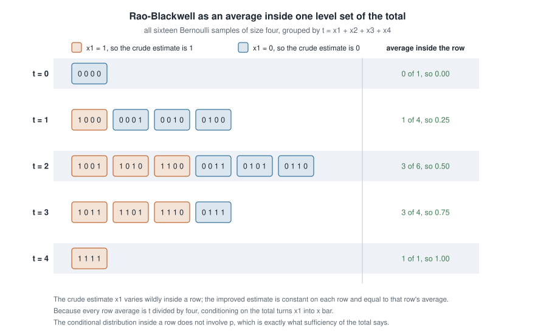
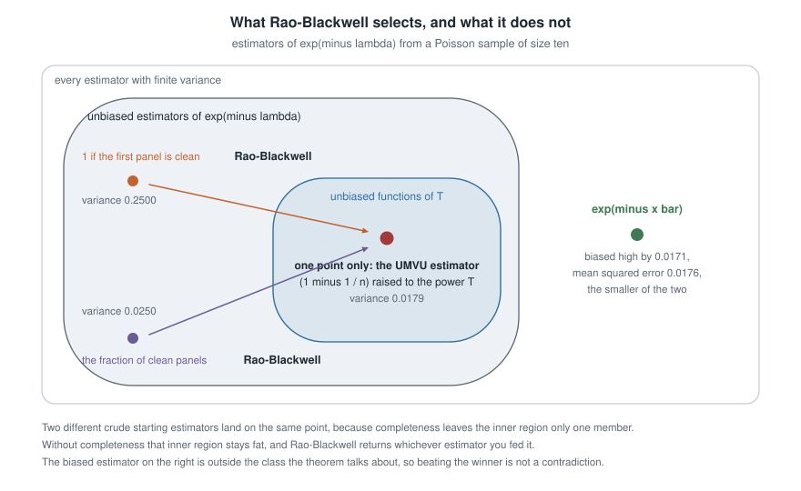
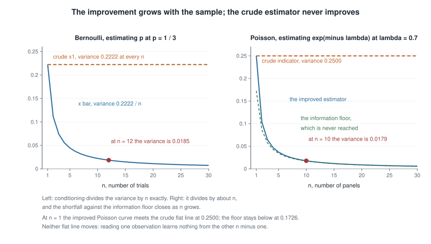
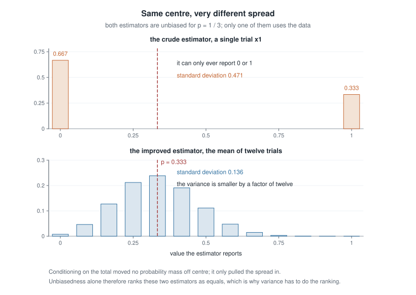

# Week 11 — Rao-Blackwell improvement, completeness, and UMVU estimation

## Where this week starts

Week 10 handed you a conservation law. For a Bernoulli sample the total $T = \sum_{i=1}^{n} X_i$ carries everything about $p$ that the full list of zeros and ones carries; for Uniform($0, \theta$) the maximum $X_{(n)}$ does. Once you know $T$, whatever remains of the sample is a lottery whose odds do not involve $\theta$. What sufficiency did not do was build anything: it named what may be discarded, not what to compute.

This week converts that law into an operator. Hand it any unbiased estimator, however crude, together with a sufficient statistic, and it returns an unbiased estimator whose variance is no larger — usually much smaller. The recipe is one line: replace the estimator by its conditional expectation given the sufficient statistic, and the proof is Week 0's variance decomposition used once. The striking part is that the starting estimator may be indefensible: begin with one that ignores eleven of your twelve observations and can only ever report zero or one, and the operator returns the sample mean.

Two questions survive. Does conditioning ever fail to improve, and does the destination depend on where you started? The first has a slightly deflating reply: the improvement is strict unless the estimator you fed in was already a function of the sufficient statistic. The second needs a new idea, **completeness**, a richness condition on the family of distributions of $T$. When it holds, $T$ carries at most one unbiased estimator, so every crude starting point is funnelled to one destination, which Lehmann-Scheffe promotes to a **uniformly minimum variance unbiased** estimator — best at every parameter value at once, among all unbiased estimators.

Read that last clause carefully, because the page closes by attacking it. UMVU is optimality *inside the unbiased class*, and Week 6 already showed that class is not sacred: in two of the three models below, a biased estimator has smaller mean squared error than the UMVU winner. By Thursday you should be able to find a complete sufficient statistic in an unfamiliar one-parameter model, condition any unbiased estimator at all, and say what the result is optimal among — and where that guarantee stops.

### Why this matters downstream

A fabrication line reports the fraction of panels expected to leave with no surface flaw. Flaw counts are modelled as Poisson($\lambda$), so the quantity wanted is $e^{-\lambda}$, and the natural move is to fit $\hat\lambda = \bar{x}$ and report $e^{-\bar{x}}$. That estimator is biased upward at every sample size, by an amount depending on $n$ and $\lambda$ that nobody reading the report can see. This week produces the unique unbiased estimator instead, $(1 - 1/n)^{T}$; on the data below the two differ in the second decimal place, $0.4783$ against $0.4966$. Which belongs in the report depends on whether you are scored on bias or on squared error — a decision you cannot make without knowing both exist.

The structural stake is Week 12. The Cramer-Rao bound says any *unbiased* estimator has variance at least $1/(nI_1(\theta))$, and that theorem is only interesting if the unbiased class has a best member to compare the bound against. Lehmann-Scheffe supplies it. When the UMVU variance sits strictly above the bound at every finite $n$, as it does for $e^{-\lambda}$ below, the bound is not attainable, and hunting for an estimator to attain it is wasted effort.

## What you will be able to do

- Prove the Rao-Blackwell theorem from the variance decomposition and name which hypothesis each step consumes.
- Compute $\mathbb{E}[\delta(X) \mid T = t]$ in a discrete model by counting arrangements, and in a continuous model by symmetry.
- Verify completeness for the Bernoulli, Poisson and Uniform($0, \theta$) families by turning the unbiased-estimator-of-zero condition into a statement about polynomials, power series or integrals.
- Apply Lehmann-Scheffe to certify an estimator as UMVU, and state which class that optimality is relative to.
- Exhibit a family whose minimal sufficient statistic is not complete, and show uniqueness failing there.
- Describe a simulation that checks a claimed risk improvement, and say what it can and cannot establish.

## Words worth owning

| Term | What it means in this course |
|------|------------------------------|
| Rao-Blackwellization | Replacing $\delta(X)$ by $\mathbb{E}[\delta(X) \mid T]$ for a sufficient $T$; bias is preserved, variance cannot rise. |
| Fibre of $T$ | The set of samples sharing one value of $T$, also called a level set; conditioning averages over a fibre. |
| Complete statistic | $T$ such that $\mathbb{E}_\theta[g(T)] = 0$ for every $\theta$ forces $g(T) = 0$ with probability one — no nonzero unbiased estimator of zero can be built from $T$. |
| Unbiased estimator of zero | A statistic with mean zero for every $\theta$. Completeness says $T$ admits only the trivial one. |
| UMVU estimator | An unbiased estimator whose variance is smallest among unbiased estimators *at every* $\theta$ simultaneously, not just at one. |
| Lehmann-Scheffe theorem | Complete plus sufficient plus unbiased, and a function of $T$, implies UMVU and unique. |
| Ancillary statistic | A statistic whose distribution does not depend on $\theta$ at all — the opposite extreme from sufficiency. |

## Conditioning as an improvement operator

Let $X = (X_1, \dots, X_n)$ be the sample, drawn from $f(x \mid \theta)$ with $\theta \in \Theta$, and let $T = T(X)$ be sufficient for $\theta$. Let $\delta(X)$ be any estimator of a target $g(\theta)$ with $\mathbb{E}_\theta[\delta(X)^2] < \infty$ for every $\theta$. Define the **Rao-Blackwellized** estimator

$$\eta(T) = \mathbb{E}\left[\delta(X) \mid T\right].$$

Three claims make up the theorem. First, $\eta$ is a statistic, so it can actually be computed from data. Second, $\mathbb{E}_\theta[\eta(T)] = \mathbb{E}_\theta[\delta(X)]$ for every $\theta$, so bias — including zero bias — is carried across unchanged. Third,

$$\operatorname{Var}_\theta\{\eta(T)\} \le \operatorname{Var}_\theta\{\delta(X)\} \quad \text{for every } \theta,$$

with equality at a given $\theta$ if and only if $\delta(X) = \eta(T)$ with $P_\theta$-probability one.

### The variance decomposition does the work

The second claim is the tower property: $\mathbb{E}_\theta[\mathbb{E}[\delta \mid T]] = \mathbb{E}_\theta[\delta]$. The third is the variance decomposition from Week 0, applied to $\delta$ and $T$:

$$\operatorname{Var}_\theta(\delta) = \mathbb{E}_\theta\left[\operatorname{Var}(\delta \mid T)\right] + \operatorname{Var}_\theta\left(\mathbb{E}[\delta \mid T]\right) = \mathbb{E}_\theta\left[\operatorname{Var}(\delta \mid T)\right] + \operatorname{Var}_\theta\{\eta(T)\}.$$

The first term on the right is an expectation of a variance, so it is never negative, and rearranging gives the inequality at once. It also gives the exact amount saved: the variance removed is the average within-fibre variance of $\delta$. That term vanishes precisely when $\delta$ does not vary within fibres — when $\delta$ was already a function of $T$ — which is the equality condition above.

Because the bias is unchanged and mean squared error splits as squared bias plus variance, the same line upgrades to a risk statement without any extra assumption:

$$\mathrm{MSE}_\theta\{\eta(T)\} = \mathrm{MSE}_\theta\{\delta(X)\} - \mathbb{E}_\theta\left[\operatorname{Var}(\delta \mid T)\right].$$

So the operator improves biased estimators too; it simply cannot repair their bias. Nor is the improvement special to squared error: for any loss $L(a, g(\theta))$ convex in its first argument, conditional Jensen gives $L(\mathbb{E}[\delta \mid T], g(\theta)) \le \mathbb{E}[L(\delta, g(\theta)) \mid T]$, and taking expectations shows the conditioned estimator has risk no larger. One inequality covers every convex loss.

One reading is worth carrying. Among square-integrable functions of the data, the functions of $T$ form a closed subspace and $\mathbb{E}[\cdot \mid T]$ projects onto it, so the decomposition is Pythagoras: Rao-Blackwell is projection, and projection never lengthens a vector.

### Why the statistic has to be sufficient

Notice where sufficiency entered. Not in the inequality — the variance decomposition holds for conditioning on *any* statistic. It entered in the first claim, that $\eta$ is a statistic at all. In general $\mathbb{E}[\delta(X) \mid T = t]$ is computed from the conditional distribution of $X$ given $T = t$, which normally depends on $\theta$, so the result is a function of $t$ and $\theta$ both and cannot be evaluated from data. Sufficiency is exactly the condition that this conditional law is free of $\theta$.

The failure is easy to see. Take $X_1, \dots, X_n$ independent $N(\mu, 1)$, take $\delta = \bar{X}$, and condition on $T = X_1$, which is not sufficient. Independence gives

$$\mathbb{E}[\bar{X} \mid X_1 = x_1] = \frac{x_1}{n} + \frac{n-1}{n}\,\mu,$$

which contains the unknown $\mu$. It has a smaller variance than $\bar{X}$ in the formal sense of the decomposition, and it is useless, because you cannot compute it without already knowing what you are estimating. Sufficiency stops the operator from cheating.

### Reading the improvement as an average over a fibre

The mechanics are clearest when the sample space is small enough to draw. Take $n = 4$ independent Bernoulli($p$) trials, so there are sixteen possible samples, and take $T = \sum_i X_i$, sufficient by factorization. The five fibres of $T$ are the groups of samples sharing a total, and Week 10 verified that, given $T = t$, the $\binom{4}{t}$ arrangements of $t$ ones are equally likely whatever $p$ is — sufficiency in its most concrete form.

{fig-alt="Five rows of chips show all sixteen binary samples of length four grouped by their total; chips whose first entry is one are shaded orange, and each row's average is printed on the right as 0.00, 0.25, 0.50, 0.75 and 1.00."}

Read the figure one row at a time. The crude estimator is $\delta(X) = X_1$, unbiased because $\mathbb{E}[X_1] = p$: orange chips are samples where it reports one, blue chips where it reports zero. In the row $t = 2$ it reports one on three of the six samples, so its average over that fibre is $0.50$; the same count gives $1/4$ at $t = 1$ and $3/4$ at $t = 3$. Every row average is $t/4$, which is $\bar{x}$.

That is the whole theorem in miniature. The conditional distribution is uniform over the arrangements, so the conditional expectation is an unweighted average, and the count of arrangements with a one in the first position is $\binom{n-1}{t-1}$ out of $\binom{n}{t}$, giving

$$\mathbb{E}[X_1 \mid T = t] = \frac{\binom{n-1}{t-1}}{\binom{n}{t}} = \frac{t}{n}.$$

The crude estimator jumps within a row and the improved one is flat on it, so the within-row variation is exactly what the decomposition promised to remove.

## Completeness and the uniqueness it buys

Rao-Blackwell improves, but it does not select. Feed it two different unbiased starting estimators and, as far as the theorem is concerned, you may get two different unbiased functions of $T$ with different variances. Completeness rules that out.

### What completeness demands, and how you check it

A statistic $T$ is **complete** for the family $\{P_\theta : \theta \in \Theta\}$ if, for every function $g$ with $\mathbb{E}_\theta \lvert g(T) \rvert < \infty$,

$$\mathbb{E}_\theta[g(T)] = 0 \ \text{ for every } \theta \in \Theta \quad \Longrightarrow \quad P_\theta\{g(T) = 0\} = 1 \ \text{ for every } \theta \in \Theta.$$

In words: the only unbiased estimator of zero you can build out of $T$ is the zero estimator. The consequence follows in one step. If $\eta_1(T)$ and $\eta_2(T)$ are both unbiased for the same $g(\theta)$, then $\eta_1 - \eta_2$ has mean zero for every $\theta$, so completeness forces $\eta_1 = \eta_2$ almost surely: **there is at most one unbiased estimator that is a function of $T$**.

Completeness is a property of the whole family, not of a single distribution, and it needs $\Theta$ rich. Verifying it means turning the displayed condition into an algebraic one. Three verifications to be able to reproduce:

- **Bernoulli.** With $T \sim \mathrm{Bin}(n, p)$ and $r = p/(1-p)$, the condition $\sum_{t=0}^{n} g(t)\binom{n}{t}p^{t}(1-p)^{n-t} = 0$ becomes $(1-p)^{n}\sum_{t=0}^{n} g(t)\binom{n}{t} r^{t} = 0$. As $p$ runs over $(0,1)$, $r$ runs over $(0, \infty)$, so a polynomial of degree at most $n$ vanishes on an interval; all its coefficients are zero; and since $\binom{n}{t} \ne 0$, every $g(t) = 0$.
- **Poisson.** With $T \sim \mathrm{Poisson}(n\lambda)$, the condition is $e^{-n\lambda}\sum_{t \ge 0} g(t)(n\lambda)^{t}/t! = 0$ for all $\lambda > 0$. A power series vanishing on an interval has all coefficients zero, so again $g \equiv 0$.
- **Uniform($0, \theta$).** Here $T = X_{(n)}$ has density $n t^{n-1}/\theta^{n}$ on $(0, \theta)$, so the condition reads $\int_0^{\theta} g(t)\,t^{n-1}\,dt = 0$ for every $\theta > 0$. Differentiating in $\theta$ gives $g(\theta)\theta^{n-1} = 0$ for almost every $\theta > 0$, hence $g = 0$ almost everywhere.

The third verification shows that completeness is not the private property of exponential families. Uniform($0, \theta$) is not one — its support moves — and $X_{(n)}$ is complete all the same.

For exponential families a theorem saves the work. Write the density as $f(x \mid \psi) = h(x)\exp\{\sum_{j=1}^{k}\psi_j T_j(x) - A(\psi)\}$, where $\psi = (\psi_1, \dots, \psi_k)$ is the natural parameter and $T_1(x), \dots, T_k(x)$ are the components of the vector statistic $T = (T_1, \dots, T_k)$; $\eta$ stays reserved for the conditioned estimator above. If the natural parameter space contains an open rectangle in $\mathbb{R}^{k}$, then $T$ is complete as well as sufficient. That open-set requirement does real work. A *curved* family, in which $\psi$ is confined to a lower-dimensional curve, generally loses completeness: for $N(\theta, \theta^{2})$ the pair $(\sum_i X_i, \sum_i X_i^{2})$ is minimal sufficient but not complete, because the single unknown $\theta$ ties the two natural parameters together. Shrinking $\Theta$ does the same — restrict a Bernoulli model to $p \in \{1/3, 2/3\}$ and completeness becomes two linear equations in $n+1$ unknowns, which for $n \ge 2$ has a nonzero root.

### The Lehmann-Scheffe theorem

**Statement.** Let $T$ be complete and sufficient for $\theta$, and let $\eta(T)$ be an unbiased estimator of $g(\theta)$ with finite variance. Then $\eta(T)$ is UMVU for $g(\theta)$, and it is the only UMVU estimator up to almost-sure equality.

**Derivation.** Let $\delta(X)$ be any unbiased estimator of $g(\theta)$ with finite variance. Rao-Blackwellize it: $\eta_\delta(T) = \mathbb{E}[\delta \mid T]$ is unbiased for $g(\theta)$ and has variance no larger than $\delta$. Now both $\eta$ and $\eta_\delta$ are unbiased functions of $T$, so $\mathbb{E}_\theta[\eta(T) - \eta_\delta(T)] = 0$ for every $\theta$, and completeness forces $\eta = \eta_\delta$ almost surely. Therefore

$$\operatorname{Var}_\theta\{\eta(T)\} = \operatorname{Var}_\theta\{\eta_\delta(T)\} \le \operatorname{Var}_\theta\{\delta(X)\} \quad \text{for every } \theta,$$

and since $\delta$ was arbitrary, $\eta$ is UMVU. For uniqueness, suppose $\delta$ is unbiased with $\operatorname{Var}_\theta(\delta) = \operatorname{Var}_\theta(\eta)$ for all $\theta$. Then the Rao-Blackwell inequality holds with equality, so $\delta = \mathbb{E}[\delta \mid T] = \eta$ almost surely.

{fig-alt="Nested regions: all finite-variance estimators, then the unbiased ones, then the unbiased functions of T as a point marked UMVU at variance 0.0179. Two crude estimators arrow into it; a biased one sits outside at MSE 0.0176."}

The figure is the theorem's geography for the Poisson example below. Two crude unbiased estimators sit in the outer band, variances $0.2500$ and $0.0250$; both arrows land on the same point, because the inner region has one member. So two recipes are interchangeable: guess an unbiased function of $T$ and stop, or start anywhere unbiased and condition. Guessing is faster; conditioning always works. The green point outside the unbiased region is what students forget — a biased estimator with mean squared error $0.0176$ against the winner's $0.0179$, simply outside the competition.

::: {.callout-note}
**A second dividend of completeness — Basu's theorem.** If $T$ is complete sufficient and $A$ is ancillary, meaning its distribution does not depend on $\theta$, then $T$ and $A$ are independent. In $N(\mu, \sigma^{2})$ with $\sigma^{2}$ known, $\bar{X}$ is complete sufficient for $\mu$ and the distribution of $S^{2}$ is free of $\mu$, so the two are independent — Week 4's least obvious fact, with no orthogonal transformation.
:::

### An incomplete family, where uniqueness fails

Let $X_1, \dots, X_n$ be independent and uniform on $(\theta, \theta + 1)$, with $\theta \in \mathbb{R}$ unknown — known width, unknown position. Factorization gives the minimal sufficient statistic $T = (X_{(1)}, X_{(n)})$, two-dimensional for a one-dimensional parameter, which is the warning sign. Put $Y_i = X_i - \theta$, so the $Y_i$ are uniform on $(0,1)$ and the range $R = X_{(n)} - X_{(1)} = Y_{(n)} - Y_{(1)}$ has a distribution free of $\theta$. Since $\mathbb{E}[Y_{(n)}] = n/(n+1)$ and $\mathbb{E}[Y_{(1)}] = 1/(n+1)$,

$$\mathbb{E}_\theta\left[R - \frac{n-1}{n+1}\right] = 0 \quad \text{for every } \theta,$$

and $R$ is a continuous random variable, so this statistic is not zero. That is a nonzero unbiased estimator of zero built from $T$: the family is not complete.

Uniqueness dies with it. Both $\hat\theta_1 = X_{(1)} - \frac{1}{n+1}$ and $\hat\theta_2 = X_{(n)} - \frac{n}{n+1}$ are unbiased functions of the minimal sufficient statistic, and each equals its own Rao-Blackwellization, so conditioning returns whichever one you fed in. Their variances are equal, both $n/\{(n+1)^{2}(n+2)\}$, but the midrange-based $\hat\theta_3 = \frac{1}{2}(X_{(1)} + X_{(n)}) - \frac{1}{2}$ is also unbiased and, using $\operatorname{Cov}(Y_{(1)}, Y_{(n)}) = 1/\{(n+1)^{2}(n+2)\}$, has variance

$$\operatorname{Var}(\hat\theta_3) = \frac{1}{4}\cdot\frac{2n + 2}{(n+1)^{2}(n+2)} = \frac{1}{2(n+1)(n+2)}.$$

At $n = 5$ that is $1/84 = 0.0119$ against $5/252 = 0.0198$ for either endpoint estimator, a ratio of $5/3$. Three unbiased functions of the minimal sufficient statistic, two distinct variances, and no theorem to pick between them: Lehmann-Scheffe is silent, and Rao-Blackwell has no purchase because there is nothing left to condition away. The midrange wins this comparison, but nothing certifies it as UMVU — with completeness gone, a smaller variance is a fact about three estimators, not a theorem about all of them.

## Checking the improvement by simulation

A variance formula is a claim, and this course audits claims. Simulation is the third of Week 8's four checks, and it is easy here because both estimators are computed from the same samples. Below is the Poisson comparison of the second worked example, at $n = 10$ and $\lambda = 0.7$.

```
set.seed(11)
n      <- 10
lam    <- 0.7
reps   <- 200000
target <- exp(-lam)                      # 0.4965853, the quantity being estimated

x   <- matrix(rpois(reps * n, lam), nrow = reps)
tot <- rowSums(x)

crude <- as.numeric(x[, 1] == 0)         # unbiased, but it reads only the first panel
umvu  <- (1 - 1 / n)^tot                 # the Rao-Blackwellized estimator
plug  <- exp(-tot / n)                   # the maximum likelihood plug-in

c(mean(crude), mean(umvu), mean(plug))   # about 0.497, 0.497, 0.514
c(mean((crude - target)^2),              # about 0.2500
  mean((umvu  - target)^2),              # about 0.0179
  mean((plug  - target)^2))              # about 0.0176

# the last two are computed on the same samples, so difference them pairwise
d <- (umvu - target)^2 - (plug - target)^2
c(mean(d), sd(d) / sqrt(reps))           # about 0.00032, with standard error 0.00001

# for contrast, the standard error of the same gap read off two unpaired averages
sqrt(var((umvu - target)^2) / reps +
     var((plug - target)^2) / reps)      # about 0.00008, nine times larger
```

Three things in that output deserve comment. The first two means agree with $e^{-0.7}$ to within Monte Carlo error, as unbiasedness predicts, while the third sits about $0.017$ high — the bias of the plug-in, visible without algebra. The mean squared errors reproduce the analytic values derived below. And pairing is the honest way to compare two estimators evaluated on the same data: differencing removes the shared noise, so the gap of $0.00032$ carries a standard error of $0.00001$ instead of the $0.00008$ it would carry read off the two averages separately. Both clear the noise here, at four unpaired standard errors against thirty-six paired; but pairing resolves the gap nine times more sharply for free, and at a tenth of the replications only the paired comparison would see it.

{fig-alt="Two panels plot variance against n from 1 to 30. Each shows a dashed flat line for the crude estimator and a falling curve for the improved one, meeting at n equals 1; the Poisson panel adds a dashed information floor below."}

The flat lines are the crude estimators, which read a single observation and never improve; the falling curves are their conditioned versions. On the left, the Bernoulli variance at $p = 1/3$ falls as exactly $0.2222/n$, so the improvement factor is precisely $n$. On the right, for the Poisson estimand $e^{-\lambda}$ at $\lambda = 0.7$, the improved variance falls at close to the same rate, and the lower dashed curve is the Cramer-Rao floor of Week 12. The floor is never touched, though the gap closes as $n$ grows: at $n = 10$ the variance is $0.01788$ against a floor of $0.01726$, short by $3.6$ percent. At $n = 1$ the improved curve meets the flat line at $0.2500$, because with a single observation the improved estimator *is* the crude one — a coincidence that costs nothing to check and would catch an algebra slip. The floor joins neither of them there: at $n = 1$ it is $\lambda e^{-2\lambda} = 0.1726$, strictly below both.

Simulation cannot prove any of this. It agrees with the derivation at one parameter value and one sample size, in the presence of noise — evidence, not proof, and Week 8's caution applies. What it catches reliably is a sign error, a dropped factor of $n$, or a conditional distribution identified wrongly, all of which move the numbers far outside Monte Carlo error.

## Worked example — from one Bernoulli trial to the sample mean

**Setting.** A laboratory pressure-tests $n = 12$ independently manufactured seals. Each either leaks or does not, and the recorded sequence is

$$0,\ 1,\ 0,\ 0,\ 1,\ 0,\ 1,\ 0,\ 0,\ 0,\ 1,\ 0,$$

with $1$ denoting a leak. Model these as independent Bernoulli($p$), so $f(x \mid p) = p^{x}(1-p)^{1-x}$ for $x \in \{0,1\}$ and $0 < p < 1$, and let the estimand be $p$ itself. The total is $t = \sum_i x_i = 4$, and the first observation is $x_1 = 0$.

**Step one — a deliberately bad unbiased estimator.** Take $\delta(X) = X_1$. It is unbiased, since $\mathbb{E}_p[X_1] = p$, and indefensible: it discards eleven observations and reports $\hat p = 0$ here, a value the four recorded leaks refute. Its variance is $\operatorname{Var}_p(X_1) = p(1-p)$, which never shrinks with $n$, since it never reads the extra data.

**Step two — the sufficient statistic.** The joint mass function is $p^{t}(1-p)^{n-t}$ with $t = \sum_i x_i$, which factors as $g(t \mid p) \cdot h(x)$ with $h \equiv 1$, so $T = \sum_i X_i$ is sufficient by Week 10's criterion. Here $T \sim \mathrm{Bin}(n, p)$.

**Step three — condition.** Two routes to the same conditional expectation. By counting, as in the fibre figure, $\mathbb{E}[X_1 \mid T = t] = \binom{n-1}{t-1}/\binom{n}{t} = t/n$. By symmetry, the $X_i$ are exchangeable, so $\mathbb{E}[X_i \mid T]$ is the same for every $i$, while $\sum_{i=1}^{n}\mathbb{E}[X_i \mid T] = \mathbb{E}[T \mid T] = T$; dividing by $n$ gives $\mathbb{E}[X_1 \mid T] = T/n$. The Rao-Blackwellized estimator is therefore

$$\eta(T) = \frac{T}{n} = \bar{X}, \qquad \eta(4) = \frac{4}{12} = 0.3333.$$

**Step four — the variances.** $\operatorname{Var}_p(\bar{X}) = p(1-p)/n$, so the variance has been divided by exactly $n = 12$. At $p = 1/3$ the crude estimator has variance $0.2222$ and standard deviation $0.4714$; the improved one has variance $0.01852$ and standard deviation $0.1361$.

**Step five — audit the decomposition.** The theorem says the saving equals $\mathbb{E}_p[\operatorname{Var}(X_1 \mid T)]$. Given $T = t$ the variable $X_1$ is Bernoulli($t/n$), so $\operatorname{Var}(X_1 \mid T) = \frac{T}{n}\left(1 - \frac{T}{n}\right) = \bar{X}(1 - \bar{X})$, and

$$\mathbb{E}_p\left[\bar{X}(1-\bar{X})\right] = p - \left\{\operatorname{Var}_p(\bar{X}) + p^{2}\right\} = p(1-p) - \frac{p(1-p)}{n} = p(1-p)\,\frac{n-1}{n}.$$

Adding the improved variance $p(1-p)/n$ returns $p(1-p)$, which is $\operatorname{Var}_p(X_1)$ exactly. At $p = 1/3$ and $n = 12$ that reads $0.20370 + 0.01852 = 0.22222$. The decomposition closes, so no factor of $n$ has gone missing.

{fig-alt="Top panel: two bars at 0 and 1 with heights 0.667 and 0.333, standard deviation 0.471. Bottom panel: thirteen much shorter bars concentrated near 0.333, standard deviation 0.136. A dashed red line at p equals 0.333 runs through both."}

Both distributions are centred at $p = 1/3$ — the red line runs through the balance point of each — which is why unbiasedness alone cannot rank them. The top panel can only ever report $0$ or $1$; the bottom sits within $\pm 0.14$ of the truth.

**Step six — certify it.** The binomial family is complete, $T$ is sufficient, and $\bar{X}$ is an unbiased function of $T$, so Lehmann-Scheffe makes $\bar{X}$ the unique UMVU estimator of $p$. Week 12's bound is $p(1-p)/n$ here, which $\bar{X}$ attains exactly, so the unbiased class has a best member sitting on the information floor.

**Step seven — critique.** The certificate has two limits. It covers the unbiased class only: $\tilde p = (T+1)/(n+2)$ — Week 9's beta-binomial posterior mean at the uniform Beta(1,1) prior — is biased, and at $p = 1/3$ with $n = 12$ its bias is $5/14 - 1/3 = 0.02381$ and its variance $\operatorname{Var}(T)/14^{2} = 2.6667/196 = 0.01361$, for a mean squared error of $0.01417$ against the UMVU's $0.01852$. Best unbiased did not make $\bar{X}$ best. And it is conditional on the model: independence and a common $p$ across seals. If seals came in batches with batch-to-batch variation in $p$, $T$ would no longer be sufficient for anything scientifically interesting, and reducing twelve numbers to one would discard the batch structure a diagnostic needs.

### The same reasoning, transferred

Run the identical four moves in a model with nothing exponential about it. A sensor's output is uniform on $(0, \theta)$ and six independent readings, in volts, are $0.35$, $0.42$, $0.88$, $1.17$, $1.51$ and $1.94$, so $n = 6$ and $x_{(n)} = 1.94$.

Start crude. Since $\mathbb{E}[X_1] = \theta/2$, the estimator $\delta = 2X_1$ is unbiased for $\theta$, with $\operatorname{Var}(2X_1) = 4\theta^{2}/12 = \theta^{2}/3$. Here it reports $2(0.35) = 0.70$ volts, a ceiling below a reading already in the notebook — the refuted-estimate failure Week 7 flagged for $2\bar{X}$.

Condition on $T = X_{(n)}$, sufficient by factorization with an indicator. Given $X_{(n)} = t$, exchangeability makes each index equally likely to achieve the maximum, and given that it is not index one, $X_1$ is uniform on $(0, t)$. Hence

$$\mathbb{E}[X_1 \mid X_{(n)} = t] = \frac{1}{n}\,t + \frac{n-1}{n}\cdot\frac{t}{2} = \frac{(n+1)\,t}{2n}, \qquad \eta(T) = 2\,\mathbb{E}[X_1 \mid T] = \frac{n+1}{n}X_{(n)}.$$

Here $\eta = \frac{7}{6}(1.94) = 2.2633$ volts. Certify it: $X_{(n)}$ is complete, shown above by differentiating the integral, so Lehmann-Scheffe makes $\frac{n+1}{n}X_{(n)}$ the UMVU estimator of $\theta$ — precisely the bias-corrected estimator Week 6 produced by hand, now with a reason rather than a repair.

What stayed the same: a crude unbiased estimator reading one observation; a complete sufficient statistic; a conditional expectation from symmetry, not integration; a certificate from the same theorem. What changed is the size of the prize. Using $\operatorname{Var}\{X_{(n)}\} = n\theta^{2}/\{(n+2)(n+1)^{2}\}$ from Week 7,

$$\operatorname{Var}\left\{\frac{n+1}{n}X_{(n)}\right\} = \frac{(n+1)^{2}}{n^{2}}\cdot\frac{n\theta^{2}}{(n+2)(n+1)^{2}} = \frac{\theta^{2}}{n(n+2)},$$

which at $n = 6$ is $\theta^{2}/48$ against $\theta^{2}/3$: an improvement factor of $n(n+2)/3 = 16$, not $n = 6$. The extra gain is the $n^{-2}$ convergence rate of a sample maximum, the same irregularity that makes Week 12's information bound inapplicable here.

## Second worked example — the probability of a clean panel in a Poisson model

**Setting.** A fabrication line inspects $n = 10$ finished panels and records surface flaws per panel:

$$0,\ 2,\ 1,\ 0,\ 0,\ 1,\ 0,\ 3,\ 0,\ 0.$$

Model the counts as independent Poisson($\lambda$) with $\lambda > 0$. The total is $t = \sum_i x_i = 7$, so $\bar{x} = 0.7$, and six of the ten panels are clean. The estimand is not $\lambda$ but

$$\vartheta = \mathbb{P}_\lambda(X = 0) = e^{-\lambda},$$

the probability that a panel leaves with no flaw. This example strains a different joint from the first: the target is a nonlinear function of the parameter, and the obvious estimator is not the right one.

**Step one — three candidates before any theory.** The plug-in maximum likelihood estimate is $e^{-\bar{x}} = e^{-0.7} = 0.4966$, correct by Week 7's invariance property. The observed fraction of clean panels is $6/10 = 0.6$. A third emerges below. They disagree, so something has to choose.

**Step two — a crude unbiased estimator.** Take $\delta(X) = \mathbf{1}\{X_1 = 0\}$, which is $1$ when the first panel is clean. It is unbiased, since $\mathbb{E}_\lambda[\delta] = \mathbb{P}(X_1 = 0) = e^{-\lambda}$, and here it reports $\hat\vartheta = 1$ — a probability of one, from a data set with four flawed panels in it. At $\lambda = 0.7$ its variance is $\vartheta(1-\vartheta) = 0.2500$.

**Step three — the complete sufficient statistic.** The joint mass function is $e^{-n\lambda}\lambda^{t}/\prod_i x_i!$, which factors with $g(t \mid \lambda) = e^{-n\lambda}\lambda^{t}$, so $T = \sum_i X_i$ is sufficient; and $T \sim \mathrm{Poisson}(n\lambda)$, whose family was verified complete above.

**Step four — the conditional distribution.** For $0 \le k \le t$, independence and the fact that $\sum_{i \ge 2} X_i \sim \mathrm{Poisson}\{(n-1)\lambda\}$ give

$$\mathbb{P}(X_1 = k \mid T = t) = \frac{e^{-\lambda}\dfrac{\lambda^{k}}{k!}\cdot e^{-(n-1)\lambda}\dfrac{\{(n-1)\lambda\}^{t-k}}{(t-k)!}}{e^{-n\lambda}\dfrac{(n\lambda)^{t}}{t!}} = \binom{t}{k}\left(\frac{1}{n}\right)^{k}\left(1 - \frac{1}{n}\right)^{t-k}.$$

Every $\lambda$ has cancelled, as sufficiency promised: $X_1 \mid T = t$ is Binomial($t$, $1/n$), which is intuitive — the $t$ flaws scatter independently and uniformly across the $n$ panels.

**Step five — the improved estimator.** Setting $k = 0$,

$$\eta(T) = \mathbb{P}(X_1 = 0 \mid T) = \left(1 - \frac{1}{n}\right)^{T}, \qquad \eta(7) = (0.9)^{7} = 0.4783.$$

By Lehmann-Scheffe this is the UMVU estimator of $e^{-\lambda}$, and the unique unbiased function of $T$. Uniqueness is worth testing rather than trusting. The sample fraction of clean panels, $\frac{1}{n}\sum_i \mathbf{1}\{X_i = 0\}$, is also unbiased and is *not* a function of $T$; conditioning term by term and using exchangeability gives $\frac{1}{n}\cdot n\,(1 - 1/n)^{T}$ again. Two starting points, one destination.

**Step six — check unbiasedness independently.** Do not take the conditional argument on trust; sum the series. With $T \sim \mathrm{Poisson}(n\lambda)$ and any constant $c$, $\mathbb{E}[c^{T}] = e^{-n\lambda}\sum_{t \ge 0}(cn\lambda)^{t}/t! = e^{-n\lambda(1-c)}$. Putting $c = 1 - 1/n$ gives $n\lambda(1-c) = \lambda$, so $\mathbb{E}[\eta(T)] = e^{-\lambda}$ for every $\lambda$ and $n$. A second check costs nothing: at $n = 1$ the estimator is $0^{T} = \mathbf{1}\{T = 0\}$, the crude estimator, as it must be with nothing to average over.

**Step seven — the variance, and the floor beneath it.** Using the same identity with $c = (1-1/n)^{2}$, so that $n(1-c) = 2 - 1/n$,

$$\operatorname{Var}_\lambda\{\eta(T)\} = e^{-\lambda(2 - 1/n)} - e^{-2\lambda} = e^{-2\lambda}\left(e^{\lambda/n} - 1\right).$$

At $\lambda = 0.7$ and $n = 10$ this is $0.2466 \times 0.07251 = 0.01788$, against the crude estimator's $0.2500$ — a reduction by a factor of about $14$. Week 12's bound for a smooth $g$ is $\{g'(\lambda)\}^{2}/\{nI_1(\lambda)\}$; with $g(\lambda) = e^{-\lambda}$ and $I_1(\lambda) = 1/\lambda$, that floor is $\lambda e^{-2\lambda}/n = 0.01726$. Since $e^{u} - 1 > u$ for every $u > 0$, the UMVU variance exceeds the floor at every finite $n$, by an excess of order $n^{-2}$. And since the UMVU estimator is the best unbiased one, no unbiased estimator attains that bound at any $n$ — a useful negative result, free.

**Step eight — and the biased rival wins anyway.** Return to the plug-in $e^{-\bar{X}}$. Using $\mathbb{E}[c^{T}] = e^{-n\lambda(1-c)}$ with $c = e^{-1/n}$,

$$\mathbb{E}_\lambda\left[e^{-\bar{X}}\right] = e^{-n\lambda\left(1 - e^{-1/n}\right)} > e^{-\lambda},$$

because $1 - e^{-1/n} < 1/n$. At $\lambda = 0.7$, $n = 10$ the mean is $0.51369$, so the bias is $+0.01710$; the same identity at $c = e^{-2/n}$ gives a variance of $0.01727$ and a mean squared error of $0.01727 + 0.01710^{2} = 0.01756$, against the UMVU estimator's $0.01788$, which is just its variance. The biased plug-in wins by about two percent at this $\lambda$.

**Step nine — critique.** So which goes in the report? If the panels feed a downstream calculation where biases accumulate across many lines, unbiasedness is worth paying for and $0.4783$ is the number. If the loss really is squared error at one line, the plug-in is defensible and $0.4966$ is. Reporting one while believing the properties of the other is what is not defensible. Everything here assumed a single Poisson rate; overdispersion, the usual reality in flaw counts, leaves $T$ sufficient for the wrong model, and $e^{-\lambda}$ stops being the clean-panel probability.

## The misreading to avoid

**"Rao-Blackwell always gives the best estimator, so just condition and stop."** This is the week's standard error, and it is really four errors wearing one coat.

*Best among what?* The theorem ranks estimators by variance inside the unbiased class, and only completeness makes that ranking total. Without it the guarantee evaporates: in the Uniform($\theta, \theta+1$) model, all three unbiased functions of the minimal sufficient statistic equal their own Rao-Blackwellization, and no theorem ranks them. Rao-Blackwell there hands back whatever you put in.

*Improvement relative to what?* The operator improves on the estimator you started with, not on all estimators, and without a sufficient conditioning statistic it does not return a statistic at all: conditioning $\bar{X}$ on $X_1$ gave $x_1/n + (n-1)\mu/n$, containing the unknown parameter. That is not a worse estimator; it is not an estimator.

*Best unbiased is not best.* Even with completeness in hand, the winner can be beaten on mean squared error by something biased. This page has two instances with the arithmetic done: $(T+1)/(n+2)$ against $\bar{X}$, $0.01417$ against $0.01852$; and $e^{-\bar{X}}$ against $(1-1/n)^{T}$, $0.01756$ against $0.01788$. Week 6's uniform comparison was a third. Stein's phenomenon is the famous instance — in three or more dimensions the obvious unbiased estimator of a normal mean vector is inadmissible under total squared error — and the pattern is the same throughout: a little bias buys a lot of variance.

*Unbiased is not the same as sensible.* The sharpest illustration is one observation from Poisson($\lambda$) with estimand $e^{-2\lambda}$. Here $T = X_1$ is complete sufficient, and $\mathbb{E}[(-1)^{X}] = e^{-\lambda}\sum_{k \ge 0}(-\lambda)^{k}/k! = e^{-2\lambda}$, so $(-1)^{X_1}$ is unbiased and, as the unique unbiased function of a complete sufficient statistic, is UMVU. It estimates a number between zero and one by $+1$ on even counts and $-1$ on odd ones. The theorem is correct and the estimator ridiculous, which tells you what the theorem promises.

Two smaller confusions travel with it. Conditioning does not always strictly reduce variance: if $\delta$ is already a function of $T$, then $\operatorname{Var}(\delta \mid T) = 0$ and nothing happens. And UMVU is not maximum likelihood relabelled. They coincide in the Bernoulli example, a coincidence of a linear estimand; in the Poisson example $(1-1/n)^{T}$ and $e^{-\bar{X}}$ differ, and the invariance that makes maximum likelihood portable is what destroys unbiasedness under a nonlinear $g$.

## Practice on your own

These are for self-checking, not submission. Work them with a pencil before running anything.

1. **A quadratic estimand.** For an independent Bernoulli($p$) sample, start from $\delta = X_1 X_2$, unbiased for $p^{2}$, and condition on $T = \sum_i X_i$ to obtain $T(T-1)/\{n(n-1)\}$. Verify unbiasedness from $\mathbb{E}[T(T-1)]$, certify it with Lehmann-Scheffe, and explain in one sentence why $\bar{X}^{2}$ is not unbiased for $p^{2}$.
2. **One more Poisson target.** Estimate $\mathbb{P}(X = 1) = \lambda e^{-\lambda}$ from an independent Poisson sample. Begin from $\mathbf{1}\{X_1 = 1\}$, use the Binomial($t$, $1/n$) conditional law from the second worked example, and reach $\frac{T}{n}\left(1 - \frac{1}{n}\right)^{T-1}$. Check unbiasedness by summing the series, and evaluate it at $n = 10$, $t = 7$.
3. **A counterexample hunt.** In the Uniform($\theta$, $\theta+1$) model, show that $R - \frac{n-1}{n+1}$ has mean zero for every $\theta$, then find a fourth unbiased estimator of $\theta$ built from $(X_{(1)}, X_{(n)})$ whose variance differs from both values in the text. Say what feature of the model produced a two-dimensional minimal sufficient statistic for one parameter.
4. **Audit two plausible arguments.** (a) "For Uniform($0,\theta$), $X_{(n)}$ is complete and sufficient and it is also the maximum likelihood estimator, so it is UMVU for $\theta$." (b) "For the same model, $2\bar{X}$ is unbiased for $\theta$ and $X_{(n)}$ is complete sufficient, so by Lehmann-Scheffe $2\bar{X}$ is UMVU." Each fails on one hypothesis. Name it in each case, and repair the second by conditioning.
5. **A simulation to describe.** Check the uniform transfer above: draw many samples of size $n = 6$ from Uniform($0, 1$), compute $2X_1$ and $\frac{7}{6}X_{(6)}$ on each, and compare the two sample means with $1$ and the two sample variances with $1/3$ and $1/48$. State in advance what you expect of each, then say what you would conclude if the means matched but the variance ratio came out near $6$.

## Where to read more

- [MIT OpenCourseWare 18.655, Mathematical Statistics](https://ocw.mit.edu/courses/18-655-mathematical-statistics-spring-2016/) — lecture notes on Rao-Blackwell, completeness and UMVU estimation, with the exponential-family completeness theorem in its general form.
- [MIT OpenCourseWare 18.650, Statistics for Applications](https://ocw.mit.edu/courses/18-650-statistics-for-applications-fall-2016/) — a gentler treatment of sufficiency and estimator comparison.
- [Penn State STAT 414, Introduction to Probability Theory](https://online.stat.psu.edu/stat414/) — the binomial conditional law of a Poisson component given the total, and the moments of uniform order statistics.
- [The R Project](https://www.r-project.org/) — home of the software in the simulation block; `rpois`, `rowSums` and `var` all ship with R.
- Hogg, McKean and Craig's optional chapter on sufficiency covers Rao-Blackwell, completeness, Lehmann-Scheffe and Basu in that order.
- Course pages: the [resources index](../resources/index.qmd) and the [schedule](../schedule.qmd).

## Where this goes next

Week 12 asks the question this page kept deferring: is there a floor under the variance of an unbiased estimator, and does maximum likelihood reach it? The Cramer-Rao bound supplies the floor, Lehmann-Scheffe the best unbiased estimator to compare it against; together they settle whether the bound is attainable. You have seen both outcomes — $\bar{X}$ sits exactly on the floor in the Bernoulli model, $(1-1/n)^{T}$ stays strictly above it at every finite $n$ — and the uniform transfer previews the third case, where regularity fails and the bound does not apply. Read [Week 12](week-12.qmd) with those three examples in hand, and revisit [Week 10](week-10.qmd) if any factorization step went past quickly.

Two threads run out of this week. The Bayesian one is quiet but complete: a posterior depends on the data only through a sufficient statistic, so a posterior mean is already a function of $T$ and can never be improved by Rao-Blackwellization — the repair this page performs is one a Bayes estimator never needs, and the $(T+1)/(n+2)$ of step seven is the same observation from the other side. The computational thread: replacing a simulated quantity by a conditional expectation available in closed form is standard Monte Carlo practice, called Rao-Blackwellization for exactly the reason derived above. The [notes index](../index.qmd) has the full sequence.
