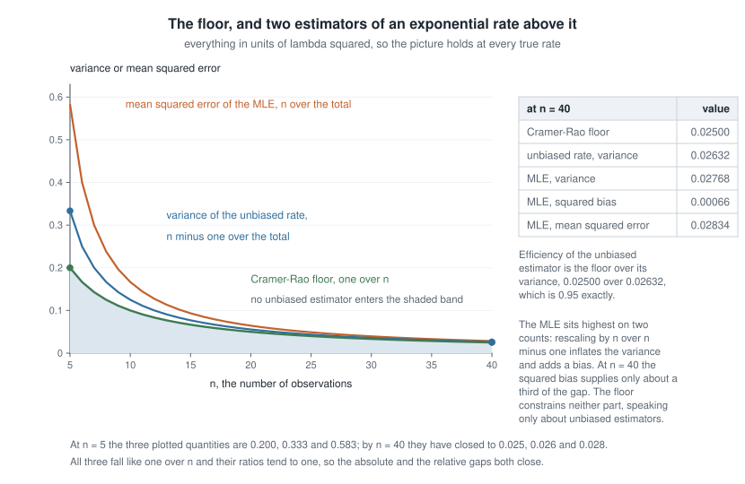
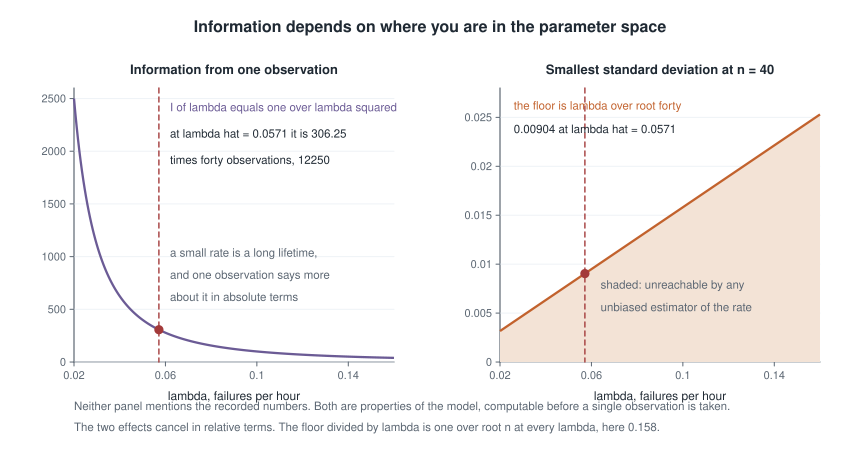
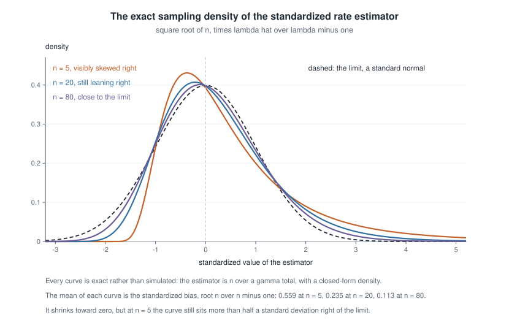
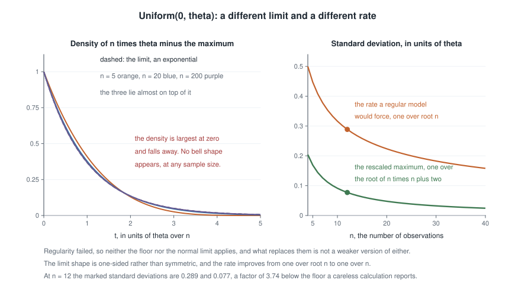

# Week 12 — Information bounds, efficiency, and asymptotic normality

## Where this week starts

Week 11 closed with a comparison. Rao-Blackwell improves any unbiased estimator by conditioning on a sufficient statistic, and when that statistic is complete, Lehmann-Scheffe promotes the improved version to uniformly minimum variance among unbiased estimators. That is a genuine optimality claim, but a relative one: it says your estimator beats the others in a set, not how good the best member of that set is. It gives you nothing to say when someone reports a variance you find implausible.

This week supplies the missing absolute standard. Before any estimator exists — before you have data, in fact — the model itself pins down a number below which the variance of an unbiased estimator cannot go. That number is built from the Fisher information of Week 7, where it measured the sharpness of a log-likelihood peak and supplied a standard error by convention. Here it becomes the denominator of a floor, $1/(n I_1(\theta))$, and that convention finally gets its theorem.

Two questions organize the page, each with an honest complication. Is there a floor? Yes, the Cramer-Rao bound, easy to prove once you notice that the score is mean-zero and has a fixed covariance with every unbiased estimator. But it speaks about unbiased estimators in regular models, and both qualifications do real work. Does maximum likelihood reach the floor? Asymptotically yes: $\sqrt{n}(\hat\theta - \theta)$ has a normal limit whose variance is the reciprocal of the information. At finite $n$, though, "asymptotically" is a promise about a limit rather than a description of your estimate, and this page makes that difference numerical rather than rhetorical.

Then the uniform, one last time. Since Week 3 this course has kept a family whose support moves with the parameter, and since Week 7 you have known the score identities fail for it. Here the failure pays off spectacularly: the bound cannot be written down at all, and the natural estimator of the endpoint has standard deviation of order $1/n$ rather than $1/\sqrt{n}$ — doing what a careless reading of the theorem calls impossible. By Thursday you should be able to decide before computing whether a floor applies, write it correctly when it does, and say how far a moderate sample sits from the limit theorem you quote.

### Why this matters downstream

Here is the concrete stake. A laboratory reports an unbiased estimate of a sensor's full-scale voltage with a standard error of $0.24$ volts from twelve readings. A reviewer objects: the model has information $1/\theta^{2}$ per observation, so no unbiased estimator can have standard deviation below $\theta/\sqrt{12} \approx 0.89$ volts, and the reported figure is impossible. But the reviewer has computed an information for a model whose support moves with the parameter, where the derivative-under-the-integral step behind the bound is illegal, and used it to reject the best unbiased estimator available. Both are confident, one is wrong, and telling them apart takes the conditions, not just the inequality.

The structural stake is larger. Week 13's Wald interval is this week's limit theorem with a normal quantile attached, so every caveat here becomes a coverage failure there. Sample-size planning uses $1/(n I_1(\theta))$ to decide how many observations buy a target precision, and the standard errors printed by regression and generalized-linear-model software are the multiparameter version of the same formula with the information matrix inverted. The posterior has a matching limit, which is why Bayesian and frequentist intervals nearly coincide in large regular samples.

## What you will be able to do

- Compute $I_1(\theta)$ for a one-parameter family by both routes, and write the Cramer-Rao floor for $\theta$ and for a differentiable function $g(\theta)$.
- Check the regularity conditions before quoting the bound, and say which one fails when it does.
- Decide whether a given unbiased estimator attains the floor, using the equality condition rather than by comparing numbers.
- Report the efficiency of an estimator and the relative efficiency of two, and translate an efficiency of $0.5$ into a statement about sample size.
- Sketch the Taylor-expansion proof of $\sqrt{n}(\hat\theta - \theta) \xrightarrow{d} N(0, 1/I_1(\theta))$ and name which theorem does each step.
- Attach a standard error to a maximum likelihood estimate from observed information, and quantify how far a moderate sample sits from the limit.

## Words worth owning

| Term | What it means in this course |
|------|------------------------------|
| Cramer-Rao bound | The inequality $\operatorname{Var}_\theta(T) \ge \{g'(\theta)\}^2 / (n I_1(\theta))$ for any unbiased $T$ of $g(\theta)$, valid only under the regularity conditions of Week 7. |
| Information floor | The right-hand side of that inequality, read as a property of the model at a particular $\theta$. It exists before any estimator does. |
| Efficiency | The floor divided by an estimator's variance, a number in $(0, 1]$. An efficiency of $0.95$ means the estimator does the work of $0.95n$ observations. |
| Relative efficiency | The ratio of two estimators' variances, always stated in the order that makes the better estimator's efficiency exceed one. |
| Attainment | Equality in the bound. It happens only when the score is a multiple of the centred estimator, which forces a one-parameter exponential family. |
| Asymptotic variance | The variance of the limit of $\sqrt{n}(\hat\theta - \theta)$, divided by $n$ when quoted on the estimator's own scale. |
| Asymptotically efficient | Having asymptotic variance equal to $1/(nI_1(\theta))$: reaching the floor in the limit, whatever happens at finite $n$. |
| Superefficiency | Beating $1/(nI_1(\theta))$ asymptotically at isolated parameter values, at the cost of terrible behaviour nearby. It is why "the MLE is optimal" needs care. |

## The Cramer-Rao floor on the variance of an unbiased estimator

Let $X_1, \dots, X_n$ be independent draws from $f(x \mid \theta)$ with $\theta$ in an open interval $\Theta \subseteq \mathbb{R}$, and write $f_n(x \mid \theta) = \prod_{i=1}^{n} f(x_i \mid \theta)$ for the joint density of the sample. Let $T = T(X_1, \dots, X_n)$ be any statistic with finite variance and $\mathbb{E}_\theta[T] = g(\theta)$ for every $\theta$, with $g$ differentiable. The word *every* carries the argument: unbiasedness is not a fact at one parameter value but an identity in $\theta$, and an identity can be differentiated.

Assume the Week 7 regularity conditions: the support $\{x : f(x \mid \theta) > 0\}$ does not depend on $\theta$; $f$ is differentiable in $\theta$ on that support; differentiation may be moved inside the integral both for $\int f_n$ and for $\int T f_n$; and $0 < I_1(\theta) < \infty$. Under these,

$$\operatorname{Var}_\theta(T) \ge \frac{\{g'(\theta)\}^{2}}{n I_1(\theta)}.$$

### A covariance inequality, and where the work sits

The proof is three lines and one idea, and the idea is that the score has exactly the same covariance with every unbiased estimator. Write $U(\theta) = \partial_\theta \log f_n(X \mid \theta)$ for the sample score. From Week 7, $\mathbb{E}_\theta[U(\theta)] = 0$ and $\operatorname{Var}_\theta\{U(\theta)\} = n I_1(\theta)$, both under the same conditions. Now compute the covariance between the estimator and the score:

$$\operatorname{Cov}_\theta\{T, U(\theta)\} = \mathbb{E}_\theta[T\,U(\theta)] = \int T(x)\,\frac{\partial_\theta f_n(x \mid \theta)}{f_n(x \mid \theta)}\, f_n(x \mid \theta)\, dx = \int T(x)\, \partial_\theta f_n(x \mid \theta)\, dx = \frac{\partial}{\partial\theta} \int T(x) f_n(x \mid \theta)\, dx = g'(\theta).$$

The first equality uses $\mathbb{E}[U] = 0$; the second is the definition of the score; the third is cancellation; the fourth is the interchange, and is the only step that can fail; the last is unbiasedness differentiated. Then Cauchy-Schwarz, in its covariance form $\{\operatorname{Cov}(A,B)\}^2 \le \operatorname{Var}(A)\operatorname{Var}(B)$, gives

$$\{g'(\theta)\}^{2} = \{\operatorname{Cov}_\theta(T, U)\}^{2} \le \operatorname{Var}_\theta(T)\,\operatorname{Var}_\theta(U) = \operatorname{Var}_\theta(T) \cdot n I_1(\theta),$$

and dividing by $n I_1(\theta)$, which is strictly positive by assumption, finishes it. Setting $g(\theta) = \theta$ recovers the familiar form $\operatorname{Var}_\theta(\hat\theta) \ge 1/(n I_1(\theta))$.

Read the structure rather than the algebra. Every unbiased estimator of $g(\theta)$ has the *same* covariance with the score, namely $g'(\theta)$, however clever or crude it is. The *correlation* is not the same: it is $g'(\theta)/\sqrt{\operatorname{Var}_\theta(T)\, n I_1(\theta)}$, which changes from estimator to estimator, and that is what makes the argument bite: a fixed covariance against a free variance forces the variance up, since shrinking $T$ shrinks the covariance with it. Drop unbiasedness and $\mathbb{E}_\theta[T]$ is some other function whose derivative you do not control, so the constraint evaporates.

::: {.callout-note}
**Audit habit — the floor is a property of the model, not of your data.** The right-hand side involves $\theta$, $n$ and $I_1$; no observation appears in it. You can compute it before collecting anything, which makes it a design tool — and a floor evaluated at $\hat\theta$ rather than the unknown $\theta$ is itself an estimate, with its own uncertainty.
:::

### Efficiency, relative efficiency, and when the floor is reached

Define the **efficiency** of an unbiased $T$ as the floor divided by its variance, a number in $(0, 1]$. Efficiency $0.5$ has a concrete reading: since variance falls like $1/n$, a half-efficient estimator needs roughly twice the sample to match an efficient one, throwing away half your budget. The **relative efficiency** of $T_1$ against $T_2$, both unbiased, is $\operatorname{Var}_\theta(T_2)/\operatorname{Var}_\theta(T_1)$; values above one favour $T_1$. Both depend on $\theta$, so an estimator can be nearly efficient in one region and poor in another.

When is the bound attained? Cauchy-Schwarz is an equality precisely when the two variables are proportional, so equality here requires

$$U(\theta) = a(\theta)\,\{T - g(\theta)\} \quad \text{with probability one, for every } \theta \in \Theta,$$

for some function $a$ free of the data. This is a strong demand: $T$ must be affine in the score, with slope and intercept free of $\theta$ even though the score is not. Solving that constraint back through $\partial_\theta \log f_n = a(\theta)\{T - g(\theta)\}$ and integrating in $\theta$ produces a density of the form $h(x)\exp\{\eta(\theta)T(x) - A(\theta)\}$. Attainment therefore happens only in a one-parameter exponential family, and only for the one $g$ that the natural sufficient statistic is unbiased for. Week 3's exponential-family structure is doing the work again.

{fig-alt="Three curves falling against sample size from five to forty: the Cramer-Rao floor lowest with the region beneath it shaded, the unbiased rate estimator's variance just above it, and the maximum likelihood estimator's MSE highest."}

The figure makes the geometry concrete for the exponential model worked below, in units of $\lambda^{2}$ so the picture holds at every true rate. No unbiased estimator enters the shaded region beneath the green floor. The blue curve is the exact variance $\lambda^{2}/(n-2)$ of the unbiased rate estimator $\tilde\lambda = (n-1)/\sum_i X_i$, always above the floor and closing on it. The orange curve is the exact mean squared error of $\hat\lambda = n/\sum_i X_i = \{n/(n-1)\}\,\tilde\lambda$, and it sits higher for two reasons rather than one: rescaling by $n/(n-1)$ inflates the variance by $\{n/(n-1)\}^{2}$ *and* introduces the bias $\lambda/(n-1)$. Do not credit the whole excess to the bias. At $n = 40$, $\operatorname{Var}(\tilde\lambda) = 0.02632\lambda^{2}$, $\operatorname{Var}(\hat\lambda) = 0.02768\lambda^{2}$ and $\{\operatorname{bias}\}^{2} = 0.00066\lambda^{2}$: of the $0.00202\lambda^{2}$ between the curves, squared bias supplies about a third and inflated variance the rest; at $n = 5$ the bias share is only a quarter. Rescaling by $(n-1)/n$ removes both defects at once. The floor constrains neither part of the orange curve — a biased estimator is outside the theorem's scope, and drawing one here is a deliberate reminder of that.

For a case where efficiency is catastrophic rather than merely imperfect, take the exponential model with mean $\mu = 1/\lambda$ and estimate $\mu$ by rescaling the sample minimum. Since $\mathbb{P}(X_{(1)} > t) = \{e^{-\lambda t}\}^{n} = e^{-n\lambda t}$, the minimum is itself exponential with rate $n\lambda$, so $\mathbb{E}[n X_{(1)}] = n \cdot 1/(n\lambda) = \mu$ and $\operatorname{Var}(n X_{(1)}) = n^{2}/(n\lambda)^{2} = \mu^{2}$. The floor is $\mu^{2}/n$, so this estimator has efficiency $1/n$ — at $n = 40$, two and a half percent. Its variance is that of a single observation: the rescaled minimum is worth one draw no matter how many you collect.

{fig-alt="Left: information per observation falls steeply as one over lambda squared, reaching 306.25 at lambda 0.0571. Right: the smallest standard deviation at n equals forty rises linearly from 0.003 to 0.025, marked 0.00904 at lambda 0.0571."}

Before leaving the regular case, look at what a floor depends on. The left panel plots $I_1(\lambda) = 1/\lambda^{2}$ against the rate: information is not a number attached to a family but a function on the parameter space, falling steeply here as the rate grows. The right panel turns that into the smallest standard deviation an unbiased estimator of $\lambda$ could have at $n = 40$, namely $\lambda/\sqrt{40}$, rising linearly from $0.003$ to $0.025$ and passing through $0.00904$ at $\hat\lambda = 0.0571$. The readings are not in tension: a large rate is harder to pin down in absolute units, while in relative terms they cancel, the floor over $\lambda$ being $1/\sqrt{n} = 0.158$ at every rate — a cancellation special to this scale family, and the sort of check worth running whenever a precision claim looks surprising.

### Where the floor does not exist at all

Now the standing counterexample. Let $f(x \mid \theta) = 1/\theta$ for $0 \le x \le \theta$, with $\theta > 0$. On the support $\log f = -\log\theta$, so $\partial_\theta \log f = -1/\theta$ and $\partial_\theta^2 \log f = 1/\theta^{2}$. Three routes that agree in a regular model disagree here: the mean square of the score gives $\mathbb{E}[(-1/\theta)^2] = 1/\theta^{2}$; the variance of the score gives $\operatorname{Var}(-1/\theta) = 0$, a constant having no variance; and minus the expected curvature gives $-1/\theta^{2}$, a negative number where a variance should be. The three coincide only because the score is centred, and the score is centred only because the interchange is licensed — and it is not licensed here.

So the situation is not that the bound is loose, nor that it is hard to attain: there is no bound. Substituting $1/\theta^{2}$ — the only positive candidate of the three, and so the one a careless calculation reaches for — produces the number $\theta^{2}/n$, which is a floor on nothing. The second worked example puts the best unbiased estimator comfortably below it.

## Asymptotic normality of the maximum likelihood estimator

The bound says what is possible; the second theorem says likelihood achieves it in the limit. Let $\theta_0$ be the true parameter value, interior to $\Theta$, with the model identifiable and the Week 7 conditions in force, and add one more: $\log f(x \mid \theta)$ is three times differentiable in $\theta$ near $\theta_0$ with $\lvert \partial_\theta^3 \log f(x \mid \theta) \rvert \le M(x)$ for some $M$ with $\mathbb{E}_{\theta_0}[M(X)] < \infty$. Let $\hat\theta_n$ be a consistent root of the score equation. Then

$$\sqrt{n}\,(\hat\theta_n - \theta_0) \xrightarrow{d} N\!\left(0, \frac{1}{I_1(\theta_0)}\right).$$

Read the statement carefully. It concerns the standardized quantity $\sqrt{n}(\hat\theta_n - \theta_0)$, not $\hat\theta_n$; the limit is a fixed distribution, not an approximation with an error term attached; and it presumes a consistent root has been selected, which in a multimodal likelihood is an assumption about your optimizer, not the model.

### The Taylor expansion of the score, term by term

The proof is a single expansion of the score around the truth, worth carrying because each piece is a theorem you already have. Write $U_n(\theta) = \sum_{i=1}^{n} \partial_\theta \log f(X_i \mid \theta)$. Since $\hat\theta_n$ is a root, $U_n(\hat\theta_n) = 0$. Expanding around $\theta_0$ with a second-order remainder at some $\tilde\theta$ between $\theta_0$ and $\hat\theta_n$,

$$0 = U_n(\theta_0) + (\hat\theta_n - \theta_0)\,U_n'(\theta_0) + \tfrac{1}{2}(\hat\theta_n - \theta_0)^{2}\,U_n''(\tilde\theta).$$

Solve for the difference and multiply by $\sqrt{n}$, dividing numerator and denominator by $n$:

$$\sqrt{n}\,(\hat\theta_n - \theta_0) = \frac{n^{-1/2} U_n(\theta_0)}{-n^{-1} U_n'(\theta_0) - \tfrac{1}{2} n^{-1} (\hat\theta_n - \theta_0) U_n''(\tilde\theta)}.$$

Now take the three pieces in turn. The numerator is $n^{-1/2}$ times a sum of independent terms with mean zero and variance $I_1(\theta_0)$ — the Week 7 centring and information identities — so the central limit theorem of Week 5 gives $n^{-1/2}U_n(\theta_0) \xrightarrow{d} N(0, I_1(\theta_0))$. The first denominator term is an average of independent copies of $-\partial_\theta^2 \log f(X_i \mid \theta_0)$, so the weak law sends it in probability to $-\mathbb{E}_{\theta_0}[\partial_\theta^2 \log f] = I_1(\theta_0)$. The remainder is bounded by $\tfrac{1}{2}\lvert \hat\theta_n - \theta_0 \rvert \cdot n^{-1}\sum_i M(X_i)$; the first factor goes to zero in probability by consistency and the second converges to a finite mean, so the product vanishes. Slutsky's theorem then divides a normal limit by a constant, giving $N(0, I_1(\theta_0)/I_1(\theta_0)^{2})$, which is the claim.

Three observations are worth keeping. First, consistency was assumed, not proved; establishing it needs identifiability plus a uniform law of large numbers, and that is the part of the theory this sketch skips. Second, the third-derivative envelope is what makes the remainder negligible, a smoothness condition on the model rather than on the data. Third, Week 7's failure modes reappear here: a boundary maximizer means $U_n(\hat\theta_n) = 0$ is false, and the expansion never starts.

### What a standard error from observed information really claims

Since $\hat\theta_n \to \theta_0$ in probability and $I_1$ is continuous, replacing $I_1(\theta_0)$ by $I_1(\hat\theta_n)$ or by $J(\hat\theta_n)/n = -\ell''(\hat\theta_n)/n$ changes nothing in the limit, again by Slutsky. That licenses the formula Week 7 used on credit,

$$\widehat{\operatorname{se}}(\hat\theta_n) = \frac{1}{\sqrt{J(\hat\theta_n)}} \approx \frac{1}{\sqrt{n I_1(\hat\theta_n)}},$$

and it says the maximum likelihood estimator is **asymptotically efficient**: its asymptotic variance equals the Cramer-Rao floor. Practitioners often prefer the observed $J(\hat\theta_n)$, because it responds to the sample in hand rather than to an average over samples you did not draw.

::: {.callout-note}
**Check the special case — is asymptotic efficiency an optimality theorem?** Not on its own. Take $\bar X$ from $N(\theta, 1)$ and define $\tilde\theta_n = \bar X$ when $\lvert \bar X \rvert > n^{-1/4}$ and $\tilde\theta_n = 0$ otherwise. At any $\theta \ne 0$ the threshold is eventually irrelevant and $\sqrt{n}(\tilde\theta_n - \theta) \xrightarrow{d} N(0,1)$; at $\theta = 0$ it equals zero with probability tending to one, so the limit has variance zero, beating the floor. Hodges' construction shows that pointwise asymptotic variance is too weak a criterion to crown a winner. The repairs — restricting to regular estimators, or comparing worst-case risk over shrinking neighbourhoods — are Mathematical Statistics II material, and the honest summary for now is that the MLE is efficient among estimators that behave stably in $\theta$.
:::

{fig-alt="Three exact densities of the standardized exponential rate estimator, at sample sizes five, twenty and eighty, laid over a dashed standard normal; the right skew and the rightward displacement both shrink as the sample grows."}

The figure shows how slowly "asymptotically" can arrive. Each curve is the exact density of $\sqrt{n}(\hat\lambda/\lambda - 1)$, available in closed form because $\hat\lambda = n/\sum_i X_i$ and the total is gamma. At $n = 5$ the density is conspicuously skewed right and its mean sits at $\sqrt{n}/(n-1) = 0.559$, more than half a standard deviation from the limit's zero; at $n = 20$ that displacement is $0.235$, at $n = 80$ it is $0.113$. Because $\sqrt{n}$ is built into the standardization, those numbers are the bias *already divided* by the asymptotic standard error $\lambda/\sqrt{n}$ — the same $\sqrt{40}/39 = 0.162$ that step six of the worked example below reports, with no further division to perform. The bias itself, $\lambda/(n-1)$, dies like $n^{-1}$, an order faster than the standard error's $n^{-1/2}$, so their ratio $\sqrt{n}/(n-1)$ improves like $n^{-1/2}$: the bias does become negligible against the noise it sits in, but only at that same slow rate, which is why the $n = 80$ curve is still visibly shifted. The theorem is not wrong; it describes a limit, and the distance to that limit at your $n$ is a separate quantity you can and should compute.

## Worked example — the exponential rate, its mean, and a standard error at forty observations

**Setting.** The reliability laboratory of Week 7 extends its study: forty nominally identical components are run to failure and the lifetimes total $700.0$ hours, so $\bar{x} = 17.5$ hours. Model them as independent exponential with rate $\lambda > 0$, density $f(x \mid \lambda) = \lambda e^{-\lambda x}$ on $x > 0$. The support does not move with $\lambda$ and $\log f$ is smooth in $\lambda$, so the regularity conditions hold and the bound is available.

**Step one — the information, computed twice.** From Week 7, $\partial_\lambda \log f = 1/\lambda - x$ and $\partial_\lambda^{2} \log f = -1/\lambda^{2}$. The curvature route gives $I_1(\lambda) = -\mathbb{E}[-1/\lambda^2] = 1/\lambda^{2}$; the score-variance route gives $\operatorname{Var}(1/\lambda - X) = \operatorname{Var}(X) = 1/\lambda^{2}$. They agree, which is the free check that regularity holds.

**Step two — the floor for the rate.** With $g(\lambda) = \lambda$ and $n = 40$, any unbiased estimator of the rate has

$$\operatorname{Var}_\lambda(T) \ge \frac{1}{40 \cdot (1/\lambda^{2})} = \frac{\lambda^{2}}{40} = 0.0250\,\lambda^{2}.$$

**Step three — the floor for the mean.** The laboratory reports mean lifetime $\mu = g(\lambda) = 1/\lambda$, so $g'(\lambda) = -1/\lambda^{2}$ and the floor becomes

$$\frac{\{g'(\lambda)\}^{2}}{n I_1(\lambda)} = \frac{\lambda^{-4}}{40\,\lambda^{-2}} = \frac{1}{40\lambda^{2}} = \frac{\mu^{2}}{40}.$$

Reparameterizing the model directly in $\mu$ gives the same thing: $\log f = -\log\mu - x/\mu$, so $\partial_\mu \log f = -1/\mu + x/\mu^{2}$, $\partial_\mu^2 \log f = 1/\mu^{2} - 2x/\mu^{3}$, and $I_1(\mu) = -1/\mu^{2} + 2\mu/\mu^{3} = 1/\mu^{2}$. Two routes, one floor.

**Step four — who attains it.** The sample mean $\bar{X}$ is unbiased for $\mu$ with $\operatorname{Var}(\bar{X}) = \mu^{2}/40$, which is the floor exactly. The equality condition confirms it rather than accidentally agreeing: $U(\lambda) = 40/\lambda - \sum_i X_i = -40\,(\bar{X} - \mu)$, a constant multiple of the centred estimator, with $a(\lambda) = -40$. For the rate the picture is different. Attainment would force $T = \alpha \sum_i X_i + \beta$ with $\alpha$ and $\beta$ free of $\lambda$, whence $\mathbb{E}[T] = 40\alpha/\lambda + \beta$; no two constants make that equal $\lambda$ for all $\lambda > 0$. **No unbiased estimator of the rate attains the floor.**

**Step five — numbers.** The maximum likelihood estimates are $\hat\mu = \bar{x} = 17.5$ hours and, by invariance, $\hat\lambda = 1/17.5 = 0.05714$ per hour. Observed information for the rate is $J(\hat\lambda) = n/\hat\lambda^{2} = 40/0.0032653 = 12250$, so

$$\widehat{\operatorname{se}}(\hat\lambda) = \frac{1}{\sqrt{12250}} = 0.00904 \text{ per hour}, \qquad \widehat{\operatorname{se}}(\hat\mu) = \frac{\hat\mu}{\sqrt{40}} = \frac{17.5}{6.3246} = 2.767 \text{ hours}.$$

**Step six — how far from the limit.** Because $\sum_i X_i$ is gamma with shape $40$ and rate $\lambda$, the reciprocal moments are exact: $\mathbb{E}[\hat\lambda] = 40\lambda/39$ and, for the bias-corrected $\tilde\lambda = 39/\sum_i X_i$, $\operatorname{Var}(\tilde\lambda) = \lambda^{2}/38$. So the best unbiased rate estimator has efficiency $38/40 = 0.95$; its exact standard deviation is $\lambda/\sqrt{38} = 0.00927$ against the asymptotic $0.00904$, an understatement of $2.6$ percent; and the maximum likelihood estimator's bias is $\lambda/39 = 0.00147$, which is $\sqrt{40}/39 = 0.162$ of a standard error. None of that is alarming at $n = 40$; all of it is invisible if you quote only the limit theorem.

**Step seven — confirm by simulation.** The exact sampling distribution can be generated straight from the gamma total, so no data are needed to check the algebra.

```
n <- 40; lambda <- 1 / 17.5; sims <- 200000
tot       <- rgamma(sims, shape = n, rate = lambda)   # the sufficient total
lam_hat   <- n / tot                                  # the MLE
lam_tilde <- (n - 1) / tot                            # the unbiased version

mean(lam_hat) - lambda * n / (n - 1)   # near zero: matches the exact bias
var(lam_tilde) - lambda^2 / (n - 2)    # near zero: matches the exact variance
lambda^2 / n                           # the floor, 8.2e-05
var(lam_tilde)                         # about 5 percent above the floor
```

A simulation cannot prove a derivation, as Week 8 insisted, but a disagreement would be decisive, and agreement across a symbolic route, an exact moment formula and a Monte Carlo estimate is the strongest evidence short of a proof.

**What this assumed.** A constant hazard, complete observation of all forty failures, and independence. Censoring changes the score and the information; a hazard rising with age makes the exponential family wrong, and Week 14 explains what $\hat\lambda$ converges to then. The floor is a property of the model, so a wrong model gives a confidently computed floor for a quantity nobody wanted.

### The same reasoning, transferred

Run the same steps on a Poisson model, where counts replace waiting times. Let $X_1, \dots, X_n$ be independent Poisson($\lambda$), so $\log f(x \mid \lambda) = -\lambda + x\log\lambda - \log(x!)$. Then $\partial_\lambda \log f = -1 + x/\lambda$ and $\partial_\lambda^{2}\log f = -x/\lambda^{2}$: the curvature route gives $I_1(\lambda) = \mathbb{E}[X]/\lambda^{2} = 1/\lambda$ and the score-variance route gives $\operatorname{Var}(-1 + X/\lambda) = \lambda/\lambda^{2} = 1/\lambda$. The floor for unbiased estimators of $\lambda$ is $\lambda/n$, and $\bar{X}$ is unbiased with variance $\lambda/n$, so here the mean *does* attain the floor for the rate itself: $U(\lambda) = (n/\lambda)(\bar{X} - \lambda)$ has the required proportionality, with $a(\lambda) = n/\lambda$.

Now push to a function. Suppose the target is $g(\lambda) = e^{-\lambda}$, the probability of a zero count. Then $g'(\lambda) = -e^{-\lambda}$ and the floor is $\lambda e^{-2\lambda}/n$. Week 11 produced the uniformly minimum variance unbiased estimator for this quantity by Lehmann-Scheffe, namely $(1 - 1/n)^{S}$ with $S = \sum_i X_i$. Since $S$ is Poisson($n\lambda$) and $\mathbb{E}[t^{S}] = e^{n\lambda(t-1)}$, taking $t = (1-1/n)^{2}$ gives $\mathbb{E}[(1-1/n)^{2S}] = e^{-2\lambda + \lambda/n}$, so

$$\operatorname{Var}\{(1 - 1/n)^{S}\} = e^{-2\lambda}\left(e^{\lambda/n} - 1\right) > \frac{\lambda e^{-2\lambda}}{n},$$

the inequality holding because $e^{u} - 1 > u$ for $u > 0$. With $n = 20$ and $\lambda = 2$ the floor is $0.0018316$ and the variance $0.0019263$, an efficiency of $0.951$; as $n$ grows the ratio tends to one. What stayed the same: compute the information two ways, write the floor for the parameter and for the function, test attainment through the proportionality condition, quote an efficiency. What changed: the sufficient statistic is a count, the floor for $\lambda$ is now attained exactly, and the best possible estimator of a nonlinear function of $\lambda$ falls short at every finite $n$ while closing on it — the typical pattern, and why "UMVU" and "efficient" are different words.

## Second worked example — the uniform ceiling, where no floor exists

**Setting.** A sensor's output is modelled as uniform on $(0, \theta)$, with $\theta$ the unknown full-scale value in volts. Twelve independent readings, sorted:

$$0.24,\ 0.51,\ 0.63,\ 1.09,\ 1.22,\ 1.47,\ 1.86,\ 2.05,\ 2.28,\ 2.44,\ 2.79,\ 2.86.$$

Here $n = 12$, the total is $19.44$ so $\bar{x} = 1.62$, and $x_{(n)} = 2.86$.

**Step one — what a careless calculation reports.** Taking $I_1(\theta) = 1/\theta^{2}$ from the mean-square-of-the-score route gives the apparent floor $\theta^{2}/12$, so an apparent smallest standard deviation of $\theta/\sqrt{12} = 0.2887\,\theta$ — the reviewer's number from the opening of this page, about $0.89$ volts at $\theta \approx 3.1$.

**Step two — the actual best unbiased estimator.** From Week 3, $X_{(n)}$ has density $n t^{n-1}/\theta^{n}$ on $[0,\theta]$, with $\mathbb{E}[X_{(n)}] = n\theta/(n+1)$ and $\mathbb{E}[X_{(n)}^{2}] = n\theta^{2}/(n+2)$, so

$$\operatorname{Var}(X_{(n)}) = \frac{n\theta^{2}}{n+2} - \frac{n^{2}\theta^{2}}{(n+1)^{2}} = \frac{n\theta^{2}}{(n+2)(n+1)^{2}}.$$

Rescaling to remove the bias, $\tilde\theta = \frac{n+1}{n}X_{(n)}$ is unbiased with

$$\operatorname{Var}(\tilde\theta) = \frac{(n+1)^{2}}{n^{2}} \cdot \frac{n\theta^{2}}{(n+2)(n+1)^{2}} = \frac{\theta^{2}}{n(n+2)} = \frac{\theta^{2}}{168}.$$

By Week 11 this is the uniformly minimum variance unbiased estimator, $X_{(n)}$ being complete and sufficient here. Its standard deviation is $\theta/\sqrt{168} = 0.0772\,\theta$; numerically $\tilde\theta = \frac{13}{12}(2.86) = 3.098$ volts, with estimated standard deviation about $0.239$ volts.

**Step three — compare.** The best unbiased estimator has standard deviation $\sqrt{n+2} = \sqrt{14} = 3.74$ times *below* the apparent floor. Nothing has gone wrong with Cramer-Rao. The support $(0,\theta)$ moves with $\theta$, the derivative cannot be taken inside the integral, the score is not centred, and the covariance identity $\operatorname{Cov}(T, U) = g'(\theta)$ — the single step everything rested on — is false. The inequality was never in force, so nothing was violated.

**Step four — the rate, not just the constant.** What matters is not the factor $3.74$ but the exponent. A regular model gives variance of order $n^{-1}$; here $\operatorname{Var}(\tilde\theta) = \theta^{2}/\{n(n+2)\}$ is of order $n^{-2}$, so quadrupling the sample divides the standard deviation by four rather than two. For contrast, the method-of-moments estimator $2\bar{X}$ is also unbiased, with variance $4 \cdot (\theta^{2}/12)/n = \theta^{2}/(3n)$, here $\theta^{2}/36$ — larger by $(n+2)/3 = 4.67$ at $n = 12$, and by a factor growing without bound. On this data it reports $2(1.62) = 3.24$ volts. A wrong rate loses to a right one eventually, and "eventually" arrives quickly.

**Step five — the limit is not normal.** For $0 \le t \le n$, using $\mathbb{P}(X_{(n)} \le a) = (a/\theta)^{n}$ at $a = \theta(1 - t/n)$,

$$\mathbb{P}\left\{\frac{n(\theta - X_{(n)})}{\theta} > t\right\} = \mathbb{P}\{X_{(n)} < \theta(1 - t/n)\} = \left(1 - \frac{t}{n}\right)^{n} \longrightarrow e^{-t},$$

so $n(\theta - X_{(n)})/\theta$ converges in distribution to an Exp(1) variable. Differentiating the exact expression, the density of that rescaled quantity is $(1 - t/n)^{n-1}$ on $[0, n]$, decreasing from its maximum at zero for every $n$: no interior mode at any sample size, so no rescaling produces a bell.

{fig-alt="Left: densities of the rescaled gap from theta to the sample maximum at n equal to five, twenty and two hundred all lie on one decreasing exponential curve. Right: its standard deviation falls as one over n, far below one over root n."}

The left panel stacks the exact densities at $n = 5$, $20$ and $200$ on the limiting exponential; they are nearly indistinguishable by $n = 20$, and every one is one-sided and skewed. Convergence is fast, and it is to the wrong shape for a normal-based interval. The right panel plots the unbiased estimator's standard deviation against the $1/\sqrt{n}$ line a regular model would force: at $n = 12$ the two are $0.077\theta$ and $0.289\theta$, and the gap widens with every observation.

**What this buys, and what it costs.** You get an estimator that converges faster than anything a regular model permits. You lose the apparatus this week built: no information, no floor, no normal limit, no symmetric standard error, and so no Wald interval in Week 13. The interval you can build comes from the exact distribution of $X_{(n)}/\theta$, available in closed form and more accurate than any approximation.

## The misreading to avoid

**"No estimator can beat the Cramer-Rao bound."** Students write this after seeing the proof, and the proof is correct, so the error is in the quantifier. The theorem constrains *unbiased* estimators in *regular* models, and there are two exits.

The first exit is bias. The bound says nothing about mean squared error, and an estimator willing to be biased can have smaller MSE than any unbiased one. Take $\bar{X} \sim N(\mu, \sigma^{2}/n)$ with $\sigma^{2}/n = 1$, and shrink it: $\hat\mu_c = c\bar{X}$ with $0 < c < 1$ has $\mathrm{MSE} = c^{2} + (1-c)^{2}\mu^{2}$. At $c = 0.8$ and $\mu = 2$ that is $0.64 + 0.04(4) = 0.80$, below the floor of $1$ that binds every unbiased estimator. The gain is real but local: at $\mu = 4$ the same estimator has MSE $0.64 + 0.04(16) = 1.28$ and is now worse. This is the Week 6 bias-variance trade-off with a sharper edge, and in three or more dimensions Stein's phenomenon makes the shrinkage improvement uniform rather than local — a result Mathematical Statistics II treats properly.

The second exit is regularity, and the uniform above walked through it. The unbiased $\tilde\theta$ is not merely below the apparent floor, it is below it by a factor that grows with $n$. When a variance claim looks impossible, check the support before checking the arithmetic.

**"The maximum likelihood estimator is efficient."** Add "asymptotically" or the sentence is false. At $n = 40$ in the exponential model the maximum likelihood estimator of the rate is biased upward by about a sixth of a standard error, and the best unbiased competitor has efficiency $0.95$, not $1$. The word describes the limit of a sequence of sampling distributions, not the estimate on your screen.

**"Efficiency is a property of the estimator."** It is a property of the estimator, the parameterization, the parameter value, and the sample size together. In the exponential model $\bar{X}$ attains the floor for the mean exactly, while nothing attains it for the rate: same experiment, same data, different verdict depending on which label you gave the unknown. What survives reparameterization is asymptotic efficiency, because the delta method carries both the estimator's asymptotic variance and the floor through the same factor $\{g'(\theta)\}^{2}$.

## Practice on your own

These are for self-checking, not submission. Work them with a pencil before running anything.

1. **Bernoulli, and a floor that vanishes.** For independent Bernoulli($p$) observations, confirm $I_1(p) = 1/\{p(1-p)\}$ and show $\bar{X}$ attains the floor for $p$. Then write the floor for $g(p) = p(1-p)$ and evaluate it at $p = 1/2$. Explain in words what a floor of zero is claiming, and whether any unbiased estimator of $p(1-p)$ actually has zero variance there.
2. **Normal variance, with and without a known mean.** With $\mu$ known, show $I_1(\sigma^{2}) = 1/(2\sigma^{4})$ and verify that $\frac{1}{n}\sum_i (X_i - \mu)^{2}$ has variance $2\sigma^{4}/n$, attaining the floor. With $\mu$ unknown, $S^{2}$ has variance $2\sigma^{4}/(n-1)$. Compute its efficiency and say in one sentence what the missing observation's worth of precision was spent on.
3. **A counterexample hunt.** For the shifted exponential $f(x \mid \theta) = e^{-(x-\theta)}$ on $x \ge \theta$, identify the failing condition, find the maximum likelihood estimator, obtain the exact distribution of $X_{(1)} - \theta$, and build an unbiased estimator. Compare its variance with the floor the careless calculation would report, and with the uniform's behaviour above.
4. **A simulation to describe.** Describe a study that draws $5000$ exponential samples at each of $n = 10$ and $n = 200$, forms the interval $\hat\lambda \pm 1.96/\sqrt{J(\hat\lambda)}$, and records how often it covers the true rate. State in advance which sample size you expect to undercover and in which direction the misses fall, then say what the figures predict about the shortfall.
5. **Audit a plausible argument.** A colleague writes: "The maximum likelihood estimator is asymptotically efficient, so at $n = 25$ it has the smallest mean squared error of any estimator of $\lambda$." Identify every distinct error in that sentence, produce one concrete estimator that refutes it, and say which of the two exits above your counterexample uses.

## Where to read more

- [MIT OpenCourseWare 18.655, Mathematical Statistics](https://ocw.mit.edu/courses/18-655-mathematical-statistics-spring-2016/) — lecture notes on information bounds, efficiency and the asymptotics of maximum likelihood, with the regularity conditions stated formally.
- [MIT OpenCourseWare 18.650, Statistics for Applications](https://ocw.mit.edu/courses/18-650-statistics-for-applications-fall-2016/) — the asymptotic normality lectures, with more worked models and a gentler pace.
- [Penn State STAT 414, Introduction to Probability Theory](https://online.stat.psu.edu/stat414/) — the distributional facts used here: gamma moments including reciprocal moments, the Poisson probability generating function, and the distribution of a sample maximum.
- [The R Project](https://www.r-project.org/) — home of the software above; `rgamma`, `optimize` and `numericDeriv` are all in the base distribution.
- Hogg, McKean and Craig treat the Rao-Cramer inequality and the asymptotics of maximum likelihood in consecutive chapters, in this page's order. It is optional.
- Course pages: the [resources index](../resources/index.qmd) and the [schedule](../schedule.qmd).

## Where this goes next

Week 13 turns these two theorems into intervals. The Wald interval $\hat\theta \pm z\,\widehat{\operatorname{se}}$ is this week's normal limit with a quantile attached, and it inherits every weakness the figures displayed: a skewed sampling distribution at moderate $n$ becomes asymmetric coverage error, and a boundary parameter becomes an interval running outside the parameter space. The likelihood-ratio interval, a horizontal cut through the log-likelihood rather than its curvature at one point, repairs much of that by respecting the shape of $\ell$. Read [Week 13](week-13.qmd) with this week's floor in mind, and revisit [Week 11](week-11.qmd) if the claim that $\tilde\theta$ is best unbiased for the uniform ceiling needs refreshing.

Two threads carry further. The Bayesian counterpart of asymptotic normality is that the posterior becomes approximately $N(\hat\theta, 1/(n I_1(\hat\theta)))$ under the same conditions, which is why the Week 9 credible interval and the Week 4 confidence interval nearly coincide in large regular samples — and part company for the uniform, where neither the floor nor the normal limit survives. Week 14 asks what this means when the model is wrong: information from a misspecified family is the curvature of the wrong log-likelihood, standard errors from it are miscalibrated, and the sandwich correction exists because $-\mathbb{E}[\ell'']$ and $\operatorname{Var}(U)$ stop agreeing once the model no longer contains the truth. The [notes index](../index.qmd) has the full sequence.
