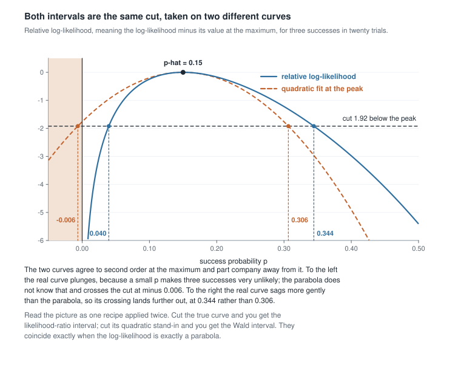
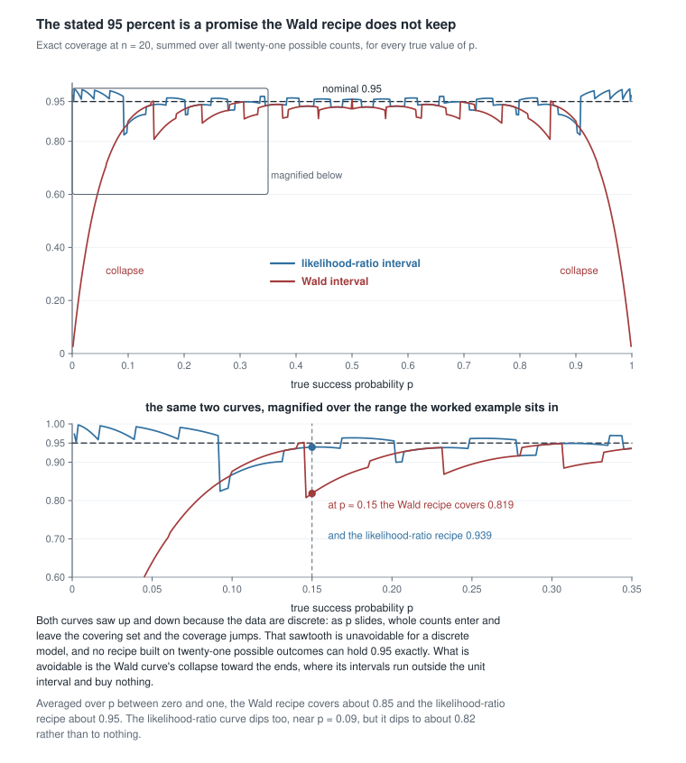
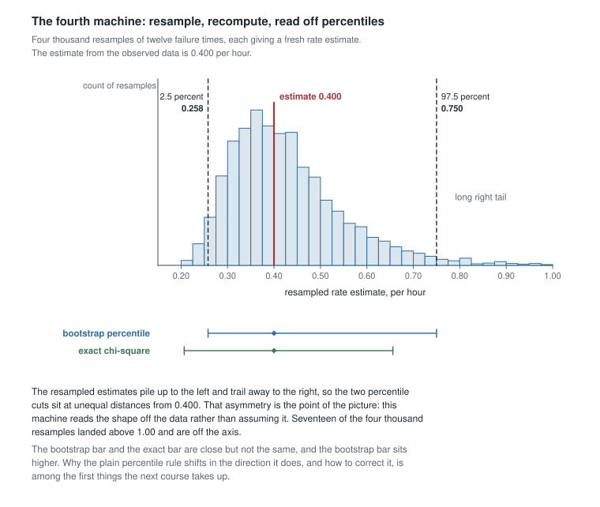
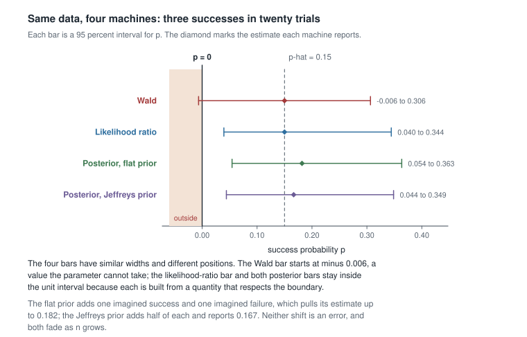

# Week 13 — Interval estimation and the shape of uncertainty

## Where this week starts

Week 12 left you holding a point estimate and a number beside it. The maximum likelihood estimator
$\hat\theta$ is asymptotically normal, its variance is approximately $1/(n I_1(\theta))$, and you can
estimate that variance from the observed information at the maximum. So you can write
$\hat\theta \pm 1.96\,\mathrm{se}(\hat\theta)$ and stop. Almost everyone does stop there, and almost
everyone who stops there believes the resulting pair of numbers means something it does not.

This week takes the step from a standard error to an interval seriously, because the step is not one
argument but several, and they do not always land in the same place. Three machines are already in
your hands. Week 4 built the **pivotal interval**: find a function of data and parameter whose
distribution is free of the parameter, then invert an exact probability statement into a set of
parameter values. Week 12 built the **Wald interval** without quite naming it: take the asymptotic
normality of $\hat\theta$ at face value and step out symmetrically. Week 9 built the **credible
interval**: put a prior on $\theta$, compute the posterior, and cut off the middle 95 percent of it.
A fourth machine, the bootstrap, is coming in the next course, and it is worth previewing here
because it makes the shape question unavoidable.

Take one data set — three successes in twenty trials, say — and run all of them. You will get four
intervals that are not the same. One of them will contain negative values of a probability. Two of
them will be visibly lopsided in opposite directions from a third. Nothing has gone wrong. Each
machine is answering a different question, and this week is about learning to hear the difference.

By Thursday you should be able to compute a Wald interval, a likelihood-ratio interval and a
posterior interval on the same model, say precisely what each one claims, predict from the shape of
the log-likelihood which way they will disagree, and diagnose which of them has actually failed when
one of them has.

### Why this matters downstream

Here is the stake, and it is not hypothetical arithmetic. A reliability group observes three failures
in twenty units and reports the Wald interval for the failure probability. The lower endpoint comes
out at $-0.006$, so they truncate it at zero and report "zero to 0.306, 95 percent confidence". The
truncation looks like tidiness. It is not: at a true failure probability of $0.15$ the recipe they
used covers the truth 81.9 percent of the time, not 95, and near the boundary it collapses further.
An interval that claims a coverage it does not have is worse than a point estimate with no interval,
because it launders a guess into a guarantee.

The forward stake is just as concrete. [Week 14](week-14.qmd) asks what any of this is worth when the
model is wrong, and that question is unanswerable until you can say what an interval claims when the
model is right. Regression, generalized linear models, and every survival analysis you will ever read
report likelihood-based intervals by default; the profile-likelihood machinery below is the whole
reason those intervals are not symmetric.

## What you will be able to do

- Derive the Wald and likelihood-ratio intervals from the same Taylor expansion, and state exactly
  which approximation separates them.
- Compute all three interval types for a binomial sample by hand and by machine, and compare them on
  one parameter axis.
- Explain what a coverage probability is a statement about, what a posterior probability is a
  statement about, and why interchanging the two is a category error rather than a rounding error.
- Predict, from the curvature and skew of a log-likelihood, which interval will be widest and in
  which direction.
- Diagnose a failing interval procedure by computing its exact coverage, rather than trusting the
  level printed on it.
- Describe how a bootstrap percentile interval is built, and name what the next course has to add
  before it can be trusted.

## Words worth owning

| Term | What it means in this course |
|------|------------------------------|
| Confidence interval | A random set produced by a rule whose coverage is at least the stated level. The level belongs to the rule, never to a realized pair of numbers. |
| Coverage probability | $P_\theta(\theta \in C(X))$: the probability over repeated samples, with $\theta$ held fixed, that the set the rule produces contains it. |
| Wald interval | $\hat\theta \pm z_{1-\alpha/2}\,\mathrm{se}(\hat\theta)$. Equivalently, the likelihood interval computed on a quadratic stand-in for the log-likelihood. |
| Deviance | $D(\theta) = 2[\ell(\hat\theta) - \ell(\theta)]$, twice the drop in the log-likelihood below its maximum. A distance measured in likelihood units. |
| Likelihood-ratio interval | The set of $\theta$ whose deviance stays below a calibrated cut, usually $\chi^2_{1, 1-\alpha}$. |
| Profile likelihood | What is left of the likelihood in the parameter you care about once the others have been maximized out at each of its values. |
| Credible interval | An interval carrying stated posterior probability. A statement about $\theta$ given these data and this model, not about repetition. |
| Bootstrap percentile interval | Endpoints read off the percentiles of the estimate's distribution across resamples of the observed data. |

## Three machines, one parameter axis

Fix notation for the whole section. Let $X_1, \dots, X_n$ be independent with density or mass function
$f(x \mid \theta)$ for a scalar $\theta$ in an open parameter space $\Theta$, write
$\ell(\theta) = \sum_{i=1}^n \log f(X_i \mid \theta)$ for the log-likelihood, and let $\hat\theta$
maximize it. Write $\alpha = 0.05$ throughout, so $z_{0.975} = 1.95996$ and
$\chi^2_{1, 0.95} = 3.84146$.

### The pivot when you can get one

The cleanest machine is Week 4's. A **pivotal quantity** is a function $Q(X, \theta)$ whose
distribution is the same under every $\theta \in \Theta$. Choose $a$ and $b$ with
$P_\theta(a \le Q(X, \theta) \le b) = 1 - \alpha$ — possible precisely because the law of $Q$ does not
move — and define $C(X) = \{\theta : a \le Q(X, \theta) \le b\}$. For each fixed $\theta$ the events
$\{\theta \in C(X)\}$ and $\{a \le Q(X, \theta) \le b\}$ are the same set of samples written twice, so
the coverage is exactly $1 - \alpha$ at every $\theta$. No limit, no approximation, no appeal to large
$n$.

The trouble is availability. Exact pivots live in a small neighbourhood of models: normal theory gives
$(\bar{X} - \mu)/(S/\sqrt{n}) \sim t_{n-1}$ and $(n-1)S^2/\sigma^2 \sim \chi^2_{n-1}$; the exponential
gives $2\lambda \sum_i X_i \sim \chi^2_{2n}$; the uniform on $(0, \theta)$ gives $X_{(n)}/\theta$ with
distribution function $u^n$. Step outside and there is usually nothing exact to invert. For the
binomial there is no pivot at all, because the data are discrete and no function of $(X, p)$ can have
a distribution free of $p$. That is not a temporary gap in the theory; it is a structural fact about
discrete models, and it is why the rest of this page exists.

### The two intervals the likelihood gives

Expand the log-likelihood about its maximum. Because $\ell'(\hat\theta) = 0$ at an interior maximum,
the linear term vanishes and

$$\ell(\theta) \approx \ell(\hat\theta) - \tfrac{1}{2} J(\hat\theta)\,(\theta - \hat\theta)^2,
\qquad J(\hat\theta) = -\ell''(\hat\theta),$$

where $J$ is the **observed information** from Week 12. Multiply the drop by two:

$$D(\theta) = 2\big[\ell(\hat\theta) - \ell(\theta)\big] \approx J(\hat\theta)\,(\hat\theta - \theta)^2.$$

Now read the same approximate identity in two directions, and the two frequentist machines fall out
of it.

Read it from right to left. Week 12 gives
$\sqrt{n}(\hat\theta - \theta) \xrightarrow{d} N(0, 1/I_1(\theta))$ and
$J(\hat\theta)/n \to I_1(\theta)$ in probability, so $\sqrt{J(\hat\theta)}(\hat\theta - \theta)$
converges in distribution to a standard normal by Slutsky. Collecting the values of $\theta$ for which
that standardized quantity is at most $z_{1-\alpha/2}$ in absolute value gives

$$\hat\theta \pm z_{1-\alpha/2}\,\mathrm{se}(\hat\theta),
\qquad \mathrm{se}(\hat\theta) = J(\hat\theta)^{-1/2},$$

the **Wald interval**. Read it from left to right instead. Squaring a standard normal gives a
$\chi^2_1$ variable, so under the same conditions
$D(\theta_0) \xrightarrow{d} \chi^2_1$ at the true $\theta_0$ — this is Wilks' theorem — and the set

$$C_{\mathrm{LR}}(X) = \big\{\theta \in \Theta : D(\theta) \le \chi^2_{1, 1-\alpha}\big\}$$

is the **likelihood-ratio interval**. Its asymptotic coverage is $1 - \alpha$ for the same reason the
Wald interval's is.

::: {.callout-note}
Wilks' theorem needs the Week 7 regularity conditions and needs them all: the true value interior to
$\Theta$, a common support not depending on $\theta$, a log-likelihood twice differentiable in
$\theta$, an information $I_1(\theta)$ finite and strictly positive, and enough smoothness to
differentiate under the integral sign. Every one of them is checkable in a given model, and the
uniform on $(0, \theta)$ fails the second, and with it the third and fifth. Check before you cut.
:::

So the two frequentist intervals are the same cut taken on two different curves: the Wald interval
cuts the parabola, the likelihood-ratio interval cuts the log-likelihood itself. They coincide exactly
when the log-likelihood is exactly quadratic, which happens for a normal mean with known variance and
essentially nowhere else. Everywhere else they differ by however much the real curve departs from its
parabola, and that departure is the shape information the Wald interval throws away.

{fig-alt="A relative log-likelihood curve peaking at 0.15 with a dashed parabola fitted at the peak. A horizontal line 1.92 below the peak crosses the true curve at 0.040 and 0.344 and the parabola at minus 0.006 and 0.306."}

The figure draws both curves for three successes in twenty trials. To the left of the maximum the true
curve plunges toward minus infinity as $p$ approaches zero, because three successes are impossible at
$p = 0$; the parabola knows nothing about that and wanders across the boundary. To the right the true
curve sags more gently than the parabola, so its crossing lands further out. The result is an
asymmetric likelihood-ratio interval sitting entirely inside $(0,1)$ and a symmetric Wald interval
that does not.

One consequence deserves its own sentence, because it decides which machine to trust in practice. The
likelihood-ratio interval is **equivariant** under any monotone reparameterization. If
$\phi = g(\theta)$ with $g$ strictly increasing, then $\hat\phi = g(\hat\theta)$, the deviance in
$\phi$ at $g(\theta)$ equals the deviance in $\theta$ at $\theta$, and so the interval for $\phi$ is
exactly the image under $g$ of the interval for $\theta$. The Wald interval has no such property: the
standard error transforms by the delta method as $|g'(\hat\theta)|\,\mathrm{se}(\hat\theta)$, and
stepping out symmetrically in $\phi$ is not the image of stepping out symmetrically in $\theta$. The
second worked example builds three different Wald intervals for one variance to make that concrete.

### The posterior interval and what it asserts

The third machine changes what kind of object $\theta$ is. Give it a prior density $\pi(\theta)$ and
Bayes' theorem returns the posterior

$$\pi(\theta \mid x) = \frac{L(\theta)\,\pi(\theta)}{\int_\Theta L(t)\,\pi(t)\,dt},$$

a genuine probability distribution over the parameter space. A $1 - \alpha$ **credible interval** is
any set carrying posterior probability $1 - \alpha$; the equal-tailed choice takes the $\alpha/2$ and
$1 - \alpha/2$ posterior quantiles, and the highest-posterior-density choice takes the shortest such
set. The sentence "the probability that $\theta$ lies between these numbers is 0.95" is legitimate
here and nowhere else in this course, and the words "within this model and under this prior" are part
of the claim, not a disclaimer bolted onto it.

Two structural remarks. First, a credible interval respects the boundary automatically: the posterior
puts no mass outside $\Theta$, so no quantile of it can land outside $\Theta$. Second, the
equal-tailed version is equivariant like the likelihood-ratio interval, because posterior quantiles
ride along under a monotone change of variables even though the density does not. The
highest-posterior-density version is the exception, and the reason sits in that last clause: under
$\phi = g(\theta)$ the density acquires a Jacobian factor, so the shortest set in $\phi$ is not in
general the image of the shortest set in $\theta$ unless $g$ is affine. Together they explain most of
what you will see when the intervals are drawn side by side.

## Where the three agree and where they part

### The regime of agreement

Suppose the log-likelihood is close to quadratic near its maximum, the prior is flat over the range
where the likelihood is appreciable, and $n$ is large. Then all three machines return nearly the same
interval, and the reason is that all three are reading the same curve. The Wald interval cuts the
parabola. The likelihood-ratio interval cuts a curve that is nearly that parabola. The posterior is
proportional to $L(\theta)$ times a nearly constant prior, so it is nearly a normal density centred at
$\hat\theta$ with variance $1/J(\hat\theta)$ — this is the Bernstein-von Mises phenomenon, and it is
the precise sense in which a flat-prior Bayesian and a likelihood frequentist stop disagreeing in
large samples. Numerically, the same three successes in twenty trials scaled up to thirty successes in
two hundred give a Wald interval of $(0.1005, 0.1995)$, a likelihood-ratio interval of
$(0.1051, 0.2038)$, and a flat-prior posterior interval of $(0.1073, 0.2062)$. All three have width
$0.099$ to three decimal places, and no endpoint differs from another by more than $0.007$.

Agreement in the regime is not agreement in meaning. The three sentences attached to those nearly
identical numbers remain different sentences: a statement about repeated sampling, a statement about
where the likelihood is not much lower than its peak, and a statement about posterior probability.
When they coincide numerically, you should say so and move on; when they do not, the gap is the
information.

### Four ways the agreement breaks

**Small $n$.** The quadratic approximation is an $n \to \infty$ statement, and at $n = 20$ near a
boundary it is simply false. Everything in the first worked example is this failure.

**A boundary.** When $\hat\theta$ sits near the edge of $\Theta$, the Wald interval crosses it and the
Wilks calibration itself begins to drift. When $\hat\theta$ sits *on* the edge, the theorem does not
apply at all.

**Skew in the likelihood.** A log-likelihood that falls away faster on one side than the other
produces an asymmetric likelihood-ratio interval, and the Wald interval — symmetric by construction —
cannot reproduce it. Rate parameters, variance components and odds ratios are all like this.

**An informative prior.** Where the prior is not flat over the range the likelihood cares about, the
posterior interval moves, and it should. That movement is a modelling choice, and it must be reported
as one.

The first of these is measurable. Coverage is a computable property of a rule, and here it can be
computed exactly rather than simulated: for each $x$ from zero to twenty, decide whether the interval
the rule builds from $x$ contains a candidate $p$, and add up the binomial probabilities of the values
of $x$ for which it does.

{fig-alt="Two sawtooth coverage curves against p, dashed line at 0.95. The Wald curve collapses near p of zero and one; the likelihood-ratio curve holds near 0.95 but dips to 0.82 near 0.09. A lower panel marks 0.819 against 0.939 at p of 0.15."}

Read the figure carefully, because it teaches two separate things. The sawtooth in both curves is
unavoidable: the data are discrete, so as $p$ slides continuously, whole outcomes enter and leave the
covering set and the coverage jumps. No rule built on twenty-one possible outcomes holds exactly 0.95
at every $p$, and the honest description of any of them is "at least approximately 95 percent, with
excursions". What is avoidable is the collapse of the Wald curve toward the ends, where its coverage
falls past 0.80, past 0.50, and finally to nothing. Averaged across $p$, the Wald recipe covers about
0.85 against the likelihood-ratio recipe's 0.95. At $p = 0.15$ the two differ by twelve parts in a
hundred, which is the entire gap between an interval worth reporting and one worth withdrawing.

### The bootstrap, previewed honestly

There is a fourth machine, and it dispenses with the likelihood altogether. Treat the observed sample
as a stand-in for the population; draw $B$ resamples of size $n$ from it with replacement; recompute
the estimator on each; and read the $2.5$ and $97.5$ percentiles off the resulting collection. That is
the **bootstrap percentile interval**, and its appeal is obvious: no pivot, no derivative, no prior,
no closed form for the sampling distribution of anything.

{fig-alt="A right-skewed histogram of four thousand resampled rate estimates centred near 0.43 with dashed cuts at 0.258 and 0.750. Below, the bootstrap bar sits noticeably higher than a shorter exact chi-square bar."}

The figure resamples twelve failure times whose total is thirty hours, so the rate estimate from the
observed data is $\hat\lambda = 12/30 = 0.400$ per hour. The resampled estimates pile up on the left
and trail away on the right, exactly as the shape of the likelihood for a rate predicts, and the two
percentile cuts sit at unequal distances from $0.400$. That is the machine's real selling point: it
reads the shape off the data instead of assuming it.

It is also where the honesty is required. The bootstrap bar in the figure runs from $0.258$ to
$0.750$, while the exact chi-square interval for these data runs from $0.207$ to $0.656$. The
bootstrap bar is shifted upward, and not by accident: the percentile rule uses the spread of
$\hat\lambda^*$ around $\hat\lambda$ as a stand-in for the spread of $\hat\lambda$ around $\lambda$,
and when the sampling distribution is skewed those two are not mirror images. Correcting for that —
the bias-corrected and accelerated variants, the bootstrap-$t$, and the theory that says when any of
it is consistent — is Mathematical Statistics II's material, not this week's. Take the picture as a
statement about shape and a promissory note, not as a fourth interval you may report today.

## Worked example — three intervals for three successes in twenty trials

**Setting.** A laboratory tests twenty independently manufactured seals under an accelerated
protocol and records three failures. Model the failures as
$X \sim \mathrm{Binomial}(n = 20, p)$ with $x = 3$ observed. The estimand is $p$, the failure
probability of a seal under this protocol. Take $\alpha = 0.05$.

**Step one, the estimate and the curve.** The log-likelihood, dropping the binomial coefficient
because it does not involve $p$, is $\ell(p) = 3\log p + 17 \log(1 - p)$. Differentiating,
$\ell'(p) = 3/p - 17/(1-p)$, which vanishes at $p = 3/20 = 0.15$, so $\hat p = 0.15$. Differentiating
again, $\ell''(p) = -3/p^2 - 17/(1-p)^2$, and at $\hat p$ this is
$-3/0.0225 - 17/0.7225 = -133.333 - 23.529 = -156.863$. So $J(\hat p) = 156.863$, which is the
familiar $n/\{\hat p(1 - \hat p)\} = 20/0.1275$.

**Step two, the Wald interval.** The standard error is
$\mathrm{se}(\hat p) = J(\hat p)^{-1/2} = \sqrt{0.1275/20} = \sqrt{0.006375} = 0.079844$. The
half-width is $1.95996 \times 0.079844 = 0.156491$, so the interval runs from
$0.15 - 0.156491 = -0.006491$ to $0.15 + 0.156491 = 0.306491$.

**Step three, the likelihood-ratio interval.** At the maximum,
$\ell(\hat p) = 3\log 0.15 + 17\log 0.85 = 3(-1.897120) + 17(-0.162519) = -8.454182$. The cut sits
half of $3.84146$ below that, at $-8.454182 - 1.920729 = -10.374911$, so the endpoints are the two
roots of

$$3\log p + 17 \log(1 - p) = -10.374911.$$

This is not solvable in closed form; bisection on each side of $\hat p$ settles it. The lower root is
$p = 0.039579$ and the upper root is $p = 0.344376$. Check the lower one by substitution:
$3\log(0.039579) = 3(-3.2294566) = -9.6883698$ and $17\log(0.960421) = 17(-0.0403835) = -0.6865195$,
and the two sum to $-10.3748893$, within two parts in a hundred thousand of the target.

**Step four, the posterior interval.** With a $\mathrm{Beta}(a, b)$ prior the posterior is
$\mathrm{Beta}(a + x,\, b + n - x)$, the conjugate update from Week 9. A flat $\mathrm{Beta}(1,1)$
prior gives $\mathrm{Beta}(4, 18)$, whose posterior mean is $4/22 = 0.1818$ and whose equal-tailed
95 percent interval is $(0.0545, 0.3634)$. The Jeffreys prior $\mathrm{Beta}(1/2, 1/2)$ gives
$\mathrm{Beta}(3.5, 17.5)$, posterior mean $3.5/21 = 0.1667$, and interval $(0.0441, 0.3486)$.

{fig-alt="Four horizontal 95 percent interval bars for a success probability after three successes in twenty trials. Only the Wald bar extends left of the marked boundary at zero; the likelihood-ratio and two posterior bars stay inside."}

**What the picture shows.** The four bars have similar widths and different positions. The Wald bar is
the only one that leaves the parameter space, and it does so because it was built from a parabola that
has no idea $p$ cannot be negative. The likelihood-ratio bar is shifted right of the Wald bar at both
ends, reflecting the right skew of the likelihood. The two posterior bars sit slightly right again,
because a flat prior on $(0,1)$ is not neutral about a small $p$: adding one imagined success and one
imagined failure moves the estimate from $0.15$ up to $0.182$, and the Jeffreys prior, adding half of
each, moves it to $0.167$. None of these shifts is an error. Each is a different, statable claim.

**What it assumed.** Independence across the twenty seals, a constant failure probability, and — for
the last two bars — a prior you would be willing to defend before seeing the data. The first two
assumptions are the ones a manufacturing process most often breaks, through a shared batch of
material.

### The same reasoning, transferred

Change the model and keep the structure. Twelve units are run to failure and the times, in hours, are
$0.2, 0.3, 0.6, 0.9, 1.2, 1.5, 2.0, 2.4, 3.3, 4.1, 5.8, 7.7$, which total exactly $30.0$. Model them as
independent $\mathrm{Exponential}(\lambda)$ with density $\lambda e^{-\lambda x}$ for $x \gt 0$, so
the estimand $\lambda$ is a failure rate per hour. Then
$\ell(\lambda) = 12 \log \lambda - 30\lambda$, so $\hat\lambda = 12/30 = 0.400$ per hour, and
$J(\hat\lambda) = 12/\hat\lambda^2 = 75$, giving $\mathrm{se}(\hat\lambda) = 1/\sqrt{75} = 0.11547$.

The three machines run again. The Wald interval is $0.400 \pm 1.95996 \times 0.11547$, that is
$(0.1737, 0.6263)$. The deviance simplifies to $D(\lambda) = 24[u - 1 - \log u]$ with
$u = \lambda/\hat\lambda$, and setting it equal to $3.84146$ gives $u = 0.5355$ and $u = 1.6772$, so
the likelihood-ratio interval is $(0.2142, 0.6709)$. Here, unusually, an exact pivot also exists:
$\sum_i X_i$ is $\mathrm{Gamma}(12, \lambda)$, so $2\lambda \sum_i X_i \sim \chi^2_{24}$ whatever
$\lambda$ is, and inverting $12.4012 \le 60\lambda \le 39.3641$ gives the exact interval
$(0.2067, 0.6561)$.

What stayed the same: one curve, one cut, and one symmetric step. What changed: the exact pivot is
available, so the two approximations can be graded rather than merely compared. The likelihood-ratio
interval is close to exact at both ends; the Wald interval is too low at both ends, by $0.033$ at the
bottom and $0.030$ at the top, because it insists on symmetry that the rate likelihood does not have.
One more thing changed, and it is worth noticing: with the Jeffreys prior $\pi(\lambda) \propto
1/\lambda$ the posterior is $\mathrm{Gamma}(12,\, 30)$, under which $2\lambda \sum_i x_i$ again has the
$\chi^2_{24}$ distribution — so the credible interval is *numerically identical* to the exact
confidence interval, $(0.2067, 0.6561)$. Same numbers, two different sentences.

## A computation you can run

Derive, compute, critique. Every number above is reproducible in a few lines of
[R](https://www.r-project.org/), and typing them is the fastest route to believing the figure.

```
x <- 3; n <- 20; phat <- x / n

# Wald
phat + c(-1, 1) * qnorm(0.975) * sqrt(phat * (1 - phat) / n)   # -0.0065  0.3065

# likelihood ratio: cut the deviance at qchisq(0.95, 1)
dev <- function(p) 2 * (dbinom(x, n, phat, log = TRUE) - dbinom(x, n, p, log = TRUE))
cut <- qchisq(0.95, 1)
c(uniroot(function(p) dev(p) - cut, c(1e-10, phat))$root,
  uniroot(function(p) dev(p) - cut, c(phat, 1 - 1e-10))$root)  #  0.0396  0.3444

# posterior with a flat prior, then with the Jeffreys prior
qbeta(c(0.025, 0.975), x + 1,   n - x + 1)                     #  0.0545  0.3634
qbeta(c(0.025, 0.975), x + 0.5, n - x + 0.5)                   #  0.0441  0.3486
```

Coverage is computable too, by exactly that enumeration.

```
cover <- function(p, n = 20) {
  x  <- 0:n
  ph <- x / n
  se <- sqrt(ph * (1 - ph) / n)
  lo <- ph - qnorm(0.975) * se
  hi <- ph + qnorm(0.975) * se
  sum(dbinom(x, n, p)[lo <= p & p <= hi])
}
cover(0.15)   # 0.8185
cover(0.05)   # 0.6389
```

Two habits are being modelled here: a claimed coverage is a checkable claim, so check it; and exact
enumeration beats simulation whenever the sample space is small enough to walk, because it removes
Monte Carlo noise from the verdict.

## Second worked example — an interval for a normal variance

**Setting.** Week 4 weighed a reference mass eight times on one balance and recorded, in grams,
$10.2, 9.8, 10.5, 10.1, 9.6, 10.4, 9.9, 10.3$. The mean is $\bar{x} = 80.8/8 = 10.1$ and the residual
sum of squares is $\sum_i (x_i - \bar{x})^2 = 0.68$, so $s^2 = 0.68/7 = 0.097143$. Model the readings
as independent $N(\mu, \sigma^2)$ with both parameters unknown, and take the estimand to be
$\sigma^2$, the balance's repeatability variance. This example strains a condition the first one did
not: there are two parameters, and $n$ is small.

**Step one, profile out the nuisance parameter.** For fixed $\sigma^2$ the log-likelihood is maximized
over $\mu$ at $\bar{x}$, so the profile log-likelihood is

$$\ell_p(\sigma^2) = -\frac{n}{2}\log(2\pi) - \frac{n}{2}\log \sigma^2 - \frac{SS}{2\sigma^2},
\qquad SS = \sum_{i=1}^n (x_i - \bar{x})^2 = 0.68 .$$

Setting the derivative to zero gives $-n/(2\sigma^2) + SS/(2\sigma^4) = 0$, so
$\hat\sigma^2 = SS/n = 0.68/8 = 0.085$. Note that this is the maximum likelihood estimate, with
divisor $n$, and not the unbiased $s^2 = 0.097143$ with divisor $n - 1$.

**Step two, the exact pivotal interval.** From Week 4, $SS/\sigma^2 \sim \chi^2_{n-1} = \chi^2_7$
whatever $\mu$ and $\sigma^2$ are. The equal-tailed cuts are $1.68987$ and $16.01276$, and inverting
$1.68987 \le 0.68/\sigma^2 \le 16.01276$ — legitimate because all three quantities are positive, so
taking reciprocals reverses both inequalities — gives

$$\frac{0.68}{16.01276} \le \sigma^2 \le \frac{0.68}{1.68987},
\qquad \text{that is} \qquad 0.04247 \le \sigma^2 \le 0.40240 .$$

**Step three, the likelihood-ratio interval.** Write $r = \sigma^2/\hat\sigma^2$. Substituting into the
profile log-likelihood and cancelling the constants,

$$D(\sigma^2) = 2\big[\ell_p(\hat\sigma^2) - \ell_p(\sigma^2)\big]
 = n\Big[\log r + \frac{1}{r} - 1\Big],$$

because $SS/\hat\sigma^2 = n$ exactly. That function is zero at $r = 1$ and increases in both
directions, as it must. Setting $8[\log r + 1/r - 1] = 3.84146$ gives $r = 0.43046$ and $r = 3.22113$,
so the interval is $(0.43046 \times 0.085,\; 3.22113 \times 0.085) = (0.03659, 0.27380)$.

**Step four, the Wald intervals, plural.** Differentiating the profile twice gives
$\ell_p''(\sigma^2) = n/(2\sigma^4) - SS/\sigma^6$, which at $\hat\sigma^2$ equals $-n/(2\hat\sigma^4)$,
so $\mathrm{se}(\hat\sigma^2) = \hat\sigma^2\sqrt{2/n} = 0.085 \times 0.5 = 0.0425$. The Wald interval
for $\sigma^2$ is therefore $0.085 \pm 1.95996 \times 0.0425 = (0.00170, 0.16830)$. Now redo it on the
log scale. By the delta method $\mathrm{se}(\log \hat\sigma^2) = \sqrt{2/n} = 0.5$, and
$\log 0.085 = -2.46510$, so the interval for $\log\sigma^2$ is $(-3.44508, -1.48512)$; exponentiating
gives $(0.03190, 0.22648)$ for $\sigma^2$.

| Machine | Interval for $\sigma^2$ | Width |
|---------|------------------------|-------|
| Exact pivotal, from $\chi^2_7$ | $(0.04247,\ 0.40240)$ | $0.35993$ |
| Likelihood ratio | $(0.03659,\ 0.27380)$ | $0.23721$ |
| Wald on the variance scale | $(0.00170,\ 0.16830)$ | $0.16660$ |
| Wald on the log-variance scale | $(0.03190,\ 0.22648)$ | $0.19458$ |
| Posterior, reference prior | $(0.04247,\ 0.40240)$ | $0.35993$ |

**Reading the table.** Four rows are four different claims about one number, and the spread between
them at $n = 8$ is the whole lesson. The exact row is the standard against which the others are
graded, because for this model an exact pivot genuinely exists. Both approximations are too short and
both are shifted low, the Wald far more than the likelihood ratio, and the reason is visible in the
profile: the log-likelihood in $\sigma^2$ is strongly right-skewed at this sample size, so a symmetric
step badly understates how large $\sigma^2$ might be. Reparameterizing to $\log \sigma^2$ helps a great
deal, moving the lower endpoint from $0.0017$ to $0.0319$ — but "helps a great deal" is not "is
correct", and the fact that the same machine produces two different intervals for one estimand is the
non-equivariance of the previous section, in numbers.

**The last row deserves a comment.** Under the standard reference prior
$\pi(\mu, \sigma^2) \propto 1/\sigma^2$, the marginal posterior of $\sigma^2$ is inverse-gamma with
shape $(n-1)/2$ and scale $SS/2$, which is the same as saying $SS/\sigma^2$ has the $\chi^2_7$
distribution *given the data*. The posterior quantiles therefore reproduce the exact confidence
interval digit for digit. That is a real and useful fact about this model and this prior, and it is
also a coincidence you must not generalize: for the binomial no prior can achieve it, because coverage
there jumps as $p$ moves — the sawtooth two sections above — while a nominal level is a constant, and
a function with jumps cannot equal a constant. Read the agreement as "these two sentences happen to
pick out the same set here", not as "the two frameworks agree".

## The misreading to avoid

Here is the sentence that arrives every year, once the table above is on the board:

::: {.callout-note}
"The four machines gave four different intervals for the same data, so three of them must be wrong.
Tell me which one is right."
:::

The request is reasonable and the premise is not. Start with what would actually make an interval
wrong: a rule is wrong when it does not deliver what it claims. A confidence interval claims coverage,
so its correctness is settled by computing coverage, which the enumeration above does. A credible
interval claims posterior probability under a stated prior, so its correctness is settled by checking
the posterior arithmetic. Those are different audits, and passing one says nothing about the other.
Two rules can both pass their own audit and still return different numbers, because they were never
promising the same thing.

By that standard, exactly one row of the first worked example fails: the Wald interval, whose stated
coverage is $0.95$ and whose actual coverage at $p = 0.15$ is $0.819$. It is not wrong because it
disagrees with the others. It is wrong because it disagrees with itself. The likelihood-ratio interval
and both posterior intervals disagree with each other just as loudly and all three survive their
audits.

Then the second half of the reply, which is the part worth keeping. Disagreement is a measurement.
When the Wald and likelihood-ratio intervals differ, the size of the difference is a direct read-out
of how far the log-likelihood is from quadratic, which is a read-out of how little the asymptotics
have taken hold at this $n$. When the two posterior intervals differ from each other, the difference
measures the prior's influence, and it shrinks as the data accumulate. When all of them coincide, as
they nearly did at two hundred trials, you have learned that you are in the regime where the choice
does not matter. Treating the spread as noise to be argued away discards all of that.

One counterexample to finish, because it shows that even the likelihood machine needs its calibration
checked rather than assumed. Take $X_1, \dots, X_n$ uniform on $(0, \theta)$ with $M = X_{(n)}$. The
likelihood is $\theta^{-n}$ for $\theta \ge M$ and zero below, so $\hat\theta = M$ and, for
$\theta \ge M$,

$$D(\theta) = 2\big[\ell(M) - \ell(\theta)\big] = 2n \log(\theta/M).$$

Its exact distribution follows from $P_\theta(M/\theta \le u) = u^n$ on $(0,1)$:

$$P_\theta\big(D(\theta) \gt w\big) = P_\theta\!\left(\frac{M}{\theta} \lt e^{-w/(2n)}\right)
= e^{-w/2},$$

so $D(\theta)$ is exponential with mean two — that is, exactly $\chi^2_2$, at every $n$, with no limit
taken. Cut it at $\chi^2_{1,0.95} = 3.84146$ as Wilks would have you do and the coverage is
$1 - e^{-1.920729} = 0.8535$, never improving with more data. Cut it at $\chi^2_{2,0.95} = 5.99146$
instead and you get $\theta \le M e^{2.99573/n}$ with coverage exactly $0.95$ — which is precisely
Week 4's uniform pivot $M/\theta$ inverted one-sidedly rather than equal-tailed, since
$-\log(0.05) = 2.99573$. The machinery was fine; the calibration was borrowed from a theorem whose
conditions this model fails. Name them exactly: the support moves with $\theta$, so the likelihood
jumps at $\theta = M$ instead of curving there, and the maximizer sits at the edge of the region where
the likelihood is positive. What does *not* fail is the condition students reach for first: the true
$\theta_0$ is interior to $\Theta = (0, \infty)$. State the assumption, check the special case: the
audit habit is not decoration here, it is the difference between 85 percent and 95.

## Practice on your own

1. **A third model, three machines.** For a Poisson sample with $n = 10$ and $\bar{x} = 0.5$, derive
   $\hat\lambda$, the observed information, the Wald interval, and the deviance function
   $D(\lambda)$ in closed form. Compute the likelihood-ratio interval numerically and the gamma
   posterior interval under $\pi(\lambda) \propto \lambda^{-1/2}$. Rank the three by width and explain
   the ranking from the shape of $\ell$.

2. **A counterexample hunt.** Find the smallest $n$ and a count $x$ for which the Wald interval for a
   binomial proportion has an upper endpoint exceeding one. Then show that the likelihood-ratio
   interval can never leave $[0,1]$, using only the fact that $\ell(p) \to -\infty$ at each endpoint
   when $0 \lt x \lt n$.

3. **An audit.** A colleague writes: "Week 4 gave the interval $(0.206, 0.634)$ for $\sigma$. Squaring
   the endpoints gives $(0.042, 0.402)$ for $\sigma^2$, which is exactly the chi-square interval on
   that scale. So I can equally square the endpoints of a Wald interval for $\sigma$ to get the Wald
   interval for $\sigma^2$." Coverage is not what separates these two moves: for nonnegative endpoints
   $L$ and $U$, the events $\{\sigma \in (L, U)\}$ and $\{\sigma^2 \in (L^2, U^2)\}$ coincide, since
   squaring is increasing on the positive half-line, so both transformed intervals carry the coverage
   of their originals. Only one move, though, reproduces what the machine itself builds on the new
   scale. Identify which, name the property that licenses it, then compute the Wald interval for
   $\sigma$ from the second worked example, square it, and set it beside the $(0.00170, 0.16830)$ in
   the table.

4. **A simulation to describe.** Predict, before running anything, whether the flat-prior credible
   interval for a binomial proportion over-covers or under-covers in the frequentist sense at
   $p = 0.05$ and $n = 20$. Write out the enumeration that would settle it, name the quantity you
   would report, and say what result would falsify your prediction.

5. **A fourth machine you can derive.** The score interval inverts
   $(\hat p - p)/\sqrt{p(1-p)/n}$ — note the denominator uses the candidate $p$, not $\hat p$ — by
   solving a quadratic in $p$. Carry out the algebra, evaluate it at $x = 3$ and $n = 20$, compare
   with the four intervals on this page, and say which of the four it most resembles and why.

## Where to read more

- [MIT OpenCourseWare 18.650, Statistics for Applications](https://ocw.mit.edu/courses/18-650-statistics-for-applications-fall-2016/)
  for confidence intervals treated as a construction, and for the binomial as the running example.
- [MIT OpenCourseWare 18.655, Mathematical Statistics](https://ocw.mit.edu/courses/18-655-mathematical-statistics-spring-2016/)
  for likelihood-based inference, Wilks' theorem, and the asymptotic theory the cut relies on.
- [Penn State STAT 414](https://online.stat.psu.edu/stat414/) for a slower treatment of the binomial
  and normal interval formulas quoted above.
- [The R Project](https://www.r-project.org/) for `qnorm`, `qchisq`, `qbeta` and `uniroot`, the four
  functions every calculation on this page needs.
- Hogg, McKean and Craig develop interval estimation in their fourth chapter and the likelihood-ratio
  machinery in their sixth.
- Course pages: the [syllabus](../syllabus.qmd), the [schedule](../schedule.qmd), and the
  [resources page](../resources/index.qmd).

## Where this goes next

Everything on this page assumed the model was right. The pivot was exact *under the normal model*; the
Wilks calibration held *under the regularity conditions*; the posterior was a probability statement
*within the model and prior*. [Week 14](week-14.qmd) removes that assumption and asks what a
confidently reported interval is worth when the family does not contain the truth. The short version
is unpleasant: the interval keeps shrinking at rate $n^{-1/2}$ around a quantity that is no longer the
estimand, so more data buys more confidence in the wrong number. The sandwich variance repairs part of
the damage and none of the bias.

Two threads run backward and one runs forward. Backward: [Week 4](week-04.qmd) built the pivot this
page reused, and [Week 12](week-12.qmd) supplied the asymptotic normality that both likelihood
machines lean on. Forward: the bootstrap previewed above is the first substantial topic of
Mathematical Statistics II, and every regression and generalized linear model you meet after this
course reports profile-likelihood intervals computed exactly as in the second worked example, with a
vector of nuisance parameters where we had one $\mu$. The [notes index](../index.qmd) lists every unit
in order.
