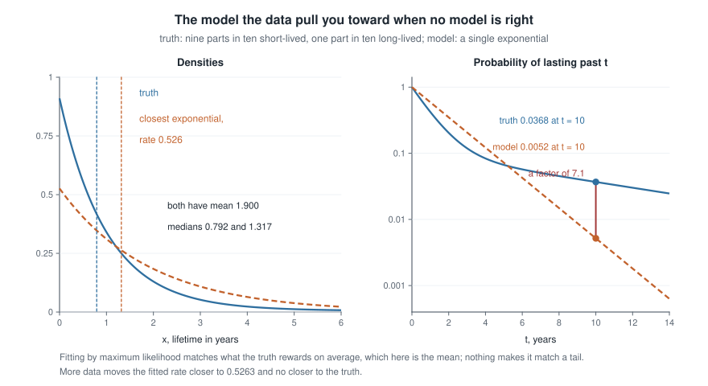
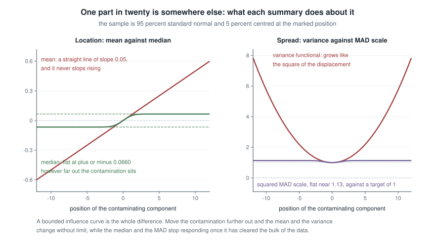
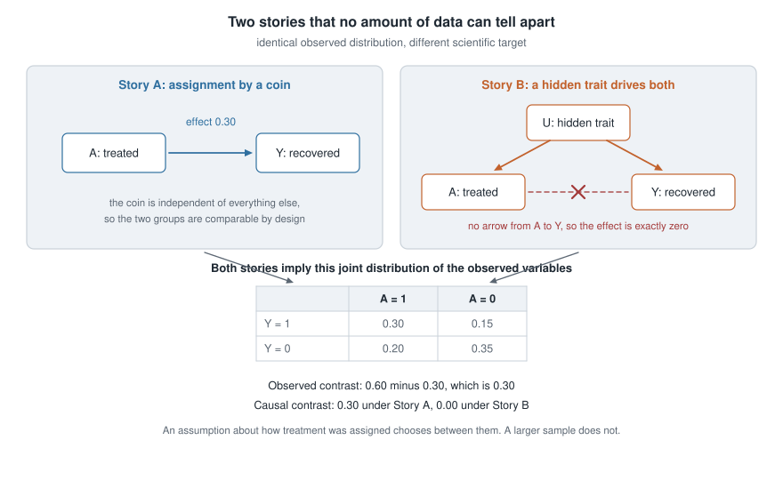
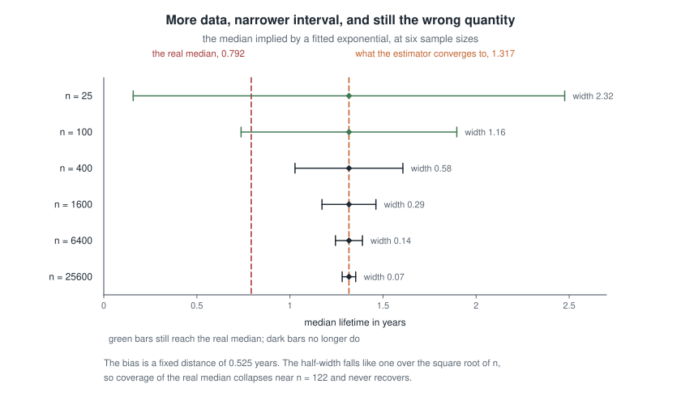

# Week 14 — Robustness, misspecification, and identification boundaries

## Where this week starts

Thirteen weeks have gone into building estimators inside a model and grading them by properties stated
inside the same model. Sufficiency reduced the data without loss *under* $f(x \mid \theta)$. The
Cramer-Rao bound floored the variance of unbiased estimators *of* $\theta$. Wilks' theorem calibrated a
cut on the log-likelihood *when* the family contains the truth. [Week 13](week-13.qmd) built four
intervals, and every claim about every one of them carried a silent clause. This week removes the
clause.

Two things can go wrong, and keeping them apart is most of the work. The first is
**misspecification**: the truth is not in the family you fitted. It is benign in one respect and quietly
disastrous in another. Benign, because the maximum likelihood estimator does not wander — it converges,
at the usual rate, to a well-defined limit. Disastrous, because that limit is the member of your family
closest to the truth in a specific information-theoretic sense, which is no reason at all for it to be
the quantity your collaborator asked about. The second failure is **non-identification**: two accounts
of how the data arose induce the same distribution over the variables you see, so nothing converges to
the wrong place — nothing converges at all.

Week 1's distinction between an estimand and an estimator pays off here: misspecification is a mismatch
between the estimand your procedure targets and the one you wanted, while non-identification is the
absence of any procedure. Both are invisible to the diagnostics you have met, all of which are computed
inside the model. By Thursday you should be able to name the limit of a misspecified maximum likelihood
estimator, repair the standard error beside it, and build two stories no data set can separate.

### Why this matters downstream

Here is the stake. A reliability group fits a single exponential to component lifetimes, reports a
warranty-relevant median with a tight interval, and is right about the mean lifetime while overstating
the median by two-thirds of its true value — permanently, however many components they test. Their
interval keeps shrinking, their software keeps reporting convergence, and their nominal 95 percent
coverage of the real median falls through one half near a hundred and twenty observations. Nothing in
the fit complains.

Every method built on the likelihood inherits this: generalized linear models, survival models and the
estimating equations of the second course report model-based standard errors by default, and the
sandwich correction below is the standard repair. The graduate causal-inference course, meanwhile,
spends a semester on assumptions this page can only name, and a student who has not seen why they are
unavoidable treats them as paperwork.

## What you will be able to do

- Define the Kullback-Leibler divergence, state where a misspecified maximum likelihood estimator
  converges, and compute that limit for an exponential family.
- Derive the sandwich variance from the score equation, and name the identity that fails.
- Compute the influence function and breakdown point of the mean, the median, the variance and the
  standardized median absolute deviation.
- Compare a robust and a non-robust estimator by mean squared error, and find the contamination fraction
  at which the ranking flips.
- Construct two data-generating stories with the same observed distribution, and write out the
  assumption that would choose between them.
- Distinguish a target estimated badly from a target not estimable at all.

## Words worth owning

| Term | What it means in this course |
|------|------------------------------|
| Misspecification | The true law $g$ is no member of the family $\{f(\cdot \mid \theta)\}$ you fitted. The ordinary situation, not an exotic one. |
| Kullback-Leibler divergence | A non-negative, asymmetric measure of how far a candidate density sits from the truth; zero exactly when they agree almost everywhere. |
| Pseudo-true value | The point $\theta^\star$ minimizing that divergence, also called the projection of the truth onto the model. What the estimator converges to. |
| Information equality | $H = K$: minus the expected second derivative of the log-likelihood equals the variance of the score. It holds at the true parameter of a correct model, and generally nowhere else. |
| Sandwich variance | $H^{-1} K H^{-1}$, the asymptotic variance of the estimator once that equality fails. |
| Influence function | The derivative of a functional in the direction of a point mass at $x$: what one observation at $x$ does to the target. |
| Breakdown point | The largest fraction of arbitrary contamination a functional tolerates before it can be pushed anywhere at all. |
| Identified | Two full-data laws with the same observed-data law must assign the target the same value. |

## What the estimator finds when the model is wrong

Let $X_1, \dots, X_n$ be independent draws from an unknown true density $g$, and let
$\{f(\cdot \mid \theta) : \theta \in \Theta\}$ be the family you fit. Nothing assumes
$g = f(\cdot \mid \theta_0)$ for any $\theta$. Write the score as
$s(x, \theta) = \partial_\theta \log f(x \mid \theta)$ and let $\hat\theta_n$ maximize
$\ell_n(\theta) = \sum_{i=1}^n \log f(X_i \mid \theta)$.

### The projection the likelihood picks out

Divide the log-likelihood by $n$. The law of large numbers gives, for each fixed $\theta$,

$$\frac{1}{n}\,\ell_n(\theta) \;\to\; M(\theta) = \mathbb{E}_g\big[\log f(X \mid \theta)\big]
\qquad \text{almost surely.}$$

Under conditions that make the convergence uniform on $\Theta$ and the maximizer of $M$ unique — Week
12's conditions, applied to $M$ rather than to the true log-likelihood — $\hat\theta_n$ converges to the
maximizer of $M$. Call it $\theta^\star$. The **Kullback-Leibler divergence** from the truth to a
candidate is

$$\mathrm{KL}\big(g, f_\theta\big) = \int g(x) \log \frac{g(x)}{f(x \mid \theta)}\,dx
= \mathbb{E}_g\big[\log g(X)\big] - M(\theta),$$

whose first term does not involve $\theta$. Maximizing $M$ and minimizing $\mathrm{KL}$ are therefore
the same problem, and the conclusion is the one to memorize: **a wrong model's maximum likelihood
estimator is consistent for the member of that model closest to the truth in Kullback-Leibler
divergence.** Still consistent — consistent for the projection.

Audit the special case. If $g = f(\cdot \mid \theta_0)$ lies in the family then $\mathrm{KL} \ge 0$ with
equality exactly at $\theta_0$, by Jensen's inequality, so $\theta^\star = \theta_0$ and the statement
reduces to ordinary consistency. Audit the direction too: the expectation is under $g$, so the criterion
punishes small model density where the truth puts mass and barely notices the reverse.

For an exponential family the projection can be written down exactly. Take the natural form
$f(x \mid \eta) = h(x)\exp\{\eta\, T(x) - \kappa(\eta)\}$, with $T$ the sufficient statistic of Week 3
and $\kappa$ the cumulant function. Then
$M(\eta) = \mathbb{E}_g[\log h(X)] + \eta\,\mathbb{E}_g[T(X)] - \kappa(\eta)$, and differentiating in
$\eta$ gives

$$\mathbb{E}_g\big[T(X)\big] = \kappa'(\eta^\star) = \mathbb{E}_{\eta^\star}\big[T(X)\big].$$

The fit matches the truth in the expectation of the sufficient statistic and in nothing else. Every
feature of the truth that is not a function of $\mathbb{E}_g[T]$ is free to be wrong.

Make it concrete. A reliability laboratory records component lifetimes in years, and the truth is a
mixture: nine parts in ten are ordinary units with an $\mathrm{Exponential}(1)$ lifetime, one part in
ten a long-lived batch with an $\mathrm{Exponential}(0.1)$ lifetime. The laboratory fits a single
exponential, $f(x \mid \lambda) = \lambda e^{-\lambda x}$ for $x \gt 0$, with $T(x) = x$. The true mean
is $0.9 \times 1 + 0.1 \times 10 = 1.900$ years, so $1/\lambda^\star = 1.900$ and
$\lambda^\star = 0.526316$ per year.

{fig-alt="Left: a spiked two-component truth beside a flatter fitted exponential of rate 0.526, both with mean 1.900 but medians 0.792 and 1.317. Right: tails on a log scale, truth 0.0368 against model 0.0052 at t equal to 10."}

The left panel shows what "closest" bought and what it did not. The two densities share a mean exactly,
because the mean is what the sufficient statistic sees. They do not share a median: the truth's is
$0.792$ years, the fit's is $\log 2 / \lambda^\star = 1.317$, too large by a factor of $1.66$. The right
panel is worse. The chance of surviving past ten years is $0.0368$ under the truth and $0.0052$ under
the fit, a factor of $7.1$; past fourteen years the factor is $39$. Across ten thousand components, the
ten-year figures are about 368 survivors against 52.

### Standard errors when the information equality fails

Consistency for the wrong thing is one problem; the reported uncertainty is a second. The derivative
vanishes at $\hat\theta_n$, so a one-term Taylor expansion of the score equation about $\theta^\star$,
with $\tilde\theta$ between the two, gives

$$0 = \frac{1}{\sqrt{n}}\sum_{i=1}^n s(X_i, \theta^\star)
 + \left[\frac{1}{n}\sum_{i=1}^n \partial_\theta s(X_i, \tilde\theta)\right] \sqrt{n}\,(\hat\theta_n - \theta^\star).$$

The defining property of $\theta^\star$ is $\mathbb{E}_g[s(X, \theta^\star)] = 0$ — the first-order
condition for maximizing $M$, not the model's score identity — so the first term is a centred sum and
the central limit theorem applies. The bracket converges in probability to $-H$. Solving and applying
Slutsky's theorem,

$$\sqrt{n}\,(\hat\theta_n - \theta^\star) \xrightarrow{d} N\big(0,\; H^{-1} K H^{-1}\big),
\qquad
H = -\mathbb{E}_g\big[\partial_\theta s(X, \theta^\star)\big],
\quad
K = \operatorname{Var}_g\big[s(X, \theta^\star)\big].$$

This is the **sandwich variance**, its two pieces conventionally called the bread and the meat. Under a
correct model the information equality $H = K = I_1(\theta_0)$ holds — the Week 7 identity
$\mathbb{E}[s^2] = -\mathbb{E}[s']$ — and the sandwich collapses to $I_1^{-1}$, the Week 12 result.
Otherwise the ratio $K/H$ measures the failure.

For the exponential fit, $s(x, \lambda) = 1/\lambda - x$ and $\partial_\lambda s = -1/\lambda^2$, so
$H = 1/\lambda^{\star 2} = 3.610$ and $K = \operatorname{Var}_g(X) = 18.190$. The sandwich variance is
$18.190/3.610^2 = 1.3958$ against a model-based $\lambda^{\star 2} = 0.2770$: a factor of $5.04$ in
variance and $2.24$ in standard error. Notice the general shape. The empirical bread is $\bar{x}^2$ and
the empirical meat is the sample variance, so the estimated sandwich standard error for an exponential
fit is the model-based one times $s/\bar{x}$ — **the coefficient of variation of the data**. Under a
genuine exponential that ratio is one; here it is $4.265/1.900 = 2.245$.

### Influence, and what one observation is allowed to do

Misspecification is a statement about a whole density; robustness asks a sharper local question. Let $T$
now denote a *functional*, a map from a distribution to a number rather than a statistic — the mean
$T(F) = \int x\,dF$, the median, the variance — and let $\delta_x$ be a point mass at $x$. The
**influence function** is the directional derivative

$$\mathrm{IF}(x; T, F) = \lim_{\epsilon \downarrow 0}
\frac{T\big((1 - \epsilon)F + \epsilon\,\delta_x\big) - T(F)}{\epsilon}.$$

For the mean it is $x - \mu$: unbounded and linear, so one observation far enough out moves the target
as far as you like. For the median at a distribution with density $f$ and median $m$ it is
$\mathrm{sign}(x - m)/\{2 f(m)\}$: bounded, and at a standard normal equal to $\pm 1/\{2\phi(0)\} =
\pm 1.2533$ however far out $x$ sits. The supremum of its absolute value is the gross-error sensitivity,
infinite for the mean and finite for the median; the **breakdown point** is zero against one half.

## Where the data stop deciding

The second failure has nothing to do with fitting badly. Let $Q$ describe fully how the data came about,
let $\Pi(Q) = P$ be the distribution of the variables you observe, and let $\psi(Q)$ be the scientific
target. Say $\psi$ is **identified** if $\Pi(Q_1) = \Pi(Q_2)$ forces $\psi(Q_1) = \psi(Q_2)$. If two
full-data laws share an observed law but disagree about $\psi$, nothing computed from the data can be
consistent for it: the data have the same distribution in both worlds.

### Two kinds of non-identification, only one of them visible

The familiar kind lives inside the model and announces itself. Let $X_1, \dots, X_n$ be independent
$N(\alpha + \beta,\, \sigma^2)$ with $\sigma^2$ known. The log-likelihood depends on $(\alpha, \beta)$
only through the sum, so it is constant along every line $\alpha + \beta = c$. The two score components
are identical, the Fisher information matrix is $\frac{n}{\sigma^2}\begin{pmatrix} 1 & 1 \\
1 & 1\end{pmatrix}$, its determinant is zero, and no amount of data narrows $\alpha$. You meet this as a
singular Hessian, a drifting optimizer, and a standard error that refuses to exist — diagnosable from
the fit.

The dangerous kind is invisible, because the observed-data model is perfectly regular and the target
lives one layer above it. Every observed parameter is estimated at the usual rate, every information
matrix is positive definite, every convergence check passes, and the quantity you wanted is still not a
function of the limit. The second worked example builds that case.

### What an assumption buys, and what it does not

Since the data cannot choose, something else must. Write $Y^1$ and $Y^0$ for the outcomes a unit would
have under treatment and under control, and let $A \in \{0, 1\}$ record which was assigned; consistency
means $Y = Y^A$. The target is $\psi = \mathbb{E}[Y^1] - \mathbb{E}[Y^0]$, a functional of a joint law
over $(Y^0, Y^1, A)$ of which you see only $(A, Y)$. If assignment was made by a coin, so $A$ is
independent of $(Y^0, Y^1)$, then

$$\mathbb{E}\big[Y \mid A = a\big] = \mathbb{E}\big[Y^a \mid A = a\big] = \mathbb{E}\big[Y^a\big],$$

by consistency and then independence, and $\psi$ becomes the observed contrast. Randomization did not
estimate anything; it made the target a functional of the observed law. Without it, the weaker
assumption that $A$ is independent of $(Y^0, Y^1)$ given a *measured* covariate $U$, with
$0 \lt P(A = 1 \mid U) \lt 1$, yields the adjustment formula $\mathbb{E}[Y^a] = \sum_u \mathbb{E}[Y \mid
A = a, U = u]\,P(U = u)$. Both assumptions constrain the unobserved layer, so neither is testable
against $(A, Y)$ — untestability being a corollary of the non-identification, not an accident of
technique. Scope discipline applies: this course names the estimand and the boundary; the
causal-inference course owns what follows.

## Worked example — the epsilon-contaminated normal

**Setting.** A calibration bench takes repeated readings of a reference standard. Almost all are
standard normal about the true value, which is zero, but a fraction $\epsilon$ are taken while a second
instrument warms up and sit ten units high:

$$F_\epsilon = (1 - \epsilon)\,N(0, 1) + \epsilon\,N(\mu_c, 1), \qquad \mu_c = 10 .$$

The estimand is the centre of the *clean* population, zero. Compare the mean and the median.

**Step one, the mean.** The mean functional of $F_\epsilon$ is $(1 - \epsilon)\cdot 0 + \epsilon\mu_c =
\epsilon\mu_c$: $0.100$ at one contaminated reading in a hundred, $0.500$ at one in twenty. The bias is
linear in both $\epsilon$ and $\mu_c$, hence unbounded in both — the influence function $x - \mu$
integrated against the contaminant.

**Step two, the median.** Solve $(1 - \epsilon)\Phi(t) + \epsilon\,\Phi(t - 10) = 0.5$. Since
$\Phi(t - 10)$ is negligible for $t$ near zero, this is $\Phi(t) = 0.5/(1 - \epsilon)$ to high accuracy,
giving $t = 0.01266$ at $\epsilon = 0.01$, $t = 0.06601$ at $0.05$, and $t = 0.13971$ at $0.10$. The
influence-function prediction $\epsilon \times 1.2533$ gives $0.01253$, $0.06267$ and $0.12533$ —
excellent at one percent, under-shooting by a tenth at ten, as a first-order expansion should.

**Step three, the picture.** Now let the contaminant move rather than grow.

{fig-alt="Left: the mean rises as a straight line of slope 0.05 without limit while the median flattens at plus or minus 0.066. Right: the variance grows like a parabola while the squared MAD scale stays flat near 1.13."}

With $\epsilon$ fixed at one part in twenty, the mean is the straight line $0.05\,\mu_c$ and never stops
climbing. The median rises, then stops: once the contaminant has cleared the bulk of the data it no
longer matters *where* it sits, only that five percent of the mass is on that side, and the median
settles at $\pm 0.0660$ forever. Read the lesson off that plateau — the median is not unbiased under
contamination, it is *boundedly* biased, and bounded is the whole of robustness.

**Step four, the price and the crossover.** At a clean normal the asymptotic variance of the sample
median is $1/\{4n\phi(0)^2\} = \pi/(2n)$ against $1/n$ for the mean: the median costs $\pi/2 = 1.571$
times the variance, a relative efficiency of $2/\pi = 0.637$. Put both on one scale by mean squared
error about zero, at $n = 100$.

| Contamination $\epsilon$ | Mean, squared error | Median, squared error |
|---|---|---|
| $0$ | $0.0100$ | $0.0157$ |
| $0.004$ | $0.0156$ | $0.0159$ |
| $0.01$ | $0.0299$ | $0.0162$ |
| $0.05$ | $0.3075$ | $0.0218$ |

The mean's entry is $\{1 + \epsilon(1 - \epsilon)\mu_c^2\}/n + (\epsilon\mu_c)^2$, variance plus squared
bias; the median's is $1/\{4n f(m)^2\} + m^2$, with $m$ from step two and $f$ the density of
$F_\epsilon$. Setting them equal gives a crossover at $\epsilon = 0.0042$: a little over four
contaminated readings in a thousand, and by one in
twenty the mean's squared error is fourteen times the median's. What this assumed: independence, a
contaminant with the same spread as the clean component, and a known clean centre.

### The same reasoning, transferred

Run the identical three questions — where the functional goes as the contamination moves out, whether
the influence is bounded, what the breakdown point is — on a *scale* functional. The variance of
$F_\epsilon$ is $\mathbb{E}[X^2] - (\mathbb{E}X)^2 = 1 + \epsilon(1 - \epsilon)\mu_c^2$. At
$\epsilon = 0.01$ and $\mu_c = 10$ that is $1.990$, so the standard deviation
reports $1.411$ where the clean scale is $1.000$ — one contaminated reading in a hundred inflates the
reported spread by 41 percent. At one in twenty, $5.750$ and $2.398$: an inflation of 140 percent.

The competitor is the median absolute deviation, standardized so it estimates one at a clean normal:
since that deviation is $\Phi^{-1}(0.75) = 0.674490$ there, the factor is $1/0.674490 = 1.4826$. Under
the same contamination the standardized MAD reads $1.012$ at $\epsilon = 0.01$ and $1.065$ at
$\epsilon = 0.05$, and stops there however far the contamination is
pushed. The right panel above draws both squared: a parabola $1 + 0.0475\,\mu_c^2$ against a flat line
near $1.13$.

What stayed the same: the three questions, and the verdict. What changed: the influence function of the
variance is $(x - \mu)^2 - \sigma^2$, *quadratic* rather than linear, so a scale estimate is even more
exposed than a location one; its breakdown point is zero against one half; and the price at the clean
model is steeper, the relative efficiency of the standardized MAD against the sample standard deviation
being about $0.37$ rather than $0.64$.

## A simulation you can run

Derive, compute, critique. Both threads are a few lines of [R](https://www.r-project.org/).

```
set.seed(75063)

rmix <- function(n)                        # 0.9 Exp(rate 1) + 0.1 Exp(rate 0.1)
  ifelse(runif(n) < 0.10, rexp(n, 0.10), rexp(n, 1))

fit <- function(n) {
  x        <- rmix(n)
  lam      <- 1 / mean(x)                  # the exponential MLE
  se_naive <- lam / sqrt(n)                # model-based, from I(lambda) = 1 / lambda^2
  se_sand  <- se_naive * sd(x) / mean(x)   # times the coefficient of variation
  c(lam, se_naive, se_sand)
}

out <- t(replicate(40000, fit(400)))
sd(out[, 1])      # 0.060   the actual spread of lambda hat
mean(out[, 2])    # 0.027   what the model-based standard error claims
mean(out[, 3])    # 0.058   what the sandwich claims

lam_star <- 1 / 1.9
mean(abs(out[, 1] - lam_star) <= 1.959964 * out[, 2])   # 0.62 against a nominal 0.95
mean(abs(out[, 1] - lam_star) <= 1.959964 * out[, 3])   # 0.94 against a nominal 0.95
```

The model-based interval covers $\lambda^\star$ about 62 percent of the time, and rerunning at
$n = 25$, $100$, $1600$ and $6400$ returns $0.64$, $0.62$, $0.62$, $0.61$ — it never improves, because
the error is in the width, not the noise. The sandwich returns $0.79$, $0.90$, $0.95$, $0.95$.

```
set.seed(414)
n <- 100
trial <- function(eps) { x <- rnorm(n) + 10 * rbinom(n, 1, eps); c(mean(x), median(x)) }

for (eps in c(0, 0.004, 0.01, 0.05))
  cat(eps, rowMeans(replicate(50000, trial(eps))^2), "\n")

#>  0      0.010  0.015
#>  0.004  0.016  0.016
#>  0.01   0.030  0.016
#>  0.05   0.307  0.022
```

Squaring before averaging is deliberate: the estimand is zero, so the mean of the squares *is* the mean
squared error. Every cell reproduces the earlier table but one — the clean median reads $0.015$ against
a predicted $0.0157$, because at $n = 100$ the sample median averages the two middle order statistics
and beats its own asymptotic variance. Which is the point of simulating: check a derived limit at a
sample size you would actually have.

## Second worked example — two causal stories with one likelihood

**Setting.** A clinic records, for each of many patients, whether treatment was taken ($A = 1$ or
$A = 0$) and whether the patient recovered ($Y = 1$ or $Y = 0$). The observed distribution is the table
in the figure; two accounts of how it arose sit above it.

{fig-alt="Two diagrams feed one shared table with cells 0.30, 0.15, 0.20 and 0.35. The left story has an arrow from treatment to outcome labelled 0.30; the right has a hidden common cause and no such arrow, so its effect is zero."}

**Step one, the observed distribution.** From the table, $P(A = 1) = 0.30 + 0.20 = 0.50$ and
$P(A = 0) = 0.15 + 0.35 = 0.50$, so $P(Y = 1 \mid A = 1) = 0.60$ and $P(Y = 1 \mid A = 0) = 0.30$: an
observed contrast of $0.30$.

**Step two, story A.** Treatment was assigned by a fair coin, so $A$ is independent of $(Y^0, Y^1)$. By
the identity above, $\mathbb{E}[Y^1] = 0.60$, $\mathbb{E}[Y^0] = 0.30$, and $\psi_A = 0.30$.

**Step three, story B, with every cell checked.** A hidden binary trait $U$ is present in half the
population. Patients with it take treatment with probability $0.8$ and recover with probability $0.7$;
patients without it, $0.2$ and $0.2$. Recovery depends on $U$ alone — no arrow runs from $A$ to $Y$ — so
$Y^1 = Y^0 = Y$ for every patient and $\psi_B = 0$ exactly. Multiplying out the four cells:

$$\begin{aligned}
P(A = 1, Y = 1) &= 0.5(0.8)(0.7) + 0.5(0.2)(0.2) = 0.28 + 0.02 = 0.30,\\
P(A = 1, Y = 0) &= 0.5(0.8)(0.3) + 0.5(0.2)(0.8) = 0.12 + 0.08 = 0.20,\\
P(A = 0, Y = 1) &= 0.5(0.2)(0.7) + 0.5(0.8)(0.2) = 0.07 + 0.08 = 0.15,\\
P(A = 0, Y = 0) &= 0.5(0.2)(0.3) + 0.5(0.8)(0.8) = 0.03 + 0.32 = 0.35 .
\end{aligned}$$

All four match. Two worlds, one observed law, $\psi_A = 0.30$ against $\psi_B = 0.00$.

**Step four, what this does to the likelihood.** With $n$ patients the observed-data likelihood is
$\prod_{a, y} p_{ay}^{\,n_{ay}}$ over the four cell counts, and it is *the same function* under both
stories, because both produce the same $p_{ay}$. The estimates $\hat p_{ay} = n_{ay}/n$ are consistent
and asymptotically normal, the observed information for the three free cell probabilities is positive
definite, and every interval from [Week 13](week-13.qmd) behaves. Nothing is broken. The target $\psi$
is simply not a function of $(p_{11}, p_{10}, p_{01})$: no maximum likelihood estimator, no Cramer-Rao
bound, and no posterior that narrows to a point.

**Step five, what would separate them.** Exactly one thing: an assumption about assignment. Assert
randomization and $\psi = 0.30$ follows in one line. Assert instead that $A$ is independent of
$(Y^0, Y^1)$ given a *measured* $U$, and the adjustment formula applies — in story B, with $U$ in hand,
it gives $0.5(0.7) + 0.5(0.2) = 0.45$ for both arms and a contrast of $0.00$, recovering the truth.
Assert nothing and the data still say something, a range rather than a number: $P(Y^1 = 1)$ is the
observed $0.30$ plus the unknown share of the untreated half that would have recovered under treatment,
so it lies between $0.30$ and $0.80$, and symmetrically $P(Y^0 = 1)$ lies between $0.15$ and $0.65$.
Together those confine $\psi$ to the identified set $-0.35 \le \psi \le 0.65$. Both stories sit inside
it, and no sample size shrinks it.

The Bayesian account stops at the same boundary, and the slogan usually offered for it — the likelihood
is flat in $\psi$, so the posterior for $\psi$ is the prior — gets it wrong. Any prior over the
full-data law ties $\psi$ to the cell probabilities, so the data *do* update $\psi$: the posterior
concentrates on that identified set. What no data touch is the *conditional* law of $\psi$ given the
observed-data parameter. The posterior for $\psi$ converges to that conditional prior evaluated at the
true cell probabilities and stops narrowing there however large $n$ grows, its shape inside the set
fixed by the prior rather than by the sample. It reverts to the prior only in the special case where
$\psi$ is a priori independent of the observed-data parameter, and here, by construction, it is not.

## The misreading to avoid

The sentence arrives every year, usually with relief:

::: {.callout-note}
"Fine, the model is wrong. But we have forty thousand observations, and everything here is asymptotic.
A large sample protects you from a wrong model."
:::

It protects you from exactly one of the two error terms. Return to the reliability laboratory and take
the estimand to be the median lifetime, what a warranty is written against. The estimator is
$\widehat{m} = \log 2 / \hat\lambda$, and the delta method with the honest *sandwich* standard error
gives an asymptotic standard deviation of $2.9563/\sqrt{n}$ years.

{fig-alt="Six horizontal intervals centred at 1.317 shrink from width 2.32 at n equal to 25 to width 0.07 at n equal to 25600. The true median at 0.792 lies inside only the two widest bars."}

Every interval in the figure is correctly built and calibrated for what it targets. Their
common centre is $1.317$ years and the true median is $0.792$, a gap of $0.525$ years that does not
depend on $n$. The half-width does: it falls like $n^{-1/2}$, from $1.159$ at twenty-five observations
to $0.036$ at twenty-five thousand six hundred, and the two cross at $n = 121.8$. Simulating the
procedure confirms it: the true median is covered 94 percent of the time at $n = 25$, 58 percent at
$n = 100$, 0.4 percent at $n = 400$, never after. More data made the wrong claim sharper.

So take the grain of truth and then take it away. A large sample controls sampling variability, the only
thing it has ever controlled; bias from misspecification is a fixed distance, so the ratio of bias to
half-width grows like $\sqrt{n}$. Large samples make misspecification *more* damaging to a coverage
statement, not less. The sandwich does not rescue this: it corrected the width, and $\lambda^\star$ was
never the target. The Bayesian twin fails identically — the posterior concentrates at that same
$\theta^\star$ with spread governed by the model-based $H^{-1}/n$, so a naive credible interval is
displaced *and* too narrow.

One consolation: misspecification leaves a trace — an exponential predicting 52 long-lived components
where 368 turn up shows in a residual plot. The causal example offers nothing to plot.

## Practice on your own

1. **The projection for a wrong family.** The truth is $\mathrm{Gamma}$ with shape $2$ and rate $1$, and
   you fit a single exponential. Compute $\lambda^\star$ from the exponential-family matching identity,
   then the true and model-implied medians and $P(X \gt 4)$. State which feature the fit reproduces
   exactly, and why.

2. **A counterexample hunt.** Find a functional other than the mean with unbounded influence, and one
   other than the median with breakdown point one half. Then explain why bounded influence, an
   infinitesimal property, cannot guarantee a positive breakdown point, a global one, and describe a
   procedure with the first and not the second.

3. **An audit.** A colleague writes: "I used the sandwich standard error, so my inference is valid under
   misspecification." Identify the ambiguity in *valid*, state the one claim the sandwich does license,
   produce a number from this page that falsifies the claim they meant, and write the sentence they
   should have written.

4. **A simulation to describe.** At what sample size do the model-based and sandwich intervals for
   $\lambda$ stop overlapping in a typical sample? Write out the design — what you generate, what you
   compute per replicate, what summary decides it — predict the order of magnitude first, and name the
   result that would show your prediction wrong.

5. **A third story for the same table.** Build a data-generating account, different from both in the
   second worked example, that reproduces the same four cell probabilities with causal contrast exactly
   $0.15$. Then name the smallest additional variable you could measure that would rule it out, and say
   whether measuring it would identify $\psi$ or merely narrow it.

## Where to read more

- [MIT OpenCourseWare 18.655, Mathematical Statistics](https://ocw.mit.edu/courses/18-655-mathematical-statistics-spring-2016/)
  for misspecified maximum likelihood, the sandwich variance, and robustness.
- [MIT OpenCourseWare 18.650, Statistics for Applications](https://ocw.mit.edu/courses/18-650-statistics-for-applications-fall-2016/)
  for what a model assumption is doing in an applied fit.
- [Penn State STAT 414](https://online.stat.psu.edu/stat414/) for the mixture and contamination
  distributions used throughout.
- [The R Project](https://www.r-project.org/) for `replicate`, `mad`, `median` and `uniroot`.
- Hogg, McKean and Craig treat robust location estimation and influence in their tenth chapter; the
  identification material has no counterpart there.
- Course pages: the [syllabus](../syllabus.qmd), the [schedule](../schedule.qmd), and the
  [resources page](../resources/index.qmd).

## Where this goes next

[Week 15](week-15.qmd) runs one estimation problem through every layer this course built — estimand,
sufficiency, likelihood, information, risk, interval — then asks this page's question at the end, where
it belongs. That final step exists because of this week, not as a disclaimer appended to it. The
habit worth carrying is small: after every fit, write down what the estimator converges to *if the model
is wrong*, and what would make that limit your estimand.

Two threads run backward. [Week 1](week-01.qmd) drew the line between an estimand and an estimator, and
this page is where the line does visible work. [Week 12](week-12.qmd) proved the asymptotic normality
the sandwich argument reuses almost verbatim, with $\theta^\star$ where $\theta_0$ stood and one identity
withdrawn. Forward, Mathematical Statistics II takes up robust and nonparametric procedures as a subject
rather than a warning. The [notes index](../index.qmd) lists the units in order.
