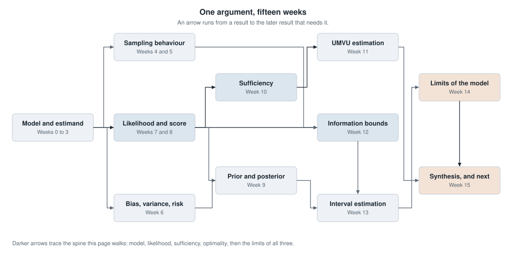
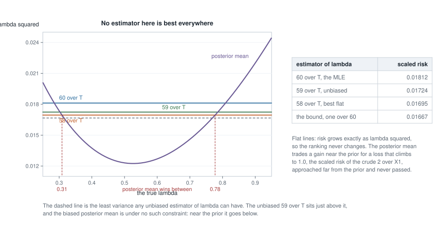
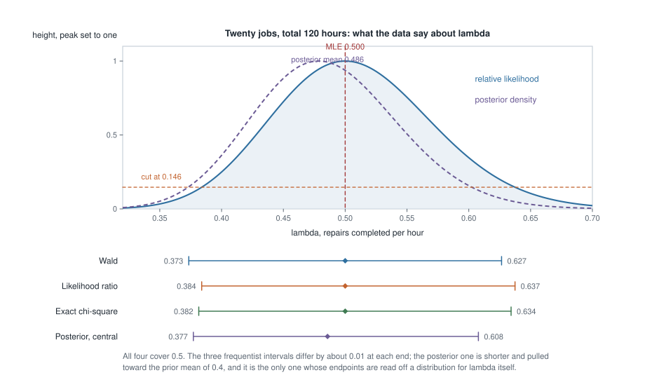
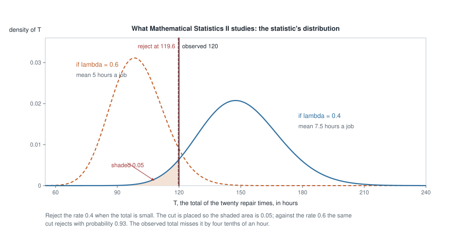

# Week 15 — Synthesis and the bridge to Mathematical Statistics II

## Where this week starts

Fourteen weeks ago you were handed a family of distributions and asked what it was for. Since then you
have built order statistics, normal theory, limit theorems, likelihoods, posteriors, sufficiency,
unbiased optimality, information bounds, intervals, and an account of misspecification. Written out
like that it reads as fourteen techniques in a row, and stored like that it will not survive the
summer: a list has no structure to recover when one item goes missing.

It is not a list. It is one argument. A scientific question fixes an **estimand**; a model turns that
estimand into a function of a parameter; the **likelihood** ranks candidate parameter values against
the data; **sufficiency** says which part of the data carries that ranking; **information** measures
how sharply it discriminates; **risk** prices the consequences of landing on the wrong value. Every
interval you have built, every Bayes estimator, every optimality theorem is a statement about one of
those objects or about the link between two of them.

So this page is one estimation problem carried the whole distance: twenty repair jobs, a gamma model,
one rate, taken through sufficiency, likelihood, information, Rao-Blackwell, a prior, a risk comparison
and four intervals, and then asked what survives when the model is wrong. Each step carries the week
that supplied it; nothing new appears except the connective tissue.

By Thursday you should be able to take an unfamiliar estimation problem through every layer without
being told which comes next, to state for any two objects above the theorem joining them, and to name
for each major topic of Mathematical Statistics II the result from this course it continues.

### Why this matters downstream

The concrete stake is diagnostic. A colleague sends you a fitted model, an estimate, a standard error
and an interval, and asks whether the analysis is sound. An interval can be too short because the
likelihood is skewed, or because a nuisance parameter was fixed at a guess, or because the model is
wrong — three faults producing numbers that look identical on the page. They live in three different
places in the structure above, so only someone who can move between estimand, likelihood, sufficiency,
information and risk can separate them.

The forward stake is that the sequel assumes exactly that mobility. Neyman-Pearson theory opens by
asking you to form a likelihood ratio and study its distribution; decision theory opens with a risk
function already on the board. If those are still fourteen separate things in your head, the next
course will spend three weeks rebuilding this one.

## What you will be able to do

- Carry one estimation problem through model, estimand, sufficiency, likelihood, information, risk and
  interval, naming the result used at each step.
- Rao-Blackwellize a crude unbiased estimator and verify the variance reduction by direct computation
  rather than by appeal to the theorem.
- Show that a maximum likelihood estimator can be inadmissible, by exhibiting a competitor with
  smaller mean squared error at every parameter value.
- Explain why the Cramer-Rao bound is attained exactly in one parameterization and missed in another,
  and predict which one it will be.
- Form the likelihood ratio for two simple hypotheses, find the cut giving a stated size, and compute
  the power of the resulting test.
- Name, for each major topic of Mathematical Statistics II, the theorem from this course it extends.

## Words worth owning

| Term | What it means in this course |
|------|------------------------------|
| Estimand | The number the scientific question asks for, fixed before any estimator exists. A property of a distribution, not a procedure. |
| Power | $P_{\theta_1}(\mathrm{reject})$ for a test at a specific alternative $\theta_1$. Like risk, a function of the parameter and not one number. |
| Sufficient statistic | A function $T$ of the data such that the likelihood depends on the sample only through $T$. |
| Fisher information | $I(\theta) = \operatorname{Var}(U(\theta)) = -\mathbb{E}[\partial^2 \ell / \partial \theta^2]$, the expected sharpness of the log-likelihood. |
| Risk function | $R(\theta, \hat\theta) = \mathbb{E}_\theta[L(\theta, \hat\theta)]$. Under squared error, the mean squared error. |
| Admissible | No competitor has risk no larger at every $\theta$ and strictly smaller somewhere. When one does, the estimator is inadmissible. |
| Most powerful test | For two simple hypotheses at a fixed size, the test maximizing power at the alternative. |
| Monotone likelihood ratio | A family whose likelihood ratio between any two parameter values is monotone in one statistic. It promotes a most powerful test to a uniformly most powerful one. |

## The course as one argument

Start with the map, because the shape is easier to see than to describe.

{fig-alt="Eleven labelled boxes joined by left-to-right arrows. Model and estimand feeds sampling behaviour, likelihood and score, and bias-variance-risk; likelihood feeds sufficiency and information bounds; the chain ends at Weeks 14 and 15."}

### Eleven results and the arrows between them

Eleven boxes, fourteen arrows, and the arrows are the content. Each runs from a result to a later
result that could not be stated without it, which is why none run backwards.

Follow the darker spine, the path this page walks. **Model and estimand** (Weeks 0 to 3) feeds
**likelihood and score** (Weeks 7 and 8): you cannot write $L(\theta)$ before you have a family
$\{P_\theta : \theta \in \Theta\}$. Likelihood feeds **sufficiency** (Week 10) very literally — the
Fisher-Neyman factorization $f(x \mid \theta) = g(T(x), \theta)h(x)$ says that $\ell(\theta)$ depends
on the sample only through $T$. Sufficiency feeds **UMVU estimation** (Week 11), since Rao-Blackwell
conditions on a sufficient statistic and Lehmann-Scheffe needs it complete. Likelihood also feeds
**information bounds** (Week 12) along a second edge, because $I(\theta)$ is the variance of the
score. The spine closes with **limits of the model** (Week 14) feeding this week.

The lighter arrows carry the rest: sampling behaviour (Weeks 4 and 5) turns information into standard
errors, and risk (Week 6) joins prior and posterior (Week 9) to make Bayes estimators, which feed
interval estimation (Week 13). The map has no box for "review".

### Five views of one structure

The same claim without the picture. Let $X_1, \dots, X_n$ be independent with density
$f(x \mid \theta)$, write $\ell(\theta) = \sum_i \log f(X_i \mid \theta)$ and $U(\theta) =
\ell'(\theta)$, and let $T$ be a statistic. Each pair below is joined by a theorem you have proved.

**Estimand and likelihood** meet through invariance: if the estimand is $g(\theta)$ then
$\widehat{g(\theta)} = g(\hat\theta)$, because reparameterizing relabels the horizontal axis of $\ell$
without moving its maximum.

**Likelihood and sufficiency.** Factorization says $T$ is sufficient exactly when $\ell(\theta)$ is,
up to a $\theta$-free additive term, a function of $T$ alone. Sufficiency is not an extra property of
the model; it describes the likelihood's shape.

**Likelihood and information.** $I(\theta) = \operatorname{Var}_\theta(U(\theta)) =
-\mathbb{E}_\theta[\ell''(\theta)]$ under the Week 7 regularity conditions. Information is curvature.

**Information and risk.** Cramer-Rao gives $\operatorname{Var}(\hat\theta) \ge 1/(nI_1(\theta))$ for
unbiased $\hat\theta$, and maximum likelihood meets that floor asymptotically.

**Risk and the posterior.** A Bayes estimator minimizes posterior expected loss pointwise, and so
minimizes risk averaged against the prior. Frequentist and Bayes risk are one integrand read in two
orders.

::: {.callout-note}
The audit habit, one last time. Every arrow carries conditions, and the standing counterexample breaks
several at once: for $X_1, \dots, X_n$ uniform on $(0, \theta)$ the support depends on $\theta$, so the
score identity fails, $I(\theta)$ is not what the formula says, Cramer-Rao does not apply, and
$X_{(n)}$ has variance of order $n^{-2}$ rather than $n^{-1}$. Factorization survives intact. Check
which side of an arrow your model is on before using it.
:::

## What the sequel adds and why it needs this course

Mathematical Statistics II is usually advertised as "testing, decision theory, and resampling", which
is accurate and useless, because it makes the topics sound new. Each continues a result you own.

### Testing is the likelihood ratio, calibrated

Week 7 built $L(\theta)$ and Week 13 cut it horizontally to make an interval. Neyman-Pearson reads the
same object as a ranking of samples instead of parameter values: for simple $H_0: \theta = \theta_0$
against simple $H_1: \theta = \theta_1$, the test rejecting when $L(\theta_1)/L(\theta_0) \ge k$ is
most powerful at its own size. The second worked example builds exactly that test.

Uniformly most powerful tests need one more ingredient, and Week 3 supplied it. If the family has a
monotone likelihood ratio in a statistic $T$ — as every one-parameter exponential family does — the cut
Neyman-Pearson produces for one alternative is the cut for every alternative on that side, so one test
is most powerful against all of them. That is the Karlin-Rubin theorem, and it is why exponential
families were worth a week in September.

### Decision theory, resampling, and letting the model go

Week 6 defined risk and Week 9 defined Bayes risk; decision theory asks the global questions those
definitions make possible. Is there an estimator no competitor beats everywhere — an **admissible**
one? Is there one whose worst-case risk is smallest, a **minimax** one? The risk figure below settles
the first question in the negative for maximum likelihood, in a line of arithmetic; Stein's
phenomenon, where the obvious estimator of a normal mean is inadmissible in three or more dimensions,
is the sequel's famous instance.

The bootstrap continues Week 13: when no pivot exists and the asymptotics are not trusted, resample,
recompute, take percentiles — the next course supplies the theory saying when that is legitimate.
Robust and nonparametric procedures continue Week 14, and the sandwich variance gets a chapter.

## Worked example — twenty repair times, carried through every layer

**Setting.** A maintenance group records the time, in hours, to complete twenty independent service
jobs of one type:

$$9.8,\ 3.2,\ 6.3,\ 4.5,\ 14.7,\ 2.1,\ 5.4,\ 7.7,\ 3.9,\ 6.8,\
1.3,\ 11.9,\ 4.6,\ 8.0,\ 5.3,\ 2.3,\ 9.2,\ 3.0,\ 6.2,\ 3.8 .$$

These sum to $T = \sum_i x_i = 120.0$ hours, so $\bar{x} = 6.0$. Model them as independent
$\mathrm{Gamma}(\alpha, \lambda)$ with **known shape** $\alpha = 3$ and unknown rate $\lambda \gt 0$:

$$f(x \mid \lambda) = \frac{\lambda^3 x^2 e^{-\lambda x}}{\Gamma(3)}
= \frac{\lambda^3 x^2 e^{-\lambda x}}{2}, \qquad x \gt 0 .$$

**Step one, the estimand (Week 1).** The parameter $\lambda$ is a rate in repairs per hour of work.
What the group cares about is the fraction of jobs overrunning an eight-hour shift,
$\psi = P_\lambda(X \gt 8)$. Two objects joined by the model and nothing else; Step nine asks what
happens to each when the family is wrong.

**Step two, sufficiency (Week 10).** The joint density factors as

$$\prod_{i=1}^{20} \frac{\lambda^3 x_i^2 e^{-\lambda x_i}}{2}
= \underbrace{\lambda^{60} e^{-\lambda T}}_{g(T, \lambda)}
\cdot \underbrace{2^{-20}\textstyle\prod_i x_i^2}_{h(x)},$$

so $T = \sum_i X_i$ is sufficient by Fisher-Neyman. It is complete as well: writing the density as
$h(x)\exp\{\eta x - A(\eta)\}$ with $\eta = -\lambda$ and $A(\eta) = -3\log(-\eta)$ puts the model in a
full-rank one-parameter exponential family. From here the twenty numbers matter only through $120.0$.

**Step three, likelihood, score, information (Weeks 7 and 12).** Up to an additive constant,

$$\ell(\lambda) = 60 \log \lambda - 120\lambda, \qquad
U(\lambda) = \frac{60}{\lambda} - 120, \qquad
\ell''(\lambda) = -\frac{60}{\lambda^2} .$$

The score vanishes at $\hat\lambda = 60/120 = 0.500$ per hour, and $\ell''$ is negative throughout, so
that is the maximum. Since $\ell''$ contains no data, observed and expected information coincide:
$J(\hat\lambda) = I_{20}(\hat\lambda) = 240$, with $I_1(\hat\lambda) = \alpha/\hat\lambda^2 = 12$, so
the standard error is $240^{-1/2} = 0.06455$. By invariance the mean job length is estimated by
$3/\hat\lambda = 6.0$ hours and the overrun fraction by

$$\hat\psi = e^{-4}\left(1 + 4 + \frac{4^2}{2}\right) = 13e^{-4} = 0.2381 .$$

**Step four, a crude competitor improved (Week 11).** Throw away nineteen observations. Since
$E_\lambda[1/X_1] = \lambda/(\alpha - 1) = \lambda/2$, the statistic $\delta_0 = 2/X_1$ is unbiased for
$\lambda$; here it gives $2/9.8 = 0.204$, badly wrong. Its variance is
$4\{\lambda^2/[(\alpha-1)(\alpha-2)] - \lambda^2/(\alpha-1)^2\} = 4(\lambda^2/2 - \lambda^2/4) =
\lambda^2$. Now condition on the sufficient statistic. Because $X_1 \sim \mathrm{Gamma}(3, \lambda)$
and $T - X_1 \sim \mathrm{Gamma}(57, \lambda)$ are independent, $X_1/T \sim \mathrm{Beta}(3, 57)$
independently of $T$; and $E[1/B] = (a + b - 1)/(a-1)$ for $B \sim \mathrm{Beta}(a,b)$, so

$$E[\delta_0 \mid T = t] = \frac{2}{t}\,E\!\left[\frac{1}{B}\right]
= \frac{2}{t}\cdot\frac{59}{2} = \frac{59}{t} .$$

The improved estimator is $59/T = 0.4917$, with variance $59^2E[T^{-2}] - \lambda^2 =
\lambda^2\{59/58 - 1\} = \lambda^2/58$. Conditioning cut the variance by a factor of $58$, and because
$T$ is complete, Lehmann-Scheffe upgrades $59/T$ from "better" to UMVU.

**Step five, the bound (Week 12).** For unbiased estimators of $\lambda$, Cramer-Rao gives
$\operatorname{Var} \ge 1/(nI_1(\lambda)) = \lambda^2/60$; the UMVU estimator sits at $\lambda^2/58$, so
the bound is real but unreached. Change the estimand and that reverses: for $\mu = 3/\lambda$ the bound
is $(3/\lambda^2)^2\lambda^2/60 = 0.15/\lambda^2$, and $\bar{X}$ is unbiased for $\mu$ with variance
$(3/\lambda^2)/20 = 0.15/\lambda^2$ exactly. Attainment needs the score to be proportional to
$\hat g - g(\lambda)$, and $U(\lambda) = -60\,(T/60 - 1/\lambda)$ delivers that for $1/\lambda$ and its
affine images, never for $\lambda$ itself.

**Step six, the posterior (Week 9).** Put a $\mathrm{Gamma}(8, 20)$ prior on $\lambda$: prior mean
$0.4$, prior standard deviation $\sqrt{8}/20 = 0.141$ — a loosely held belief that jobs run near seven
and a half hours. Conjugacy gives

$$\pi(\lambda \mid x) \propto \lambda^{7}e^{-20\lambda}\cdot\lambda^{60}e^{-120\lambda}
= \lambda^{67}e^{-140\lambda}, \qquad \lambda \mid x \sim \mathrm{Gamma}(68, 140).$$

The posterior mean $68/140 = 0.4857$ is the precision-weighted average $(20/140)(0.4) + (120/140)(0.5)$,
one part prior to six parts data. The posterior predictive mean for the next job is
$E[3/\lambda \mid x] = 3 \times 140/67 = 6.27$ hours with standard deviation $3.73$ against the plug-in
$3.57$; the extra spread is parameter uncertainty.

**Step seven, risk (Week 6).** The two estimators of $\lambda$ built so far from the sufficient
statistic — the maximum likelihood $60/T$ and the UMVU $59/T$ — both have the form $c/T$ with
$T \sim \mathrm{Gamma}(60, \lambda)$, and $E[T^{-1}] = \lambda/59$, $E[T^{-2}] = \lambda^2/(59\cdot 58)$,
so

$$\frac{\mathrm{MSE}(c/T)}{\lambda^2} = \frac{c^2}{59 \cdot 58} - \frac{2c}{59} + 1 ,$$

a parabola in $c$ minimized at $c = 58$ with value $1 - 58/59 = 1/59$. At $c = 60, 59, 58$ it equals
$62/3422 = 0.01812$, $1/58 = 0.01724$ and $1/59 = 0.01695$.

{fig-alt="Three flat lines at 0.01812, 0.01724 and 0.01695 with a dashed bound at 0.01667 below them, and a U-shaped posterior-mean curve dipping to about 0.0123 near 0.5 and crossing the lowest flat line at 0.31 and 0.78."}

Two readings. First, the flat lines never cross, because each risk is a constant multiple of
$\lambda^2$; so $58/T$ beats $60/T$ at *every* $\lambda$, making the maximum likelihood estimator
inadmissible under squared-error loss. The UMVU estimator is dominated too — optimality within the
unbiased class is not optimality. Second, the posterior mean is no flat line: its scaled risk dips to
$0.0123$ near $\lambda = 0.5$, below the Cramer-Rao value $1/60 = 0.01667$, which is legal precisely
because it is biased. It beats the best flat competitor between $\lambda = 0.31$ and $\lambda = 0.78$,
and outside that band it climbs steeply — but to a ceiling, not past one. Because
$68/(20 + T) \lt 68/20 = 3.4$ for every $T \gt 0$, the estimator simply stops following a large
$\lambda$, so beyond its minimum the scaled risk rises monotonically to the limit $1$: it is $0.027$ at
$\lambda = 1$, $0.330$ at $5$, $0.876$ at $50$ and $0.935$ at $100$. That limit is exactly the scaled
risk $1.0$ of the crude $\delta_0$, which sits off the plot — however far the truth strays from the
prior, the posterior mean approaches the estimator Step four called badly wrong and never becomes
worse than it. Its raw mean squared error still grows like $\lambda^2$, as every risk here does.

**Step eight, four intervals (Weeks 4, 12 and 13).** With $z = 1.96$ and $\chi^2_{1,0.95} = 3.84146$:

- **Wald:** $0.500 \pm 1.96(0.06455) = (0.3735,\ 0.6265)$.
- **Likelihood ratio:** with $u = \lambda/\hat\lambda$ the deviance is $D(\lambda) = 120[u - 1 - \log u]$;
  setting it equal to $3.84146$ gives $u = 0.76785$ and $u = 1.27481$, hence $(0.3839,\ 0.6374)$.
- **Exact:** $2\lambda T \sim \chi^2_{120}$ whatever $\lambda$ is, so
  $(91.573/240,\ 152.211/240) = (0.3816,\ 0.6342)$.
- **Posterior, central:** the $0.025$ and $0.975$ quantiles of $\mathrm{Gamma}(68, 140)$, namely
  $(0.3772,\ 0.6078)$.

{fig-alt="A likelihood curve peaking at 0.500 and a narrower posterior curve peaking at its mode 0.479, both scaled to peak height one, the posterior mean 0.486 marked, and four interval bars beneath: Wald, likelihood ratio, exact, posterior."}

The three frequentist intervals differ by about $0.01$ at each end, the mild right skew of a rate
likelihood appearing where Week 13 said it would: the symmetric Wald interval sits lowest at both ends,
and the two shape-aware intervals agree closely. The posterior interval is shorter, pulled toward
$0.4$, and alone has endpoints that are quantiles of a distribution for $\lambda$.

**Step nine, what breaks if the model is wrong (Week 14).** Three checks first, all using information
$T$ discarded: the sample standard deviation is $3.44$ against the model's
$\sqrt{3}/\hat\lambda = 3.46$; the sample median is $5.35$ against a model median of $5.348$; four of
twenty jobs exceeded eight hours against $20\hat\psi = 4.8$. The shape-three gamma is doing well — and
you had to look at the data rather than at $T$ to learn that.

Now suppose the shape were really one, an exponential of the same mean. Then $\hat\lambda = 3/\bar{X}$
still converges, to the Kullback-Leibler projection $3/E[X]$, which is $0.5$ again; consistency
survives. The standard error does not. Under the exponential $\operatorname{Var}(X) = 36$ rather than
$12$, so the delta-method variance of $3/\bar{X}$ triples and the honest standard error is
$\sqrt{3} \times 0.06455 = 0.1118$: every interval in Step eight is too short by a factor near $1.73$,
and more data will not repair it. And $\hat\psi$ is aimed at the wrong number, since $P(X \gt 8)$ under
that exponential is $e^{-4/3} = 0.264$, not $0.238$.

### The same reasoning, transferred

Change the model, keep the structure. A service desk logs whether each of $n = 40$ independently
handled machines needed a second visit; $x = 12$ did. Model the indicators as
$\mathrm{Bernoulli}(p)$, with estimand $p$.

*Same.* $T = \sum_i X_i = 12$ is sufficient and complete by factorization in the exponential family,
reducing forty numbers to one. The score $\ell'(p) = 12/p - 28/(1-p)$ vanishes at $\hat p = 0.300$, and
$I_1(p) = 1/\{p(1-p)\}$ gives $I_{40}(\hat p) = 40/0.21 = 190.48$ and $\mathrm{se} = 0.07246$.
Rao-Blackwell runs identically: $X_1$ is unbiased with variance $p(1-p)$, and
$E[X_1 \mid T = t] = t/40 = \bar{X}$, a variance cut by a factor of forty. So does conjugacy: a
$\mathrm{Beta}(2,2)$ prior gives a $\mathrm{Beta}(14, 30)$ posterior with mean
$14/44 = 0.3182 = (4/44)(0.5) + (40/44)(0.3)$, the same weighting in new clothes. The Wald interval is
$(0.1580,\ 0.4420)$, the likelihood-ratio interval $(0.1735,\ 0.4514)$, the credible interval
$(0.1908,\ 0.4613)$.

*Changed.* The Cramer-Rao bound is now **attained exactly**:
$\operatorname{Var}(\bar{X}) = p(1-p)/40 = 1/I_{40}(p)$, which is $0.00525$ at $\hat p$, so $\bar{X}$ is
efficient at every $n$. Resist the inference that therefore nothing beats it. Efficiency settles
optimality inside the unbiased class and, as Step seven just showed with $59/T$, settles nothing
outside it, so the shrinkage question has to be asked directly. For $c\bar{X}$,

$$\mathrm{MSE}(c\bar{X}) = \frac{c^2 p(1-p)}{40} + p^2(c-1)^2 ,$$

minimized at $c = 40p/(40p + 1 - p)$, which is $0.945$ at $p = 0.3$ and $0.678$ at $p = 0.05$. The
best multiplier depends on the unknown $p$, so no single choice of $c$ can be made in advance; and near
$p = 1$ every choice but one is a mistake, since
$\mathrm{MSE}(c\bar{X}) - \mathrm{MSE}(\bar{X}) = (c^2-1)p(1-p)/40 + p^2(c-1)^2 \to (c-1)^2$, strictly
positive for $c \ne 1$. No constant multiple of $\bar{X}$ dominates it, and the stronger statement,
that $\bar{X}$ is admissible here, is one the sequel's decision theory proves. In the gamma case the
minimizing constant was $n\alpha - 2$, free of $\lambda$ — which is exactly why $58/T$ could dominate
there and why nothing of that shape can here. Meanwhile the
exact row of Step eight has no counterpart: the data are discrete, no function of $(X, p)$ has a
$p$-free distribution, and every interval here is an approximation whose coverage sawtooths with $p$.
One model gave an unreachable bound and an exact pivot; the other gives the reverse.

## A computation you can run

Nothing above needs more than a dozen lines of [R](https://www.r-project.org/), and typing them beats
trusting the page.

```
hours <- c(9.8, 3.2, 6.3, 4.5, 14.7, 2.1, 5.4, 7.7, 3.9, 6.8,
           1.3, 11.9, 4.6, 8.0, 5.3, 2.3, 9.2, 3.0, 6.2, 3.8)
n <- length(hours); alpha <- 3; tot <- sum(hours); K <- n * alpha   # 20, 120, 60

lhat <- K / tot; se <- lhat / sqrt(K)                # 0.5000   0.06455
lhat + c(-1, 1) * 1.959964 * se                      # 0.3735   0.6265  Wald
dev <- function(l) 2 * K * (l / lhat - 1 - log(l / lhat))
c(uniroot(function(l) dev(l) - qchisq(0.95, 1), c(1e-6, lhat))$root,
  uniroot(function(l) dev(l) - qchisq(0.95, 1), c(lhat, 5))$root)   # 0.3839  0.6374
qchisq(c(0.025, 0.975), 2 * K) / (2 * tot)           # 0.3816   0.6342  exact
qgamma(c(0.025, 0.975), 8 + K, 20 + tot)             # 0.3772   0.6078  posterior
```

The risk claims are simulation checks, each of this shape: draw the sufficient statistic from its own
distribution, apply each estimator, average the squared error.

```
tsim <- rgamma(2e5, K, rate = 0.5)
mean((K / tsim         - 0.5)^2) / 0.25              # about 0.0181   the MLE
mean((58 / tsim        - 0.5)^2) / 0.25              # about 0.0169   best flat
mean((68 / (20 + tsim) - 0.5)^2) / 0.25              # about 0.0123   posterior mean
```

Agreement confirms only that the algebra was transcribed correctly, and at this many draws each figure
is pinned to about the third decimal place. Week 8's rule stands.

## Second worked example — the most powerful test for two simple rates

**Setting.** Same twenty jobs, same gamma model with $\alpha = 3$. A contract turns on one comparison:
the incumbent's advertised rate $\lambda_0 = 0.4$ per hour, a mean job of $3/0.4 = 7.5$ hours, against
a challenger's claimed $\lambda_1 = 0.6$, five hours. Both hypotheses are simple, which is exactly what
Neyman-Pearson governs. Fix the size at $0.05$.

**Step one, the ratio.** Everything free of $\lambda$ cancels:

$$\Lambda(x) = \frac{L(\lambda_1)}{L(\lambda_0)}
= \left(\frac{\lambda_1}{\lambda_0}\right)^{60} e^{-(\lambda_1 - \lambda_0)T}
= 1.5^{60}\,e^{-0.2T} .$$

Two facts fall out. The ratio depends on the sample only through $T$ — sufficiency again, now inside a
testing problem — and it is strictly decreasing in $T$. So "reject when $\Lambda \ge k$" is the rule
"reject when $T \le c$": the most powerful test rejects the advertised rate when the total is *small*.

**Step two, the cut.** Under $H_0$, $T \sim \mathrm{Gamma}(60, 0.4)$, equivalently
$0.8\,T \sim \chi^2_{120}$. Choosing $c$ with $P_{0.4}(T \le c) = 0.05$ gives
$c = \chi^2_{120,\,0.05}/0.8 = 95.705/0.8 = 119.63$ hours, and the equivalent cut on the ratio is
$k = 1.5^{60}e^{-0.2(119.63)} = \exp(24.3279 - 23.9262) = 1.494$.

**Step three, power.** Under $H_1$, $T \sim \mathrm{Gamma}(60, 0.6)$ and
$P_{0.6}(T \le 119.63) = 0.930$: the test detects the challenger's rate about $93$ times in a hundred.
What made that computable was not the test but Week 3's fact that independent gammas sharing a rate
add to a gamma.

{fig-alt="Two gamma densities for the total: one centred near 150 for a rate of 0.4, one near 100 for 0.6. The lower five percent tail of the first is shaded up to 119.6, and the observed total of 120 sits just outside the shaded region."}

**Step four, the verdict.** The observed total is $120.0$, exceeding $119.63$ by four tenths of an
hour, so the test does not reject $H_0$. The observed ratio is $\Lambda = 1.5^{60}e^{-24} = 1.388$,
just under the cut of $1.494$: the data do favour the challenger, by $1.4$ to one, and the procedure
still declines to act. That is not a defect to argue away. A size-$0.05$ test is a commitment made
before the data arrive about how much evidence is enough, and honouring it in awkward cases is the
whole content of the commitment. The attained tail probability $P_{0.4}(T \le 120) = 0.052$ reports how
awkward this case was.

**What it buys and what it assumed.** The lemma delivers optimality only against $\lambda_1 = 0.6$.
But the ratio is monotone in $T$ for *every* pair $\lambda_1 \gt \lambda_0$, and the cut $119.63$ never
mentions $\lambda_1$ — so the same test is uniformly most powerful for $H_0: \lambda \le 0.4$ against
$H_1: \lambda \gt 0.4$. Karlin-Rubin, visible as a property of the algebra rather than a new theorem.
It assumed independence, the shape $\alpha = 3$, and a pre-specified size. The exact law of $\Lambda$
under $H_0$, available only because this model is friendly, is what the sequel studies when it is not:
Wilks' theorem exists because $\Lambda$ usually has no tractable exact distribution.

## The misreading to avoid

The sentence that arrives in the last week, in something close to these words:

::: {.callout-note}
"So the course was fourteen separate techniques and a review. I will memorize the formulas that get
tested and let the rest go."
:::

Two things are wrong with it: one about the material, one about what memorizing will cost.

The material first. Take the integrated example and change a single thing — let $\alpha = 1$, so the
jobs are exponential. Every step moves at once. The sufficient statistic is still $T$; the maximum
likelihood estimator becomes $20/T$; the UMVU estimator $19/T$; the best estimator of the form $c/T$
becomes $18/T$; the Cramer-Rao value becomes $\lambda^2/20$; the exact pivot becomes
$2\lambda T \sim \chi^2_{40}$; the deviance becomes $40[u - 1 - \log u]$; the conjugate prior is still
gamma. Each is the same formula with $K = n\alpha$ changed from $60$ to $20$, because each was a
statement about the distribution of the sufficient statistic, and the model entered only through $K$.
There were never eight formulas. There was one structure with a parameter in it, and whoever learned
the eight separately now has eight more to learn.

The second problem matters more. Formulas fail silently; structure does not. Remember only
"$\mathrm{se} = 1/\sqrt{nI_1}$" and you will compute a standard error for the uniform on
$(0, \theta)$, get a number, and never be told it is wrong. Remember instead that the formula is a
claim about the curvature of a log-likelihood assumed differentiable at an interior maximum, and you
look at the uniform likelihood first. It is zero for $\theta \lt x_{(n)}$ and $\theta^{-n}$ for
$\theta \ge x_{(n)}$: it jumps from nothing to its maximum $x_{(n)}^{-n}$ at $\theta = x_{(n)}$ and
decays from there, so it is discontinuous exactly at its maximizer, with no interior stationary point
and no second derivative to read curvature from. Then you stop before computing. Every counterexample
in this course has that shape: the technique runs, returns a plausible number, and is silently
inapplicable.

One concession: the weeks *are* separable enough that you can compute a posterior without having
proved Rao-Blackwell, which is why the misreading survives a semester of homework. It does not survive
an unfamiliar problem, which will not tell you which technique it wants; only the map can.

## Practice on your own

1. **The integrated pass on a new model.** Repeat all nine steps of the first worked example for
   $X_1, \dots, X_n$ independent $\mathrm{Poisson}(\lambda)$ with $n = 30$ and $\sum_i x_i = 45$: the
   sufficient statistic, the maximum likelihood estimator, $I_1(\lambda)$, a Rao-Blackwellized
   improvement of $X_1$, a gamma posterior, and three intervals. Say where your derivation stops
   matching the gamma case, and why.

2. **An admissibility hunt.** Show that $c = 58$ minimizes $c^2/(59\cdot 58) - 2c/59 + 1$ with minimum
   $1/59$. Then show that for a general known shape the minimizing constant is $n\alpha - 2$, and say
   why the maximum likelihood constant $n\alpha$ sits on the wrong side of the parabola.

3. **A counterexample hunt.** Find a model in which the Rao-Blackwellized estimator is *not* UMVU, and
   name which hypothesis of Lehmann-Scheffe your example violates. An incomplete sufficient statistic
   is one route; a curved exponential family is another.

4. **An audit.** A draft report states: "The posterior mean has smaller mean squared error than the
   maximum likelihood estimator, so it is the better estimator, and since it beats the Cramer-Rao
   bound the bound must be wrong." Identify the three separate errors, and give a value of $\lambda$
   from the risk figure at which the first claim is false.

5. **A simulation to describe.** Design, in words and pseudocode, a study checking whether the exact
   interval of Step eight holds coverage $0.95$ at $n = 5$ while the Wald interval does not. Work out
   how many replicates put the Monte Carlo standard error of a coverage near $0.95$ below $0.002$, and
   say what would falsify the claim.

## Where to read more

- [MIT OpenCourseWare 18.655, Mathematical Statistics](https://ocw.mit.edu/courses/18-655-mathematical-statistics-spring-2016/)
  for the decision-theoretic framing that unifies this page, and for admissibility.
- [MIT OpenCourseWare 18.650, Statistics for Applications](https://ocw.mit.edu/courses/18-650-statistics-for-applications-fall-2016/)
  for the Neyman-Pearson lemma at the level the next course assumes.
- [Penn State STAT 414](https://online.stat.psu.edu/stat414/) for gamma and beta facts, including the
  beta-gamma relationship of the Rao-Blackwell step.
- [The R Project](https://www.r-project.org/) for `qgamma`, `qchisq`, `uniroot` and `rgamma`.
- [Quarto](https://quarto.org/), the format these pages use.
- Hogg, McKean and Craig treat sufficiency and completeness in their seventh chapter and
  Neyman-Pearson theory in their eighth.
- Course pages: the [syllabus](../syllabus.qmd), the [schedule](../schedule.qmd), and the
  [resources page](../resources/index.qmd).

## Where this goes next

There is no Week 16. The course ends here, and Mathematical Statistics II begins where the second
worked example stopped: with the distribution of a likelihood ratio and what to do with it. Every box
on the map is a prerequisite for something there, and the honest way to prepare is not to reread these
notes but to run an integrated pass on a model appearing nowhere in them — a two-parameter normal, a
negative binomial, a censored exponential — and notice which step you cannot complete. That step is
what to reread.

The last connection is the one this course has been making since Week 2. The posterior in Step six was
not an alternative to the frequentist analysis: it used the same likelihood, the same sufficient
statistic and the same information, differing only in what it treats as random. A Bayesian workflow —
prior, posterior, predictive check, decision under loss — is assembled from parts built here.
[Week 14](week-14.qmd) is the way back, the [notes index](../index.qmd) lists every unit in order, and
the [schedule](../schedule.qmd) records where each of them fell.
